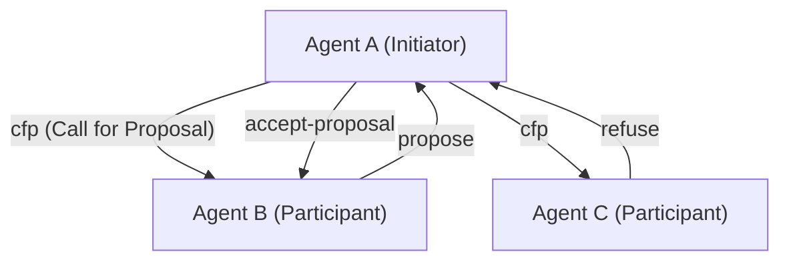
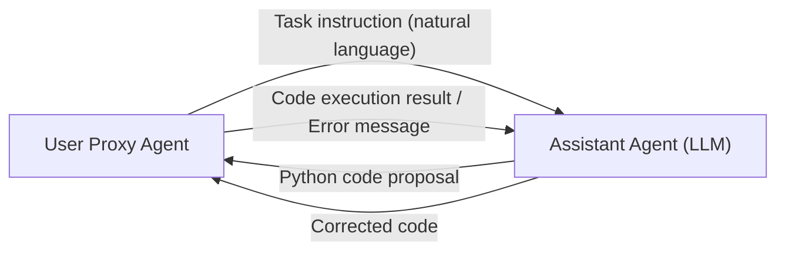

# History of Communication Protocols Between AI Agents

In the history of artificial intelligence, the concept of a **Multi-Agent System (MAS)**, where multiple agents, which are "autonomously operating software entities," gather and cooperate to solve complex tasks, is by no means new. However, with the advent of Large Language Models (LLMs), the capabilities of agents have improved dramatically, and modern MAS have acquired unprecedented flexibility and adaptability.

This article details the history of the evolution of communication protocols between AI agents and the prospects for future standardization, from classic agent communication protocols such as FIPA-ACL and KQML to the messaging mechanisms in modern LLM-based multi-agent frameworks (such as AutoGen and CrewAI).

## 1. The Dawn of Agent Communication: Knowledge Sharing and Intent Transmission

In the 1990s, while agent-oriented software engineering was being actively researched, standard communication methods were explored to enable multiple agents to share knowledge with each other and take cooperative actions.

### KQML (Knowledge Query and Manipulation Language)

KQML is a language and protocol for exchanging information between agents, developed by a project supported by DARPA. The most significant feature of KQML is that it separates the content of a message (payload) from the "intent" (Performative) of the message.
For example, by attaching a tag indicating an intent such as `ask-if` (question), `tell` (notification), or `subscribe` (subscription) to a message, an agent could interpret what kind of action the other party is requesting.

### FIPA-ACL (Foundation for Intelligent Physical Agents - Agent Communication Language)

**FIPA-ACL** emerged to overcome the limitations of KQML and provide a more strict semantics. Standardized by FIPA (later integrated into IEEE), this protocol is designed based on Speech Act Theory.

The structure of a FIPA-ACL message mainly consists of the following elements:

- **Performative**: The intent of the communication, such as `inform`, `request`, `propose`, `cfp` (Call for Proposal).
- **Sender / Receiver**: Identifiers for the sender and receiver.
- **Content**: The specific content of the message.
- **Language / Ontology**: The language used to describe the Content (e.g., KIF, SL) and the referenced ontology.
- **Protocol**: The interaction protocol in progress (e.g., Contract Net Protocol).

The above is an example of the famous **Contract Net Protocol (CNP)**. The cooperative process was clearly defined where an agent wanting to delegate a task (Initiator) asks other agents (Participants) for proposals (cfp), and assigns the task to the agent that made the optimal proposal (accept-proposal).

## 2. Transition to the Modern Era: Microservices and REST/gRPC

From the late 2000s to the 2010s, along with the evolution of the Web, software architecture transitioned from SOA (Service-Oriented Architecture) to **Microservices Architecture**.
During this era, communication between agents came to rely on standard web technologies (HTTP/REST, WebSockets, message queues, and later gRPC) rather than proprietary protocols (such as FIPA-ACL).

Data exchange in JSON format became mainstream, and each service (agent) communicated via APIs. This greatly enhanced the practicality of the systems, but at the same time, the strict definitions of "intent" and "ontology" were lost, making them dependent on the schema of each API.

## 3. The Rise of LLMs and Agent Communication via Natural Language

Entering the 2020s, with the emergence of high-performance large language models (LLMs) such as GPT-4 and Claude 3, the very definition of an agent changed dramatically. Modern "AI agents" are no longer just operating on fixed algorithms, but entities capable of understanding natural language, reasoning, and using tools (function calling).

Along with this, communication protocols between agents are also **returning from "structured data (JSON/XML)" to "natural language prompts"**.

### The Interaction Paradigm by AutoGen

**AutoGen**, developed by Microsoft, is a framework where multiple LLM agents solve tasks through conversation. In AutoGen, agents send messages to each other in natural language.

The "protocol" in AutoGen is not an explicit JSON schema, but is defined by the **roles and behavioral rules described in the agents' system prompts**. Agents utilize the conversation history (Context Window) as shared memory and infer context to determine their next actions.

### CrewAI and Role-Based Collaboration

**CrewAI** is a framework that gives agents clear "Roles," "Goals," and "Backstories" to function as a team.
Communication in CrewAI is structured around **task delegation** and **handing over results**. Even when exchanging information between agents, the base is natural language, combining structured outputs (such as Pydantic models) as necessary to connect to subsequent processes.

### Stateful Control with LangGraph

**LangGraph** takes the approach of defining the control flow of agents with a graph structure (nodes and edges) and managing the state.
Communication between agents is represented as updates to the "State (state object)" circulating within the graph. It adopts an architecture close to the Blackboard model, where one node (agent) updates the State, and the next node reads that State to perform processing.

## 4. Communication Challenges Faced by Modern MAS

While natural language-based communication using LLMs is extremely flexible and easy for humans to understand, several challenges have arisen from a systems engineering perspective.

1. **Non-determinism and Interpretation Variability**: Since natural language inherently has ambiguity, there is always a risk that the receiving agent may misunderstand the intent of the message (including hallucinations). This is because there are no strict Performatives like those in FIPA-ACL.
2. **Context Window Exhaustion**: When communicating in a conversational format, a long conversation history strains the LLM's context window, increasing processing costs (token consumption) and causing the "Lost in the Middle" problem where important information gets buried.
3. **Lack of Communication Standardization**: Currently, the mechanisms for communication and state management differ for each framework, such as AutoGen, CrewAI, and LangChain, and there is no standard means to link agents built with different frameworks.

## 5. Prospects for New Standard Protocols

To solve these challenges, the search for next-generation AI agent communication protocols has begun.

### Hybrid of Structured Data and Natural Language

Communication between AI agents is expected to evolve into a hybrid of "machine-processable structured metadata (JSON, Schema)" and "natural language (Context) that is easy for LLMs to reason with."
For example, a format that has a standardized JSON header (sender, intent, referenced task ID, etc.) as a message wrapper, and includes the natural language reasoning process and code as the payload.

### The Potential of MCP (Model Context Protocol)

Recently, **MCP (Model Context Protocol)** has been gaining attention as a standard for connecting LLMs with external tools and data sources. Currently, the main focus is on the integration of LLMs and tools, but as these protocols expand, they have the potential to become standard specifications for capability disclosure (Discovery) and delegation of authority in "agent-to-agent" communication.

### Decentralized Agent Networks

Linked with Web3 and decentralized technologies, protocols (e.g., Fetch.ai's AEA framework) for autonomous agents to communicate safely, negotiate, and make payments across organizational and corporate boundaries are also continuing to evolve. Here, identity guarantee of agents through cryptographic signatures and tamper-resistant messaging become important foundations.

## Conclusion

Communication protocols between AI agents started from a strict logical system like FIPA-ACL, passed through the era of Web APIs, and have now reached flexible natural language-based dialogues by LLMs.

In the future, "next-generation standard protocols" that guarantee robustness, interoperability, and efficiency as a system while maintaining this flexibility are required. The future where agents with different design philosophies are autonomously orchestrated with a common language and protocol is just around the corner.
