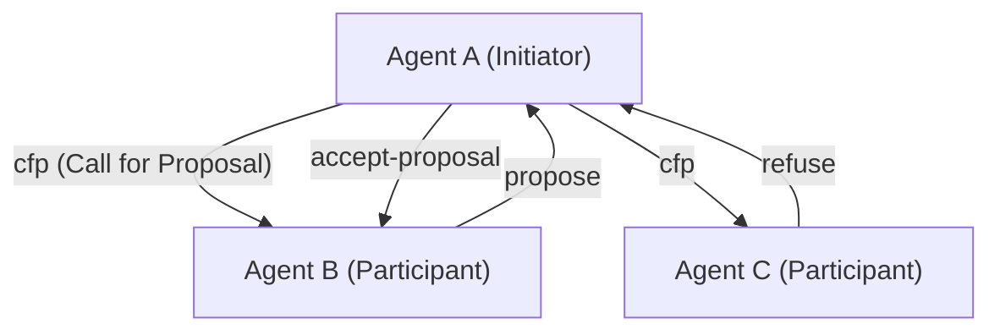
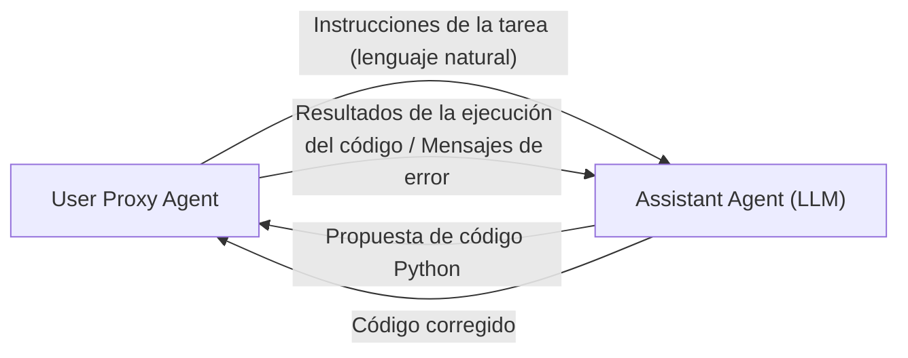

# Historia de los protocolos de comunicación entre agentes de IA

En la historia de la inteligencia artificial, el concepto de **sistemas multiagente (MAS)**, donde múltiples agentes, entidades de software que actúan de manera autónoma, se reúnen y colaboran para resolver tareas complejas, no es en absoluto nuevo. Sin embargo, con la aparición de los Modelos de Lenguaje Grande (LLM), las capacidades de los agentes han mejorado drásticamente, y los MAS modernos han adquirido una flexibilidad y adaptabilidad sin precedentes.

En este artículo, explicaremos en detalle la historia de la evolución de los protocolos de comunicación entre agentes de IA, desde los protocolos clásicos de comunicación de agentes como FIPA-ACL y KQML, hasta los mecanismos de mensajería en los marcos de trabajo multiagente modernos basados en LLM (como AutoGen, CrewAI, etc.), y las perspectivas hacia una futura estandarización.

## 1. Los albores de la comunicación entre agentes: Compartir el conocimiento y transmitir la intención

En la década de 1990, mientras se investigaba activamente la ingeniería de software orientada a agentes, se buscaron métodos de comunicación estándar para que múltiples agentes compartieran conocimientos entre sí y tomaran acciones coordinadas.

### KQML (Knowledge Query and Manipulation Language)

KQML es un lenguaje y protocolo diseñado para el intercambio de información entre agentes, desarrollado por un proyecto apoyado por DARPA. La mayor característica de KQML fue la separación del contenido del mensaje (carga útil o payload) de la "intención" (Performative) de dicho mensaje.
Por ejemplo, al adjuntar etiquetas al mensaje que indican intenciones como `ask-if` (preguntar), `tell` (informar) o `subscribe` (suscribir), un agente podía interpretar qué tipo de acción requería el otro.

### FIPA-ACL (Foundation for Intelligent Physical Agents - Agent Communication Language)

**FIPA-ACL** surgió para superar las limitaciones de KQML y proporcionar una semántica (significado) más rigurosa. Este protocolo, estandarizado por la FIPA (que luego se integró en la IEEE), está diseñado basándose en la teoría de los actos de habla (Speech Act Theory).

La estructura de un mensaje FIPA-ACL consta principalmente de los siguientes elementos:

- **Performative**: La intención de la comunicación, como `inform`, `request`, `propose`, `cfp` (Call for Proposal), etc.
- **Sender / Receiver**: Los identificadores del remitente y del receptor.
- **Content**: El contenido específico del mensaje.
- **Language / Ontology**: El lenguaje en el que se describe el Content (ej. KIF, SL) y la ontología a la que hace referencia.
- **Protocol**: El protocolo de interacción en curso (ej. Contract Net Protocol).

El diagrama anterior es un ejemplo del famoso **Contract Net Protocol (CNP)**. Se definía claramente un proceso colaborativo en el que un agente que desea delegar una tarea (Initiator) pide propuestas a otros agentes (Participants) mediante un cfp, y luego asigna la tarea al agente que ha hecho la mejor propuesta (accept-proposal).

## 2. El punto de inflexión hacia la era moderna: Microservicios y REST/gRPC

Desde finales de la década de 2000 y durante la década de 2010, junto con la evolución de la Web, la arquitectura de software pasó de SOA (Arquitectura Orientada a Servicios) a la **arquitectura de microservicios**.
En esta era, la comunicación entre agentes llegó a depender más de tecnologías Web estándar (HTTP/REST, WebSockets, colas de mensajes, y más tarde gRPC) que de protocolos propietarios (como FIPA-ACL).

El intercambio de datos en formato JSON se convirtió en la norma, y cada servicio (agente) comenzó a comunicarse a través de APIs. Esto aumentó significativamente la practicidad de los sistemas, pero al mismo tiempo se perdió la definición estricta de "intención" y "ontología", pasando a depender del esquema de cada API.

## 3. El auge de los LLM y la comunicación entre agentes mediante lenguaje natural

Al entrar en la década de 2020, con la aparición de Modelos de Lenguaje Grande (LLM) de alto rendimiento como GPT-4 y Claude 3, la propia definición de agente cambió drásticamente. Los "agentes de IA" modernos no solo operan con algoritmos fijos, sino que ahora son entidades capaces de entender el lenguaje natural, razonar y utilizar herramientas (llamadas a funciones).

Con esto, los protocolos de comunicación entre agentes también están **volviendo de los "datos estructurados (JSON/XML)" a los "prompts en lenguaje natural"**.

### El paradigma de diálogo con AutoGen

**AutoGen**, desarrollado por Microsoft, es un marco de trabajo donde múltiples agentes LLM resuelven tareas mediante el diálogo. En AutoGen, los agentes se envían mensajes entre sí en lenguaje natural.

El "protocolo" en AutoGen no es un esquema JSON explícito, sino que se define mediante el **rol (Role) y las reglas de comportamiento descritas en el system prompt del agente**. Los agentes utilizan el historial de la conversación (Context Window) como memoria compartida, deduciendo el contexto para decidir su próxima acción.

### CrewAI y la colaboración basada en roles

**CrewAI** es un marco de trabajo que da a los agentes un "rol" (Role), un "objetivo" (Goal) y una "historia de fondo" (Backstory) claros, haciéndolos funcionar como un equipo.
La comunicación en CrewAI se estructura en torno a la **delegación de tareas (Delegation)** y el **traspaso de resultados**. Al intercambiar información entre agentes, la base sigue siendo el lenguaje natural y, si es necesario, se combinan salidas estructuradas (como modelos Pydantic) para enlazar con procesos posteriores.

### Control con estado mediante LangGraph

**LangGraph** adopta un enfoque en el que el flujo de control de los agentes se define como una estructura de grafo (nodos y aristas), gestionando el estado (State).
La comunicación entre agentes se representa como actualizaciones del "State (objeto de estado)" que circula por el grafo. Adopta una arquitectura cercana al modelo Blackboard (pizarra), en el que un nodo (agente) actualiza el State y el siguiente nodo lo lee para realizar su procesamiento.

## 4. Desafíos de comunicación en los MAS modernos

Aunque la comunicación basada en lenguaje natural utilizando LLMs es extremadamente flexible y fácil de entender para los humanos, desde una perspectiva de ingeniería de sistemas presenta varios desafíos.

1. **No determinismo e inconsistencia en la interpretación**: Dado que el lenguaje natural conlleva ambigüedad, siempre existe el riesgo de que el agente receptor malinterprete la intención del mensaje (incluyendo alucinaciones). Esto se debe a que no existe un Performative estricto como lo había en FIPA-ACL.
2. **Agotamiento de la ventana de contexto**: Cuando la comunicación se realiza de forma conversacional, si el historial se alarga demasiado, ejerce presión sobre la ventana de contexto del LLM, incrementando el costo de procesamiento (consumo de tokens) y provocando el problema de que la información importante quede enterrada (Lost in the Middle).
3. **Falta de estandarización en la comunicación**: Actualmente, los mecanismos de comunicación y gestión de estado difieren entre marcos de trabajo como AutoGen, CrewAI o LangChain, y no existe un medio estándar para conectar agentes construidos en diferentes marcos.

## 5. Perspectivas hacia nuevos protocolos estándar

Para resolver estos desafíos, ha comenzado la búsqueda de la próxima generación de protocolos de comunicación para agentes de IA.

### Híbrido de datos estructurados y lenguaje natural

Se espera que la comunicación entre agentes de IA evolucione hacia un híbrido de "metadatos estructurados fáciles de procesar por máquinas (JSON, Schema)" y "lenguaje natural fácil de inferir por LLMs (Context)".
Por ejemplo, un formato en el que el mensaje cuenta con un encabezado JSON estandarizado (remitente, intención, ID de la tarea de referencia, etc.) como envoltorio, y la carga útil (payload) contiene el proceso de razonamiento en lenguaje natural o código.

### El potencial de MCP (Model Context Protocol)

Recientemente, estándares como **MCP (Model Context Protocol)** están llamando la atención como protocolo estándar para conectar LLMs con herramientas externas y fuentes de datos. En este momento, se centra principalmente en la integración entre LLMs y herramientas, pero existe la posibilidad de que estos protocolos se amplíen y se conviertan en estándares para la revelación de capacidades (Discovery) y la delegación de permisos en la comunicación "agente a agente".

### Redes de agentes descentralizadas

Los protocolos para que los agentes autónomos se comuniquen, negocien y realicen transacciones de forma segura más allá de los límites de las organizaciones o empresas, vinculados a la Web3 y las tecnologías descentralizadas (ej. el marco de trabajo AEA de Fetch.ai), también continúan evolucionando. Aquí, la garantía de identidad del agente mediante firmas criptográficas y la mensajería a prueba de manipulaciones son bases fundamentales.

## Conclusión

Los protocolos de comunicación entre agentes de IA comenzaron con sistemas lógicos estrictos como FIPA-ACL, pasaron por la era de las APIs Web y actualmente han llegado al diálogo flexible basado en el lenguaje natural impulsado por los LLM.

En el futuro, se requiere un "protocolo estándar de próxima generación" que mantenga esta flexibilidad, al mismo tiempo que garantice la solidez, interoperabilidad y eficiencia como sistema. El futuro en el que agentes con diferentes filosofías de diseño se orquesten de manera autónoma utilizando un lenguaje y protocolo comunes está a la vuelta de la esquina.
