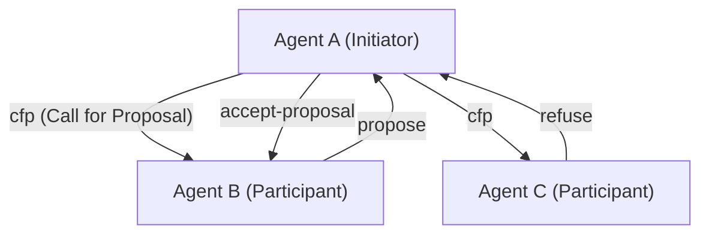
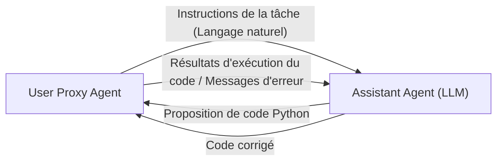

# Histoire des protocoles de communication entre agents IA

Dans l'histoire de l'intelligence artificielle, le concept de **systèmes multi-agents (SMA)**, où plusieurs agents – des entités logicielles agissant de manière autonome – se rassemblent et collaborent pour résoudre des tâches complexes, n'est en aucun cas nouveau. Cependant, avec l'émergence des grands modèles de langage (LLM), les capacités des agents se sont considérablement améliorées, et les SMA modernes ont acquis une flexibilité et une adaptabilité sans précédent.

Dans cet article, nous expliquerons en détail l'histoire de l'évolution des protocoles de communication entre agents IA, des protocoles classiques comme FIPA-ACL et KQML aux mécanismes de messagerie dans les frameworks multi-agents modernes basés sur les LLM (AutoGen, CrewAI, etc.), ainsi que les perspectives de normalisation future.

## 1. L'aube de la communication des agents : Partage des connaissances et transmission des intentions

Dans les années 1990, alors que l'ingénierie logicielle orientée agent était activement étudiée, des méthodes de communication standard pour permettre à plusieurs agents de partager mutuellement des connaissances et de mener des actions coordonnées ont été explorées.

### KQML (Knowledge Query and Manipulation Language)

KQML est un langage et un protocole développés par un projet soutenu par la DARPA dans le but d'échanger des informations entre agents. La principale caractéristique de KQML est la séparation du contenu du message (la charge utile) et de l'« intention » (Performative) de ce message.
Par exemple, en attachant au message des balises indiquant des intentions telles que `ask-if` (question), `tell` (notification), `subscribe` (abonnement), l'agent pouvait interpréter quel type d'action l'autre partie demandait.

### FIPA-ACL (Foundation for Intelligent Physical Agents - Agent Communication Language)

**FIPA-ACL** est apparu pour surmonter les limites de KQML et fournir une sémantique plus rigoureuse. Normalisé par la FIPA (intégrée par la suite à l'IEEE), ce protocole a été conçu sur la base de la théorie des actes de langage (Speech Act Theory).

La structure d'un message FIPA-ACL est principalement composée des éléments suivants :

- **Performative** : L'intention de la communication telle que `inform`, `request`, `propose`, `cfp` (Call for Proposal).
- **Sender / Receiver** : Les identifiants de l'expéditeur et du destinataire.
- **Content** : Le contenu spécifique du message.
- **Language / Ontology** : Le langage utilisé pour décrire le Content (ex : KIF, SL) et l'ontologie référencée.
- **Protocol** : Le protocole d'interaction en cours (ex : Contract Net Protocol).

Ce qui précède est un exemple du célèbre **Contract Net Protocol (CNP)**. Le processus de coordination était clairement défini : un agent souhaitant déléguer une tâche (Initiator) demande des propositions à d'autres agents (Participants) via `cfp`, puis attribue la tâche à l'agent ayant fait la meilleure proposition (`accept-proposal`).

## 2. La transition vers l'ère moderne : Microservices et REST/gRPC

De la fin des années 2000 aux années 2010, avec l'évolution du Web, l'architecture logicielle est passée de la SOA (Architecture Orientée Services) à l'**architecture de microservices**.
Durant cette période, la communication entre agents a commencé à s'appuyer davantage sur des technologies Web standard (HTTP/REST, WebSockets, files d'attente de messages, puis gRPC) plutôt que sur des protocoles propriétaires (comme FIPA-ACL).

L'échange de données au format JSON est devenu courant, et chaque service (agent) a commencé à communiquer via des API. Bien que cela ait considérablement accru l'utilité des systèmes, la définition stricte des « intentions » ou des « ontologies » s'est perdue, le tout devenant dépendant des schémas de chaque API.

## 3. L'essor des LLM et la communication des agents en langage naturel

Dans les années 2020, l'apparition de modèles de langage à grande échelle (LLM) très performants tels que GPT-4 et Claude 3 a radicalement modifié la définition même d'un agent. Les « agents IA » modernes ne sont plus seulement des entités fonctionnant avec des algorithmes fixes, mais sont capables de comprendre le langage naturel, de raisonner et d'utiliser des outils (appels de fonctions).

Par conséquent, les protocoles de communication entre agents **reviennent des « données structurées (JSON/XML) » aux « invites en langage naturel »**.

### Le paradigme conversationnel avec AutoGen

**AutoGen**, développé par Microsoft, est un framework dans lequel plusieurs agents LLM résolvent des tâches par le biais du dialogue. Dans AutoGen, les agents s'envoient des messages en langage naturel.

Le « protocole » dans AutoGen n'est pas un schéma JSON explicite, mais **défini par les rôles (Role) et les règles de comportement décrits dans l'invite système (System Prompt) de l'agent**. Les agents utilisent l'historique des conversations (Context Window) comme mémoire partagée et déterminent leur prochaine action en déduisant le contexte.

### CrewAI et la coordination basée sur les rôles

**CrewAI** est un framework qui donne aux agents des « Rôles (Role) », des « Objectifs (Goal) » et des « Histoires de fond (Backstory) » clairs, leur permettant de fonctionner en équipe.
La communication dans CrewAI est structurée autour de la **délégation de tâches (Delegation)** et de la **transmission des résultats**. Même lors de l'échange d'informations entre agents, la base reste le langage naturel, combiné si nécessaire à des sorties structurées (comme des modèles Pydantic) pour alimenter les traitements ultérieurs.

### Le contrôle avec état (Stateful) par LangGraph

**LangGraph** adopte une approche où le flux de contrôle des agents est défini par une structure de graphe (nœuds et arêtes) pour gérer l'état (State).
La communication entre agents est représentée comme la mise à jour d'un « State (objet d'état) » qui circule dans le graphe. Il utilise une architecture proche du modèle Blackboard (Tableau noir), où un nœud (agent) met à jour le State, et le nœud suivant lit ce State pour effectuer son traitement.

## 4. Les défis de communication des SMA modernes

Bien que la communication basée sur le langage naturel utilisant des LLM soit extrêmement flexible et facile à comprendre pour les humains, elle pose plusieurs défis du point de vue de l'ingénierie des systèmes.

1. **Non-déterminisme et variations d'interprétation** : Le langage naturel étant ambigu, il existe toujours un risque que l'agent récepteur interprète mal l'intention du message (y compris via des hallucinations). Cela est dû à l'absence de Performative stricte comme on en trouvait dans FIPA-ACL.
2. **Épuisement de la fenêtre de contexte** : Lors de communications sous forme de dialogue, si l'historique de la conversation s'allonge, cela surcharge la fenêtre de contexte du LLM, augmentant les coûts de traitement (consommation de tokens) et provoquant le problème de la perte d'informations importantes noyées au milieu (Lost in the Middle).
3. **Manque de standardisation de la communication** : Actuellement, les mécanismes de communication et de gestion de l'état diffèrent selon les frameworks tels qu'AutoGen, CrewAI ou LangChain, et il n'existe pas de méthode standard pour relier des agents construits avec des frameworks différents.

## 5. Perspectives vers de nouveaux protocoles standard

Pour résoudre ces défis, la recherche d'un protocole de communication de nouvelle génération pour les agents IA a commencé.

### L'hybride de données structurées et de langage naturel

On s'attend à ce que la communication entre agents IA évolue vers un hybride combinant des « métadonnées structurées faciles à traiter par les machines (JSON, Schema) » et un « langage naturel facile à déduire pour les LLM (Context) ».
Par exemple, un format qui possède un en-tête JSON standardisé (expéditeur, intention, ID de tâche de référence, etc.) comme enveloppe de message, et dont la charge utile contient le processus de raisonnement en langage naturel ou du code.

### Le potentiel du MCP (Model Context Protocol)

Récemment, le **MCP (Model Context Protocol)** a attiré l'attention en tant que norme pour connecter les LLM avec des outils et des sources de données externes. Bien qu'actuellement il se concentre principalement sur la liaison entre LLM et outils, il est possible que de tels protocoles soient étendus pour devenir des normes en matière de découverte (Discovery) des capacités et de délégation d'autorité dans la communication « agent à agent ».

### Réseaux d'agents décentralisés

En lien avec le Web3 et les technologies décentralisées, des protocoles (par exemple, le framework AEA de Fetch.ai) continuent d'évoluer pour permettre aux agents autonomes de communiquer, de négocier et d'effectuer des transactions en toute sécurité au-delà des frontières organisationnelles et des entreprises. Ici, la garantie d'identité des agents par des signatures cryptographiques et une messagerie résistante aux falsifications constituent une base fondamentale.

## Conclusion

Les protocoles de communication entre agents IA ont commencé avec des systèmes logiques stricts comme FIPA-ACL, ont traversé l'ère des API Web, et en sont maintenant aux dialogues flexibles basés sur le langage naturel grâce aux LLM.

À l'avenir, un « protocole standard de nouvelle génération » sera nécessaire pour garantir la robustesse, l'interopérabilité et l'efficacité en tant que système tout en maintenant cette flexibilité. Un avenir où des agents aux philosophies de conception différentes seront orchestrés de manière autonome avec un langage et un protocole communs est à notre porte.
