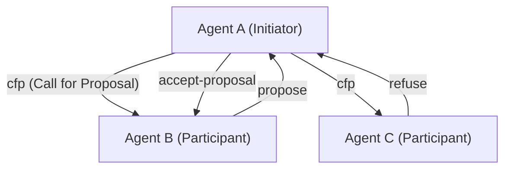
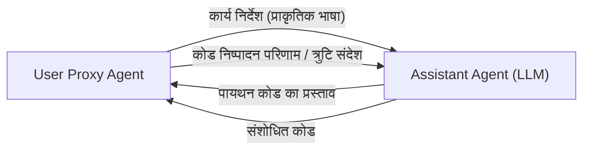

# AI एजेंट संचार प्रोटोकॉल का इतिहास

कृत्रिम बुद्धिमत्ता के इतिहास में, **मल्टी-एजेंट सिस्टम (MAS)** की अवधारणा कभी भी नई नहीं रही है, जहाँ कई एजेंट—"स्वायत्त रूप से संचालित होने वाले सॉफ़्टवेयर निकाय"—एक साथ आते हैं और जटिल कार्यों को हल करने के लिए सहयोग करते हैं। हालाँकि, लार्ज लैंग्वेज मॉडल (LLM) के आगमन ने एजेंटों की क्षमताओं में नाटकीय रूप से सुधार किया है, जिससे आधुनिक MAS को अभूतपूर्व लचीलापन और अनुकूलन क्षमता प्राप्त हुई है।

यह लेख AI एजेंटों के बीच संचार प्रोटोकॉल के विकास के इतिहास और भविष्य के मानकीकरण की संभावनाओं के बारे में विस्तार से बताएगा, जिसमें FIPA-ACL और KQML जैसे क्लासिक एजेंट संचार प्रोटोकॉल से लेकर आधुनिक LLM-आधारित मल्टी-एजेंट फ्रेमवर्क (जैसे AutoGen, CrewAI) में मैसेजिंग तंत्र तक शामिल हैं।

## 1. एजेंट संचार के शुरुआती दिन: ज्ञान साझा करना और इरादे संप्रेषित करना

1990 के दशक में, जब एजेंट-ओरिएंटेड सॉफ़्टवेयर इंजीनियरिंग पर सक्रिय रूप से शोध किया जा रहा था, तब कई एजेंटों के लिए ज्ञान साझा करने और समन्वित कार्रवाई करने के लिए मानक संचार विधियों की तलाश की गई।

### KQML (Knowledge Query and Manipulation Language)

KQML एक भाषा और प्रोटोकॉल है जिसे DARPA-समर्थित प्रोजेक्ट द्वारा एजेंटों के बीच सूचनाओं के आदान-प्रदान के लिए विकसित किया गया है। KQML की सबसे बड़ी विशेषता यह है कि यह संदेश की सामग्री (payload) और उस संदेश के "इरादे" (Performative) को अलग करता है।
उदाहरण के लिए, संदेशों में `ask-if` (प्रश्न), `tell` (अधिसूचना), और `subscribe` (सदस्यता) जैसे इरादे-संकेतक टैग जोड़कर, एजेंट व्याख्या कर सकते हैं कि दूसरा पक्ष उनसे किस तरह की कार्रवाई की अपेक्षा कर रहा है।

### FIPA-ACL (Foundation for Intelligent Physical Agents - Agent Communication Language)

**FIPA-ACL** KQML की सीमाओं को पार करने और अधिक कठोर शब्दार्थ (semantics) प्रदान करने के लिए उभरा। FIPA (बाद में IEEE में एकीकृत) द्वारा मानकीकृत, यह प्रोटोकॉल स्पीच एक्ट थ्योरी (Speech Act Theory) पर आधारित है।

FIPA-ACL संदेश की संरचना मुख्य रूप से निम्नलिखित तत्वों से बनी होती है:

- **Performative**: संचार का इरादा, जैसे `inform`, `request`, `propose`, `cfp` (Call for Proposal)।
- **Sender / Receiver**: प्रेषक और प्राप्तकर्ता के पहचानकर्ता।
- **Content**: संदेश की विशिष्ट सामग्री।
- **Language / Ontology**: Content का वर्णन करने के लिए उपयोग की जाने वाली भाषा (जैसे, KIF, SL) और संदर्भित ऑन्टोलॉजी।
- **Protocol**: प्रगति पर संवाद प्रोटोकॉल (जैसे, Contract Net Protocol)।

ऊपर प्रसिद्ध **Contract Net Protocol (CNP)** का एक उदाहरण है। एक स्पष्ट सहयोग प्रक्रिया परिभाषित की गई थी जिसमें एक एजेंट जो कार्य सौंपना चाहता है (Initiator) अन्य एजेंटों (Participants) से प्रस्ताव (cfp) मांगता है, और फिर कार्य को उस एजेंट को सौंपता है जो सबसे अच्छा प्रस्ताव देता है (accept-proposal)।

## 2. आधुनिक युग में परिवर्तन: माइक्रोसर्विसेज और REST/gRPC

2000 के दशक के उत्तरार्ध से 2010 के दशक तक, वेब के विकास के साथ, सॉफ़्टवेयर आर्किटेक्चर SOA (सेवा-उन्मुख आर्किटेक्चर) से **माइक्रोसर्विसेज आर्किटेक्चर** में स्थानांतरित हो गया।
इस युग के दौरान, एजेंटों के बीच संचार मालिकाना प्रोटोकॉल (जैसे FIPA-ACL) के बजाय मानक वेब प्रौद्योगिकियों (HTTP/REST, WebSockets, मैसेज कतार और बाद में gRPC) पर निर्भर हो गया।

JSON प्रारूप में डेटा का आदान-प्रदान मुख्यधारा बन गया, और प्रत्येक सेवा (एजेंट) ने API के माध्यम से संचार करना शुरू कर दिया। इससे सिस्टम की व्यावहारिकता में काफी सुधार हुआ, लेकिन साथ ही, "इरादे" और "ऑन्टोलॉजी" की सख्त परिभाषाएँ खो गईं, और वे प्रत्येक API के स्कीमा पर निर्भर हो गईं।

## 3. LLM का उदय और प्राकृतिक भाषा एजेंट संचार

2020 के दशक में GPT-4 और Claude 3 जैसे उच्च-प्रदर्शन वाले लार्ज लैंग्वेज मॉडल (LLM) की उपस्थिति के साथ, एजेंट की परिभाषा अपने आप में नाटकीय रूप से बदल गई है। आधुनिक "AI एजेंट" न केवल निश्चित एल्गोरिदम पर काम करते हैं, बल्कि प्राकृतिक भाषा को समझ सकते हैं, तर्क कर सकते हैं और टूल (फ़ंक्शन कॉल) का उपयोग कर सकते हैं।

इसके साथ ही, एजेंटों के बीच संचार प्रोटोकॉल भी **"संरचित डेटा (JSON/XML)" से "प्राकृतिक भाषा संकेतों"** पर लौट रहे हैं।

### AutoGen का संवाद प्रतिमान

Microsoft द्वारा विकसित **AutoGen**, एक फ्रेमवर्क है जहां कई LLM एजेंट संवाद के माध्यम से कार्यों को हल करते हैं। AutoGen में, एजेंट एक दूसरे को प्राकृतिक भाषा में संदेश भेजते हैं।

AutoGen में "प्रोटोकॉल" एक स्पष्ट JSON स्कीमा नहीं है, बल्कि **एजेंट के सिस्टम प्रॉम्प्ट में वर्णित भूमिकाओं (Role) और व्यवहार नियमों** द्वारा परिभाषित किया गया है। एजेंट साझा मेमोरी के रूप में वार्तालाप इतिहास (Context Window) का उपयोग करते हैं और संदर्भ का अनुमान लगाकर अपनी अगली कार्रवाई तय करते हैं।

### CrewAI और भूमिका-आधारित सहयोग

**CrewAI** एक फ्रेमवर्क है जो एजेंटों को एक स्पष्ट "भूमिका (Role)", "लक्ष्य (Goal)", और "बैकस्टोरी (Backstory)" देता है, जिससे वे एक टीम के रूप में काम कर सकते हैं।
CrewAI में संचार मुख्य रूप से **कार्य प्रत्यायोजन (Delegation)** और **परिणाम सौंपने** के आसपास संरचित है। यहां तक ​​कि जब एजेंटों के बीच जानकारी का आदान-प्रदान किया जाता है, तब भी आधार प्राकृतिक भाषा होती है, और यदि आवश्यक हो, तो बाद के प्रसंस्करण से जुड़ने के लिए संरचित आउटपुट (जैसे Pydantic मॉडल) को संयोजित किया जाता है।

### LangGraph के साथ स्टेटफुल नियंत्रण

**LangGraph** एक ग्राफ संरचना (नोड्स और किनारे) के साथ एक एजेंट के नियंत्रण प्रवाह को परिभाषित करने और स्टेट (स्थिति) का प्रबंधन करने का दृष्टिकोण अपनाता है।
एजेंटों के बीच संचार को ग्राफ में घूमने वाले "स्टेट (स्टेट ऑब्जेक्ट)" के अद्यतन के रूप में दर्शाया जाता है। यह ब्लैकबोर्ड (Blackboard) मॉडल के समान एक आर्किटेक्चर को अपनाता है, जहां एक नोड (एजेंट) स्टेट को अपडेट करता है और अगला नोड इसे पढ़ता है और संसाधित करता है।

## 4. आधुनिक MAS में संचार की चुनौतियाँ

LLM का उपयोग करके प्राकृतिक भाषा-आधारित संचार अत्यंत लचीला है और मनुष्यों के लिए समझना आसान है, लेकिन सिस्टम इंजीनियरिंग के दृष्टिकोण से कुछ चुनौतियाँ हैं।

1. **अनिर्धारितता और व्याख्या में विचलन**: चूंकि प्राकृतिक भाषा अस्पष्टता के साथ आती है, इसलिए हमेशा यह जोखिम रहता है कि प्राप्तकर्ता एजेंट संदेश के इरादे को गलत समझ ले (जिसमें मतिभ्रम या Hallucination शामिल है)। ऐसा इसलिए है क्योंकि FIPA-ACL की तरह कोई सख्त Performative मौजूद नहीं है।
2. **संदर्भ विंडो की कमी**: जब संवादात्मक रूप से संवाद किया जाता है, तो बातचीत का लंबा इतिहास LLM की संदर्भ विंडो पर दबाव डालता है, प्रसंस्करण लागत (टोकन खपत) बढ़ाता है, और महत्वपूर्ण जानकारी के खो जाने (Lost in the Middle) की समस्या पैदा करता है।
3. **संचार मानकीकरण का अभाव**: वर्तमान में, AutoGen, CrewAI और LangChain जैसे प्रत्येक फ्रेमवर्क में संचार और स्टेट प्रबंधन के लिए अलग-अलग तंत्र हैं, और अलग-अलग फ्रेमवर्क में बने एजेंटों को जोड़ने का कोई मानक तरीका नहीं है।

## 5. नए मानक प्रोटोकॉल की ओर संभावनाएँ

इन चुनौतियों को हल करने के लिए, अगली पीढ़ी के AI एजेंट संचार प्रोटोकॉल की खोज शुरू हो गई है।

### संरचित डेटा और प्राकृतिक भाषा का हाइब्रिड

यह उम्मीद की जाती है कि AI एजेंटों के बीच संचार "संरचित मेटाडेटा (JSON, Schema) जिसे मशीनों द्वारा संसाधित करना आसान है" और "प्राकृतिक भाषा (Context) जिसके साथ LLM के लिए तर्क करना आसान है" के हाइब्रिड के रूप में विकसित होगा।
उदाहरण के लिए, यह एक ऐसा प्रारूप है जिसमें एक संदेश रैपर के रूप में एक मानकीकृत JSON हेडर (प्रेषक, इरादा, संदर्भ कार्य आईडी, आदि) होता है, और इसमें पेलोड के रूप में प्राकृतिक भाषा तर्क प्रक्रियाएं और कोड शामिल होते हैं।

### MCP (Model Context Protocol) की क्षमता

हाल ही में, **MCP (Model Context Protocol)** आदि बाहरी उपकरणों और डेटा स्रोतों के साथ LLM को जोड़ने के लिए एक मानक के रूप में ध्यान आकर्षित कर रहे हैं। वर्तमान में, ध्यान मुख्य रूप से LLM और टूल के बीच सहयोग पर है, लेकिन यदि इन प्रोटोकॉल का विस्तार किया जाता है, तो वे "एजेंट-टू-एजेंट" संचार में क्षमताओं के प्रकटीकरण (Discovery) और अधिकार प्रत्यायोजन के लिए एक मानक बन सकते हैं।

### विकेंद्रीकृत एजेंट नेटवर्क

Web3 और विकेंद्रीकृत प्रौद्योगिकियों के साथ मिलकर, ऐसे प्रोटोकॉल (जैसे Fetch.ai का AEA फ्रेमवर्क) भी विकसित हो रहे हैं जो स्वायत्त एजेंटों को संगठनों और कंपनियों की सीमाओं के पार सुरक्षित रूप से संवाद करने, बातचीत करने और भुगतान करने में सक्षम बनाते हैं। यहां, क्रिप्टोग्राफ़िक हस्ताक्षर का उपयोग करके एजेंटों की पहचान की गारंटी देना और छेड़छाड़-प्रतिरोधी संदेश देना एक महत्वपूर्ण आधार है।

## निष्कर्ष

AI एजेंटों के बीच संचार प्रोटोकॉल की शुरुआत FIPA-ACL जैसी सख्त तार्किक प्रणालियों से हुई, जो वेब API के युग से होते हुए, अब LLM का उपयोग करके लचीले प्राकृतिक भाषा-आधारित संवाद तक पहुँच गई है।

भविष्य में, एक "अगली पीढ़ी के मानक प्रोटोकॉल" की आवश्यकता है जो इस लचीलेपन को बनाए रखते हुए एक सिस्टम के रूप में मजबूती, इंटरऑपरेबिलिटी और दक्षता सुनिश्चित कर सके। वह भविष्य बस आने ही वाला है, जहां विभिन्न डिज़ाइन दर्शन वाले एजेंट स्वायत्त रूप से एक साझा भाषा और प्रोटोकॉल का उपयोग करके ऑर्केस्ट्रेटेड किए जा सकेंगे।
