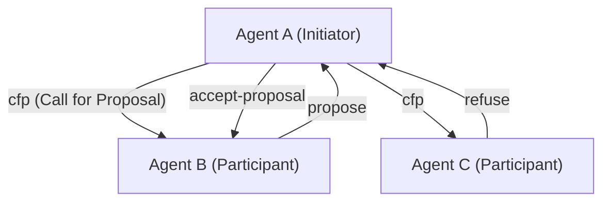
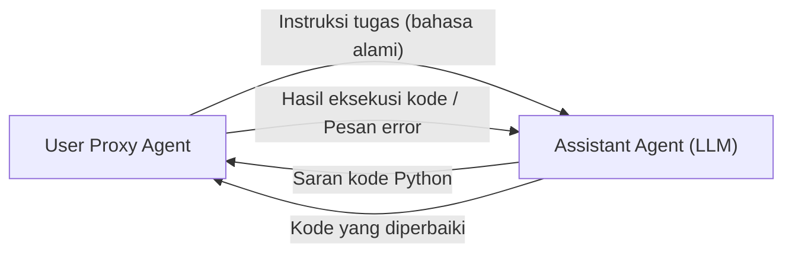

# Sejarah Protokol Komunikasi Antar Agen AI

Dalam sejarah kecerdasan buatan, konsep **sistem multi-agen (MAS)**, di mana beberapa agen yang merupakan "entitas perangkat lunak yang beroperasi secara otonom" berkumpul dan berkolaborasi untuk memecahkan tugas-tugas kompleks, sama sekali bukanlah hal yang baru. Namun, dengan munculnya Large Language Models (LLM), kemampuan agen telah meningkat secara dramatis, dan MAS modern telah memperoleh fleksibilitas dan kemampuan beradaptasi yang belum pernah ada sebelumnya.

Pada artikel ini, kita akan membahas secara detail sejarah evolusi protokol komunikasi antar agen AI, mulai dari protokol komunikasi agen klasik seperti FIPA-ACL dan KQML, hingga mekanisme perpesanan dalam kerangka kerja multi-agen berbasis LLM modern (seperti AutoGen, CrewAI), serta prospek untuk standardisasi di masa depan.

## 1. Era Awal Komunikasi Agen: Berbagi Pengetahuan dan Penyampaian Niat

Pada tahun 1990-an, ketika rekayasa perangkat lunak berorientasi agen sedang diteliti secara aktif, sebuah metode komunikasi standar dicari agar beberapa agen dapat berbagi pengetahuan dan mengambil tindakan kolaboratif satu sama lain.

### KQML (Knowledge Query and Manipulation Language)

KQML adalah bahasa dan protokol yang dikembangkan oleh proyek yang didukung DARPA dengan tujuan pertukaran informasi antar agen. Fitur terbesar KQML adalah memisahkan isi pesan (payload) dari "niat" (Performative) pesan tersebut.
Misalnya, dengan melampirkan tag yang menunjukkan niat seperti `ask-if` (bertanya), `tell` (memberitahu), dan `subscribe` (berlangganan) ke sebuah pesan, agen dapat menginterpretasikan tindakan apa yang diminta oleh pihak lain.

### FIPA-ACL (Foundation for Intelligent Physical Agents - Agent Communication Language)

**FIPA-ACL** muncul untuk mengatasi keterbatasan KQML dan menyediakan semantik (semantics) yang lebih ketat. Protokol ini, yang distandarisasi oleh FIPA (yang kemudian diintegrasikan ke dalam IEEE), dirancang berdasarkan Teori Tindak Tutur (Speech Act Theory).

Struktur pesan FIPA-ACL utamanya terdiri dari elemen-elemen berikut:

- **Performative**: Niat komunikasi seperti `inform`, `request`, `propose`, `cfp` (Call for Proposal).
- **Sender / Receiver**: Pengidentifikasi pengirim dan penerima.
- **Content**: Isi spesifik dari pesan.
- **Language / Ontology**: Bahasa (misalnya: KIF, SL) untuk mendeskripsikan Content dan ontologi yang dirujuk.
- **Protocol**: Protokol dialog yang sedang berlangsung (misalnya: Contract Net Protocol).

Di atas adalah contoh dari **Contract Net Protocol (CNP)** yang terkenal. Proses kolaboratif di mana agen yang ingin mendelegasikan tugas (Initiator) meminta proposal dari agen lain (Participants) menggunakan (cfp), dan menugaskan tugas kepada agen yang memberikan proposal terbaik (accept-proposal) telah didefinisikan dengan jelas.

## 2. Titik Balik Menuju Era Modern: Layanan Mikro (Microservices) dan REST/gRPC

Dari akhir 2000-an hingga 2010-an, seiring dengan evolusi Web, arsitektur perangkat lunak beralih dari SOA (Service-Oriented Architecture) ke **arsitektur layanan mikro (microservices architecture)**.
Di era ini, komunikasi antar agen menjadi lebih bergantung pada teknologi Web standar (HTTP/REST, WebSockets, message queue, dan kemudian gRPC) daripada protokol kepemilikan (seperti FIPA-ACL).

Pertukaran data dalam format JSON menjadi arus utama, dan setiap layanan (agen) mulai berkomunikasi melalui API. Hal ini sangat meningkatkan kepraktisan sistem, tetapi pada saat yang sama, definisi ketat tentang "niat" dan "ontologi" hilang, dan itu menjadi bergantung pada skema setiap API.

## 3. Kebangkitan LLM dan Komunikasi Agen melalui Bahasa Alami

Memasuki tahun 2020-an, dengan munculnya model bahasa besar (LLM) berperforma tinggi seperti GPT-4 dan Claude 3, definisi agen itu sendiri berubah secara dramatis. "Agen AI" modern tidak hanya beroperasi dengan algoritma tetap, tetapi telah menjadi entitas yang dapat memahami bahasa alami, bernalar, dan menggunakan alat (pemanggilan fungsi).

Seiring dengan ini, protokol komunikasi antar agen juga **sedang kembali dari "data terstruktur (JSON/XML)" ke "prompt bahasa alami"**.

### Paradigma Dialog dengan AutoGen

**AutoGen**, yang dikembangkan oleh Microsoft, adalah sebuah kerangka kerja di mana beberapa agen LLM menyelesaikan tugas melalui dialog. Di AutoGen, agen saling mengirim pesan dalam bahasa alami.

"Protokol" dalam AutoGen bukanlah skema JSON eksplisit, tetapi didefinisikan oleh **peran (Role) dan aturan perilaku yang tertulis dalam sistem prompt agen**. Agen menggunakan riwayat percakapan (Context Window) sebagai memori bersama untuk bernalar tentang konteks dan menentukan tindakan selanjutnya.

### CrewAI dan Kolaborasi Berbasis Peran

**CrewAI** adalah kerangka kerja yang memberikan agen "peran (Role)", "tujuan (Goal)", dan "latar belakang cerita (Backstory)" yang jelas, dan membuat mereka berfungsi sebagai tim.
Komunikasi dalam CrewAI disusun di sekitar **pendelegasian tugas (Delegation)** dan **serah terima hasil**. Saat agen bertukar informasi satu sama lain, basisnya adalah bahasa alami, dan jika perlu, output terstruktur (seperti model Pydantic) digabungkan untuk terhubung ke proses selanjutnya.

### Kontrol Stateful dengan LangGraph

**LangGraph** mengambil pendekatan mendefinisikan alur kontrol agen dengan struktur grafik (node dan tepi) serta mengelola status (state).
Komunikasi antar agen direpresentasikan sebagai pembaruan "State (objek status)" yang bersirkulasi di dalam grafik. Ini mengadopsi arsitektur yang dekat dengan model Blackboard (papan tulis), di mana satu node (agen) memperbarui State dan node berikutnya membaca State tersebut untuk melakukan pemrosesan.

## 4. Tantangan Komunikasi yang Dihadapi oleh MAS Modern

Komunikasi berbasis bahasa alami yang menggunakan LLM sangat fleksibel dan mudah dipahami oleh manusia, tetapi dari perspektif rekayasa sistem, beberapa tantangan telah muncul.

1. **Non-determinisme dan perbedaan interpretasi**: Karena bahasa alami melibatkan ambiguitas, selalu ada risiko bahwa agen penerima salah memahami maksud pesan (termasuk halusinasi). Ini karena tidak ada Performative ketat seperti yang ada pada FIPA-ACL.
2. **Kehabisan Context Window**: Saat berkomunikasi dalam format dialog, jika riwayat percakapan menjadi panjang, hal itu akan menekan context window LLM, meningkatkan biaya pemrosesan (konsumsi token), dan menyebabkan masalah di mana informasi penting terkubur (Lost in the Middle).
3. **Kurangnya Standardisasi Komunikasi**: Saat ini, mekanisme komunikasi dan manajemen status berbeda-beda untuk setiap kerangka kerja, seperti AutoGen, CrewAI, dan LangChain, dan tidak ada cara standar untuk menghubungkan agen yang dibangun dengan kerangka kerja yang berbeda.

## 5. Prospek Menuju Protokol Standar Baru

Untuk mengatasi tantangan ini, pencarian protokol komunikasi agen AI generasi berikutnya telah dimulai.

### Hibrida antara Data Terstruktur dan Bahasa Alami

Komunikasi antar agen AI diperkirakan akan berkembang menjadi hibrida dari "metadata terstruktur yang mudah diproses oleh mesin (JSON, Schema)" dan "bahasa alami yang mudah dinalar oleh LLM (Context)".
Misalnya, format yang memiliki header JSON terstandarisasi (pengirim, niat, ID tugas referensi, dll.) sebagai pembungkus pesan, dan berisi proses penalaran bahasa alami serta kode sebagai payload.

### Potensi MCP (Model Context Protocol)

Baru-baru ini, **MCP (Model Context Protocol)** dan lainnya menarik perhatian sebagai standar untuk menghubungkan LLM dengan alat eksternal dan sumber data. Saat ini, fokus utamanya adalah kolaborasi antara LLM dan alat, tetapi protokol ini dapat diperluas dan menjadi standar untuk pengungkapan kemampuan (Discovery) dan pendelegasian wewenang dalam komunikasi "agen-ke-agen".

### Jaringan Agen Terdesentralisasi

Protokol untuk agen otonom agar dapat berkomunikasi dengan aman, bernegosiasi, dan melakukan pembayaran melintasi batas-batas organisasi dan perusahaan, dikombinasikan dengan Web3 dan teknologi terdesentralisasi (misalnya: kerangka kerja AEA dari Fetch.ai), juga terus berkembang. Di sini, jaminan identitas agen melalui tanda tangan kriptografi dan pengiriman pesan yang tahan terhadap gangguan menjadi fondasi yang penting.

## Penutup

Protokol komunikasi antar agen AI dimulai dari sistem logika ketat seperti FIPA-ACL, melewati era Web API, dan saat ini telah mencapai dialog berbasis bahasa alami yang fleksibel oleh LLM.

Di masa depan, sambil mempertahankan fleksibilitas ini, diperlukan "protokol standar generasi berikutnya" untuk menjamin ketahanan, interoperabilitas, dan efisiensi sebagai sebuah sistem. Masa depan di mana agen dengan filosofi desain yang berbeda diorkestrasi secara otonom menggunakan bahasa dan protokol yang sama sudah di depan mata.
