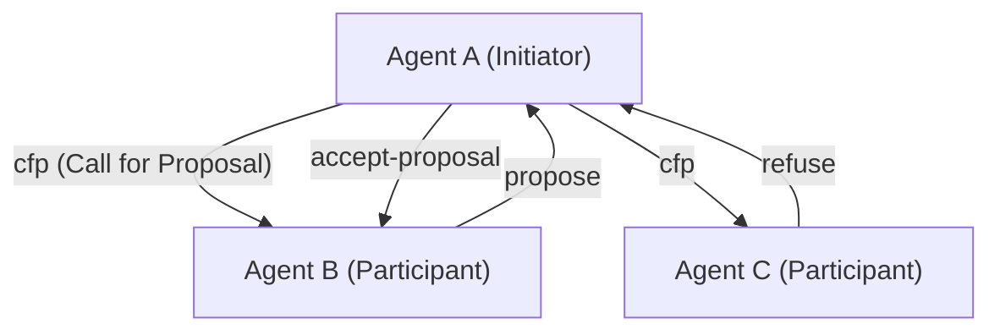
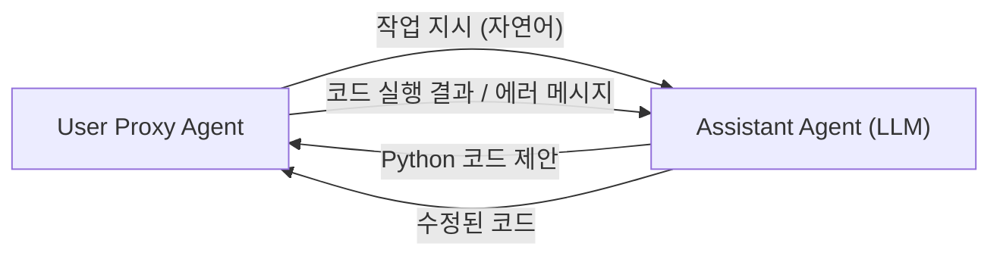

# AI 에이전트 간의 통신 프로토콜 역사

인공지능의 역사에서 '자율적으로 동작하는 소프트웨어의 실체'인 에이전트가 여럿 모여 협력하여 복잡한 작업을 해결하는 **멀티 에이전트 시스템(MAS)**의 개념은 결코 새로운 것이 아닙니다. 그러나 대규모 언어 모델(LLM)의 등장으로 에이전트의 능력이 비약적으로 향상되어, 현대의 MAS는 전례 없는 유연성과 적응력을 획득하고 있습니다.

본 문서에서는 고전적인 에이전트 통신 프로토콜인 FIPA-ACL이나 KQML부터 현대의 LLM 기반 멀티 에이전트 프레임워크(AutoGen, CrewAI 등)의 메시징 메커니즘에 이르기까지, AI 에이전트 간의 통신 프로토콜의 진화 역사와 향후 표준화를 향한 전망을 상세히 해설합니다.

## 1. 에이전트 통신의 여명기: 지식의 공유와 의도의 전달

1990년대, 에이전트 지향 소프트웨어 공학이 활발히 연구되는 가운데 여러 에이전트가 서로 지식을 공유하고 협력 행동을 취하기 위한 표준적인 통신 기법이 모색되었습니다.

### KQML (Knowledge Query and Manipulation Language)

KQML은 DARPA의 지원을 받은 프로젝트에 의해 개발된, 에이전트 간의 정보 교환을 목적으로 한 언어 및 프로토콜입니다. KQML의 가장 큰 특징은 메시지의 내용(페이로드)과 그 메시지의 '의도'(Performative)를 분리했다는 것입니다.
예를 들어, `ask-if`(질문), `tell`(통지), `subscribe`(구독)와 같은 의도를 나타내는 태그를 메시지에 부여함으로써 에이전트는 상대방이 어떤 액션을 요구하고 있는지를 해석할 수 있었습니다.

### FIPA-ACL (Foundation for Intelligent Physical Agents - Agent Communication Language)

KQML의 한계를 극복하고 더 엄밀한 의미론(시맨틱스)을 제공하기 위해 등장한 것이 **FIPA-ACL**입니다. FIPA(나중에 IEEE에 통합됨)에 의해 표준화된 이 프로토콜은 화행 이론(Speech Act Theory)을 기반으로 설계되었습니다.

FIPA-ACL 메시지의 구조는 주로 다음 요소로 구성됩니다.

- **Performative**: `inform`, `request`, `propose`, `cfp` (Call for Proposal) 등 통신의 의도.
- **Sender / Receiver**: 송신자와 수신자의 식별자.
- **Content**: 메시지의 구체적인 내용.
- **Language / Ontology**: Content를 기술하는 언어(예: KIF, SL) 및 참조하는 온톨로지.
- **Protocol**: 진행 중인 대화 프로토콜(예: Contract Net Protocol).

위는 유명한 **Contract Net Protocol (CNP)**의 예입니다. 작업을 위임하고 싶은 에이전트(Initiator)가 다른 에이전트(Participants)에게 제안을 요청(cfp)하고, 최적의 제안을 한 에이전트에게 작업을 할당(accept-proposal)한다는 협력 프로세스가 명확하게 정의되어 있었습니다.

## 2. 현대로의 전환기: 마이크로서비스와 REST/gRPC

2000년대 후반부터 2010년대에 걸쳐 웹의 진화와 함께 소프트웨어 아키텍처는 SOA(서비스 지향 아키텍처)에서 **마이크로서비스 아키텍처**로 전환되었습니다.
이 시기 에이전트 간의 통신은 독자적인 프로토콜(FIPA-ACL 등)보다 표준적인 웹 기술(HTTP/REST, WebSockets, 메시지 큐, 나중에 gRPC)에 의존하게 되었습니다.
JSON 형식의 데이터 교환이 주류가 되어 각 서비스(에이전트)는 API를 통해 통신을 수행하게 되었습니다. 이는 시스템의 실용성을 크게 높였지만, 동시에 '의도'나 '온톨로지'의 엄밀한 정의는 사라지고 각 API의 스키마에 의존하는 형태가 되었습니다.

## 3. LLM의 대두와 자연어에 의한 에이전트 통신

2020년대에 들어 GPT-4나 Claude 3 등 고성능 대규모 언어 모델(LLM)이 등장하면서 에이전트의 정의 자체가 극적으로 변화했습니다. 현대의 'AI 에이전트'는 고정된 알고리즘으로 동작할 뿐만 아니라 자연어를 이해하고 추론하며 도구(함수 호출)를 사용할 수 있는 존재가 되었습니다.

이에 따라 에이전트 간의 통신 프로토콜도 **'구조화 데이터(JSON/XML)'에서 '자연어 프롬프트'로 회귀**하고 있습니다.

### AutoGen에 의한 대화 패러다임

Microsoft가 개발한 **AutoGen**은 여러 LLM 에이전트가 대화를 통해 작업을 해결하는 프레임워크입니다. AutoGen에서 에이전트는 서로 자연어로 메시지를 주고받습니다.

AutoGen에서의 '프로토콜'은 명시적인 JSON 스키마가 아니라 **에이전트의 시스템 프롬프트에 기술된 역할(Role)과 행동 규칙**에 의해 정의됩니다. 에이전트는 대화 기록(Context Window)을 공유 메모리로 활용하여 문맥을 추론하면서 다음 행동을 결정합니다.

### CrewAI와 역할 기반의 협력

**CrewAI**는 에이전트에게 명확한 '역할(Role)', '목표(Goal)', '배경 이야기(Backstory)'를 부여하여 팀으로서 기능하게 하는 프레임워크입니다.
CrewAI에서의 통신은 **작업의 위임(Delegation)**과 **결과의 인수인계**를 중심으로 구성되어 있습니다. 에이전트 간에 정보를 주고받을 때도 기반이 되는 것은 자연어이며, 필요에 따라 구조화된 출력(Pydantic 모델 등)을 조합하여 후속 처리로 연결합니다.

### LangGraph에 의한 상태 기반 제어

**LangGraph**는 에이전트의 제어 흐름을 그래프 구조(노드와 엣지)로 정의하고 상태(State)를 관리하는 접근 방식을 취합니다.
에이전트 간의 통신은 그래프 내를 순회하는 'State(상태 객체)'의 업데이트로 표현됩니다. 어느 노드(에이전트)가 State를 업데이트하고 다음 노드가 그 State를 읽어 들여 처리를 수행하는, Blackboard(칠판) 모델에 가까운 아키텍처를 채택하고 있습니다.

## 4. 현대 MAS가 안고 있는 통신의 과제

LLM을 이용한 자연어 기반 통신은 매우 유연하고 인간이 이해하기 쉬운 반면, 시스템 공학적 관점에서는 몇 가지 과제가 발생하고 있습니다.

1. **비결정성과 해석의 차이**: 자연어는 모호성을 동반하기 때문에 수신 측 에이전트가 메시지의 의도를 오해할(환각 포함) 위험이 항상 존재합니다. FIPA-ACL에 있었던 것과 같은 엄밀한 Performative가 존재하지 않기 때문입니다.
2. **컨텍스트 윈도우의 고갈**: 대화 형식으로 통신을 수행할 경우, 대화 기록이 길어지면 LLM의 컨텍스트 윈도우를 압박하여 처리 비용(토큰 소비량)이 증대됨과 동시에 중요한 정보가 묻히는(Lost in the Middle) 문제가 발생합니다.
3. **통신 표준화의 부재**: 현재 AutoGen, CrewAI, LangChain 등 프레임워크마다 통신이나 상태 관리의 구조가 달라 서로 다른 프레임워크로 구축된 에이전트끼리 연동시킬 표준적인 수단이 존재하지 않습니다.

## 5. 새로운 표준 프로토콜을 향한 전망

이러한 과제를 해결하기 위해 차세대 AI 에이전트 통신 프로토콜을 향한 모색이 시작되고 있습니다.

### 구조화 데이터와 자연어의 하이브리드

AI 에이전트 간의 통신은 '기계가 처리하기 쉬운 구조화 메타데이터(JSON, Schema)'와 'LLM이 추론하기 쉬운 자연어(Context)'의 하이브리드로 진화해 나갈 것으로 예상됩니다.
예를 들어, 메시지 래퍼로서 표준화된 JSON 헤더(송신자, 의도, 참조 작업 ID 등)를 가지며 페이로드로서 자연어 추론 과정이나 코드를 포함하는 형식입니다.

### MCP (Model Context Protocol)의 가능성

최근에는 LLM과 외부 도구·데이터 소스를 연결하는 표준 규격으로 **MCP (Model Context Protocol)** 등이 주목을 받고 있습니다. 현시점에서는 LLM과 도구의 연계가 주를 이루지만, 이러한 프로토콜이 확장되어 '에이전트 대 에이전트' 통신에서의 능력 공개(Discovery)나 권한 위임의 표준 규격이 될 가능성이 있습니다.

### 분산형 에이전트 네트워크

Web3나 분산형 기술과 결합하여 조직이나 기업의 경계를 넘어 자율 에이전트가 안전하게 통신하고 협상이나 결제를 수행하기 위한 프로토콜(예: Fetch.ai의 AEA 프레임워크 등)도 계속 진화하고 있습니다. 여기서는 암호 서명을 통한 에이전트의 신원 보장과 위변조 방지 메시징이 중요한 기반이 됩니다.

## 맺음말

AI 에이전트 간의 통신 프로토콜은 FIPA-ACL과 같은 엄밀한 논리 체계에서 시작하여 Web API 시대를 거쳐 현재는 LLM을 통한 유연한 자연어 기반의 대화에 이르렀습니다.
앞으로는 이러한 유연성을 유지하면서 시스템으로서의 견고성, 상호 운용성, 효율성을 담보하기 위한 '차세대 표준 프로토콜'이 요구되고 있습니다. 서로 다른 설계 사상을 가진 에이전트들이 공통의 언어와 프로토콜로 자율적으로 오케스트레이션되는 미래가 머지않았습니다.
