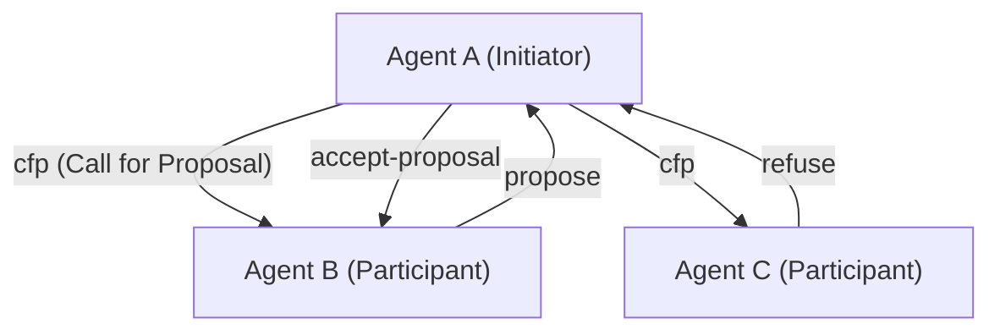
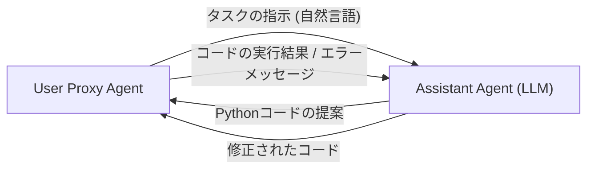

# AIエージェント間の通信プロトコル史

人工知能の歴史において、「自律的に動作するソフトウェアの実体」であるエージェントが複数集まり、協調して複雑なタスクを解決する**マルチエージェントシステム（MAS）**の概念は、決して新しいものではありません。しかし、大規模言語モデル（LLM）の登場により、エージェントの能力が飛躍的に向上し、現代のMASはかつてないほどの柔軟性と適応力を獲得しています。

本記事では、古典的なエージェント通信プロトコルであるFIPA-ACLやKQMLから、現代のLLMベースのマルチエージェントフレームワーク（AutoGen、CrewAIなど）におけるメッセージングの仕組みに至るまで、AIエージェント間の通信プロトコルの進化の歴史と、今後の標準化に向けた展望を詳細に解説します。

## 1. エージェント通信の黎明期：知識の共有と意図の伝達

1990年代、エージェント指向ソフトウェア工学が盛んに研究される中、複数のエージェントが相互に知識を共有し、協調行動をとるための標準的な通信手法が模索されました。

### KQML (Knowledge Query and Manipulation Language)

KQMLは、DARPAの支援を受けたプロジェクトによって開発された、エージェント間の情報交換を目的とした言語およびプロトコルです。KQMLの最大の特徴は、メッセージの内容（ペイロード）と、そのメッセージの「意図」（Performative）を分離したことです。
例えば、`ask-if`（質問）、`tell`（通知）、`subscribe`（購読）といった意図を示すタグをメッセージに付与することで、エージェントは相手がどのようなアクションを求めているのかを解釈できました。

### FIPA-ACL (Foundation for Intelligent Physical Agents - Agent Communication Language)

KQMLの限界を克服し、より厳密な意味論（セマンティクス）を提供するために登場したのが**FIPA-ACL**です。FIPA（のちにIEEEに統合）によって標準化されたこのプロトコルは、音声行為理論（Speech Act Theory）に基づいて設計されています。

FIPA-ACLメッセージの構造は、主に以下の要素で構成されます。

- **Performative**: `inform`, `request`, `propose`, `cfp` (Call for Proposal) などの通信の意図。
- **Sender / Receiver**: 送信者と受信者の識別子。
- **Content**: メッセージの具体的な内容。
- **Language / Ontology**: Contentを記述する言語（例: KIF, SL）および参照するオントロジー。
- **Protocol**: 進行中の対話プロトコル（例: Contract Net Protocol）。

上記は、有名な**Contract Net Protocol (CNP)**の例です。タスクを委譲したいエージェント（Initiator）が、他のエージェント（Participants）に提案を求め（cfp）、最適な提案をしたエージェントにタスクを割り当てる（accept-proposal）という協調プロセスが明確に定義されていました。

## 2. 現代への転換期：マイクロサービスとREST/gRPC

2000年代後半から2010年代にかけて、Webの進化とともにソフトウェアアーキテクチャはSOA（サービス指向アーキテクチャ）から**マイクロサービスアーキテクチャ**へと移行しました。
この時代、エージェント間の通信は、独自のプロトコル（FIPA-ACLなど）よりも、標準的なWeb技術（HTTP/REST, WebSockets, メッセージキュー、のちにgRPC）に依存するようになりました。

JSON形式でのデータ交換が主流となり、各サービス（エージェント）はAPIを通じて通信を行うようになりました。これはシステムの実用性を大きく高めましたが、同時に「意図」や「オントロジー」の厳密な定義は失われ、各APIのスキーマに依存する形となりました。

## 3. LLMの台頭と自然言語によるエージェント通信

2020年代に入り、GPT-4やClaude 3などの高性能な大規模言語モデル（LLM）が登場すると、エージェントの定義そのものが劇的に変化しました。現代の「AIエージェント」は、固定されたアルゴリズムで動作するだけでなく、自然言語を理解し、推論し、ツール（関数呼び出し）を使用できる存在となりました。

これに伴い、エージェント間の通信プロトコルも**「構造化データ（JSON/XML）」から「自然言語のプロンプト」へと回帰**しつつあります。

### AutoGenによる対話パラダイム

Microsoftが開発した**AutoGen**は、複数のLLMエージェントが対話を通じてタスクを解決するフレームワークです。AutoGenでは、エージェントは互いに自然言語でメッセージを送信し合います。

AutoGenにおける「プロトコル」は、明示的なJSONスキーマではなく、**エージェントのシステムプロンプトに記述された役割（Role）と振る舞いのルール**によって定義されます。エージェントは会話の履歴（Context Window）を共有メモリとして活用し、文脈を推論しながら次の行動を決定します。

### CrewAIとロールベースの協調

**CrewAI**は、エージェントに明確な「役割（Role）」「目標（Goal）」「バックストーリー（Backstory）」を与え、チームとして機能させるフレームワークです。
CrewAIにおける通信は、**タスクの委譲（Delegation）**と**結果の引き継ぎ**を中心に構成されています。エージェント間で情報をやり取りする際も、ベースとなるのは自然言語であり、必要に応じて構造化された出力（Pydanticモデルなど）を組み合わせて後続の処理に繋げます。

### LangGraphによるステートフルな制御

**LangGraph**は、エージェントの制御フローをグラフ構造（ノードとエッジ）で定義し、ステート（状態）を管理するアプローチをとります。
エージェント間の通信は、グラフ内を巡回する「State（状態オブジェクト）」の更新として表現されます。あるノード（エージェント）がStateを更新し、次のノードがそのStateを読み取って処理を行うという、Blackboard（黒板）モデルに近いアーキテクチャを採用しています。

## 4. 現代のMASが抱える通信の課題

LLMを用いた自然言語ベースの通信は、極めて柔軟で人間にとって理解しやすい反面、システム工学的な観点からはいくつかの課題が生じています。

1. **非決定性と解釈のブレ**: 自然言語は曖昧さを伴うため、受信側エージェントがメッセージの意図を誤解する（ハルシネーションを含む）リスクが常に存在します。FIPA-ACLにあったような厳密なPerformativeが存在しないためです。
2. **コンテキストウィンドウの枯渇**: 対話形式で通信を行う場合、会話履歴が長くなるとLLMのコンテキストウィンドウを圧迫し、処理コスト（トークン消費量）が増大するとともに、重要な情報が埋もれる（Lost in the Middle）問題が発生します。
3. **通信の標準化の欠如**: 現在、AutoGen、CrewAI、LangChainなど、フレームワークごとに通信や状態管理の仕組みが異なり、異なるフレームワークで構築されたエージェント同士を連携させる標準的な手段が存在しません。

## 5. 新たな標準プロトコルに向けた展望

これらの課題を解決するため、次世代のAIエージェント通信プロトコルに向けた模索が始まっています。

### 構造化データと自然言語のハイブリッド

AIエージェント間の通信は、「機械が処理しやすい構造化メタデータ（JSON, Schema）」と「LLMが推論しやすい自然言語（Context）」のハイブリッドに進化していくと予想されます。
たとえば、メッセージのラッパーとして標準化されたJSONヘッダー（送信者、意図、参照タスクIDなど）を持ち、ペイロードとして自然言語の推論過程やコードを含む形式です。

### MCP (Model Context Protocol) の可能性

最近では、LLMと外部ツール・データソースを接続する標準規格として**MCP (Model Context Protocol)**などが注目を集めています。現時点ではLLMとツールの連携が主ですが、こうしたプロトコルが拡張され、「エージェント対エージェント」の通信における能力の開示（Discovery）や権限委譲の標準規格となる可能性があります。

### 分散型エージェントネットワーク

Web3や分散型技術と結びつき、組織や企業の境界を越えて自律エージェントが安全に通信し、交渉や決済を行うためのプロトコル（例: Fetch.aiのAEAフレームワークなど）も進化を続けています。ここでは、暗号署名によるエージェントの身元保証と、改ざん耐性のあるメッセージングが重要な基盤となります。

## おわりに

AIエージェント間の通信プロトコルは、FIPA-ACLのような厳密な論理体系から始まり、Web APIの時代を経て、現在はLLMによる柔軟な自然言語ベースの対話へと至りました。

今後は、この柔軟性を維持しつつ、システムとしての堅牢性、相互運用性、効率性を担保するための「次世代の標準プロトコル」が求められています。異なる設計思想を持つエージェント同士が、共通の言語とプロトコルで自律的にオーケストレーションされる未来は、すぐそこまで来ています。
