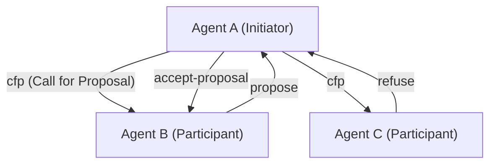
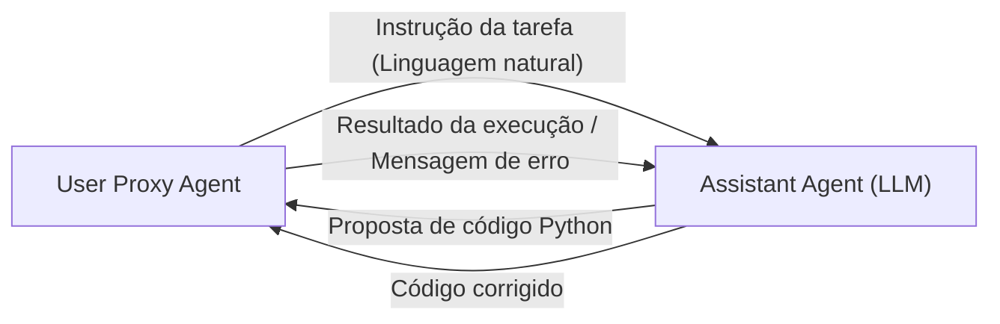

# História dos Protocolos de Comunicação entre Agentes de IA

Na história da inteligência artificial, o conceito de **Sistemas Multiagente (SMA)** — onde múltiplos agentes, que são "entidades de software autônomas", se reúnem e colaboram para resolver tarefas complexas — não é de forma alguma algo novo. No entanto, com o surgimento dos Grandes Modelos de Linguagem (LLMs), a capacidade dos agentes melhorou dramaticamente, e os SMAs modernos adquiriram uma flexibilidade e adaptabilidade sem precedentes.

Neste artigo, explicaremos em detalhes a história da evolução dos protocolos de comunicação entre agentes de IA e as perspectivas para futura padronização, desde os protocolos clássicos como FIPA-ACL e KQML até os mecanismos de mensagens em frameworks modernos de múltiplos agentes baseados em LLM (AutoGen, CrewAI, etc.).

## 1. O Alvorecer da Comunicação de Agentes: Compartilhamento de Conhecimento e Comunicação de Intenções

Durante a década de 1990, com a engenharia de software orientada a agentes sendo ativamente pesquisada, buscava-se métodos padrão de comunicação para que múltiplos agentes pudessem compartilhar conhecimento mutuamente e tomar ações coordenadas.

### KQML (Knowledge Query and Manipulation Language)

O KQML é uma linguagem e protocolo para troca de informações entre agentes, desenvolvido por um projeto apoiado pela DARPA. A maior característica do KQML foi a separação entre o conteúdo da mensagem (payload) e a "intenção" (Performative) dessa mensagem.
Por exemplo, ao anexar tags indicando intenção, como `ask-if` (perguntar), `tell` (informar) ou `subscribe` (assinar), o agente conseguia interpretar que tipo de ação a outra parte estava solicitando.

### FIPA-ACL (Foundation for Intelligent Physical Agents - Agent Communication Language)

O **FIPA-ACL** surgiu para superar as limitações do KQML e fornecer uma semântica mais rigorosa. Este protocolo, padronizado pela FIPA (mais tarde integrada à IEEE), foi projetado com base na Teoria dos Atos de Fala (Speech Act Theory).

A estrutura de uma mensagem FIPA-ACL consiste principalmente nos seguintes elementos:

- **Performative**: A intenção da comunicação, como `inform`, `request`, `propose`, `cfp` (Call for Proposal), etc.
- **Sender / Receiver**: Os identificadores do remetente e do destinatário.
- **Content**: O conteúdo específico da mensagem.
- **Language / Ontology**: A linguagem para descrever o Content (ex: KIF, SL) e a ontologia referenciada.
- **Protocol**: O protocolo de diálogo em andamento (ex: Contract Net Protocol).

O diagrama acima é um exemplo do famoso **Contract Net Protocol (CNP)**. Nele, o processo colaborativo era claramente definido: o agente que deseja delegar uma tarefa (Initiator) pede propostas a outros agentes (Participants) usando o `cfp`, e então atribui a tarefa ao agente que fez a melhor proposta (accept-proposal).

## 2. Ponto de Virada para a Era Moderna: Microsserviços e REST/gRPC

Do final dos anos 2000 até a década de 2010, com a evolução da Web, a arquitetura de software fez a transição da SOA (Arquitetura Orientada a Serviços) para a **arquitetura de microsserviços**.
Nesta era, a comunicação entre agentes passou a depender mais de tecnologias Web padrão (HTTP/REST, WebSockets, filas de mensagens, e depois gRPC) do que de protocolos proprietários (como FIPA-ACL).

A troca de dados no formato JSON tornou-se o padrão dominante, e cada serviço (agente) passou a se comunicar através de APIs. Embora isso tenha aumentado muito a utilidade prática do sistema, a definição rigorosa de "intenção" ou "ontologia" foi perdida, tornando as interações dependentes dos esquemas de cada API.

## 3. A Ascensão dos LLMs e a Comunicação de Agentes em Linguagem Natural

Na década de 2020, com o surgimento de Grandes Modelos de Linguagem (LLMs) de alto desempenho, como o GPT-4 e o Claude 3, a própria definição de agente mudou drasticamente. Os "agentes de IA" modernos não apenas operam com algoritmos fixos, mas também são entidades capazes de compreender linguagem natural, raciocinar e usar ferramentas (chamadas de função).

Junto com isso, os protocolos de comunicação entre agentes estão aos poucos **retornando dos "dados estruturados (JSON/XML)" para os "prompts em linguagem natural"**.

### O Paradigma de Diálogo do AutoGen

O **AutoGen**, desenvolvido pela Microsoft, é um framework onde múltiplos agentes LLM resolvem tarefas através do diálogo. No AutoGen, os agentes enviam mensagens em linguagem natural uns para os outros.

O "protocolo" no AutoGen não é um esquema JSON explícito, mas sim os **papéis (Role) e regras de comportamento descritos nos prompts de sistema dos agentes**. O agente utiliza o histórico de conversação (Context Window) como uma memória compartilhada, raciocinando sobre o contexto para decidir sua próxima ação.

### CrewAI e a Colaboração Baseada em Papéis

O **CrewAI** é um framework que fornece aos agentes um "Papel" (Role), "Objetivo" (Goal) e "Histórico" (Backstory) claros, fazendo com que funcionem como uma equipe.
A comunicação no CrewAI é construída em torno da **delegação de tarefas (Delegation)** e do **repasse de resultados**. Quando a informação é trocada entre agentes, a base é a linguagem natural e, conforme necessário, saídas estruturadas (como modelos Pydantic) são combinadas para conectar os processos subsequentes.

### Controle Stateful com LangGraph

O **LangGraph** adota uma abordagem que define o fluxo de controle dos agentes usando uma estrutura de grafos (nós e arestas) e gerencia o estado (State).
A comunicação entre os agentes é representada como atualizações de um "State (objeto de estado)" que circula dentro do grafo. Adota uma arquitetura próxima ao modelo Blackboard (quadro negro), onde um nó (agente) atualiza o estado, e o nó seguinte lê esse estado para realizar seu processamento.

## 4. Desafios de Comunicação nos SMAs Modernos

Embora a comunicação baseada em linguagem natural utilizando LLMs seja extremamente flexível e fácil de ser compreendida por humanos, surgem vários desafios do ponto de vista da engenharia de sistemas.

1. **Não-determinismo e Variações na Interpretação**: Por a linguagem natural envolver ambiguidades, há sempre o risco de que o agente receptor entenda mal a intenção da mensagem (incluindo alucinações). Isso ocorre porque não há as rígidas Performatives como havia no FIPA-ACL.
2. **Esgotamento da Context Window**: Quando a comunicação ocorre em formato de diálogo, à medida que o histórico de conversas se prolonga, há uma pressão sobre a janela de contexto do LLM. Isso aumenta os custos de processamento (consumo de tokens) e causa o problema em que informações importantes acabam sendo ignoradas (Lost in the Middle).
3. **Falta de Padronização na Comunicação**: Atualmente, frameworks como AutoGen, CrewAI e LangChain possuem mecanismos diferentes de comunicação e gerenciamento de estados, e não há meios padronizados para integrar agentes construídos em diferentes frameworks.

## 5. Perspectivas Rumo a um Novo Protocolo Padrão

Para resolver esses desafios, a busca por protocolos de comunicação de agentes de IA de próxima geração já começou.

### Híbrido de Dados Estruturados e Linguagem Natural

Espera-se que a comunicação entre agentes de IA evolua para um híbrido de "metadados estruturados de fácil processamento por máquinas (JSON, Schema)" e "linguagem natural de fácil raciocínio por LLMs (Context)".
Por exemplo, poderia haver um formato com um cabeçalho JSON padronizado como wrapper para a mensagem (remetente, intenção, ID de tarefa referenciada, etc.) e o processo de raciocínio ou código em linguagem natural como o payload.

### O Potencial do MCP (Model Context Protocol)

Recentemente, o **MCP (Model Context Protocol)** e padrões semelhantes vêm ganhando atenção como uma especificação padrão para conectar LLMs com ferramentas e fontes de dados externas. No momento, o foco principal é a integração entre LLMs e ferramentas, mas existe o potencial de que tais protocolos sejam expandidos para se tornarem a especificação padrão de Descoberta (Discovery) de capacidades e delegação de autoridade na comunicação "agente para agente".

### Redes de Agentes Descentralizadas

Em conjunto com Web3 e tecnologias descentralizadas, protocolos para que agentes autônomos se comuniquem com segurança através das fronteiras de organizações e empresas para negociar e liquidar pagamentos (ex: framework AEA da Fetch.ai) também continuam a evoluir. Aqui, a garantia de identidade dos agentes usando assinaturas criptográficas e mensagens resistentes a adulterações tornam-se uma base importante.

## Conclusão

Os protocolos de comunicação entre agentes de IA começaram com sistemas lógicos rigorosos como o FIPA-ACL, passaram pela era das Web APIs e agora chegaram aos diálogos flexíveis baseados em linguagem natural usando LLMs.

No futuro, embora mantendo essa flexibilidade, será necessário um "protocolo padrão de próxima geração" para garantir a robustez, interoperabilidade e eficiência como sistema. Um futuro onde agentes com diferentes filosofias de design sejam orquestrados de forma autônoma com uma linguagem e protocolo comuns está logo ali.
