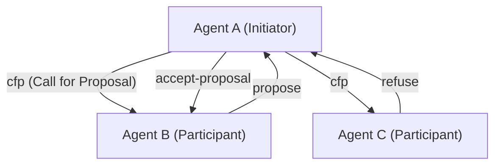
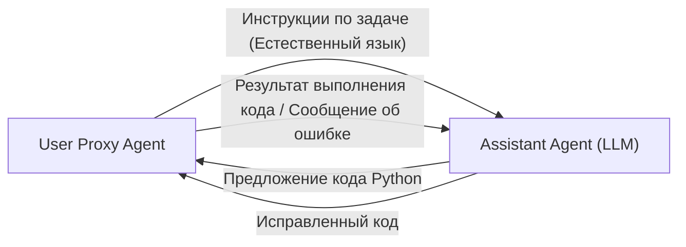

# История протоколов связи между ИИ-агентами

В истории искусственного интеллекта концепция **многоагентных систем (MAS)**, в которых несколько агентов, являющихся «автономно действующими программными сущностями», собираются вместе для совместного решения сложных задач, отнюдь не нова. Однако с появлением больших языковых моделей (LLM) возможности агентов резко возросли, и современные MAS приобрели беспрецедентную гибкость и адаптивность.

В этой статье мы подробно рассмотрим историю эволюции протоколов связи между ИИ-агентами и перспективы их будущей стандартизации: от классических протоколов связи агентов, таких как FIPA-ACL и KQML, до механизмов обмена сообщениями в современных многоагентных фреймворках на базе LLM (таких как AutoGen, CrewAI и др.).

## 1. Зарождение связи между агентами: обмен знаниями и передача намерений

В 1990-е годы, когда активно исследовалась агентно-ориентированная программная инженерия, велся поиск стандартных методов связи, позволяющих нескольким агентам обмениваться знаниями друг с другом и координировать свои действия.

### KQML (Knowledge Query and Manipulation Language)

KQML — это язык и протокол, разработанный в рамках проекта при поддержке DARPA, целью которого был обмен информацией между агентами. Главной особенностью KQML является то, что он разделяет содержимое сообщения (полезную нагрузку) и «намерение» (Performative) этого сообщения.
Например, прикрепляя к сообщению теги, указывающие на намерение, такие как `ask-if` (вопрос), `tell` (уведомление), `subscribe` (подписка), агент мог интерпретировать, какого действия ожидает от него другая сторона.

### FIPA-ACL (Foundation for Intelligent Physical Agents - Agent Communication Language)

Чтобы преодолеть ограничения KQML и обеспечить более строгую семантику, был создан **FIPA-ACL**. Этот протокол, стандартизированный FIPA (позже интегрированной в IEEE), разработан на основе теории речевых актов (Speech Act Theory).

Структура сообщения FIPA-ACL состоит в основном из следующих элементов:

- **Performative**: Намерение связи, такое как `inform`, `request`, `propose`, `cfp` (Call for Proposal).
- **Sender / Receiver**: Идентификаторы отправителя и получателя.
- **Content**: Конкретное содержимое сообщения.
- **Language / Ontology**: Язык, на котором описан Content (например, KIF, SL), и эталонная онтология.
- **Protocol**: Текущий протокол взаимодействия (например, Contract Net Protocol).

Выше приведен пример известного **Contract Net Protocol (CNP)**. Процесс координации был четко определен: агент, желающий делегировать задачу (Initiator), запрашивает предложения у других агентов (Participants) (cfp) и назначает задачу агенту, сделавшему лучшее предложение (accept-proposal).

## 2. Переходный период к современности: микросервисы и REST/gRPC

С конца 2000-х до 2010-х годов, наряду с эволюцией Web, архитектура программного обеспечения перешла от SOA (сервис-ориентированной архитектуры) к **микросервисной архитектуре**.
В эту эпоху связь между агентами стала опираться на стандартные веб-технологии (HTTP/REST, WebSockets, очереди сообщений, а позже и gRPC), а не на проприетарные протоколы (такие как FIPA-ACL).

Обмен данными в формате JSON стал основным направлением, и каждый сервис (агент) начал обмениваться данными через API. Это значительно повысило практичность систем, но в то же время были утрачены строгие определения «намерений» и «онтологий», что привело к зависимости от схемы каждого API.

## 3. Расцвет LLM и связь между агентами на естественном языке

В 2020-е годы, с появлением высокопроизводительных больших языковых моделей (LLM), таких как GPT-4 и Claude 3, само определение агентов кардинально изменилось. Современные «ИИ-агенты» стали сущностями, которые не только работают по фиксированным алгоритмам, но и могут понимать естественный язык, рассуждать и использовать инструменты (вызов функций).

В связи с этим протоколы связи между агентами также начинают **возвращаться от «структурированных данных (JSON/XML)» к «промптам на естественном языке»**.

### Парадигма диалога с помощью AutoGen

**AutoGen**, разработанный Microsoft, — это фреймворк, в котором несколько LLM-агентов решают задачи посредством диалога. В AutoGen агенты отправляют друг другу сообщения на естественном языке.

«Протокол» в AutoGen — это не явная JSON-схема, а **определение на основе ролей (Role) и правил поведения, описанных в системном промпте агента**. Агенты используют историю разговора (Context Window) как общую память, принимая решения о дальнейших действиях путем вывода из контекста.

### CrewAI и ролевая координация

**CrewAI** — это фреймворк, который наделяет агентов четкими «Ролями (Role)», «Целями (Goal)» и «Предысториями (Backstory)», заставляя их функционировать как команда.
Связь в CrewAI в первую очередь построена на **делегировании задач (Delegation)** и **передаче результатов**. При обмене информацией между агентами основой является естественный язык, который при необходимости комбинируется со структурированным выводом (например, моделями Pydantic) для подключения к последующей обработке.

### Управление с сохранением состояния с помощью LangGraph

**LangGraph** использует подход определения потока управления агентами с помощью графовой структуры (узлы и ребра) и управления состоянием (State).
Связь между агентами представлена как обновления «State (объекта состояния)», который перемещается по графу. В нем используется архитектура, близкая к модели Blackboard (классной доски), где один узел (агент) обновляет State, а следующий узел читает этот State и выполняет обработку.

## 4. Проблемы связи в современных MAS

Связь на естественном языке с использованием LLM чрезвычайно гибка и проста для понимания человеком, однако с точки зрения системной инженерии возникает несколько проблем.

1. **Недетерминированность и размытость интерпретации**: Поскольку естественный язык подразумевает неоднозначность, всегда существует риск того, что принимающий агент неправильно поймет намерение сообщения (включая галлюцинации). Это связано с тем, что не существует строгих Performative, как в FIPA-ACL.
2. **Исчерпание контекстного окна**: При диалоговом общении удлинение истории разговора оказывает давление на контекстное окно LLM, что приводит к увеличению затрат на обработку (расход токенов) и проблеме потери важной информации (Lost in the Middle).
3. **Отсутствие стандартизации связи**: В настоящее время такие фреймворки, как AutoGen, CrewAI, LangChain, имеют разные механизмы связи и управления состоянием, и не существует стандартного способа интеграции агентов, созданных на разных фреймворках.

## 5. Перспективы новых стандартных протоколов

Для решения этих проблем начался поиск протоколов связи между ИИ-агентами следующего поколения.

### Гибрид структурированных данных и естественного языка

Ожидается, что связь между ИИ-агентами будет развиваться в сторону гибрида «машинно-читаемых структурированных метаданных (JSON, Schema)» и «удобного для рассуждений LLM естественного языка (Context)».
Например, это формат, в котором есть стандартизированный заголовок JSON (отправитель, намерение, ID связанной задачи и т. д.) в качестве обертки для сообщения, а полезная нагрузка включает процесс рассуждения на естественном языке и код.

### Потенциал MCP (Model Context Protocol)

В последнее время стандарты, такие как **MCP (Model Context Protocol)**, привлекают внимание как стандарт для подключения LLM к внешним инструментам и источникам данных. В настоящее время это в основном интеграция между LLM и инструментами, но такие протоколы могут быть расширены и стать стандартом для раскрытия возможностей (Discovery) и делегирования полномочий в связи «агент-агент».

### Децентрализованные агентные сети

В связи с развитием Web3 и децентрализованных технологий также продолжают развиваться протоколы (например, фреймворк AEA от Fetch.ai), позволяющие автономным агентам безопасно общаться, вести переговоры и осуществлять расчеты, преодолевая организационные и корпоративные границы. Здесь важной основой служат гарантия идентичности агента с помощью криптографических подписей и обмен сообщениями, защищенными от несанкционированного вмешательства.

## Заключение

Протоколы связи между ИИ-агентами начались со строгих логических систем, таких как FIPA-ACL, прошли через эпоху Web API и теперь достигли гибкого диалога на естественном языке с помощью LLM.

В будущем, при сохранении этой гибкости, потребуется «стандартный протокол следующего поколения» для обеспечения надежности, совместимости и эффективности системы в целом. Будущее, в котором агенты с различными философиями дизайна автономно оркестрируются с использованием общего языка и протокола, уже не за горами.
