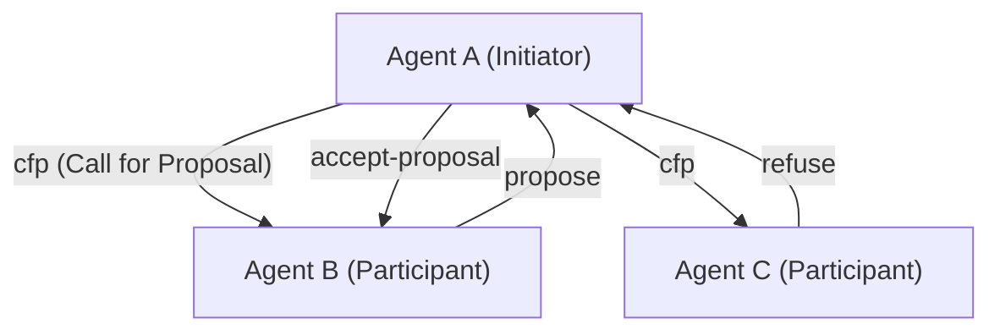
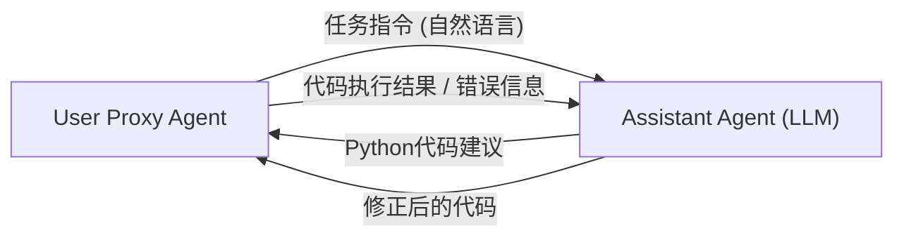

# AI智能体间通信协议发展史

在人工智能的历史中，多个作为“自主运行的软件实体”的智能体聚集在一起，协同解决复杂任务的**多智能体系统（MAS）**的概念绝非新鲜事物。然而，随着大型语言模型（LLM）的出现，智能体的能力得到了飞跃性的提升，现代的MAS获得了前所未有的灵活性和适应力。

本文将详细探讨AI智能体间通信协议的演变历史及其未来迈向标准化的前景，涵盖从FIPA-ACL和KQML等经典智能体通信协议，到现代基于LLM的多智能体框架（如AutoGen、CrewAI等）中消息传递的机制。

## 1. 智能体通信的黎明期：知识共享与意图传递

20世纪90年代，随着面向智能体的软件工程研究的兴起，人们探索了多种标准的通信方法，以便多个智能体能够相互共享知识并采取协作行动。

### KQML (Knowledge Query and Manipulation Language)

KQML是在DARPA资助的项目下开发的一种旨在实现智能体之间信息交换的语言和协议。KQML的最大特点是将消息的内容（有效载荷）与该消息的“意图”（Performative，行动表达）分离开来。
例如，通过在消息上附加表示意图的标签，如`ask-if`（提问）、`tell`（通知）、`subscribe`（订阅），智能体就能解析对方期望采取怎样的行动。

### FIPA-ACL (Foundation for Intelligent Physical Agents - Agent Communication Language)

为了克服KQML的局限性并提供更严格的语义（Semantics），**FIPA-ACL**应运而生。这个由FIPA（后并入IEEE）标准化的协议，是基于言语行为理论（Speech Act Theory）设计的。

FIPA-ACL消息的结构主要由以下要素组成：

- **Performative**: 通信的意图，如`inform`, `request`, `propose`, `cfp` (Call for Proposal)等。
- **Sender / Receiver**: 发送者和接收者的标识符。
- **Content**: 消息的具体内容。
- **Language / Ontology**: 描述Content所使用的语言（例如：KIF, SL）以及引用的本体（Ontology）。
- **Protocol**: 正在进行的对话协议（例如：Contract Net Protocol）。

上图是著名的**契约网协议 (Contract Net Protocol, CNP)**示例。该协议明确定义了一个协作过程：希望委派任务的智能体（Initiator）向其他智能体（Participants）征求提案（cfp），然后将任务分配给提出最佳提案的智能体（accept-proposal）。

## 2. 迈向现代的转折期：微服务与REST/gRPC

从2000年代后期到2010年代，随着Web的发展，软件架构从SOA（面向服务的架构）过渡到了**微服务架构**。
在这个时代，智能体之间的通信不再依赖像FIPA-ACL这样专门的协议，而是转向依赖标准的Web技术（HTTP/REST、WebSockets、消息队列以及后来的gRPC）。

采用JSON格式进行数据交换成为主流，各个服务（智能体）开始通过API进行通信。这大大提高了系统的实用性，但同时也丢失了对“意图”和“本体”的严格定义，变得依赖于各个API的模式（Schema）。

## 3. LLM的崛起与通过自然语言进行的智能体通信

进入2020年代，随着GPT-4和Claude 3等高性能大型语言模型（LLM）的出现，智能体的定义本身发生了剧烈的变化。现代的“AI智能体”不仅通过固定的算法运行，而是成为了能够理解自然语言、进行推理并使用工具（函数调用）的存在。

随之而来的是，智能体之间的通信协议也正**从“结构化数据（JSON/XML）”回归到“自然语言提示词（Prompt）”**。

### AutoGen带来的对话范式

微软开发的**AutoGen**是一个允许多个LLM智能体通过对话协同解决任务的框架。在AutoGen中，智能体之间使用自然语言互相发送消息。

AutoGen中的“协议”并非显式的JSON模式，而是由**写在智能体系统提示词中的角色（Role）和行为规则**来定义的。智能体将对话历史（Context Window）作为共享内存来利用，并在推断上下文的同时决定下一步的行动。

### CrewAI与基于角色的协作

**CrewAI**是一个赋予智能体明确的“角色（Role）”、“目标（Goal）”和“背景故事（Backstory）”，并使它们作为一个团队运作的框架。
CrewAI中的通信主要是围绕**任务委派（Delegation）**和**结果交接**构建的。在智能体之间传递信息时，基础仍然是自然语言，并在必要时结合结构化输出（如Pydantic模型）以衔接后续处理。

### LangGraph与有状态控制

**LangGraph**采用了一种通过图结构（节点和边）来定义智能体控制流并管理状态（State）的方法。
智能体之间的通信被表现为在图中循环流转的“状态（State对象）”的更新。它采用了类似于黑板（Blackboard）模型的架构：某个节点（智能体）更新状态，下一个节点读取该状态并进行处理。

## 4. 现代MAS在通信方面面临的挑战

尽管基于LLM的自然语言通信极其灵活且易于人类理解，但从系统工程的角度来看，也带来了一些挑战。

1. **非确定性与解释偏差**: 由于自然语言固有的模糊性，接收方智能体总是存在误解消息意图（包括产生幻觉）的风险。这是因为缺乏像FIPA-ACL中那样严格的行动表达（Performative）。
2. **上下文窗口枯竭**: 当以对话形式进行通信时，过长的对话历史会挤压LLM的上下文窗口，不仅增加了处理成本（Token消耗量），还会引发重要信息被埋没（Lost in the Middle）的问题。
3. **缺乏标准化的通信**: 目前，像AutoGen、CrewAI、LangChain等不同的框架各自具有不同的通信和状态管理机制，目前尚不存在连接使用不同框架构建的智能体之间的标准手段。

## 5. 迈向新标准协议的展望

为了解决这些挑战，人们已经开始探索下一代AI智能体通信协议。

### 结构化数据与自然语言的混合

预计AI智能体之间的通信将演变为“便于机器处理的结构化元数据（JSON, Schema）”和“便于LLM推理的自然语言（Context）”的混合形式。
例如，采用包含标准化JSON标头（发送者、意图、引用任务ID等）作为消息的封装层，而以自然语言推理过程或代码作为有效载荷的格式。

### MCP (Model Context Protocol) 的潜力

最近，作为连接LLM与外部工具和数据源的标准规范，**MCP (Model Context Protocol)**等备受关注。虽然目前它主要用于LLM与工具之间的连接，但随着此类协议的扩展，它有望成为“智能体间”通信中披露能力（Discovery）和委派权限的标准规范。

### 去中心化智能体网络

与Web3和去中心化技术相结合，跨越组织和企业边界、使自主智能体能够安全通信、进行谈判和结算的协议（例如：Fetch.ai的AEA框架等）也在持续发展。在这里，基于加密签名的智能体身份保证以及抗篡改的消息传递机制成为了重要的基础。

## 结语

AI智能体间通信协议从诸如FIPA-ACL这样严格的逻辑体系起步，历经Web API时代，如今已发展到基于LLM的灵活的自然语言对话。

展望未来，我们需要一种“下一代标准协议”，它不仅能保持这种灵活性，还能保障作为系统的稳健性、互操作性和效率。那些拥有不同设计理念的智能体们，通过共通的语言和协议被自主编排和协作的未来，已经近在咫尺。
