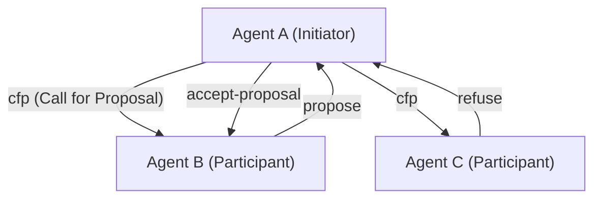
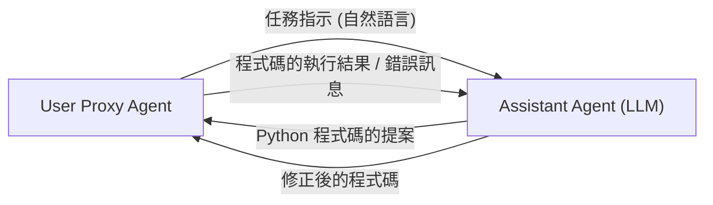

# AI 代理間的通訊協定史

在人工智慧的歷史中，由多個作為「自主運行的軟體實體」的代理集合而成，並協同解決複雜任務的**多代理系統（MAS）**概念，絕對不是什麼新鮮事。然而，隨著大型語言模型（LLM）的出現，代理的能力有了飛躍性的提升，現代的 MAS 獲得了前所未有的靈活性與適應力。

本文將從古典的代理通訊協定如 FIPA-ACL 與 KQML，一直到現代基於 LLM 的多代理框架（如 AutoGen、CrewAI 等）中的訊息傳遞機制，詳細解說 AI 代理間通訊協定的演進歷史，以及對未來邁向標準化的展望。

## 1. 代理通訊的黎明期：知識共享與意圖傳達

1990 年代，在代理導向軟體工程研究盛行的背景下，人們開始探索能讓多個代理相互共享知識並採取協同行動的標準通訊方法。

### KQML (Knowledge Query and Manipulation Language)

KQML 是一個由 DARPA 贊助的專案所開發，旨在用於代理間資訊交換的語言與協定。KQML 最大的特色在於，它將訊息的內容（有效負載，Payload）與該訊息的「意圖」（Performative）分離開來。
例如，透過在訊息中附加表示意圖的標籤，如 `ask-if`（詢問）、`tell`（通知）、`subscribe`（訂閱）等，代理就能解讀對方所要求的是什麼樣的行動。

### FIPA-ACL (Foundation for Intelligent Physical Agents - Agent Communication Language)

為克服 KQML 的限制並提供更嚴謹的語義（Semantics），**FIPA-ACL** 應運而生。這個由 FIPA（後來併入 IEEE）所標準化的協定，是基於言語行為理論（Speech Act Theory）而設計。

FIPA-ACL 訊息的結構主要由以下元素組成：

- **Performative**: `inform`、`request`、`propose`、`cfp` (Call for Proposal) 等通訊的意圖。
- **Sender / Receiver**: 發送者與接收者的識別碼。
- **Content**: 訊息的具體內容。
- **Language / Ontology**: 描述 Content 所使用的語言（例：KIF、SL）以及參考的本體論（Ontology）。
- **Protocol**: 進行中的對話協定（例：Contract Net Protocol）。

上述是著名的**合約網路協定 (Contract Net Protocol, CNP)** 範例。明確定義了這樣的協同過程：希望委派任務的代理（Initiator）向其他代理（Participants）徵求提案（cfp），並將任務分配給提出最佳提案的代理（accept-proposal）。

## 2. 邁向現代的轉型期：微服務與 REST/gRPC

從 2000 年代後半到 2010 年代，隨著 Web 的進化，軟體架構也從 SOA（服務導向架構）轉型為**微服務架構**。
在這個時代，代理間的通訊不再依賴專有的協定（如 FIPA-ACL），而是開始仰賴標準的 Web 技術（HTTP/REST、WebSockets、訊息佇列，以及後來的 gRPC）。

以 JSON 格式進行資料交換成為主流，各個服務（代理）開始透過 API 進行通訊。這大幅提升了系統的實用性，但同時也失去了對「意圖」與「本體論」的嚴格定義，變成依賴各個 API 結構描述（Schema）的形式。

## 3. LLM 的崛起與基於自然語言的代理通訊

進入 2020 年代，隨著 GPT-4 和 Claude 3 等高性能大型語言模型（LLM）的登場，代理的定義本身發生了劇烈的變化。現代的「AI 代理」不再只是以固定的演算法運作，而是成為了能理解自然語言、進行推論，並使用工具（函數呼叫）的實體。

伴隨而來的是，代理間的通訊協定也正逐漸從**「結構化資料（JSON/XML）」回歸到「自然語言的提示詞（Prompt）」**。

### AutoGen 的對話典範

由微軟開發的 **AutoGen**，是一個讓多個 LLM 代理透過對話來解決任務的框架。在 AutoGen 中，代理們會以自然語言相互傳送訊息。

AutoGen 中的「協定」並非明確的 JSON Schema，而是由**寫在代理系統提示詞中的角色（Role）與行為規則**來定義。代理會將對話紀錄（Context Window）作為共享記憶體來活用，一邊推論脈絡一邊決定下一步的行動。

### CrewAI 與基於角色的協作

**CrewAI** 是一個賦予代理明確的「角色（Role）」、「目標（Goal）」以及「背景故事（Backstory）」，並讓它們作為一個團隊運作的框架。
CrewAI 中的通訊主要由**任務的委派（Delegation）**與**結果的交接**構成。即使在代理間交換資訊，基礎依然是自然語言，並根據需要結合結構化的輸出（如 Pydantic 模型）以銜接後續的處理。

### LangGraph 的有狀態控制

**LangGraph** 採取了一種透過圖形結構（節點與邊）來定義代理的控制流程，並管理狀態（State）的方法。
代理間的通訊表現為在圖中巡迴的「State（狀態物件）」的更新。某個節點（代理）更新了 State，接著下一個節點讀取該 State 並進行處理，這種架構近似於 Blackboard（黑板）模型。

## 4. 現代 MAS 面臨的通訊挑戰

基於 LLM 的自然語言通訊，雖然極度靈活且易於人類理解，但從系統工程的角度來看，卻產生了幾個挑戰：

1. **非決定性與解讀偏差**：由於自然語言帶有模糊性，接收端代理誤解訊息意圖（包含幻覺，Hallucination）的風險始終存在。這是因為缺乏了如同 FIPA-ACL 中那樣嚴格的 Performative。
2. **上下文視窗（Context Window）枯竭**：在以對話形式進行通訊時，一旦對話紀錄變長，就會對 LLM 的上下文視窗造成壓力，除了增加處理成本（Token 消耗量），也會發生重要資訊被埋沒（Lost in the Middle）的問題。
3. **缺乏通訊的標準化**：目前，AutoGen、CrewAI、LangChain 等每個框架的通訊與狀態管理機制各不相同，缺乏讓建構在不同框架上的代理彼此連結的標準手段。

## 5. 邁向新標準協定的展望

為了解決這些挑戰，業界已經開始探索邁向次世代 AI 代理通訊協定的道路。

### 結構化資料與自然語言的混合

預計 AI 代理間的通訊將會演化為「機器易於處理的結構化詮釋資料（JSON, Schema）」與「LLM 易於推論的自然語言（Context）」的混合體。
例如，以標準化的 JSON 標頭（發送者、意圖、參考的任務 ID 等）作為訊息的包裝，並將包含自然語言推論過程或程式碼的內容作為有效負載。

### MCP (Model Context Protocol) 的潛力

最近，作為連接 LLM 與外部工具・資料來源的標準規格，**MCP (Model Context Protocol)** 等技術備受矚目。雖然目前主要用於 LLM 與工具的整合，但這類協定若能延伸擴展，未來有可能成為「代理對代理」通訊中能力揭露（Discovery）與權限委派的標準規格。

### 分散式代理網路

結合 Web3 與分散式技術，讓跨越組織與企業邊界的自主代理能夠安全通訊，進行交涉或支付的協定（例：Fetch.ai 的 AEA 框架等）也在持續發展。在這裡，透過加密簽章保證代理的身分，以及具備防篡改能力的訊息傳遞，將成為重要的基礎。

## 結語

AI 代理間的通訊協定，從如同 FIPA-ACL 般的嚴謹邏輯體系開始，歷經 Web API 時代，如今發展到了由 LLM 驅動的靈活自然語言對話。

展望未來，我們需要的是一個既能維持這份靈活性，又能確保系統的強健性、互通性與效率的「次世代標準協定」。設計理念相異的代理們，能以共通的語言與協定進行自主編排的未來，已經近在眼前。
