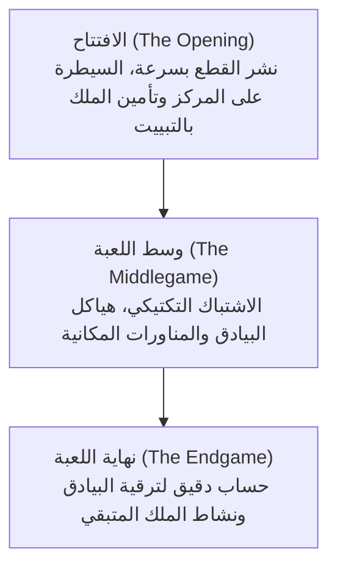

# ألعاب الطاولة والذكاء الاصطناعي: قواعد الشطرنج والأنماط الاستراتيجية وتطوره من ديب بلو إلى ألفازيرو

في تاريخ أبحاث الذكاء الاصطناعي (AI)، لُقبت ألعاب الطاولة الذهنية بـ «ذبابة الفاكهة في أبحاث الذكاء الاصطناعي»؛ إذ وفرت بيئة مغلقة ومنضبطة لاختبار آليات التفكير البشري وتقييم الخوارزميات الحسابية الثورية. ويتربع الشطرنج على قمة هذه الألعاب، دافعاً مسيرة علوم الحاسوب نحو إنجازات تاريخية خالدة.

يستعرض هذا المقال القواعد الأساسية للشطرنج، وتعقيد شجرة اللعبة، والأنماط الاستراتيجية، متتبعاً مسار التطور من أبحاث كلود شانون وهزيمة بطل العالم غاري كاسباروف أمام حاسوب IBM ديب بلو عام 1997، وصولاً إلى ثورة ألفازيرو ومحركات الشطرنج الهجينة الحديثة مثل ستوكفيش NNUE.

## 1. القواعد الأساسية للشطرنج وتعقيد شجرة اللعبة

الشطرنج لعبة ثنائية، صفرية، منتهية، حتمية وتامة المعلومات. تُمارس على رقعة مربعة مكونة من 64 مربعاً ($8 \times 8$) تتناوب فيها الألوان الفاتحة والداكنة. يقود كل لاعب 16 قطعة (يبدأ الأبيض بالحركة الأولى)، والهدف النهائي هو محاصرة ملك الخصم في وضع هجوم لا يمكن النجاة منه: **كش مات (Checkmate)**.

### أنواع القطع وحركتها الهندسية
تتألف كل قوة من ست قطع تتحرك وفق متجهات محددة:
- **الملك (King)**: يتحرك خطوة واحدة في أي اتجاه. سقوطه يعني نهاية اللعبة فوراً.
- **الوزير / الملكة (Queen)**: أقوى القطع؛ يتحرك في خطوط مستقيمة أفقياً ورأسياً وقطرياً لأي عدد من المربعات الشاغرة.
- **القلعة / الطابية (Rook)**: تتحرك أفقياً ورأسياً عبر الصفوف والأعمدة.
- **الفيل (Bishop)**: يتحرك قطرياً فقط، ويبقى مقيداً بلون مربعاته الأصلية طوال اللعبة.
- **الحصان (Knight)**: يقفز على شكل حرف «L» (مربعان في اتجاه ثم مربع واحد بزاوية قائمة)، وهو الوحيد القادر على القفز فوق القطع الأخرى.
- **البيدق (Pawn)**: يتحرك خطوة واحدة للأمام (أو خطوتين في نقلته الأولى) ويأسر قطرياً. ويتمتع بحركات خاصة مثل الأسر بالتجاوز والترقية عند بلوغ الصف الثامن.

### مراحل المباراة الثلاث
تمر مباراة الشطرنج بثلاث مراحل استراتيجية رئيسية:

1. **الافتتاح (Opening)**: تعبئة القطع من مواقعها الأصلية نحو المربعات النشطة، والقتال للسيطرة على مربعات المركز ($d4, e4, d5, e5$)، وتأمين الملك عبر التبييت.
2. **وسط اللعبة (Middlegame)**: مرحلة المعركة الكبرى؛ تجمع بين التقدير الموقعي العميق (هياكل البيادق، المربعات الضعيفة) والتكتيكات الحادة (التثبيت، الشوكة، التضحيات).
3. **نهاية اللعبة (Endgame)**: تبسيط الموقف بعد تكسير معظم القطع الثقيلة. تصبح ترقية البيدق إلى وزير الفيصل الحاسم، ويتطلب الأمر دقة حسابية لا تقبل الخطأ.

### تعقيد شجرة اللعبة: رقم شانون

لتوضيح التحدي الحسابي الخارق، قدّر عالم الرياضيات كلود شانون عام 1950 عدد مباريات الشطرنج الممكنة بـ **رقم شانون**:

$$ \text{تعقيد شجرة اللعبة} \approx 10^{120} $$

بينما يُقدّر عدد الأوضاع القانونية الممكنة على الرقعة بـ:

$$ \text{تعقيد فضاء الحالات} \approx 10^{43} \sim 10^{47} $$

وبالمقارنة مع عدد الذرات في الكون المرئي (نحو $10^{80}$)، يؤكد رقم شانون بوضوح أن **حل الشطرنج بالحساب الشامل وقوة الحوسبة العمياء مستحيل فيزيائياً**. وكان لزاماً على برامج الذكاء الاصطناعي أن تتعلم تقليم فروع الشجرة واختزالها.

## 2. الأنماط الاستراتيجية والحدس البشري

كيف تعامل أبطال الشطرنج مع هذا الانفجار الحسابي الهائل؟ أثبتت أبحاث علم النفس المعرفي أن السر يكمن في **التعرف على الأنماط (Pattern Recognition) وتجميع المعلومات (Chunking)**.

لا يحلل الأستاذ الكبير كل نقلة قانونية، بل يدرك الموقف ككتل مترابطة ذات معنى استراتيجي. فيتجاهل عقله أكثر من 98% من النقلات الهامشية، ويركز حسابه العميق على نقلتين أو ثلاث نقلات حاسمة فقط.

يجمع التفكير الشطرنجي بين:
- **التكتيك (Tactics)**: مناورات إجبارية قصيرة المدى لكسب قطع أو تحقيق المات (الشوكة، التثبيت، الكشف).
- **اللعب الموقعي (Positional Play)**: خطط طويلة المدى للسيطرة على الأعمدة المفتوحة واستغلال ضعف هيكل بيادق الخصم.

وكان الهدف الأسمى للذكاء الاصطناعي على مدار نصف قرن هو محاكاة هذا التقدير الاستراتيجي البشري داخل حواسيب إلكترونية.

## 3. صدمة ديب بلو: قوة الحساب الهائل تتفوق

اعتمدت المحركات الأولى على **خوارزمية مينيماكس (Minimax)** مع **تقليم ألفا-بيتا (Alpha-Beta Pruning)** ودالة تقييم حسابية يدوية.

### بنية ديب بلو الخارقة
في مايو 1997، حقق حاسوب IBM الفائق **ديب بلو (Deep Blue)** إنجازاً تاريخياً بهزيمة بطل العالم غاري كاسباروف بنتيجة $3\frac{1}{2} - 2\frac{1}{2}$.

اعتمد ديب بلو على قوة الحوسبة المتوازية الخارقة:
- **عتاد مخصص**: حاسوب فائق يضم 30 عقدة مدعوماً بـ 480 شريحة VLSI صُممت خصيصاً لحساب نقلات الشطرنج.
- **سرعة البحث**: تقييم أكثر من **200 مليون وضعية في الثانية**، والتعمق من 6 إلى 8 نقلات بشكل روتيني وحتى 20 نقلة في المواقف الإجبارية.
- **موسوعة المعرفة البشرية**: دالة تقييم تزن آلاف المعاملات بالتعاون مع أساتذة دوليين، ومكتبة افتتاحات ضخمة وقواعد بيانات لنهايات اللعب.

ورغم الضجة العالمية، كان ديب بلو مجرد انتصار للحوسبة المتخصصة وقوة التكرار الرياضي، ولم يكن يمتلك ذكاءً عاماً قادراً على التعلم الذاتي.

## 4. التحول الجذري: معجزة ألفازيرو (AlphaZero)

في ديسمبر 2017، فجرت شركة Google DeepMind ثورة هائلة بإطلاق **AlphaZero**.

في مواجهة من 100 مباراة ضد Stockfish 8 (المحرك الأقوى في العالم آنذاك)، حقق ألفازيرو فوزاً ساحقاً: 28 انتصاراً، 72 تعادلاً، و**صفر هزائم**.

### الابتكار الخوارزمي في ألفازيرو
1. **التعلم من نقطة الصفر (Tabula Rasa)**: لم يُزوّد بأي مباريات بشرية أو مكتبات افتتاحيات؛ زُوّد فقط بقواعد اللعبة الأساسية.
2. **اللعب الذاتي (Self-Play)**: من خلال ملايين المباريات ضد نفسه، استنبط ألفازيرو عبر التعلم المعزز العميق استراتيجيات مذهلة تفوقت على قرون من التنظير البشري.
3. **شبكة عصبية عميقة مزدوجة**: تحسب الشبكة النقلات الأفضل احتمالية (**Policy**) وتقيم فرص الفوز في الوضعية (**Value**).
4. **بحث شجرة مونت كارلو (MCTS)**: بينما كان ستوكفيش 8 يحلل 60 مليون نقلة بالثانية، فحص ألفازيرو **60 ألف نقلة فقط بالثانية**. وبفضل حدسه العصبي، فحص الفروع المصيرية فقط، محاكياً حدس كبار الأساتذة.

لعب ألفازيرو بأسلوب غير مسبوق، اتسم بالتضحية بالقطع والبيادق في سبيل الحصول على نشاط مطلق وخنق مساحات الخصم، ووصفه الأساتذة بأنه "لعب ينتمي لحضارة فضائية متفوقة".

## 5. العصر الحديث: المحركات الهجينة و Stockfish NNUE

أثبت ألفازيرو تفوق الشبكات العصبية، لكنه كان يحتاج أجهزة TPU عملاقة. استجابت مجتمعات المصادر المفتوحة بابتكار ثوري: **تقنية NNUE (الشبكة العصبية القابلة للتحديث الفوري)**.

طُبقت تقنية NNUE في محرك Stockfish 12 عام 2020:
- استبدلت دوال التقييم اليدوية بشبكة عصبية مدمجة مدربة على مليارات الأوضاع.
- بفضل تعليمات المعالجات الحديثة، تُحدّث الشبكة في أجزاء من النانوثانية أثناء بحث ألفا-بيتا، جامعة بين السرعة الفائقة والحدس الموقعي للشبكات العصبية.

اليوم يتجاوز تصنيف **Stockfish 16+ NNUE** حاجز **3500 نقطة إيلو**، وهو مستوى يفوق قدرة أي عقل بشري (تصنيف ماغنوس كارلسن القياسي بلغ 2882 نقطة).

## 6. خاتمة: التطور المشترك بين الإنسان والآلة

تطور ذكاء الشطرنج الاصطناعي من محاكاة قواعد التفكير البشري إلى القوة الحسابية العمياء، ثم توّج بالتعلم الذاتي العميق.

واليوم، لم يعد الذكاء الاصطناعي خصماً للبشر، بل أصبح المعلم والشريك الأبرز:
- يستخدم كبار الأساتذة المحركات العصبية يومياً لاكتشاف أفكار جديدة في الافتتاحيات.
- أعادت محركات الذكاء الاصطناعي إحياء افتتاحيات كلاسيكية قديمة كانت مهملة.
- الخوارزميات التي نضجت على رقعة الشطرنج تُستخدم اليوم في حل معضلات كبرى كطي البروتينات (AlphaFold)، واكتشاف الأدوية، وتحسين سلاسل الإمداد العالمية.

على هذه الرقعة العريقة المكونة من 64 مربعاً، يواصل الفكر الإنساني والذكاء الاصطناعي حوارهما الخلاق لإضاءة آفاق المعرفة.
