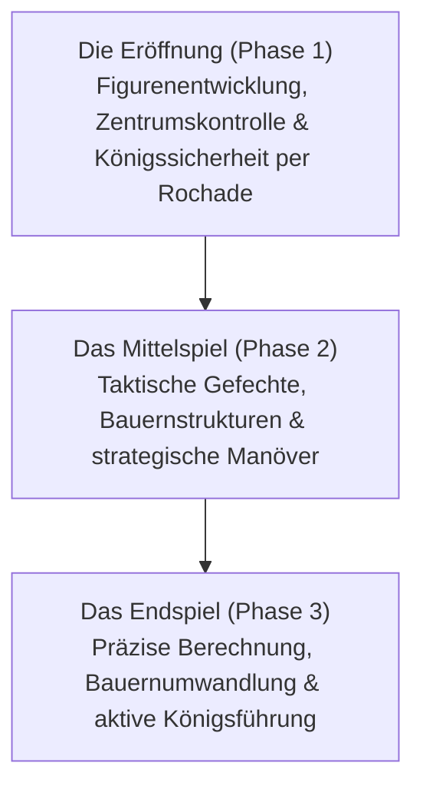

# Brettspiele & KI: Schachregeln, strategische Muster und die Entwicklung von Deep Blue bis AlphaZero

In der Geschichte der Künstlichen Intelligenz (KI) dienten Brettspiele seit jeher als „Taufliege der KI-Forschung“: ein streng abgegrenztes, formales Labor, um die Mechanismen menschlicher Intelligenz zu entschlüsseln und neue Algorithmen zu erproben. Unter allen klassischen Spielen nimmt das Schachspiel eine herausragende Stellung ein. Als eines der weltweit meistgespielten Strategiespiele trieb Schach fundamentale Meilensteine der Informatik voran.

Dieser Beitrag vermittelt eine fundierte Übersicht über die Grundregeln des Schachs, die Komplexität seines Spielbaums, strategische Muster sowie den epochalen Weg von Claude Shannons theoretischen Grundlagen über den historischen Sieg von IBMs Deep Blue 1997 bis hin zur Selbstlern-Revolution von AlphaZero und modernen hybriden Engines wie Stockfish NNUE.

## 1. Grundregeln und Spielbaum-Komplexität des Schachs

Schach ist ein deterministisches, endliches Nullsummenspiel mit vollständiger Information für zwei Spieler. Gespielt wird auf einem quadratischen Brett mit 64 Feldern ($8 \times 8$) in abwechselnd hellen und dunklen Farben. Jeder Spieler führt eine Armee von 16 Figuren (Weiß zieht zuerst), mit dem Ziel, den gegnerischen König unausweichlich anzugreifen: das **Schachmatt (Checkmate)**.

### Figurenarten und Zuggeometrie
Das Spiel umfasst sechs Figurenarten mit spezifischen Bewegungsregeln:
- **König (King)**: Zieht ein Feld in jede Richtung; fällt der König, ist das Spiel verloren.
- **Dame (Queen)**: Die stärkste Figur; zieht horizontal, vertikal und diagonal beliebig viele freie Felder.
- **Turm (Rook)**: Zieht horizontal und vertikal entlang von Reihen und Linien.
- **Läufer (Bishop)**: Zieht ausschließlich diagonal und bleibt dauerhaft an seine Feldfarbe gebunden.
- **Springer (Knight)**: Zieht in L-Form (zwei Felder geradeaus, ein Feld quer); als einzige Figur kann er andere Figuren überspringen.
- **Bauer (Pawn)**: Zieht ein Feld vorwärts (im ersten Zug wahlweise zwei Felder) und schlägt diagonal. Besitzt Spezialregeln wie das Schlagen en passant und die Bauernumwandlung (Promotion) auf der achten Reihe.

### Die drei Phasen einer Partie
Eine Schachpartie gliedert sich klassisch in drei Phasen:

1. **Die Eröffnung (Opening)**: Schnelle Entwicklung der Leichtfiguren, Kampf um die vier Zentrumsfelder ($d4, e4, d5, e5$) und Sicherung des Königs durch die Rochade. Menschliche Großmeister haben im Laufe der Jahrhunderte ein gewaltiges Eröffnungsrepertoire (ECO-Klassifikation) geschaffen.
2. **Das Mittelspiel (Middlegame)**: Nach Abschluss der Entwicklung entbrennt der Kampf. Diese Phase erfordert das harmonische Zusammenspiel aus positionellem Verständnis (Bauernketten, offene Linien, Vorposten) und taktischen Wendungen (Fesselungen, Gabeln, Figurenopfer).
3. **Das Endspiel (Endgame)**: Die meisten Schwer- und Leichtfiguren wurden abgetauscht. Das Rennen um die Bauernumwandlung entscheidet die Partie; hier zählt exakteste Berechnung, da ein einziges Tempo über Sieg oder Remis entscheidet.

### Die Spielbaum-Komplexität: Die Shannon-Zahl

Wie gewaltig die rechnerische Herausforderung des Schachs für Computer ist, verdeutlicht die 1950 von Claude Shannon berechnete Zahl möglicher Zugfolgen – die **Shannon-Zahl**:

$$ \text{Spielbaum-Komplexität} \approx 10^{120} $$

Die Gesamtzahl aller theoretisch möglichen, legalen Brettstellungen (Zustandsraum-Komplexität) wird auf etwa geschätzt:

$$ \text{Zustandsraum-Komplexität} \approx 10^{43} \sim 10^{47} $$

Verglichen mit der geschätzten Anzahl aller Atome im beobachtbaren Universum (rund $10^{80}$) belegt die Shannon-Zahl unmissverständlich: **Schach kann niemals durch vollständiges Durchrechnen aller Züge (Brute-Force) gelöst werden**. Intelligente Programme müssen den Suchbaum drastisch beschneiden.

## 2. Strategische Muster und menschliche Großmeister-Intuition

Wie bewältigen menschliche Großmeister diese kombinatorische Explosion? Die Kognitionspsychologie (u. a. Herbert Simon) zeigte, dass dies auf **Mustererkennung (Pattern Recognition) und Chunking** beruht.

Großmeister berechnen nicht jeden Zug: Sie erfassen Stellungsbilder intuitiv in Sinnzusammenhängen. Sie blenden 98 % aller legalen Züge unbewusst aus und vertiefen ihre Analyse nur auf zwei oder drei vielversprechende Varianten.

Das schachliche Denken vereint zwei Dimensionen:
- **Taktik (Tactics)**: Kurzfristige Forcierserien zur Materialgewinnung oder Mattführung (Fesselung, Spieß, Abzugsschach).
- **Positionsspiel (Positional Play)**: Langfristige Pläne wie die Schwächung der gegnerischen Bauernstruktur, Raumgewinn oder die Kontrolle strategischer Vorposten.

Über Jahrzehnte bestand das Kernziel der KI-Forschung darin, diesen Sinn für Harmonie und Stellungsvorteile in Algorithmen zu fassen.

## 3. Der Schock von Deep Blue: Die Ära der Rechenkraft

Frühe Schachprogramme basierten auf dem **Minimax-Algorithmus**, der **Alpha-Beta-Suche (Alpha-Beta Pruning)** und einer manuell programmierten **Bewertungsfunktion (Evaluation Function)**, die Figurenwerte und Mobilität gewichtete.

### Die Architektur von Deep Blue
Im Mai 1997 besiegte der von IBM entwickelte Supercomputer **Deep Blue** den amtierenden Weltmeister Garry Kasparov in einem Sechs-Partien-Wettkampf mit $3\frac{1}{2} : 2\frac{1}{2}$ – ein globales Medienereignis.

Deep Blues Stärke basierte auf extremer Brute-Force-Hardware-Leistung:
- **Spezialprozessoren**: Ein IBM RS/6000 SP Supercomputer mit 30 Rechenknoten und 480 eigens gefertigten VLSI-Schachchips.
- **Berechnungsgeschwindigkeit**: Evaluierung von über **200 Millionen Stellungen pro Sekunde**, standardmäßig 6 bis 8 Züge im Voraus, in taktischen Zwangslagen über 20 Züge tief.
- **Großmeister-Wissen**: Die Bewertungsfunktion enthielt tausende manuell kalibrierte Parameter, ergänzt durch eine Eröffnungsbibliothek mit Hunderttausenden Partien und Endspieldatenbanken für 5 Figuren.

### Bedeutung und Grenzen
Kasparovs Niederlage galt als Zeitenwende. Doch Informatiker erkannten: Deep Blue dachte nicht im eigentlichen Sinne; er verstand kein Schach, sondern rechnete Variantenbäume in unvorstellbarer Geschwindigkeit durch. Es war der Triumph spezialisierter Ingenieurskunst, aber noch keine allgemeine lernfähige KI.

## 4. Der Paradigmenwechsel: AlphaZero

Zwanzig Jahre lang dominierten verfeinerte Alpha-Beta-Engines auf Standardprozessoren (wie Stockfish). Doch im Dezember 2017 erschütterte Google DeepMind mit **AlphaZero** die Schachwelt.

In einem 100-Partien-Wettkampf gegen das damals weltweit stärkste Programm Stockfish 8 siegte AlphaZero überlegen mit 28 Siegen, 72 Remis und **null Niederlagen**.

### Der algorithmische Durchbruch von AlphaZero
AlphaZero brach radikal mit allen bisherigen Prinzipien:

1. **Tabula-Rasa-Lernen**: AlphaZero erhielt weder Eröffnungsbücher noch Endspieldatenbanken oder menschliche Meisterpartien – lediglich die Grundregeln des Spiels.
2. **Selbstspiel (Self-Play)**: Durch Millionen Partien gegen sich selbst lernte das System durch bestärkendes Lernen (Reinforcement Learning) innerhalb weniger Stunden die Prinzipien der Schachtheorie aus dem Nichts.
3. **Duale tiefe neuronale Netze**: Ein tiefes Convolutional Neural Network liefert simultan die Zugbewertung (**Policy**, welche Züge vielversprechend sind) und die Stellungseinschätzung (**Value**, Siegwahrscheinlichkeit).
4. **Monte-Carlo-Baumsuche (MCTS)**: Während Stockfish 8 rund 60 Millionen Stellungen pro Sekunde analysierte, prüfte AlphaZero lediglich etwa **60.000 Stellungen pro Sekunde**. Geleitet von neuronaler Intuition berechnete es nur hochrelevante Äste – ganz ähnlich einem menschlichen Großmeister.

AlphaZeros Spielweise verblüffte die Fachwelt: Es opferte scheinbar mühelos Bauern oder Figuren für langfristige Aktivität und Raumvorteile. Großmeister beschrieben seinen Stil als „überirdisch schön“.

## 5. Moderne hybride Schach-KI: Stockfish NNUE

AlphaZero bewies die Überlegenheit neuronaler Stellungsbewertung, benötigte jedoch gewaltige Google-TPU-Rechenzentren. Die Open-Source-Gemeinschaft schuf daraufhin eine geniale Synthese: **NNUE (Efficiently Updatable Neural Network)**.

Ursprünglich im Shogi entwickelt, wurde NNUE 2020 in Stockfish 12 integriert:
- Es ersetzt alte handgeschriebene Bewertungsfunktionen durch ein kompaktes neuronales Netz, das auf Millionen Stellungen trainiert wurde.
- Dank optimierter CPU-Vektorbefehle aktualisiert sich das Netz extrem schnell während der Alpha-Beta-Suche, was tiefste Suchtiefen mit feinster neuronaler Intuition verbindet.

Aktuelle Versionen wie **Stockfish 16+ NNUE** erreichen Elo-Werte von über **3500**, weit jenseits des menschlichen Rekords (Magnus Carlsen ca. 2882 Elo).

## 6. Fazit: Die Koevolution von Mensch und Maschine

Die Evolution der Schach-KI entwickelte sich vom regelbasierten Formalismus über rohe Rechenkraft bis hin zum autonomen Deep Learning.

Heute ist die KI kein Gegner mehr, sondern ein unersetzlicher Partner:
- Großmeister nutzen neuronale Engines täglich zur Eröffnungsvorbereitung und Fehleranalyse.
- Ungewöhnliche Züge (wie das Vorrücken von Randbauern $h4/a4$), die früher als fehlerhaft galten, wurden durch KI neu belebt.
- Die im Schach gereiften Methoden (MCTS, Reinforcement Learning) revolutionieren heute Proteinfaltung (AlphaFold), Materialforschung und logistische Optimierungsprozesse.

Auf den 64 Feldern des Schachbretts haben Mensch und Maschine gemeinsam neue Horizonte des Denkens erschlossen.
