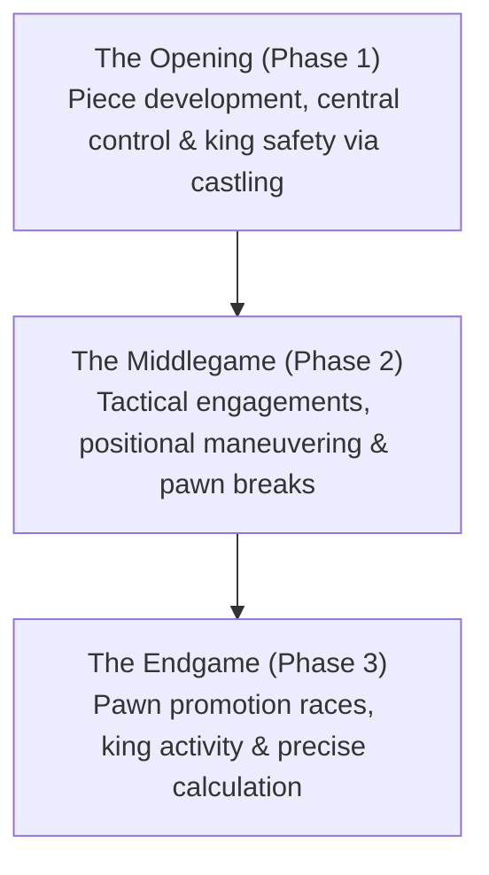

# Board Games & AI: Chess Rules, Strategic Patterns, and the Evolution from Deep Blue to AlphaZero

In the history of Artificial Intelligence (AI), board games have long served as the "Drosophila of AI research"—a rigorous, bounded laboratory to decipher the mechanics of human cognition and benchmark revolutionary computational algorithms. Among all classical games, chess holds a preeminent position. As one of the world's most widely played intellectual contests, chess has driven monumental milestones in computer science. 

This article explores the fundamental rules, game-tree complexity, and strategic patterns of chess, tracing the evolutionary trajectory from Claude Shannon's theoretical foundations and IBM Deep Blue's historic 1997 victory to the self-taught deep learning of AlphaZero and modern hybrid neural engines like Stockfish.

## 1. Fundamentals of Chess: Rules, Geometry, and State Complexity

Chess is a two-player, zero-sum, finite, deterministic game of perfect information played upon an $8 \times 8$ grid of 64 alternating light and dark squares (the chessboard). Each player commands an army of 16 pieces, with White moving first. The ultimate objective is to trap the opposing King in an inescapable attack—a state known as **checkmate**.

### Piece Types and Movement Mechanics
Each side commands six distinct types of pieces, each governed by specific geometric movement vectors:
- **King**: Moves one square in any direction (horizontal, vertical, or diagonal). The royal piece whose capture ends the game.
- **Queen**: The most powerful piece; moves any number of unoccupied squares horizontally, vertically, or diagonally.
- **Rook**: Moves any number of unoccupied squares horizontally or vertically along ranks and files.
- **Bishop**: Moves any number of unoccupied squares diagonally, permanently bound to squares of a single color.
- **Knight**: Moves in an "L-shape" (two squares in one cardinal direction, then one square perpendicular). The only piece capable of jumping over other pieces.
- **Pawn**: Advances forward one square at a time (optionally two squares on its initial move) and captures diagonally. Features unique tactical rules: *en passant* capture and pawn promotion upon reaching the eighth rank.

### The Three Phases of the Game
A game of chess naturally unfolds through three distinct strategic phases:

1. **The Opening**: Players develop pieces from their initial starting squares to active posts, battle for control of the central squares ($d4, e4, d5, e5$), and secure king safety through castling. Centuries of human practice have compiled an immense library of opening theory (ECO codes).
2. **The Middlegame**: Following development, armies clash in full combat. This phase demands an intricate synthesis of grand positional strategy (pawn structure, outposts, weak squares) and sharp local tactics (combinations, sacrifices).
3. **The Endgame**: Most minor and major pieces have been exchanged off the board. Pawns become paramount as promotion into queens decides the contest. Calculation must be mathematically exact, as a single king tempo separates victory from defeat.

### Game-Tree Complexity: The Shannon Number

To appreciate why chess presented such an intimidating challenge for computer scientists, consider its combinatorial state space. In 1950, American mathematician Claude Shannon calculated an estimate of the total number of possible unique chess games, now known as the **Shannon Number**:

$$ \text{Game-Tree Complexity} \approx 10^{120} $$

The total number of legal board configurations (state-space complexity) is roughly estimated as:

$$ \text{State-Space Complexity} \approx 10^{43} \sim 10^{47} $$

When compared to the estimated total number of atoms in the observable universe (approximately $10^{80}$), the Shannon number is staggering. It proves conclusively that chess can never be solved by brute-force exhaustive search: no supercomputer past, present, or future could ever calculate the complete game tree from move one to checkmate.

## 2. Strategic Patterns and Human Grandmaster Intuition

How have human grandmasters navigated this astronomical combinatorial explosion for centuries? The secret lies in **pattern recognition, chunking, and intuitive heuristics**.

Cognitive psychology research (notably by Adriaan de Groot and Herbert Simon) revealed that master chess players do not calculate every legal move. Instead, through decades of deliberate practice, they perceive the board in organized conceptual "chunks." When looking at a position, grandmasters instantly filter out 98% of candidate moves, focusing deep calculation on only two or three promising variations.

Human chess strategy integrates two interlocking dimensions:
- **Tactics**: Concrete, short-term forcing sequences that yield immediate material gain or deliver checkmate. Fundamental motifs include pins, forks, skewers, discovered attacks, and deflection.
- **Positional Play**: Long-term structural planning. Players evaluate pawn structures (isolated pawns, backward pawns, doubled pawns), outpost control for knights, open files for rooks, bishop pairs, and king safety.

For decades, the holy grail of chess AI was to replicate this elusive human "positional judgment" inside silicone circuits.

## 3. The Shock of Deep Blue: Brute-Force Power Triumphs

The earliest chess programs relied on the **Minimax Algorithm** paired with **Alpha-Beta Pruning**—an optimization that eliminates branches that cannot influence the final evaluation—combined with a handcrafted **evaluation function** that scored positions based on material value and simple positional heuristics.

### The Architecture of Deep Blue
In May 1997, IBM's custom-built supercomputer **Deep Blue** achieved a monumental historical milestone by defeating the reigning World Chess Champion, Garry Kasparov, in a six-game match ($3\frac{1}{2} - 2\frac{1}{2}$).

Deep Blue's superhuman prowess was driven by relentless brute-force computational power:
- **Massively Parallel Hardware**: Deep Blue combined a 30-node IBM RS/6000 SP supercomputer with 480 custom, dedicated VLSI chess chips.
- **Search Velocity**: It evaluated over **200 million positions per second**, calculating 6 to 8 moves ahead routinely, and up to 20 moves deep in sharp tactical sequences.
- **Handcrafted Knowledge Base**: Its evaluation function weighed thousands of distinct parameters fine-tuned with Grandmaster Joel Benjamin, backed by an opening book of hundreds of thousands of grandmaster games and 5-piece endgame tablebases.

### Significance and Limitations
Kasparov's defeat stunned the world, prompting headlines declaring that machine intelligence had conquered the pinnacle of human intellect. Yet, computer scientists recognized Deep Blue's inherent limitation: it was a triumph of **specialized, brute-force calculation**, not general intelligence. Deep Blue did not "understand" chess concepts; it simply crunched numerical trees at astronomical speeds.

## 4. The Paradigm Shift: The Emergence of AlphaZero

For twenty years after Deep Blue, chess engines continued to refine the brute-force alpha-beta paradigm, culminating in open-source engines like Stockfish. But in December 2017, Google DeepMind unveiled **AlphaZero**, triggering an earthquake in artificial intelligence.

In a 100-game match against Stockfish 8 (the world's strongest classical engine at the time), AlphaZero scored an astonishing 28 wins, 72 draws, and **zero losses**.

### The Algorithmic Breakthrough of AlphaZero
What set AlphaZero apart was its total independence from human chess knowledge:

1. **Tabula Rasa Reinforcement Learning**: AlphaZero was given nothing beyond the basic rules of chess—no opening books, no endgame tables, and no human grandmaster games.
2. **Self-Play**: AlphaZero learned chess entirely by playing millions of games against itself. Starting from completely random moves, its deep neural networks gradually learned strategy through trial, error, and reinforcement of winning patterns.
3. **Deep Dual-Headed Neural Network**: A unified deep convolutional neural network simultaneously outputs:
   - A **policy vector** predicting the most promising candidate moves.
   - A **scalar value** estimating the winning probability of the current board state.
4. **Monte Carlo Tree Search (MCTS)**: Instead of evaluating 60 million positions per second like Stockfish 8, AlphaZero evaluated only **60,000 positions per second**—a thousand-fold reduction. Guided by the neural network's intuition, it searched selectively and deeply along critical paths, mimicking human grandmaster calculation.

AlphaZero played chess unlike any machine before it. Grandmasters marveled at its play, describing it as "alien yet profoundly artistic." AlphaZero consistently favored piece activity and spatial constriction over material greed, frequently sacrificing pawns and pieces for long-term positional dominance.

## 5. Modern Chess AI: Hybridization and Stockfish NNUE

AlphaZero proved the superiority of deep learning in positional evaluation, but its reliance on massive Google TPU clusters made it impractical for standard hardware. The chess programming community responded with another breakthrough: **NNUE (Efficiently Updatable Neural Network)**.

Originally developed for computer shogi, NNUE was integrated into Stockfish starting with Version 12 (2020). 

NNUE combines the best of both worlds:
- It replaces the old, manually tuned evaluation functions with a lightweight, multi-layer neural network trained on millions of evaluated positions.
- Because it updates incrementally during alpha-beta tree searches, NNUE runs directly on consumer CPUs with blistering speed, evaluating tens of millions of positions per second.

Today, hybrid neural engines like **Stockfish 16+** easily defeat AlphaZero's original benchmarks and boast Elo ratings exceeding **3500+**—rendering human grandmasters (whose peak ratings hover around 2880) completely incapable of winning a single game under standard conditions.

## 6. Conclusion: The Co-Evolution of Humans and Artificial Intelligence

The journey of chess AI began as an effort to mechanize human logic, evolved into brute-force computation, and culminated in autonomous deep learning. 

Today, AI is no longer viewed as an adversary to be conquered, but as an indispensable partner in intellectual exploration:
- **Centaur Chess and Analysis**: Every professional grandmaster studies daily with neural network engines to analyze opening novelties and assess tactical sharpness.
- **Rejuvenation of Classical Theory**: AI's radical willingness to push flank pawns ($h4/a4$) and sacrifice material for dynamic activity has revitalized centuries-old opening lines like the French Defense and King's Indian Defense.
- **Real-World Impact**: The algorithms forged on the 64 squares of the chessboard—MCTS, deep reinforcement learning, and efficient neural inference—now power breakthroughs in protein folding (AlphaFold), material science, supply chain logistics, and fusion plasma control.

The timeless battle on the chessboard has demonstrated that when human intellect meets artificial intelligence, both are elevated to heights neither could achieve alone.
