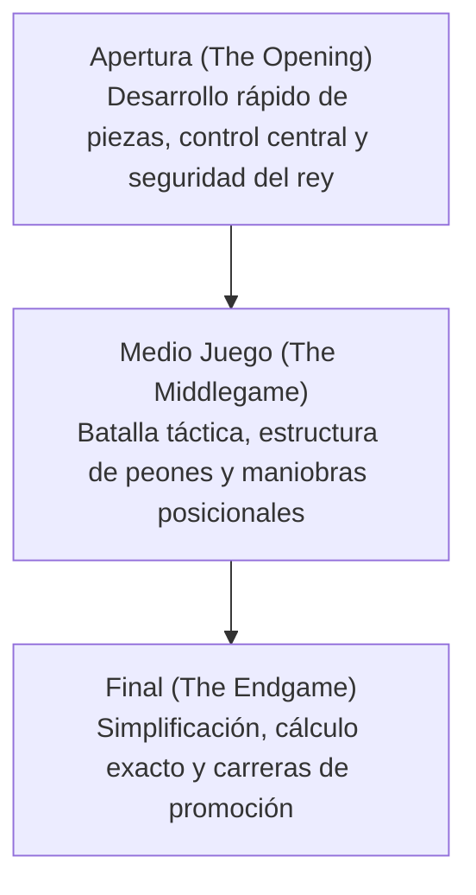

# Juegos de Mesa e IA: Reglas del Ajedrez, Patrones Estratégicos y de Deep Blue a AlphaZero

En la historia de la inteligencia artificial (IA), los juegos de tablero han sido considerados durante décadas la «drosophila de la investigación en IA»: un entorno cerrado, riguroso e ideal para desentrañar los mecanismos de la cognición humana y poner a prueba nuevos algoritmos computacionales. Entre todos ellos, el ajedrez ocupa un lugar de honor indiscutible. Como uno de los juegos más practicados del planeta, el ajedrez ha impulsado hitos históricos en la informática.

Este artículo explora las reglas fundamentales del ajedrez, la complejidad de su árbol de juego y sus patrones estratégicos, analizando la trayectoria que une las formulaciones teóricas de Claude Shannon, la histórica victoria de IBM Deep Blue sobre Garry Kasparov en 1997, la revolución del aprendizaje profundo con AlphaZero y la hegemonía contemporánea de motores híbridos neuronales como Stockfish NNUE.

## 1. Reglas Básicas y Complejidad del Árbol de Juego

El ajedrez es un juego para dos jugadores, de suma cero, finito, determinista y de información perfecta. Se juega sobre un tablero cuadriculado de $8 \times 8$ con 64 casillas de colores alternos claros y oscuros. Cada bando comanda 16 piezas (blancas abren la partida, seguidas por las negras), con el objetivo unívoco de colocar al Rey adversario bajo una amenaza de captura insalvable: el **jaque mate (Checkmate)**.

### Piezas y Mecánicas de Movimiento
Cada jugador dispone de seis tipos de piezas con vectores geométricos específicos:
- **Rey (King)**: Se desplaza una casilla en cualquier dirección (horizontal, vertical o diagonal). Su caída determina el fin del juego.
- **Dama (Queen)**: La pieza más poderosa; puede desplazarse cualquier número de casillas libres en horizontal, vertical o diagonal.
- **Torre (Rook)**: Se mueve horizontal o verticalmente a lo largo de filas y columnas.
- **Alfil (Bishop)**: Se desplaza en diagonal cualquier número de casillas, quedando limitado de por vida a casillas de un mismo color.
- **Caballo (Knight)**: Su movimiento dibuja una «L» (dos casillas en una dirección y una en perpendicular); es la única pieza capaz de saltar sobre otras.
- **Peón (Pawn)**: Avanza una casilla hacia adelante (opcionalmente dos en su movimiento inicial) y captura en diagonal. Dispone de reglas singulares como la captura al paso y la promoción (coronación) al alcanzar la octava fila.

### Las Tres Fases de una Partida
Una partida de ajedrez se divide tradicionalmente en tres fases:

1. **Apertura (Opening)**: Consiste en movilizar las piezas desde sus casillas de origen hacia puestos activos, disputar el dominio del centro ($d4, e4, d5, e5$) y proteger al rey mediante el enroque. La teoría de aperturas humana está clasificada en extensas enciclopedias (códigos ECO).
2. **Medio Juego (Middlegame)**: Con el despliegue completado, estalla el combate abierto. Esta fase exige combinar el juicio posicional abstracto (estructuras de peones, casillas débiles, puestos avanzados) con la agudeza táctica concreta (clavadas, dobles, sacrificios).
3. **Final (Endgame)**: Tras el intercambio masivo de piezas, el tablero queda despejado. La coronación de los peones se convierte en el factor dirimente, exigiendo un cálculo milimétrico en el que un solo tiempo de ventaja decide la victoria.

### La Complejidad del Árbol de Juego: El Número de Shannon

Para calibrar el inmenso reto computacional que representa el ajedrez, en 1950 el matemático Claude Shannon calculó una estimación del número total de partidas posibles, bautizado como el **Número de Shannon**:

$$ \text{Complejidad del Árbol de Juego} \approx 10^{120} $$

Asimismo, el número de configuraciones legales posibles en el tablero (complejidad del espacio de estados) se estima en:

$$ \text{Complejidad del Espacio de Estados} \approx 10^{43} \sim 10^{47} $$

Comparado con el número estimado de átomos en el universo observable (alrededor de $10^{80}$), el número de Shannon es astronómico. Esto prueba que el ajedrez **jamás podrá resolverse por fuerza bruta exhaustiva**: ningún superordenador podría calcular todos los caminos posibles desde la jugada inicial hasta el mate.

## 2. Patrones Estratégicos y la Intuición Humana

¿Cómo han logrado los grandes maestros humanos dominar un juego con tantas variantes? La psicología cognitiva demostró que el secreto radica en el **reconocimiento de patrones (Pattern Recognition) y la fragmentación mental (Chunking)**.

Un gran maestro no analiza todas las jugadas legales; gracias a miles de horas de estudio, percibe el tablero en bloques conceptuales significativos. Su mente descarta instantáneamente más del 98% de las jugadas posibles y concentra su cálculo profundo únicamente en dos o tres variantes críticas.

La mente ajedrecística fusiona dos dimensiones:
- **Táctica (Tactics)**: Maniobras forzadas a corto plazo para ganar material o dar mate (clavadas, horquillas, ataques a la descubierta).
- **Estrategia Posicional (Positional Play)**: Planes a largo plazo orientados a debilitar la estructura enemiga, adueñarse de columnas abiertas para las torres o dominar casillas clave con los caballos.

El gran desafío de la IA consistió durante décadas en cómo codificar esa intuición estratégica en algoritmos computacionales.

## 3. El Impacto de Deep Blue: La Fuerza Bruta Supera al Hombre

Los primeros motores de ajedrez se basaron en el **algoritmo Minimax** combinado con la **poda alfa-beta (Alpha-Beta Pruning)**, complementados con una **función de evaluación heurística** que ponderaba numéricamente el valor de las piezas y la seguridad del rey.

### La Arquitectura de Deep Blue
En mayo de 1997, el superordenador de IBM **Deep Blue** hizo historia al derrotar al campeón mundial Garry Kasparov en un encuentro a seis partidas ($3\frac{1}{2} - 2\frac{1}{2}$).

El motor de Deep Blue descansaba en una potencia de cálculo por fuerza bruta sin precedentes:
- **Hardware Especializado**: Integraba un superordenador IBM RS/6000 SP de 30 nodos conectado a 480 chips VLSI diseñados exclusivamente para calcular ajedrez.
- **Velocidad de Búsqueda**: Evaluaba más de **200 millones de posiciones por segundo**, profundizando habitualmente de 6 a 8 jugadas completas, y hasta más de 20 jugadas en líneas tácticas forzadas.
- **Conocimiento Humano Codificado**: Su función de evaluación contenía miles de parámetros ajustados por grandes maestros, respaldada por una base de datos de aperturas y tablas de finales de 5 piezas.

### Trascendencia y Limitaciones
La derrota de Kasparov conmocionó al mundo. Sin embargo, los investigadores sabían que Deep Blue no poseía verdadera inteligencia: no comprendía conceptos de ajedrez ni aprendía por sí mismo. Era la cúspide de la fuerza bruta y el procesamiento paralelo masivo.

## 4. El Cambio de Paradigma: La Revolución de AlphaZero

Durante dos décadas tras Deep Blue, los programas de ajedrez perfeccionaron el paradigma alfa-beta en procesadores estándar. Pero en diciembre de 2017, Google DeepMind presentó **AlphaZero**, transformando radicalmente la inteligencia artificial.

En un duelo a 100 partidas contra Stockfish 8 (el motor tradicional más fuerte del momento), AlphaZero logró 28 victorias, 72 tablas y **cero derrotas**.

### La Innovación Algorítmica de AlphaZero
AlphaZero rompió con todos los métodos precedentes:

1. **Aprendizaje por Refuerzo desde Cero (Tabula Rasa)**: No recibió libros de aperturas, tablas de finales ni partidas humanas; únicamente las reglas básicas del juego.
2. **Autoaprendizaje mediante Juego Autónomo (Self-Play)**: Jugando millones de partidas contra sí mismo, aprendió desde cero las leyes del ajedrez mediante ensayo, error y refuerzo de estrategias victoriosas.
3. **Red Neuronal Profunda Dual**: Una red convolucional profunda evaluaba simultáneamente la probabilidad de las mejores jugadas (política) y la probabilidad de victoria (valor).
4. **Búsqueda en Árbol de Montecarlo (MCTS)**: Mientras Stockfish 8 evaluaba 60 millones de posiciones por segundo, AlphaZero evaluaba tan solo **60.000 posiciones por segundo**. Guiada por la intuición de la red neuronal, su búsqueda era sumamente selectiva y profunda, emulando la visión posicional de un gran maestro.

El estilo de AlphaZero fascinó a la comunidad internacional. Grandmasters veteranos lo describieron como «un juego alienígena pero de enorme belleza», caracterizado por audaces sacrificios de material a cambio de una asfixiante actividad de piezas y dominio territorial a largo plazo.

## 5. La Era Moderna: Fusión Híbrida y Stockfish NNUE

AlphaZero demostró la superioridad del aprendizaje profundo, pero requería superordenadores TPU inaccesibles para el usuario común. La comunidad de código abierto respondió con una innovación revolucionaria: **NNUE (Efficiently Updatable Neural Network)**.

Originario del shogi por ordenador, el sistema NNUE se incorporó a Stockfish 12 en 2020:
- Sustituyó las viejas funciones de evaluación manuales por una red neuronal ligera entrenada con cientos de millones de posiciones.
- Gracias a instrucciones SIMD en procesadores comerciales, la red se actualiza de manera incremental a la velocidad de la poda alfa-beta, combinando un gran volumen de búsqueda con un juicio posicional de nivel neuronal.

Hoy en día, **Stockfish 16+ con NNUE** supera ampliamente los **3500 puntos de Elo**, un nivel inalcanzable para cualquier ser humano (el pico histórico de Magnus Carlsen ronda los 2882 puntos).

## 6. Conclusión: La Coevolución del Hombre y la Máquina

La historia de la IA en el ajedrez transitó desde el cálculo artesanal hasta la fuerza bruta masiva y, finalmente, hacia el aprendizaje autónomo profundo.

En la actualidad, la IA ya no es un adversario a batir, sino un maestro imprescindible:
- Todos los grandes maestros analizan sus partidas e innovan en aperturas con motores neuronales.
- Ideas que la ortodoxia humana consideraba dudosas (como el avance agresivo de peones laterales de torre $h4/a4$) han revitalizado defensas clásicas.
- Las técnicas perfeccionadas en el ajedrez —MCTS, aprendizaje por refuerzo y redes neuronales eficientes— son la base de los mayores avances en plegamiento de proteínas (AlphaFold), optimización industrial y diseño de nuevos materiales.

Sobre los 64 escaques del tablero, el intelecto humano y la inteligencia artificial continúan enriqueciéndose mutuamente en una fascinante aventura del pensamiento.
