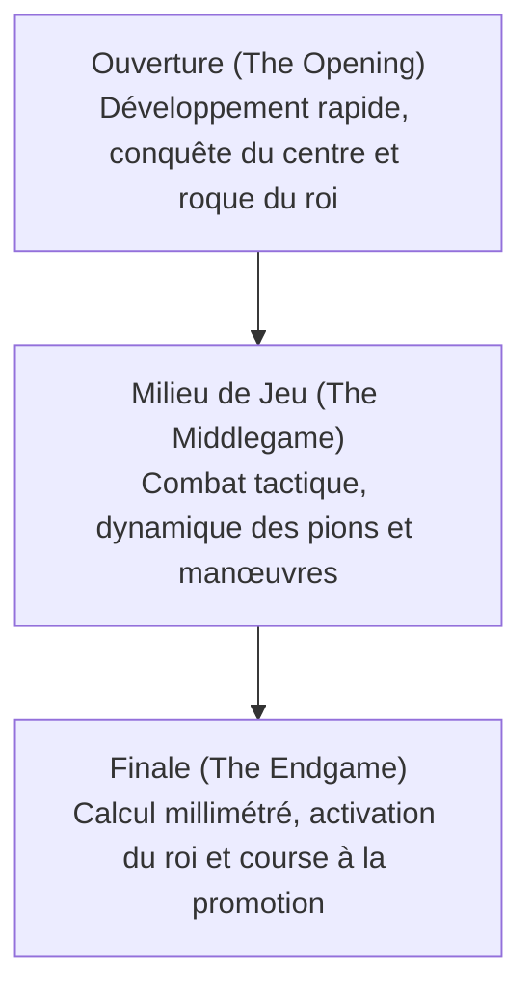

# Jeux de Société & IA : Règles des Échecs, Schémas Stratégiques et de Deep Blue à AlphaZero

Dans les annales de l'intelligence artificielle, les jeux de réflexion ont toujours été désignés comme la « drosophile de la recherche en IA » : un laboratoire d'expérimentation clos et rigoureux, idéal pour sonder les rouages de la cognition humaine et tester de nouveaux algorithmes. Parmi tous les jeux classiques, le jeu d'échecs occupe le sommet absolu. Discipline intellectuelle universelle, il a scandé les grandes étapes de l'histoire de l'informatique.

Cet article retrace les règles fondamentales du jeu d'échecs, la complexité de son arbre de jeu, ses principes stratégiques majeurs, et examine l'évolution qui mène des travaux théoriques de Claude Shannon à la victoire historique d'IBM Deep Blue en 1997, jusqu'à la rupture d'AlphaZero et l'avènement des moteurs hybrides modernes comme Stockfish NNUE.

## 1. Principes Fondamentaux : Règles, Géométrie et Complexité

Le jeu d'échecs est un jeu à deux joueurs, à somme nulle, fini, déterministe et à information parfaite. Il se dispute sur un échiquier de 64 cases alternant les teintes claires et sombres ($8 \times 8$). Chaque joueur dispose de 16 pièces (les Blancs débutent), avec pour but suprême d'acculer le Roi adverse à une situation d'attaque sans issue : **l'échec et mat (Checkmate)**.

### Types de Pièces et Vecteurs de Déplacement
Chaque armée comprend six pièces aux trajectoires bien définies :
- **Le Roi (King)** : Se déplace d'une case dans toutes les directions. Sa perte entraîne la fin immédiate de la partie.
- **La Dame (Queen)** : La pièce maîtresse la plus puissante ; se déplace en ligne droite (lignes, colonnes ou diagonales) d'un nombre quelconque de cases inoccupées.
- **La Tour (Rook)** : Parcourt verticalement les colonnes et horizontalement les rangées.
- **Le Fou (Bishop)** : Glisse uniquement en diagonale, restant cantonné toute la partie aux cases de sa couleur d'origine.
- **Le Cavalier (Knight)** : Effectue un saut en « L » (deux cases dans une direction puis une perpendiculaire) ; c'est la seule pièce habilitée à sauter par-dessus les autres.
- **Le Pion (Pawn)** : Avance d'une case (ou deux lors de son coup initial) et capture en diagonale. Il bénéficie de coups spéciaux tels que la prise en passant et la promotion dès qu'il atteint la huitième rangée.

### Les Trois Phases de la Partie
Une partie d'échecs s'articule traditionnellement en trois phases distinctes :

1. **L'Ouverture (Opening)** : Consiste à mobiliser les pièces légères vers les cases actives, à lutter pour le contrôle des quatre cases centrales ($d4, e4, d5, e5$) et à mettre le Roi à l'abri par le roque. Des siècles d'analyses humaines ont compilé un répertoire monumental (code ECO).
2. **Le Milieu de Jeu (Middlegame)** : Une fois le développement achevé, la confrontation directe éclate. Cette phase requiert une symbiose entre stratégie positionnelle (structures de pions, cases faibles, avant-postes) et acuité tactique (clouages, fourchettes, sacrifices).
3. **La Finale (Endgame)** : La plupart des pièces lourdes ont disparu de l'échiquier. La promotion des pions en dames devient l'enjeu crucial. Le calcul doit être mathématiquement parfait, un seul temps de décalage séparant le gain de la défaite.

### La Complexité de l'Arbre de Jeu : Le Nombre de Shannon

Pour mesurer l'immensité du défi que posent les échecs à l'informatique, Claude Shannon calcula en 1950 le nombre théorique de parties possibles, désormais connu sous le nom de **Nombre de Shannon** :

$$ \text{Complexité de l'Arbre de Jeu} \approx 10^{120} $$

De surcroît, le nombre de positions légales envisageables sur l'échiquier (complexité de l'espace d'états) est estimé à :

$$ \text{Complexité de l'Espace d'États} \approx 10^{43} \sim 10^{47} $$

Comparé au nombre d'atomes dans l'Univers observable (environ $10^{80}$), le nombre de Shannon démontre irréfutablement que **le jeu d'échecs ne pourra jamais être résolu par recherche exhaustive (force brute)**. Les algorithmes d'IA ont dû apprendre à élaguer l'arbre des possibles.

## 2. Motifs Stratégiques et Intuition des Grands Maîtres

Comment les champions humains parviennent-ils à maîtriser cette infinité de combinaisons ? Les recherches en psychologie cognitive (menées notamment par Herbert Simon) ont démontré que ce talent repose sur **la reconnaissance de motifs (Pattern Recognition) et la fragmentation (Chunking)**.

Un grand maître n'évalue pas chaque coup légal un par un : son regard synthétise la position en configurations globales cohérentes. Il écarte d'emblée plus de 98 % des coups possibles pour concentrer son calcul sur deux ou trois variantes critiques.

La pensée échiquéenne conjugue deux volets :
- **La Tactique (Tactics)** : Suites de coups forcés visant un gain matériel immédiat ou le mat (clouage, enfilade, échec à la découverte).
- **Le Jeu Positionnel (Positional Play)** : Élaboration de plans à long terme, valorisation de la paire de fous, occupation des colonnes ouvertes et exploitation des faiblesses de pions.

Durant un demi-siècle, le défi ultime des chercheurs en IA fut d'inculquer cette subtile intuition humaine à des lignes de code informatique.

## 3. Le Choc de Deep Blue : La Puissance Brute l'Emporte

Les premiers moteurs d'échecs reposaient sur **l'algorithme Minimax**, optimisé par **l'élagage Alpha-Bêta (Alpha-Beta Pruning)** et guidé par une **fonction d'évaluation heuristique** qui quantifiait le matériel et l'activité des pièces.

### L'Architecture de Deep Blue
En mai 1997, le supercalculateur d'IBM **Deep Blue** entra dans l'histoire en terrassant le champion du monde en titre Garry Kasparov lors d'un match en six parties ($3\frac{1}{2} - 2\frac{1}{2}$).

La force colossale de Deep Blue reposait sur une puissance de calcul brutale :
- **Matériel Dédié** : Un superordinateur IBM RS/6000 SP à 30 nœuds, intégrant 480 puces VLSI conçues sur mesure pour le calcul exclusif des coups d'échecs.
- **Vitesse de Calcul** : Il évaluait plus de **200 millions de positions par seconde**, anticipant de 6 à 8 demi-coups de façon courante, et jusqu'à plus de 20 coups dans les séquences tactiques forcées.
- **Bibliothèque d'Experts** : Sa fonction d'évaluation intégrait des milliers de paramètres calibrés avec l'aide du grand maître Joel Benjamin, complétés par une bibliothèque d'ouvertures de plusieurs centaines de milliers de parties et des tables de finales parfaites à 5 pièces.

### Portée et Limites
La défaite de Kasparov fit grand bruit dans le monde entier. Cependant, les spécialistes savaient que Deep Blue ne manifestait aucune intelligence générale : il ne comprenait pas le jeu et ne pouvait progresser par lui-même. C'était le triomphe de la puissance matérielle brute et de la miniaturisation électronique.

## 4. Le Changement de Paradigme : L'Exploit d'AlphaZero

Pendant vingt ans après Deep Blue, les moteurs traditionnels ont dominé grâce à des calculs de plus en plus profonds sur processeurs standards. Mais en décembre 2017, Google DeepMind dévoila **AlphaZero**, bouleversant les fondations de l'IA.

Opposé à Stockfish 8 (le meilleur moteur mondial de l'époque) dans un match de 100 parties, AlphaZero s'imposa sans concéder la moindre défaite : 28 victoires, 72 nulles et **zéro défaite**.

### Les Percées Conceptuelles d'AlphaZero
AlphaZero s'affranchissait totalement du savoir humain :

1. **Apprentissage par Renforcement Tabula Rasa** : Aucune partie humaine, aucune bibliothèque d'ouvertures ni table de finales ne lui fut fournie, hormis les règles fondamentales du jeu.
2. **Auto-apprentissage (Self-Play)** : En disputant des millions de parties contre lui-même, AlphaZero a réinventé en quelques heures des siècles de théorie échiquéenne par pur apprentissage par renforcement.
3. **Réseau de Neurones Profond à Deux Têtes** : Un unique réseau convolutif profond évalue à la fois la probabilité des meilleurs coups (politique) et les chances de victoire de la position (valeur).
4. **Recherche Arborescente Monte-Carlo (MCTS)** : Alors que Stockfish 8 calculait 60 millions de coups par seconde, AlphaZero n'en examinait que **60 000 par seconde**. Guidé par son intuition neuronale, il explorait sélectivement et profondément les variantes les plus pertinentes, à l'image des grands maîtres.

Le style de jeu d'AlphaZero stupéfia le monde des échecs. Des champions qualifièrent son jeu « d'extraterrestre et d'une beauté pure », marqué par une recherche obsessionnelle de l'activité des pièces, n'hésitant pas à sacrifier des pions pour paralyser durablement l'adversaire.

## 5. L'Ère Hybride Moderne : L'Avènement de Stockfish NNUE

AlphaZero prouva l'écrasante supériorité de l'évaluation neuronale, mais nécessitait d'immenses fermes de serveurs TPU. La communauté des développeurs open source releva le défi en inventant l'architecture **NNUE (Efficiently Updatable Neural Network)**.

Créée initialement pour le shogi, la technologie NNUE fut intégrée à Stockfish 12 en 2020 :
- Elle remplaça les anciennes fonctions d'évaluation codées à la main par un réseau de neurones compact entraîné sur des centaines de millions de positions.
- Grâce aux instructions vectorielles des processeurs grand public, NNUE s'actualise instantanément lors de l'élagage alpha-bêta, alliant la vitesse de calcul brute à la profondeur d'analyse d'un réseau neuronal.

Aujourd'hui, **Stockfish 16+ NNUE** culmine à plus de **3500 points Elo**, surclassant largement les meilleurs humains de l'histoire (Magnus Carlsen plafonnant à 2882 points).

## 6. Conclusion : La Coévolution entre l'Homme et l'IA

De la mécanisation des règles logiques à la force brute de Deep Blue, puis à l'apprentissage profond d'AlphaZero, le jeu d'échecs a été le miroir des progrès fulgurants de l'intelligence artificielle.

Désormais, l'IA n'est plus perçue comme une rivale hostile, mais comme une source d'inspiration inestimable :
- Les grands maîtres professionnels s'entraînent quotidiennement avec des moteurs neuronaux pour explorer des nouveautés théoriques.
- Des ouvertures autrefois jugées passives reprennent vie grâce aux manœuvres atypiques révélées par l'IA (comme l'avancée agressive des pions de tour $h4/a4$).
- Les algorithmes perfectionnés sur l'échiquier (MCTS, apprentissage par renforcement profond) irriguent aujourd'hui la recherche sur le repliement des protéines (AlphaFold), la synthèse de nouveaux médicaments et la logistique mondiale.

Sur les 64 cases de l'échiquier, l'intelligence humaine et l'intelligence artificielle poursuivent un dialogue fécond qui continue d'éclairer l'avenir des sciences.
