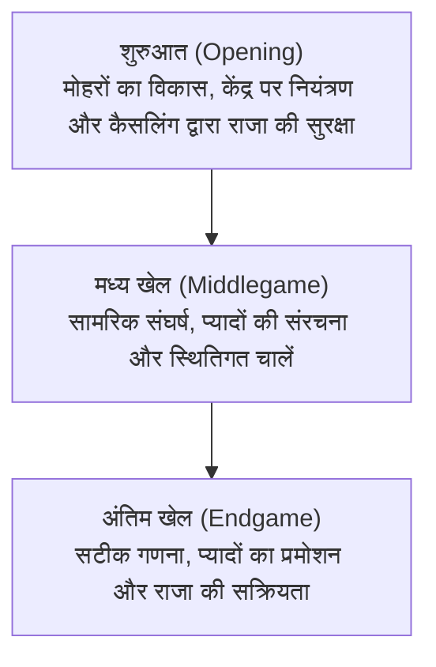

# बोर्ड गेम और AI: शतरंज के नियम, रणनीतिक पैटर्न और डीप ब्लू से अल्फाज़ीरो तक का विकास

आर्टिफिशियल इंटेलिजेंस (AI) के इतिहास में बोर्ड गेम लंबे समय से "AI अनुसंधान की ड्रोसोफिला (प्रयोगशाला मक्खी)" रहे हैं। यह मानव बुद्धि की कार्यप्रणाली को समझने और नए कंप्यूटिंग एल्गोरिदम का परीक्षण करने का सबसे सटीक बंद वातावरण रहा है। इनमें शतरंज (Chess) का स्थान सर्वोपरि है। दुनिया भर में खेले जाने वाले सबसे लोकप्रिय बौद्धिक खेलों में से एक के रूप में, शतरंज ने कंप्यूटर विज्ञान के कई मील के पत्थर स्थापित किए हैं।

इस लेख में, हम शतरंज के बुनियादी नियमों, गेम-ट्री की जटिलता और रणनीतिक पैटर्न का विश्लेषण करेंगे, और 1997 में विश्व चैंपियन को हराने वाले आईबीएम के "डीप ब्लू" से लेकर "अल्फाज़ीरो" और आधुनिक "स्टॉकफिश NNUE" तक AI के विकास की यात्रा को विस्तार से समझेंगे।

## 1. शतरंज के बुनियादी नियम और गेम-ट्री की जटिलता

शतरंज दो खिलाड़ियों के बीच खेला जाने वाला एक परिमित, शून्य-योग (Zero-sum) और पूर्ण सूचना (Perfect Information) वाला खेल है। यह खेल $8 \times 8$ के 64 काले और सफेद खानों वाले बोर्ड पर खेला जाता है। प्रत्येक खिलाड़ी 16 मोहरों का संचालन करता है (सफेद पहले चलता है), और इसका अंतिम उद्देश्य प्रतिद्वंद्वी के 'राजा' को ऐसी स्थिति में फंसाना है जहाँ से वह बच न सके—अर्थात **चेकमेट (Checkmate)**।

### मोहरों के प्रकार और उनकी चालें
शतरंज में छह अलग-अलग प्रकार के मोहरे होते हैं:
- **राजा (King)**: किसी भी दिशा में एक खाना चलता है। सबसे महत्वपूर्ण मोहरा, जिसके चेकमेट होने पर खेल समाप्त हो जाता है।
- **वज़ीर / रानी (Queen)**: सबसे शक्तिशाली मोहरा; क्षैतिज, लंबवत या विकर्ण रूप से किसी भी दूरी तक चल सकता है।
- **हाथी / रूक (Rook)**: पंक्तियों और स्तंभों में सीधा चलता है।
- **ऊंट / बिशप (Bishop)**: केवल तिरछा (विकर्ण पर) चलता है और जीवन भर एक ही रंग के खानों पर रहता है।
- **घोड़ा / नाइट (Knight)**: 'L' आकार में चलता है (दो कदम सीधे और एक कदम लंबवत); अन्य मोहरों के ऊपर से कूदने वाला एकमात्र मोहरा।
- **प्यादा / पॉन (Pawn)**: आगे एक कदम चलता है (पहली चाल में दो कदम चल सकता है) और तिरछा वार करता है। इसमें 'एन पासेंट' और अंतिम पंक्ति में पहुंचने पर किसी बड़े मोहरे में बदलने (प्रमोशन) के नियम होते हैं।

### खेल के तीन प्रमुख चरण
शतरंज का एक मुकाबला तीन चरणों में आगे बढ़ता है:

1. **शुरुआत (Opening)**: मोहरों को सक्रिय स्थानों पर लाना, केंद्र के चार खानों ($d4, e4, d5, e5$) पर नियंत्रण स्थापित करना और कैसलिंग द्वारा राजा को सुरक्षित करना।
2. **मध्य खेल (Middlegame)**: मोहरों के विकास के बाद सीधा संघर्ष। इसमें दीर्घकालिक रणनीतिक योजना और अल्पकालिक सामरिक चालें (पिन, फोर्क, बलिदान) शामिल होती हैं।
3. **अंतिम खेल (Endgame)**: अधिकांश मोहरे कट जाने के बाद की स्थिति। प्यादे को वज़ीर बनाना जीत का मुख्य आधार बनता है और इसमें सटीक गणना आवश्यक होती है।

### गेम-ट्री जटिलता: शैनन संख्या

शतरंज कंप्यूटरों के लिए कितनी बड़ी चुनौती रहा है, यह 1950 में क्लाउड शैनन द्वारा अनुमानित संभावित शतरंज मैचों की संख्या से समझा जा सकता है, जिसे **शैनन संख्या (Shannon Number)** कहा जाता है:

$$ \text{गेम-ट्री जटिलता} \approx 10^{120} $$

बोर्ड पर संभावित कानूनी स्थितियों की संख्या का अनुमान लगभग इतना है:

$$ \text{अवस्था-अंतरिक्ष जटिलता} \approx 10^{43} \sim 10^{47} $$

ब्रह्मांड में मौजूद कुल परमाणुओं की संख्या (लगभग $10^{80}$) की तुलना में, $10^{120}$ की संख्या यह स्पष्ट करती है कि **शतरंज को कभी भी पूर्ण गणना (Brute-Force) द्वारा हल नहीं किया जा सकता**। कंप्यूटर को आवश्यक रूप से अनावश्यक शाखाओं को काटना सीखना पड़ा।

## 2. रणनीतिक पैटर्न और मानव ग्रैंडमास्टर की अंतर्दृष्टि

मनुष्य इस विशाल गणना को कैसे संभालता है? संज्ञानात्मक मनोविज्ञान ने साबित किया है कि इसका रहस्य **पैटर्न पहचान (Pattern Recognition)** में है।

एक ग्रैंडमास्टर हर चाल की अलग-अलग गणना नहीं करता; वह वर्षों के अनुभव से बोर्ड को एक समग्र रूप में देखता है। उसका मस्तिष्क 98% अनावश्यक चालों को तुरंत खारिज कर देता है और केवल दो या तीन मुख्य चालों पर ध्यान केंद्रित करता है।

शतरंज के दो पहलू होते हैं:
- **टैक्टिक्स (Tactics)**: मोहरा जीतने या तुरंत मात देने के लिए की जाने वाली बाध्यकारी चालें (पिन, फोर्क, दोहरा हमला)।
- **पोजिशनल प्ले (Positional Play)**: प्यादों की मजबूत संरचना, खुली लाइनों पर नियंत्रण और दीर्घकालिक स्थितिगत लाभ।

दशकों तक AI का मुख्य उद्देश्य इसी मानवीय अंतर्दृष्टि को कंप्यूटर कोड में ढालना था।

## 3. डीप ब्लू का धमाका: गणना शक्ति की ऐतिहासिक जीत

शुरुआती शतरंज प्रोग्राम **मिनिमेक्स एल्गोरिदम** और **अल्फा-बीटा प्रूनिंग** पर आधारित थे, जो हाथों से लिखे गए मूल्यांकन फलनों (Evaluation Functions) द्वारा मोहरों की स्थिति का आकलन करते थे।

### डीप ब्लू की वास्तुकला
मई 1997 में आईबीएम के सुपरकंप्यूटर **डीप ब्लू (Deep Blue)** ने विश्व चैंपियन गैरी कास्पारोव को छह मैचों की श्रृंखला में $3\frac{1}{2} - 2\frac{1}{2}$ से हराकर दुनिया को स्तब्ध कर दिया।

डीप ब्लू की सफलता का मुख्य आधार भारी हार्डवेयर क्षमता थी:
- **विशिष्ट हार्डवेयर**: 30-नोड वाला IBM RS/6000 SP सुपरकंप्यूटर, जिसमें शतरंज गणना के लिए विशेष रूप से डिज़ाइन किए गए 480 VLSI चिप्स लगे थे।
- **गति**: यह प्रति सेकंड **20 करोड़ चालों** का मूल्यांकन कर सकता था।
- **ज्ञानकोश**: ग्रैंडमास्टरों के सहयोग से तैयार मूल्यांकन सूत्र और लाखों खेलों की ओपनिंग लाइब्रेरी।

हालाँकि, वैज्ञानिकों को पता था कि डीप ब्लू सचमुच 'बुद्धिमान' नहीं था; वह खेल को समझता नहीं था, बल्कि केवल अत्यधिक तीव्र गति से गणितीय गणना करता था।

## 4. प्रतिमान बदलाव: अल्फाज़ीरो की क्रांति

डीप ब्लू के 20 साल बाद, दिसंबर 2017 में गूगल डीपमाइंड ने **अल्फाज़ीरो (AlphaZero)** पेश किया।

तत्कालीन सर्वश्रेष्ठ शतरंज इंजन स्टॉकफिश 8 के खिलाफ 100 मैचों में, अल्फाज़ीरो ने 28 जीत, 72 ड्रॉ और **शून्य हार** के साथ एकतरफा जीत दर्ज की।

### अल्फाज़ीरो का क्रांतिकारी दृष्टिकोण
1. **शून्य से शुरुआत (Tabula Rasa)**: अल्फाज़ीरो को कोई मानवीय खेल या ओपनिंग बुक नहीं दी गई; केवल शतरंज के नियम बताए गए।
2. **स्वयं से खेलकर सीखना (Self-Play)**: खुद के खिलाफ लाखों मैच खेलकर इसने रीइन्फोर्समेंट लर्निंग द्वारा शतरंज की पूरी थ्योरी स्वयं सीखी।
3. **डीप न्यूरल नेटवर्क**: एक विशाल न्यूरल नेटवर्क यह तय करता था कि कौन सी चाल चलनी है (**Policy**) और जीतने की संभावना कितनी है (**Value**)।
4. **मोंटे कार्लो ट्री सर्च (MCTS)**: जहाँ स्टॉकफिश 8 प्रति सेकंड 6 करोड़ चालें देखता था, वहीं अल्फाज़ीरो प्रति सेकंड केवल **60,000 चालें** देखता था। वह केवल सबसे महत्वपूर्ण चालों पर गहराई से सोचता था, ठीक एक मानवीय ग्रैंडमास्टर की तरह।

अल्फाज़ीरो के खेलने का तरीका अद्भुत था। उसने मोहरों के भौतिक लाभ की तुलना में उनकी सक्रियता और बोर्ड पर दबाव को प्राथमिकता दी।

## 5. आधुनिक हाइब्रिड युग: स्टॉकफिश NNUE

अल्फाज़ीरो के बाद ओपन-सोर्स समुदाय ने **NNUE (Efficiently Updatable Neural Network)** तकनीक विकसित की। इसे 2020 में स्टॉकफिश 12 में शामिल किया गया:
- इसने पुराने कोड की जगह एक हल्के न्यूरल नेटवर्क को शामिल किया, जो अरबों स्थितियों पर प्रशिक्षित था।
- यह सामान्य कंप्यूटर प्रोसेसर पर भी तेजी से काम करता है, जिससे लाखों चालों की खोज के साथ न्यूरल अंतर्दृष्टि का संगम हुआ।

आज **स्टॉकफिश 16+ NNUE** का एलो रेटिंग **3500 से अधिक** है, जो मानव चैंपियन मैग्नस कार्लसन (2882) से बहुत आगे है।

## 6. निष्कर्ष: मानव और AI का सह-विकास

शतरंज AI अब मनुष्य का प्रतिद्वंद्वी नहीं, बल्कि उसका सबसे बड़ा शिक्षक और साथी बन चुका है:
- आज दुनिया के सभी ग्रैंडमास्टर AI इंजन से अपनी चालों का विश्लेषण करते हैं।
- AI ने कई पुरानी और भूली हुई रणनीतियों को नया जीवन दिया है।
- शतरंज के बोर्ड पर विकसित तकनीकों (MCTS, रीइन्फोर्समेंट लर्निंग) का उपयोग आज प्रोटीन संरचना के पूर्वानुमान (AlphaFold), दवा निर्माण और रसद प्रबंधन में किया जा रहा है।

64 खानों के इस खेल में मानव और मशीन का संगम ज्ञान के नए क्षितिज खोल रहा है।
