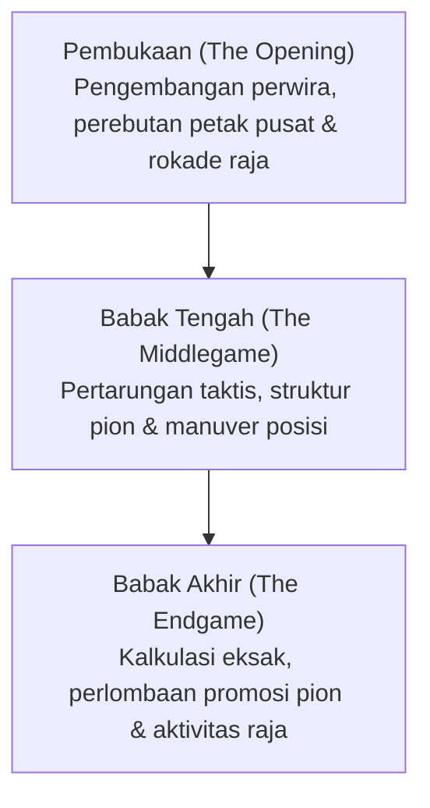

# Permainan Papan & AI: Aturan Catur, Pola Strategis, dan Evolusi dari Deep Blue ke AlphaZero

Dalam sejarah riset Kecerdasan Buatan (AI), permainan papan telah lama dijuluki sebagai "lalat buah (Drosophila) bagi riset AI": sebuah lingkungan tertutup yang terukur dan ideal untuk membedah rahasia kognisi manusia serta menguji algoritma komputasi mutakhir. Di antara sekian banyak permainan strategi, catur menduduki puncak tertinggi. Sebagai cabang olahraga otak paling populer di dunia, catur telah mendorong tonggak-tonggak krusial dalam ilmu komputer.

Artikel ini menyajikan ulasan terpadu mengenai aturan dasar catur, kompleksitas pohon permainan, pola strategis, serta perjalanan panjang dari fondasi teoretis Claude Shannon, kemenangan bersejarah IBM Deep Blue pada 1997, revolusi pembelajaran mendalam AlphaZero, hingga dominasi mesin saraf hibrida Stockfish NNUE saat ini.

## 1. Aturan Dasar dan Kompleksitas Permainan Catur

Catur adalah permainan dua pemain, zero-sum, berhingga, deterministik, dan berinformasi sempurna. Permainan berlangsung di atas papan kotak-kotak $8 \times 8$ yang terdiri dari 64 petak berwarna gelap dan terang bergantian. Setiap pihak mengendalikan 16 buah catur (Putih melangkah lebih dahulu), dengan tujuan utama menjebak Raja lawan dalam ancaman serang tanpa jalan keluar: **skakmat (Checkmate)**.

### Jenis Buah Catur dan Vektor Gerakan
Masing-masing pihak mengendalikan enam jenis buah dengan karakteristik geometris unik:
- **Raja (King)**: Bergerak satu petak ke segala arah. Buah terpenting yang kejatuhannya mengakhiri permainan.
- **Ratu / Menteri (Queen)**: Buah terkuat; bergerak bebas secara horizontal, vertikal, maupun diagonal sejauh tidak terhalang.
- **Benteng (Rook)**: Bergerak lurus sepanjang baris horizontal dan lajur vertikal.
- **Gajah / Peluncur (Bishop)**: Meluncur secara diagonal, terikat seumur hidup pada petak sewarna.
- **Kuda (Knight)**: Melompat membentuk pola huruf "L" (dua petak lurus dan satu petak menyiku); satu-satunya buah yang mampu melompati buah lain.
- **Pion (Pawn)**: Maju satu petak (opsional dua petak pada langkah pertama) dan memukul secara diagonal. Memiliki aturan khusus seperti memukul sambil lalu (*en passant*) dan promosi saat mencapai baris kedelapan.

### Tiga Babak dalam Catur
Sebuah duel catur terbagi secara sistematis ke dalam tiga fase:

1. **Pembukaan (Opening)**: Mengembangkan buah dari posisi awal ke petak aktif, merebut kendali empat petak pusat ($d4, e4, d5, e5$), dan mengamankan Raja lewat rokade. Analisis manusia telah dihimpun ke dalam ensiklopedia teori pembukaan (kode ECO).
2. **Babak Tengah (Middlegame)**: Pertempuran terbuka meletus setelah pengembangan selesai. Fase ini menuntut perpaduan intuisi posisi makro (struktur pion, petak lemah, pos terdepan) dan kalkulasi taktis tajam (pin, fork, serangan tersembunyi, pengorbanan buah).
3. **Babak Akhir (Endgame)**: Mayoritas perwira telah ditukarkan. Promosi pion menjadi kunci mutlak kemenangan. Kalkulasi harus sangat akurat, karena selisih satu tempo langkah menentukan hidup dan mati.

### Kompleksitas Pohon Permainan: Bilangan Shannon

Tantangan komputasi catur tercermin dari estimasi yang dihitung matematikawan Claude Shannon pada 1950 mengenai jumlah seluruh kemungkinan partai catur, yang dikenal sebagai **Bilangan Shannon**:

$$ \text{Kompleksitas Pohon Permainan} \approx 10^{120} $$

Sementara itu, kompleksitas ruang keadaan (jumlah konfigurasi posisi legal di atas papan) diperkirakan berkisar antara:

$$ \text{Kompleksitas Ruang Keadaan} \approx 10^{43} \sim 10^{47} $$

Bila dibandingkan dengan total atom di alam semesta teramati (sekitar $10^{80}$), bilangan Shannon menegaskan bahwa **catur tidak akan pernah bisa dipecahkan melalui pencarian menyeluruh (brute-force)**. Komputer mutlak memerlukan pemangkasan cabang dan fungsi evaluasi cerdas.

## 2. Pola Strategis dan Intuisi Grandmaster Manusia

Bagaimana para pecatur terbaik dunia mampu mengatasi ledakan kombinatorika tersebut? Riset psikologi kognitif (Herbert Simon dkk.) menunjukkan bahwa rahasianya terletak pada **pengenalan pola (Pattern Recognition) dan pemilahan informasi (Chunking)**.

Grandmaster tidak menghitung seluruh kemungkinan langkah legal; mereka memandang papan catur dalam kesatuan pola bermakna yang diasah bertahun-tahun. Secara otomatis, pikiran mereka menyaring 98% langkah sia-sia dan memusatkan kalkulasi mendalam pada dua atau tiga jalur kritis saja.

Kemampuan catur memadukan dua aspek:
- **Taktik (Tactics)**: Kombinasi langkah paksaan untuk meraih keunggulan materi atau skakmat seketika (pin, garpuan, serangan terbuka).
- **Strategi Posisi (Positional Play)**: Visi jangka panjang, seperti penguasaan lajur terbuka, keunggulan sepasang gajah, dan perusakan struktur pion lawan.

Tantangan terbesar AI selama puluhan tahun adalah bagaimana menerjemahkan intuisi posisi ini ke dalam bahasa komputer.

## 3. Kejutan Deep Blue: Keunggulan Daya Komputasi Kasar

Program catur masa awal mengandalkan **algoritma Minimax** dengan optimasi **pemangkasan Alfa-Beta (Alpha-Beta Pruning)**, yang dipandu oleh **fungsi evaluasi heuristik** manual berbobot numerik.

### Arsitektur Mesin Deep Blue
Pada Mei 1997, superkomputer rancangan IBM **Deep Blue** mencetak rekor dunia dengan menaklukkan Juara Dunia Garry Kasparov dalam duel enam babak ($3\frac{1}{2} - 2\frac{1}{2}$).

Kunci kemenangan Deep Blue bersumber dari kecepatan komputasi paralel masif:
- **Perangkat Keras Khusus**: Menggabungkan superkomputer IBM RS/6000 SP 30-node dengan 480 chip VLSI yang dirancang khusus untuk memproses kalkulasi catur.
- **Kecepatan Pencarian**: Mampu mengevaluasi lebih dari **200 juta posisi per detik**, menjangkau kalkulasi 6 hingga 8 langkah ke depan secara reguler, dan lebih dari 20 langkah pada jalur taktis paksaan.
- **Basis Data Pengetahuan**: Fungsi evaluasi disetel bersama Grandmaster Joel Benjamin, didukung jutaan langkah buku pembukaan dan tabel babak akhir sempurna untuk 5 buah catur.

### Makna Sejarah dan Keterbatasan
Kekalahan Kasparov menggemparkan dunia. Namun para ilmuwan menyadari: Deep Blue bukanlah kecerdasan umum adaptif. Deep Blue tidak "memahami" konsep catur dan tidak dapat belajar sendiri; ia merupakan puncak dari kehebatan komputasi perangkat keras khusus.

## 4. Pergeseran Paradigma: Lahirnya AlphaZero

Dua puluh tahun setelah Deep Blue, mesin catur terus mengandalkan pencarian alfa-beta pada prosesor standar. Namun pada Desember 2017, Google DeepMind mengumumkan **AlphaZero**, mengubah peta kecerdasan buatan untuk selamanya.

Dalam duel 100 babak melawan Stockfish 8 (mesin catur konvensional terkuat saat itu), AlphaZero membukukan 28 kemenangan, 72 remis, dan **nol kekalahan**.

### Terobosan Algoritma AlphaZero
AlphaZero merombak seluruh metodologi pendahulunya:

1. **Belajar dari Nol (Tabula Rasa)**: Tanpa buku pembukaan, tanpa data babak akhir, dan tanpa arsip partai manusia—hanya dibekali aturan dasar catur.
2. **Bermain Mandiri (Self-Play)**: Melalui jutaan partai melawan dirinya sendiri, AlphaZero menemukan teori catur dari ketiadaan lewat pembelajaran penguatan (Reinforcement Learning).
3. **Jaringan Saraf Tiruan Ganda**: Jaringan konvolusional mendalam mengevaluasi probabilitas langkah terbaik (**Policy**) sekaligus menaksir peluang kemenangan posisi (**Value**).
4. **Pencarian Pohon Monte Carlo (MCTS)**: Jika Stockfish 8 memeriksa 60 juta posisi per detik, AlphaZero hanya memeriksa sekitar **60.000 posisi per detik**. Berkat intuisi jaringan sarafnya, ia hanya menelusuri cabang-cabang paling kritis, menyerupai cara berpikir grandmaster manusia.

Gaya bermain AlphaZero memukau komunitas internasional. Para master menggambarkan permainannya sebagai "seni catur dari peradaban lain": ia rela mengorbankan pion dan perwira demi merebut dominasi ruang dan melumpuhkan mobilitas lawan.

## 5. Catur Modern: Hibridisasi dan Stockfish NNUE

AlphaZero membuktikan keunggulan evaluasi jaringan saraf, namun membutuhkan server TPU mahal. Komunitas catur open-source merespons dengan menciptakan terobosan brilian: **NNUE (Efficiently Updatable Neural Network)**.

Awalnya diciptakan untuk shogi komputer, NNUE diintegrasikan ke dalam Stockfish 12 pada tahun 2020:
- Menggantikan kode evaluasi manual lama dengan jaringan saraf ringan yang dilatih pada miliaran posisi catur.
- Memanfaatkan instruksi vektor CPU konsumen, jaringan diperbarui dalam hitungan nanodetik saat pencarian alfa-beta berlangsung, memadukan kecepatan komputasi tinggi dengan intuisi posisi yang tajam.

Kini, **Stockfish 16+ dengan NNUE** menembus peringkat Elo di atas **3500**, jauh melampaui kemampuan tertinggi manusia (rekor Magnus Carlsen berkisar pada 2882 Elo).

## 6. Kesimpulan: Koevolusi Manusia dan Kecerdasan Buatan

Sejarah AI catur berevolusi dari pemodelan aturan logika manual, penaklukan melalui daya komputasi perangkat keras, hingga otonomi pembelajaran mendalam mandiri.

Saat ini, AI bukan lagi musuh manusia, melainkan mitra dan guru terhebat:
- Para pecatur profesional menganalisis partai dan merancang variasi pembukaan baru bersama mesin catur.
- Langkah-langkah agresif pion sayap ($h4/a4$) yang digali oleh AI menyuntikkan napas segar pada teori pembukaan klasik.
- Algoritma yang ditempa di atas papan catur (MCTS, deep reinforcement learning) kini memicu terobosan dalam prediksi struktur protein (AlphaFold), penemuan obat, hingga logistik rantai pasok global.

Di atas 64 petak hitam-putih, akal budi manusia dan kecerdasan buatan terus berdampingan memperluas batas-batas pengetahuan.
