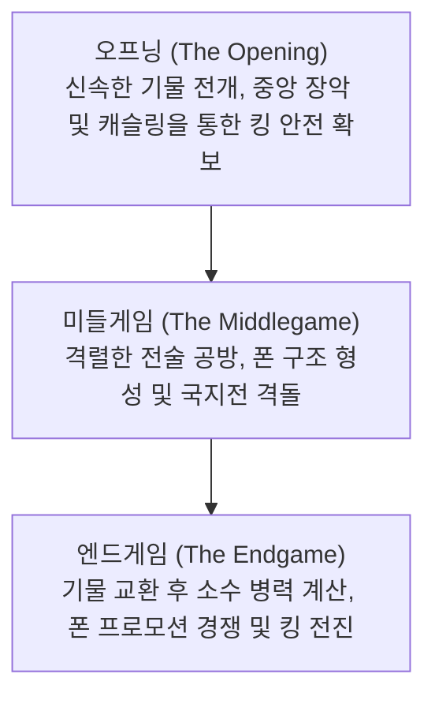

# 보드게임과 AI: 체스의 규칙과 전략 패턴, 딥블루에서 알파제로까지의 진화

인공지능(AI) 연구의 역사에서 보드게임은 오랫동안 '지능 연구의 초파리'라 불렸습니다. 인간 인지의 비밀을 탐구하고 혁신적인 연산 알고리즘을 실험하기에 가장 이상적인 폐쇄형 실험 환경이었기 때문입니다. 그중에서도 체스(Chess)는 독보적인 지위를 차지합니다. 세계에서 가장 널리 보급된 두뇌 스포츠로서 체스는 컴퓨터 과학의 굵직한 이정표들을 견인해 왔습니다.

본 글에서는 체스의 기본 규칙, 상태 공간 복잡도 및 전략적 패턴을 심층적으로 살펴보고, 1997년 세계 챔피언을 꺾은 IBM의 '딥블루(Deep Blue)'부터 심층 강화학습 혁명을 일으킨 '알파제로(AlphaZero)', 그리고 오늘날 최강자로 군림하는 '스톡피시(Stockfish) NNUE'에 이르기까지 AI 기술의 진화 궤적을 체계적으로 조명합니다.

## 1. 체스의 기본 규칙과 게임 트리 복잡도

체스는 가로세로 $8 \times 8$, 총 64개의 흑백 격자판(체스보드) 위에서 백과 흑이 16개씩의 기물을 운용하여 승패를 가리는 2인 제로섬 유한 확정 완전정보 게임입니다. 플레이어는 번갈아 기물을 움직이며 상대방의 국왕 격인 '킹'을 도망칠 곳 없는 공격 상태로 몰아넣는 **체크메이트(Checkmate)** 를 목표로 합니다.

### 기물의 종류와 이동 벡터
체스에는 고유한 기하학적 이동 방식을 가진 6가지 기물이 존재합니다:
- **킹 (King)**: 사방 1칸씩 이동. 생포되면 게임이 즉시 종료되는 가장 핵심적인 기물.
- **퀸 (Queen)**: 가로, 세로, 대각선으로 원하는 칸만큼 이동 가능한 최강의 공격 기물.
- **룩 (Rook)**: 가로와 세로 직선 방향으로 제한 없이 이동.
- **비숍 (Bishop)**: 대각선 방향으로만 이동하며, 태어난 칸의 색상에 평생 귀속됨.
- **나이트 (Knight)**: 'L자' 모양(한 방향으로 2칸 직진 후 수직으로 1칸)으로 이동하며, 다른 기물을 뛰어넘을 수 있는 유일한 기물.
- **폰 (Pawn)**: 전방으로 1칸씩 전진(첫 이동 시 2칸 가능)하며 대각선으로 적을 잡음. 앙파상(En Passant) 및 상대 끝단 도달 시 다른 강력한 기물로 변신하는 프로모션(Promotion) 규칙 보유.

### 게임의 3단계 흐름
한 판의 체스 대국은 일반적으로 3개의 전략적 페이즈로 전개됩니다:

1. **오프닝 (Opening)**: 기물을 초깃값에서 전술적 요충지로 신속히 배치하고, 중앙 4칸($d4, e4, d5, e5$)을 장악하며, 캐슬링을 통해 킹을 안전지대로 피신시키는 단계입니다. 수백 년에 걸쳐 축적된 방대한 정석 체계(ECO)가 존재합니다.
2. **미들게임 (Middlegame)**: 전개가 완료된 후 전면전이 펼쳐지는 단계입니다. 폰 구조와 기물 활동성을 아우르는 거시적 전략(포지셔널 플레이)과 핀, 포크, 스큐어 등 단기적인 수읽기 전술(택틱스)이 극한으로 결합됩니다.
3. **엔드게임 (Endgame)**: 대부분의 주요 기물이 교환되고 판에 소수의 기물만 남은 상태입니다. 폰을 퀸으로 승격시키는 프로모션이 승패를 가르며, 단 1템포의 오차도 용납되지 않는 정밀한 수학적 계산이 요구됩니다.

### 상태 공간 복잡도: 섀넌의 수

체스가 컴퓨터 과학자들에게 얼마나 거대한 도전이었는지를 단적으로 보여주는 지표가 바로 **섀넌의 수(Shannon Number)** 입니다. 1950년 클로드 섀넌이 추산한 바에 따르면, 체스에서 발생할 수 있는 총 대국 기보의 수는 무려 다음과 같습니다:

$$ \text{게임 트리 복잡도} \approx 10^{120} $$

또한 가능한 모든 체스 국면의 상태 공간 복잡도는 대략 다음과 같이 추정됩니다:

$$ \text{상태 공간 복잡도} \approx 10^{43} \sim 10^{47} $$

관측 가능한 우주에 존재하는 모든 원자의 총수(약 $10^{80}$개)와 비교할 때, $10^{120}$이라는 숫자는 상상을 초월하는 천문학적 규모입니다. 이는 그 어떤 최첨단 슈퍼컴퓨터로도 **무차별 대입(Brute-force) 전체 탐색을 통해 체스를 해결하는 것은 물리적으로 불가능하다** 는 것을 입증합니다.

## 2. 전략 패턴과 인간 그랜드마스터의 직관

인간 체스 마스터들은 이 무한에 가까운 계산량을 어떻게 처리해 왔을까요? 인지심리학 연구(허버트 사이먼 등)는 그 비결이 **패턴 인식(Pattern Recognition)과 청킹(Chunking)** 에 있음을 밝혀냈습니다.

인간 고수는 국면을 볼 때 개별 말을 하나씩 계산하지 않고, 수많은 경험을 통해 압축된 '전략적 덩어리(청크)'로 형세를 직관적으로 파악합니다. 수천 가지의 가능한 수 중에서 98% 이상의 무의미한 수를 무의식적으로 걸러내고, 승부처가 되는 핵심적인 2〜3가지 경로에만 깊은 수읽기를 집중합니다.

체스의 사고는 두 축으로 구성됩니다:
- **택틱스 (Tactics)**: 핀(Pin), 포크(Fork), 디스커버드 어택 등 단기적으로 기물 이득이나 체크메이트를 강제하는 전술적 수단.
- **포지셔널 플레이 (Positional Play)**: 폰 구조의 견고함, 열린 파일(Open file), 비숍 쌍(Bishop pair)의 우위, 공간 점유 등 장기적이고 은근한 주도권을 쥐기 위한 거시적 포석.

인간의 이 영민한 '직관과 형세 판단'을 기계에 어떻게 부여할 것인가는 체스 AI 연구의 최대 난제였습니다.

## 3. 딥블루의 충격: 압도적 연산력이 인간을 꺾은 날

초기 체스 프로그램은 **최소최대 알고리즘(Minimax)** 에 불필요한 계산 경로를 쳐내는 **알파-베타 가지치기(Alpha-Beta Pruning)** 를 접목하고, 기물의 가치와 배치를 점수화하는 **평가 함수(Evaluation Function)** 를 결합하는 방식을 사용했습니다.

### 딥블루의 하드웨어와 구조
1997년 5월, IBM이 개발한 체스 전용 슈퍼컴퓨터 **딥블루(Deep Blue)** 는 당시 인류 역사상 최강의 챔피언으로 군림하던 가리 카스파로프(Garry Kasparov)를 6번 승부 끝에 $3\frac{1}{2} - 2\frac{1}{2}$ 로 격파하며 전 세계에 거대한 충격을 안겼습니다.

딥블루 승리의 핵심 동력은 극한으로 끌어올린 무차별 탐색(Brute-force) 역량이었습니다:
- **전용 하드웨어 아키텍처**: 30노드의 IBM RS/6000 SP 슈퍼컴퓨터에 체스 전용 연산용으로 맞춤 설계된 480개의 VLSI 칩이 탑재되었습니다.
- **초당 2억 국면 탐색**: 1초에 무려 **2억 개의 수** 를 평가할 수 있었으며, 통상 6〜8수 앞을 내다보고 전술적 승부처에서는 20수 이상을 깊게 수읽기했습니다.
- **인간 지식의 집대성**: 그랜드마스터 조엘 벤저민 등이 참여하여 수천 개의 미세 가중치를 수작업으로 튜닝한 평가 함수와 수십만 국면의 오프닝 라이브러리 및 5기물 완전 엔드게임 테이블베이스를 탑재했습니다.

### 승리의 의의와 한계
카스파로프의 패배는 "기계가 인간의 지능을 넘어섰다"는 센세이션을 일으켰습니다. 하지만 딥블루는 체스의 개념을 이해하거나 스스로 학습한 것이 아니었습니다. 그것은 '초고속 하드웨어 연산'과 '인간 지식의 프로그래밍화'가 낳은 기념비적 공학 승리였을 뿐, 진정한 의미의 자율 학습 인공지능은 아니었습니다.

## 4. 패러다임 시프트: 알파제로(AlphaZero)의 등장

딥블루 이후 20년간 체스 엔진은 탐색 알고리즘과 휴리스틱 가지치기를 고도화하며 발전했습니다. 그러나 2017년 12월, 구글 딥마인드(Google DeepMind)의 **알파제로(AlphaZero)** 가 등장하면서 체스 AI의 패러다임은 근본적으로 뒤바뀌었습니다.

알파제로는 당시 세계 최강의 전통 체스 엔진이었던 스톡피시 8(Stockfish 8)과의 100번기 대국에서 28승 72무 0패라는 경이적인 성적으로 무패 완승을 거두었습니다.

### 알파제로의 혁신적 원리
알파제로는 이전의 모든 엔진들과 근본적으로 결을 달리했습니다:

1. **백지상태에서의 강화학습 (Tabula Rasa)**: 인간의 기보, 오프닝 북, 엔드게임 테이블을 단 한 줄도 주지 않고 오직 체스의 기본 규칙만을 입력했습니다.
2. **자가 대진을 통한 자율 진화 (Self-Play)**: 무작위로 말을 두는 상태에서 출발하여 자기 자신과의 수백만 번 대국을 통해 승리 확률이 높은 전략을 스스로 찾아내며 바닥부터 체스 이론을 깨우쳤습니다.
3. **심층 신경망 기반의 직관**: 거대한 심층 합성곱 신경망이 국면을 평가하여 **어느 수를 둘지(Policy)** 와 **승리 확률이 얼마인지(Value)** 를 직관적으로 판별합니다.
4. **몬테카를로 트리 탐색 (MCTS)**: 스톡피시 8이 초당 6,000만 국면을 탐색할 때, 알파제로는 초당 **6만 국면** 만을 탐색했습니다. 탐색량은 1,000분의 1에 불과했지만 신경망의 뛰어난 직관 덕분에 유망한 경로만을 깊게 파고들어 인간 초고수의 대국관에 근접한 수읽기를 보여주었습니다.

알파제로는 기물의 손익에 연연하지 않고 기물의 활동성과 장기적인 공간 압박을 최우선시하며 파격적인 폰 희생을 서슴지 않았습니다. 당대 최고의 체스 그랜드마스터들은 "외계인이 체스를 두는 것 같은 경이로움과 아름다움을 느꼈다"고 극찬했습니다.

## 5. 현대 체스 AI의 하이브리드 진화: 스톡피시 NNUE

알파제로의 충격 이후, 오픈소스 진영은 알파제로의 신경망 대국관을 일반 PC의 CPU 환경에서도 초고속으로 구동할 수 있는 혁신적인 아키텍처를 도입했습니다. 바로 **NNUE (효율적 갱신 신경망: Efficiently Updatable Neural Network)** 입니다.

원래 컴퓨터 쇼기(일본 장기) 분야에서 개발된 NNUE는 2020년 스톡피시 12에 전격 통합되었습니다.

- 기존의 수작업 평가 함수 코드를 완전히 걷어내고, 수억 개의 국면 데이터를 학습한 경량 심층 신경망으로 대체했습니다.
- CPU의 SIMD 벡터 명령어를 극한으로 활용하여 알파-베타 탐색 중에도 초당 수천만 국면을 신경망으로 평가할 수 있게 되었습니다.

오늘날 NNUE를 탑재한 **스톡피시 16+** 의 레이팅은 **3500점** 을 훌쩍 넘어서며, 현존하는 인간 세계 챔피언(매그너스 칼슨 약 2880점)조차 단 한 판도 이길 수 없는 신의 경지에 도달했습니다.

## 6. 결론: 인간과 AI의 공진화

체스에서 AI의 역사는 인간의 사고를 모방하려는 시도에서 출발하여, 무차별 연산력을 통한 정복을 거쳐, 마침내 스스로 학습하는 자율 인공지능의 완성으로 귀결되었습니다.

현재 AI는 인간에게 '타도해야 할 적'이 아니라 체스의 지평을 넓혀주는 '가장 위대한 스승이자 파트너'입니다:
- 모든 프로 기사는 AI를 통해 새로운 오프닝을 연구하고 자신의 실수를 복기합니다.
- AI가 발굴해 낸 외곽 폰 전진($h4/a4$)과 동적 기물 희생 등 혁신적인 수들은 수백 년 묵은 체스 이론을 다시 살아 숨 쉬게 만들고 있습니다.
- 체스판 위에서 단련된 강화학습, 몬테카를로 탐색, 심층 신경망 기술은 오늘날 단백질 구조 예측(AlphaFold), 신소재 개발, 물류 최적화 등 인류의 복잡한 난제를 해결하는 핵심 원동력으로 뻗어 나가고 있습니다.

흑백의 64개 칸 위에서 펼쳐진 인간과 기계의 지적 교감은 앞으로도 인류 과학기술의 지평을 비추는 영원한 등대로 남을 것입니다.
