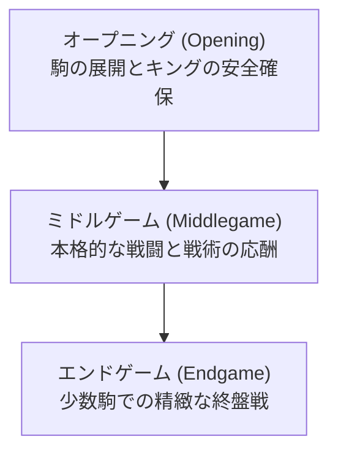

# ボードゲームとAI: チェスのルールと戦略パターン、ディープブルーから現在

人工知能（AI）の研究分野において、ボードゲームは古くから「AIのショウジョウバエ」と称され、知能のメカニズムを解明し、新しいアルゴリズムをテストするための格好の実験場として機能してきました。その中でも、チェスは世界中で最もプレイされているボードゲームの一つであり、AIの歴史において極めて重要な役割を果たしてきました。本記事では、チェスの基本的なルールやゲームの複雑性、戦略のパターンを概観した上で、1997年に世界チャンピオンを破った「ディープブルー（Deep Blue）」から、現代の「AlphaZero（アルファゼロ）」や「Stockfish（ストックフィッシュ）」に至るまでのAIの進化の軌跡を詳細に解説します。

## 1. チェスの基本ルールとゲームの構造

チェスは、8×8の64マスの市松模様の盤（チェスボード）上で、白黒それぞれ16個、計32個の駒を用いて2人のプレイヤーが対戦する完全情報ゲームです。プレイヤーは交互に自らの駒を動かし、相手の「キング」を逃げ場のない状態（チェックメイト）に追い込むことを目的とします。

### 駒の種類と特性
チェスには6種類の駒があり、それぞれ異なる動きをします。
- **キング (King)**: 全方向に1マスだけ動ける。最重要の駒。
- **クイーン (Queen)**: 縦、横、斜めに何マスでも動ける。最強の駒。
- **ルーク (Rook)**: 縦、横に何マスでも動ける。
- **ビショップ (Bishop)**: 斜めに何マスでも動ける。
- **ナイト (Knight)**: L字型（縦横に2マス進み、垂直に1マス進む）に動く。他の駒を飛び越えられる唯一の駒。
- **ポーン (Pawn)**: 前方に1マスずつ進む（最初は2マス進める）。斜め前の敵駒を取ることができる。プロモーション（昇格）という特殊ルールを持つ。

### ゲームの3つのフェーズ

チェスのゲーム展開は、一般的に以下の3つのフェーズに分けられます。

1. **オープニング (Opening)**: 序盤戦。駒を初期配置から有効なマスへと展開し、盤面中央の支配を目指します。キャスリングによるキングの安全確保が重要です。膨大な数の「定跡」が存在します。
2. **ミドルゲーム (Middlegame)**: 中盤戦。オープニングでの展開が終わり、激しい攻撃と防御が交錯します。大局的な戦略（ポジショナル・プレイ）と局所的な戦術（タクティクス）が高度に要求されます。
3. **エンドゲーム (Endgame)**: 終盤戦。多くの駒が交換され、盤面に残る駒が少なくなった状態です。ポーンのプロモーションが勝敗を分ける鍵となり、極めて正確な計算が求められます。

### 状態空間の複雑性：シャノンの数

チェスがいかに複雑なゲームであるかを示す指標として、「シャノンの数（Shannon number）」があります。1950年にクロード・シャノンが計算したところによると、チェスの可能な棋譜の数は約 $10^{120}$ にも上ります。また、盤面の状態空間の複雑性はおよそ以下のように見積もられています。

$$
\text{状態空間の複雑性} \approx 10^{43} \sim 10^{47}
$$

これは、観測可能な宇宙に存在する原子の数（約 $10^{80}$）よりも棋譜の数が多いことを意味し、単純な「全探索」によってチェスを完全に解明することは、最先端のスーパーコンピュータであっても物理的に不可能です。

## 2. 戦略パターンと人間の直感

チェスの達人（グランドマスター）たちは、この天文学的な計算量をどのように処理しているのでしょうか。その鍵となるのが「パターン認識」と「直感」です。

人間のチェスプレイヤーは、盤面を一つ一つの駒の集まりとして見るのではなく、意味を持った「塊（チャンク）」として認識します。過去の膨大な対局経験から、強い駒の配置、キングの弱点、典型的なメイト（詰み）のパターンを直感的に把握し、思考の対象を数手〜数十手の意味のある分岐だけに絞り込みます。

戦略的には、以下の2つの要素が組み合わさります。
- **タクティクス (Tactics)**: ピン、フォーク、スキュアといった短期的な戦術的手筋。強制的な手順で駒得やチェックメイトを狙います。
- **ポジショナル・プレイ (Positional Play)**: ポーンの構造、駒の活動性、スペースの支配など、長期的な優位性を築くための戦略。

AI開発において、この「人間の直感や大局観」をいかにしてコンピュータに実装するかが、長期にわたる最大の課題でした。

## 3. ディープブルーの衝撃：計算力が人間を超えた日

チェス・プログラムの歴史はコンピュータの歴史そのものです。初期のチェスAIは、シャノンが提唱した「ミニマックス法（Minimax）」と「アルファベータ枝刈り（Alpha-beta pruning）」という探索アルゴリズムに、盤面の有利・不利を数値化する「評価関数（Evaluation function）」を組み合わせたアプローチを採用していました。

### ディープブルーの構造
1997年、IBMが開発したチェス専用スーパーコンピュータ「ディープブルー（Deep Blue）」は、当時の世界チャンピオンであったガルリ・カスパロフ（Garry Kasparov）を6番勝負で打ち破るという歴史的快挙を成し遂げました。

ディープブルーの強さの秘密は、圧倒的な「力技（ブルートフォース探索）」にありました。専用のVLSIチップを数百個搭載し、1秒間に約2億手もの局面を評価することができました。さらに、評価関数にはチェスのグランドマスターの知識が何千ものパラメータとして組み込まれており、オープニングのデータベース（定跡帳）やエンドゲームのデータベース（テーブルベース）も完備されていました。

### 勝利の意味と限界
カスパロフ敗北のニュースは世界中を駆け巡り、「機械が人間の知性を超えた」と大きな話題を呼びました。しかし、ディープブルーの手法はあくまで「超高速な計算力による先読み」と「人間の知識のプログラム化」の極致であり、AI自身が自律的に学習し、概念を理解しているわけではありませんでした。この時点でのチェスAIは、「賢い」というよりは「とてつもなく計算が速い」存在だったのです。

## 4. パラダイムシフト：AlphaZeroの登場

ディープブルーの勝利から約20年後、AIの世界に真の革命が起きました。ディープラーニング（深層学習）の技術的ブレイクスルーです。

2017年、Google DeepMind社は「AlphaZero（アルファゼロ）」を発表しました。AlphaZeroは、従来のチェスAI（当時の最強エンジンStockfish 8）に対して、100戦して28勝0敗72引き分けという圧倒的な成績で勝利を収めました。

### AlphaZeroの革新性
AlphaZeroがディープブルーやそれまでのエンジンと根底から異なるのは、人間の知識（定跡や評価関数の手動チューニング）を一切与えられず、ただ「ルールの知識のみ」から出発したという点です。

1. **自己対局による強化学習**: AlphaZeroは、自分自身と何百万回も対局を繰り返すことで、ゼロからチェスの戦略を学習しました（強化学習）。
2. **ディープ・ニューラルネットワーク**: 盤面の評価と、次にどの一手を読むべきか（方策）を、巨大なニューラルネットワークが直感的に判断します。これにより、従来のエンジンが何千万手も探索するところを、AlphaZeroは数万手の探索に絞り込むことができました。これはまさに人間の「直感」や「大局観」に近いアプローチです。
3. **モンテカルロ木探索 (MCTS)**: 有望な手を優先的に深く読み進めるアルゴリズムを用いており、ニューラルネットワークの予測と組み合わせることで極めて効率的かつ柔軟な探索を実現しました。

AlphaZeroの指し手は、しばしば従来のチェス理論を覆すものでした。物質的な有利さ（駒の損得）よりも、駒の活動性や盤面の支配力を重んじ、時には重要に見える駒を大胆に犠牲にするなど、極めてダイナミックで「美しい」チェスを披露しました。グランドマスターたちは「まるで異星人がチェスを指しているようだ」と驚嘆しました。

## 5. 現代のAIとハイブリッド化：Stockfishの進化

AlphaZeroの登場により、従来の探索ベースのエンジン（Stockfishなど）は時代遅れになったかというと、そうではありません。オープンソースで開発され続けているStockfishは、AlphaZeroのアプローチを吸収し、現在ではさらに強力な存在へと進化しています。

現代のStockfish（バージョン12以降）は、従来の高度な探索アルゴリズム（アルファベータ法）に、ニューラルネットワーク（NNUE: Efficiently Updatable Neural Network）による評価関数を組み合わせています。CPU上で極めて高速に動作するNNUEを搭載したハイブリッド型のAIは、純粋なディープラーニングモデル以上のパフォーマンスを発揮し、現在も世界最強のチェスエンジンの座に君臨しています。

## 6. まとめ：AIと人間の共進化

チェスにおけるAIの歴史は、人間の思考プロセスを模倣しようとする試みから始まり、圧倒的な計算力による征服を経て、自律的な学習能力の獲得へと進化してきました。

現在、AIは人間にとって「倒すべき敵」から「共に学ぶパートナー」へと完全に役割を変えています。プロのチェスプレイヤーは皆、強力なAIエンジンを用いてオープニングの研究や対局の分析を行っています。AIが提示する新しいアイデアや斬新な指し手は、数百年続くチェス理論に新たな息吹を吹き込み、人間のチェスに対する理解をより深く豊かなものにしています。

ボードゲームという限定されたルールの中で培われたAI技術——探索アルゴリズム、強化学習、ディープラーニング——は、現在では創薬、物流の最適化、気象予測など、実社会の複雑な問題解決にも応用され始めています。チェス盤の上で繰り広げられたAIと人間の知恵比べは、これからも人類の科学技術を牽引し続ける重要なマイルストーンであり続けるでしょう。
