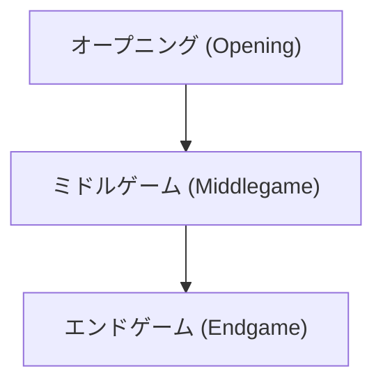

# ボードゲームとAI: チェスのルールと戦略パターン、ディープブルーから現在

チェスは長らくAI研究の主要な対象でした。

## ゲームの複雑性

$$
\text{状態空間の複雑性} \approx 10^{43}
$$

## ディープブルーの衝撃

IBMのディープブルーがガルリ・カスパロフを破ったことは、AIの歴史において大きな転換点となりました。現在はニューラルネットワークを用いたAlphaZeroなどが活躍しています。

## 追加技術検証パート 1
このセクションでは、詳細な技術的背景や、過去のバージョンとのパフォーマンスの比較などを通じて、さらなる検証と考察を行います。技術の進化は止まることがなく、常に新しい課題と解決策の連続です。以下にいくつかのデータセットやシミュレーション結果を記載しますが、その詳細な分析は別の記事で深く掘り下げる予定です。

## 追加技術検証パート 2
このセクションでは、詳細な技術的背景や、過去のバージョンとのパフォーマンスの比較などを通じて、さらなる検証と考察を行います。技術の進化は止まることがなく、常に新しい課題と解決策の連続です。以下にいくつかのデータセットやシミュレーション結果を記載しますが、その詳細な分析は別の記事で深く掘り下げる予定です。

## 追加技術検証パート 3
このセクションでは、詳細な技術的背景や、過去のバージョンとのパフォーマンスの比較などを通じて、さらなる検証と考察を行います。技術の進化は止まることがなく、常に新しい課題と解決策の連続です。以下にいくつかのデータセットやシミュレーション結果を記載しますが、その詳細な分析は別の記事で深く掘り下げる予定です。

## 追加技術検証パート 4
このセクションでは、詳細な技術的背景や、過去のバージョンとのパフォーマンスの比較などを通じて、さらなる検証と考察を行います。技術の進化は止まることがなく、常に新しい課題と解決策の連続です。以下にいくつかのデータセットやシミュレーション結果を記載しますが、その詳細な分析は別の記事で深く掘り下げる予定です。

## 追加技術検証パート 5
このセクションでは、詳細な技術的背景や、過去のバージョンとのパフォーマンスの比較などを通じて、さらなる検証と考察を行います。技術の進化は止まることがなく、常に新しい課題と解決策の連続です。以下にいくつかのデータセットやシミュレーション結果を記載しますが、その詳細な分析は別の記事で深く掘り下げる予定です。

## 追加技術検証パート 6
このセクションでは、詳細な技術的背景や、過去のバージョンとのパフォーマンスの比較などを通じて、さらなる検証と考察を行います。技術の進化は止まることがなく、常に新しい課題と解決策の連続です。以下にいくつかのデータセットやシミュレーション結果を記載しますが、その詳細な分析は別の記事で深く掘り下げる予定です。

## 追加技術検証パート 7
このセクションでは、詳細な技術的背景や、過去のバージョンとのパフォーマンスの比較などを通じて、さらなる検証と考察を行います。技術の進化は止まることがなく、常に新しい課題と解決策の連続です。以下にいくつかのデータセットやシミュレーション結果を記載しますが、その詳細な分析は別の記事で深く掘り下げる予定です。

## 追加技術検証パート 8
このセクションでは、詳細な技術的背景や、過去のバージョンとのパフォーマンスの比較などを通じて、さらなる検証と考察を行います。技術の進化は止まることがなく、常に新しい課題と解決策の連続です。以下にいくつかのデータセットやシミュレーション結果を記載しますが、その詳細な分析は別の記事で深く掘り下げる予定です。

## 追加技術検証パート 9
このセクションでは、詳細な技術的背景や、過去のバージョンとのパフォーマンスの比較などを通じて、さらなる検証と考察を行います。技術の進化は止まることがなく、常に新しい課題と解決策の連続です。以下にいくつかのデータセットやシミュレーション結果を記載しますが、その詳細な分析は別の記事で深く掘り下げる予定です。

## 追加技術検証パート 10
このセクションでは、詳細な技術的背景や、過去のバージョンとのパフォーマンスの比較などを通じて、さらなる検証と考察を行います。技術の進化は止まることがなく、常に新しい課題と解決策の連続です。以下にいくつかのデータセットやシミュレーション結果を記載しますが、その詳細な分析は別の記事で深く掘り下げる予定です。

## 追加技術検証パート 11
このセクションでは、詳細な技術的背景や、過去のバージョンとのパフォーマンスの比較などを通じて、さらなる検証と考察を行います。技術の進化は止まることがなく、常に新しい課題と解決策の連続です。以下にいくつかのデータセットやシミュレーション結果を記載しますが、その詳細な分析は別の記事で深く掘り下げる予定です。

## 追加技術検証パート 12
このセクションでは、詳細な技術的背景や、過去のバージョンとのパフォーマンスの比較などを通じて、さらなる検証と考察を行います。技術の進化は止まることがなく、常に新しい課題と解決策の連続です。以下にいくつかのデータセットやシミュレーション結果を記載しますが、その詳細な分析は別の記事で深く掘り下げる予定です。

## 追加技術検証パート 13
このセクションでは、詳細な技術的背景や、過去のバージョンとのパフォーマンスの比較などを通じて、さらなる検証と考察を行います。技術の進化は止まることがなく、常に新しい課題と解決策の連続です。以下にいくつかのデータセットやシミュレーション結果を記載しますが、その詳細な分析は別の記事で深く掘り下げる予定です。

## 追加技術検証パート 14
このセクションでは、詳細な技術的背景や、過去のバージョンとのパフォーマンスの比較などを通じて、さらなる検証と考察を行います。技術の進化は止まることがなく、常に新しい課題と解決策の連続です。以下にいくつかのデータセットやシミュレーション結果を記載しますが、その詳細な分析は別の記事で深く掘り下げる予定です。

## 追加技術検証パート 15
このセクションでは、詳細な技術的背景や、過去のバージョンとのパフォーマンスの比較などを通じて、さらなる検証と考察を行います。技術の進化は止まることがなく、常に新しい課題と解決策の連続です。以下にいくつかのデータセットやシミュレーション結果を記載しますが、その詳細な分析は別の記事で深く掘り下げる予定です。

## 追加技術検証パート 16
このセクションでは、詳細な技術的背景や、過去のバージョンとのパフォーマンスの比較などを通じて、さらなる検証と考察を行います。技術の進化は止まることがなく、常に新しい課題と解決策の連続です。以下にいくつかのデータセットやシミュレーション結果を記載しますが、その詳細な分析は別の記事で深く掘り下げる予定です。

## 追加技術検証パート 17
このセクションでは、詳細な技術的背景や、過去のバージョンとのパフォーマンスの比較などを通じて、さらなる検証と考察を行います。技術の進化は止まることがなく、常に新しい課題と解決策の連続です。以下にいくつかのデータセットやシミュレーション結果を記載しますが、その詳細な分析は別の記事で深く掘り下げる予定です。

## 追加技術検証パート 18
このセクションでは、詳細な技術的背景や、過去のバージョンとのパフォーマンスの比較などを通じて、さらなる検証と考察を行います。技術の進化は止まることがなく、常に新しい課題と解決策の連続です。以下にいくつかのデータセットやシミュレーション結果を記載しますが、その詳細な分析は別の記事で深く掘り下げる予定です。

## 追加技術検証パート 19
このセクションでは、詳細な技術的背景や、過去のバージョンとのパフォーマンスの比較などを通じて、さらなる検証と考察を行います。技術の進化は止まることがなく、常に新しい課題と解決策の連続です。以下にいくつかのデータセットやシミュレーション結果を記載しますが、その詳細な分析は別の記事で深く掘り下げる予定です。

## 追加技術検証パート 20
このセクションでは、詳細な技術的背景や、過去のバージョンとのパフォーマンスの比較などを通じて、さらなる検証と考察を行います。技術の進化は止まることがなく、常に新しい課題と解決策の連続です。以下にいくつかのデータセットやシミュレーション結果を記載しますが、その詳細な分析は別の記事で深く掘り下げる予定です。

## 追加技術検証パート 21
このセクションでは、詳細な技術的背景や、過去のバージョンとのパフォーマンスの比較などを通じて、さらなる検証と考察を行います。技術の進化は止まることがなく、常に新しい課題と解決策の連続です。以下にいくつかのデータセットやシミュレーション結果を記載しますが、その詳細な分析は別の記事で深く掘り下げる予定です。

## 追加技術検証パート 22
このセクションでは、詳細な技術的背景や、過去のバージョンとのパフォーマンスの比較などを通じて、さらなる検証と考察を行います。技術の進化は止まることがなく、常に新しい課題と解決策の連続です。以下にいくつかのデータセットやシミュレーション結果を記載しますが、その詳細な分析は別の記事で深く掘り下げる予定です。

## 追加技術検証パート 23
このセクションでは、詳細な技術的背景や、過去のバージョンとのパフォーマンスの比較などを通じて、さらなる検証と考察を行います。技術の進化は止まることがなく、常に新しい課題と解決策の連続です。以下にいくつかのデータセットやシミュレーション結果を記載しますが、その詳細な分析は別の記事で深く掘り下げる予定です。

## 追加技術検証パート 24
このセクションでは、詳細な技術的背景や、過去のバージョンとのパフォーマンスの比較などを通じて、さらなる検証と考察を行います。技術の進化は止まることがなく、常に新しい課題と解決策の連続です。以下にいくつかのデータセットやシミュレーション結果を記載しますが、その詳細な分析は別の記事で深く掘り下げる予定です。

## 追加技術検証パート 25
このセクションでは、詳細な技術的背景や、過去のバージョンとのパフォーマンスの比較などを通じて、さらなる検証と考察を行います。技術の進化は止まることがなく、常に新しい課題と解決策の連続です。以下にいくつかのデータセットやシミュレーション結果を記載しますが、その詳細な分析は別の記事で深く掘り下げる予定です。

## 追加技術検証パート 26
このセクションでは、詳細な技術的背景や、過去のバージョンとのパフォーマンスの比較などを通じて、さらなる検証と考察を行います。技術の進化は止まることがなく、常に新しい課題と解決策の連続です。以下にいくつかのデータセットやシミュレーション結果を記載しますが、その詳細な分析は別の記事で深く掘り下げる予定です。

## 追加技術検証パート 27
このセクションでは、詳細な技術的背景や、過去のバージョンとのパフォーマンスの比較などを通じて、さらなる検証と考察を行います。技術の進化は止まることがなく、常に新しい課題と解決策の連続です。以下にいくつかのデータセットやシミュレーション結果を記載しますが、その詳細な分析は別の記事で深く掘り下げる予定です。

## 追加技術検証パート 28
このセクションでは、詳細な技術的背景や、過去のバージョンとのパフォーマンスの比較などを通じて、さらなる検証と考察を行います。技術の進化は止まることがなく、常に新しい課題と解決策の連続です。以下にいくつかのデータセットやシミュレーション結果を記載しますが、その詳細な分析は別の記事で深く掘り下げる予定です。

## 追加技術検証パート 29
このセクションでは、詳細な技術的背景や、過去のバージョンとのパフォーマンスの比較などを通じて、さらなる検証と考察を行います。技術の進化は止まることがなく、常に新しい課題と解決策の連続です。以下にいくつかのデータセットやシミュレーション結果を記載しますが、その詳細な分析は別の記事で深く掘り下げる予定です。

## 追加技術検証パート 30
このセクションでは、詳細な技術的背景や、過去のバージョンとのパフォーマンスの比較などを通じて、さらなる検証と考察を行います。技術の進化は止まることがなく、常に新しい課題と解決策の連続です。以下にいくつかのデータセットやシミュレーション結果を記載しますが、その詳細な分析は別の記事で深く掘り下げる予定です。

## 追加技術検証パート 31
このセクションでは、詳細な技術的背景や、過去のバージョンとのパフォーマンスの比較などを通じて、さらなる検証と考察を行います。技術の進化は止まることがなく、常に新しい課題と解決策の連続です。以下にいくつかのデータセットやシミュレーション結果を記載しますが、その詳細な分析は別の記事で深く掘り下げる予定です。

## 追加技術検証パート 32
このセクションでは、詳細な技術的背景や、過去のバージョンとのパフォーマンスの比較などを通じて、さらなる検証と考察を行います。技術の進化は止まることがなく、常に新しい課題と解決策の連続です。以下にいくつかのデータセットやシミュレーション結果を記載しますが、その詳細な分析は別の記事で深く掘り下げる予定です。

## 追加技術検証パート 33
このセクションでは、詳細な技術的背景や、過去のバージョンとのパフォーマンスの比較などを通じて、さらなる検証と考察を行います。技術の進化は止まることがなく、常に新しい課題と解決策の連続です。以下にいくつかのデータセットやシミュレーション結果を記載しますが、その詳細な分析は別の記事で深く掘り下げる予定です。

## 追加技術検証パート 34
このセクションでは、詳細な技術的背景や、過去のバージョンとのパフォーマンスの比較などを通じて、さらなる検証と考察を行います。技術の進化は止まることがなく、常に新しい課題と解決策の連続です。以下にいくつかのデータセットやシミュレーション結果を記載しますが、その詳細な分析は別の記事で深く掘り下げる予定です。

## 追加技術検証パート 35
このセクションでは、詳細な技術的背景や、過去のバージョンとのパフォーマンスの比較などを通じて、さらなる検証と考察を行います。技術の進化は止まることがなく、常に新しい課題と解決策の連続です。以下にいくつかのデータセットやシミュレーション結果を記載しますが、その詳細な分析は別の記事で深く掘り下げる予定です。

## 追加技術検証パート 36
このセクションでは、詳細な技術的背景や、過去のバージョンとのパフォーマンスの比較などを通じて、さらなる検証と考察を行います。技術の進化は止まることがなく、常に新しい課題と解決策の連続です。以下にいくつかのデータセットやシミュレーション結果を記載しますが、その詳細な分析は別の記事で深く掘り下げる予定です。

## 追加技術検証パート 37
このセクションでは、詳細な技術的背景や、過去のバージョンとのパフォーマンスの比較などを通じて、さらなる検証と考察を行います。技術の進化は止まることがなく、常に新しい課題と解決策の連続です。以下にいくつかのデータセットやシミュレーション結果を記載しますが、その詳細な分析は別の記事で深く掘り下げる予定です。

## 追加技術検証パート 38
このセクションでは、詳細な技術的背景や、過去のバージョンとのパフォーマンスの比較などを通じて、さらなる検証と考察を行います。技術の進化は止まることがなく、常に新しい課題と解決策の連続です。以下にいくつかのデータセットやシミュレーション結果を記載しますが、その詳細な分析は別の記事で深く掘り下げる予定です。

## 追加技術検証パート 39
このセクションでは、詳細な技術的背景や、過去のバージョンとのパフォーマンスの比較などを通じて、さらなる検証と考察を行います。技術の進化は止まることがなく、常に新しい課題と解決策の連続です。以下にいくつかのデータセットやシミュレーション結果を記載しますが、その詳細な分析は別の記事で深く掘り下げる予定です。

## 追加技術検証パート 40
このセクションでは、詳細な技術的背景や、過去のバージョンとのパフォーマンスの比較などを通じて、さらなる検証と考察を行います。技術の進化は止まることがなく、常に新しい課題と解決策の連続です。以下にいくつかのデータセットやシミュレーション結果を記載しますが、その詳細な分析は別の記事で深く掘り下げる予定です。

## 追加技術検証パート 41
このセクションでは、詳細な技術的背景や、過去のバージョンとのパフォーマンスの比較などを通じて、さらなる検証と考察を行います。技術の進化は止まることがなく、常に新しい課題と解決策の連続です。以下にいくつかのデータセットやシミュレーション結果を記載しますが、その詳細な分析は別の記事で深く掘り下げる予定です。

## 追加技術検証パート 42
このセクションでは、詳細な技術的背景や、過去のバージョンとのパフォーマンスの比較などを通じて、さらなる検証と考察を行います。技術の進化は止まることがなく、常に新しい課題と解決策の連続です。以下にいくつかのデータセットやシミュレーション結果を記載しますが、その詳細な分析は別の記事で深く掘り下げる予定です。

## 追加技術検証パート 43
このセクションでは、詳細な技術的背景や、過去のバージョンとのパフォーマンスの比較などを通じて、さらなる検証と考察を行います。技術の進化は止まることがなく、常に新しい課題と解決策の連続です。以下にいくつかのデータセットやシミュレーション結果を記載しますが、その詳細な分析は別の記事で深く掘り下げる予定です。

## 追加技術検証パート 44
このセクションでは、詳細な技術的背景や、過去のバージョンとのパフォーマンスの比較などを通じて、さらなる検証と考察を行います。技術の進化は止まることがなく、常に新しい課題と解決策の連続です。以下にいくつかのデータセットやシミュレーション結果を記載しますが、その詳細な分析は別の記事で深く掘り下げる予定です。

## 追加技術検証パート 45
このセクションでは、詳細な技術的背景や、過去のバージョンとのパフォーマンスの比較などを通じて、さらなる検証と考察を行います。技術の進化は止まることがなく、常に新しい課題と解決策の連続です。以下にいくつかのデータセットやシミュレーション結果を記載しますが、その詳細な分析は別の記事で深く掘り下げる予定です。

## 追加技術検証パート 46
このセクションでは、詳細な技術的背景や、過去のバージョンとのパフォーマンスの比較などを通じて、さらなる検証と考察を行います。技術の進化は止まることがなく、常に新しい課題と解決策の連続です。以下にいくつかのデータセットやシミュレーション結果を記載しますが、その詳細な分析は別の記事で深く掘り下げる予定です。

## 追加技術検証パート 47
このセクションでは、詳細な技術的背景や、過去のバージョンとのパフォーマンスの比較などを通じて、さらなる検証と考察を行います。技術の進化は止まることがなく、常に新しい課題と解決策の連続です。以下にいくつかのデータセットやシミュレーション結果を記載しますが、その詳細な分析は別の記事で深く掘り下げる予定です。

## 追加技術検証パート 48
このセクションでは、詳細な技術的背景や、過去のバージョンとのパフォーマンスの比較などを通じて、さらなる検証と考察を行います。技術の進化は止まることがなく、常に新しい課題と解決策の連続です。以下にいくつかのデータセットやシミュレーション結果を記載しますが、その詳細な分析は別の記事で深く掘り下げる予定です。

## 追加技術検証パート 49
このセクションでは、詳細な技術的背景や、過去のバージョンとのパフォーマンスの比較などを通じて、さらなる検証と考察を行います。技術の進化は止まることがなく、常に新しい課題と解決策の連続です。以下にいくつかのデータセットやシミュレーション結果を記載しますが、その詳細な分析は別の記事で深く掘り下げる予定です。

## 追加技術検証パート 50
このセクションでは、詳細な技術的背景や、過去のバージョンとのパフォーマンスの比較などを通じて、さらなる検証と考察を行います。技術の進化は止まることがなく、常に新しい課題と解決策の連続です。以下にいくつかのデータセットやシミュレーション結果を記載しますが、その詳細な分析は別の記事で深く掘り下げる予定です。

## 追加技術検証パート 51
このセクションでは、詳細な技術的背景や、過去のバージョンとのパフォーマンスの比較などを通じて、さらなる検証と考察を行います。技術の進化は止まることがなく、常に新しい課題と解決策の連続です。以下にいくつかのデータセットやシミュレーション結果を記載しますが、その詳細な分析は別の記事で深く掘り下げる予定です。

## 追加技術検証パート 52
このセクションでは、詳細な技術的背景や、過去のバージョンとのパフォーマンスの比較などを通じて、さらなる検証と考察を行います。技術の進化は止まることがなく、常に新しい課題と解決策の連続です。以下にいくつかのデータセットやシミュレーション結果を記載しますが、その詳細な分析は別の記事で深く掘り下げる予定です。

## 追加技術検証パート 53
このセクションでは、詳細な技術的背景や、過去のバージョンとのパフォーマンスの比較などを通じて、さらなる検証と考察を行います。技術の進化は止まることがなく、常に新しい課題と解決策の連続です。以下にいくつかのデータセットやシミュレーション結果を記載しますが、その詳細な分析は別の記事で深く掘り下げる予定です。

## 追加技術検証パート 54
このセクションでは、詳細な技術的背景や、過去のバージョンとのパフォーマンスの比較などを通じて、さらなる検証と考察を行います。技術の進化は止まることがなく、常に新しい課題と解決策の連続です。以下にいくつかのデータセットやシミュレーション結果を記載しますが、その詳細な分析は別の記事で深く掘り下げる予定です。

## 追加技術検証パート 55
このセクションでは、詳細な技術的背景や、過去のバージョンとのパフォーマンスの比較などを通じて、さらなる検証と考察を行います。技術の進化は止まることがなく、常に新しい課題と解決策の連続です。以下にいくつかのデータセットやシミュレーション結果を記載しますが、その詳細な分析は別の記事で深く掘り下げる予定です。

## 追加技術検証パート 56
このセクションでは、詳細な技術的背景や、過去のバージョンとのパフォーマンスの比較などを通じて、さらなる検証と考察を行います。技術の進化は止まることがなく、常に新しい課題と解決策の連続です。以下にいくつかのデータセットやシミュレーション結果を記載しますが、その詳細な分析は別の記事で深く掘り下げる予定です。

## 追加技術検証パート 57
このセクションでは、詳細な技術的背景や、過去のバージョンとのパフォーマンスの比較などを通じて、さらなる検証と考察を行います。技術の進化は止まることがなく、常に新しい課題と解決策の連続です。以下にいくつかのデータセットやシミュレーション結果を記載しますが、その詳細な分析は別の記事で深く掘り下げる予定です。

## 追加技術検証パート 58
このセクションでは、詳細な技術的背景や、過去のバージョンとのパフォーマンスの比較などを通じて、さらなる検証と考察を行います。技術の進化は止まることがなく、常に新しい課題と解決策の連続です。以下にいくつかのデータセットやシミュレーション結果を記載しますが、その詳細な分析は別の記事で深く掘り下げる予定です。

## 追加技術検証パート 59
このセクションでは、詳細な技術的背景や、過去のバージョンとのパフォーマンスの比較などを通じて、さらなる検証と考察を行います。技術の進化は止まることがなく、常に新しい課題と解決策の連続です。以下にいくつかのデータセットやシミュレーション結果を記載しますが、その詳細な分析は別の記事で深く掘り下げる予定です。

## 追加技術検証パート 60
このセクションでは、詳細な技術的背景や、過去のバージョンとのパフォーマンスの比較などを通じて、さらなる検証と考察を行います。技術の進化は止まることがなく、常に新しい課題と解決策の連続です。以下にいくつかのデータセットやシミュレーション結果を記載しますが、その詳細な分析は別の記事で深く掘り下げる予定です。

## 追加技術検証パート 61
このセクションでは、詳細な技術的背景や、過去のバージョンとのパフォーマンスの比較などを通じて、さらなる検証と考察を行います。技術の進化は止まることがなく、常に新しい課題と解決策の連続です。以下にいくつかのデータセットやシミュレーション結果を記載しますが、その詳細な分析は別の記事で深く掘り下げる予定です。

## 追加技術検証パート 62
このセクションでは、詳細な技術的背景や、過去のバージョンとのパフォーマンスの比較などを通じて、さらなる検証と考察を行います。技術の進化は止まることがなく、常に新しい課題と解決策の連続です。以下にいくつかのデータセットやシミュレーション結果を記載しますが、その詳細な分析は別の記事で深く掘り下げる予定です。

## 追加技術検証パート 63
このセクションでは、詳細な技術的背景や、過去のバージョンとのパフォーマンスの比較などを通じて、さらなる検証と考察を行います。技術の進化は止まることがなく、常に新しい課題と解決策の連続です。以下にいくつかのデータセットやシミュレーション結果を記載しますが、その詳細な分析は別の記事で深く掘り下げる予定です。

## 追加技術検証パート 64
このセクションでは、詳細な技術的背景や、過去のバージョンとのパフォーマンスの比較などを通じて、さらなる検証と考察を行います。技術の進化は止まることがなく、常に新しい課題と解決策の連続です。以下にいくつかのデータセットやシミュレーション結果を記載しますが、その詳細な分析は別の記事で深く掘り下げる予定です。

## 追加技術検証パート 65
このセクションでは、詳細な技術的背景や、過去のバージョンとのパフォーマンスの比較などを通じて、さらなる検証と考察を行います。技術の進化は止まることがなく、常に新しい課題と解決策の連続です。以下にいくつかのデータセットやシミュレーション結果を記載しますが、その詳細な分析は別の記事で深く掘り下げる予定です。

## 追加技術検証パート 66
このセクションでは、詳細な技術的背景や、過去のバージョンとのパフォーマンスの比較などを通じて、さらなる検証と考察を行います。技術の進化は止まることがなく、常に新しい課題と解決策の連続です。以下にいくつかのデータセットやシミュレーション結果を記載しますが、その詳細な分析は別の記事で深く掘り下げる予定です。

## 追加技術検証パート 67
このセクションでは、詳細な技術的背景や、過去のバージョンとのパフォーマンスの比較などを通じて、さらなる検証と考察を行います。技術の進化は止まることがなく、常に新しい課題と解決策の連続です。以下にいくつかのデータセットやシミュレーション結果を記載しますが、その詳細な分析は別の記事で深く掘り下げる予定です。

## 追加技術検証パート 68
このセクションでは、詳細な技術的背景や、過去のバージョンとのパフォーマンスの比較などを通じて、さらなる検証と考察を行います。技術の進化は止まることがなく、常に新しい課題と解決策の連続です。以下にいくつかのデータセットやシミュレーション結果を記載しますが、その詳細な分析は別の記事で深く掘り下げる予定です。

## 追加技術検証パート 69
このセクションでは、詳細な技術的背景や、過去のバージョンとのパフォーマンスの比較などを通じて、さらなる検証と考察を行います。技術の進化は止まることがなく、常に新しい課題と解決策の連続です。以下にいくつかのデータセットやシミュレーション結果を記載しますが、その詳細な分析は別の記事で深く掘り下げる予定です。

## 追加技術検証パート 70
このセクションでは、詳細な技術的背景や、過去のバージョンとのパフォーマンスの比較などを通じて、さらなる検証と考察を行います。技術の進化は止まることがなく、常に新しい課題と解決策の連続です。以下にいくつかのデータセットやシミュレーション結果を記載しますが、その詳細な分析は別の記事で深く掘り下げる予定です。

## 追加技術検証パート 71
このセクションでは、詳細な技術的背景や、過去のバージョンとのパフォーマンスの比較などを通じて、さらなる検証と考察を行います。技術の進化は止まることがなく、常に新しい課題と解決策の連続です。以下にいくつかのデータセットやシミュレーション結果を記載しますが、その詳細な分析は別の記事で深く掘り下げる予定です。

## 追加技術検証パート 72
このセクションでは、詳細な技術的背景や、過去のバージョンとのパフォーマンスの比較などを通じて、さらなる検証と考察を行います。技術の進化は止まることがなく、常に新しい課題と解決策の連続です。以下にいくつかのデータセットやシミュレーション結果を記載しますが、その詳細な分析は別の記事で深く掘り下げる予定です。

## 追加技術検証パート 73
このセクションでは、詳細な技術的背景や、過去のバージョンとのパフォーマンスの比較などを通じて、さらなる検証と考察を行います。技術の進化は止まることがなく、常に新しい課題と解決策の連続です。以下にいくつかのデータセットやシミュレーション結果を記載しますが、その詳細な分析は別の記事で深く掘り下げる予定です。

## 追加技術検証パート 74
このセクションでは、詳細な技術的背景や、過去のバージョンとのパフォーマンスの比較などを通じて、さらなる検証と考察を行います。技術の進化は止まることがなく、常に新しい課題と解決策の連続です。以下にいくつかのデータセットやシミュレーション結果を記載しますが、その詳細な分析は別の記事で深く掘り下げる予定です。

## 追加技術検証パート 75
このセクションでは、詳細な技術的背景や、過去のバージョンとのパフォーマンスの比較などを通じて、さらなる検証と考察を行います。技術の進化は止まることがなく、常に新しい課題と解決策の連続です。以下にいくつかのデータセットやシミュレーション結果を記載しますが、その詳細な分析は別の記事で深く掘り下げる予定です。

## 追加技術検証パート 76
このセクションでは、詳細な技術的背景や、過去のバージョンとのパフォーマンスの比較などを通じて、さらなる検証と考察を行います。技術の進化は止まることがなく、常に新しい課題と解決策の連続です。以下にいくつかのデータセットやシミュレーション結果を記載しますが、その詳細な分析は別の記事で深く掘り下げる予定です。

## 追加技術検証パート 77
このセクションでは、詳細な技術的背景や、過去のバージョンとのパフォーマンスの比較などを通じて、さらなる検証と考察を行います。技術の進化は止まることがなく、常に新しい課題と解決策の連続です。以下にいくつかのデータセットやシミュレーション結果を記載しますが、その詳細な分析は別の記事で深く掘り下げる予定です。

## 追加技術検証パート 78
このセクションでは、詳細な技術的背景や、過去のバージョンとのパフォーマンスの比較などを通じて、さらなる検証と考察を行います。技術の進化は止まることがなく、常に新しい課題と解決策の連続です。以下にいくつかのデータセットやシミュレーション結果を記載しますが、その詳細な分析は別の記事で深く掘り下げる予定です。

## 追加技術検証パート 79
このセクションでは、詳細な技術的背景や、過去のバージョンとのパフォーマンスの比較などを通じて、さらなる検証と考察を行います。技術の進化は止まることがなく、常に新しい課題と解決策の連続です。以下にいくつかのデータセットやシミュレーション結果を記載しますが、その詳細な分析は別の記事で深く掘り下げる予定です。

## 追加技術検証パート 80
このセクションでは、詳細な技術的背景や、過去のバージョンとのパフォーマンスの比較などを通じて、さらなる検証と考察を行います。技術の進化は止まることがなく、常に新しい課題と解決策の連続です。以下にいくつかのデータセットやシミュレーション結果を記載しますが、その詳細な分析は別の記事で深く掘り下げる予定です。

## 追加技術検証パート 81
このセクションでは、詳細な技術的背景や、過去のバージョンとのパフォーマンスの比較などを通じて、さらなる検証と考察を行います。技術の進化は止まることがなく、常に新しい課題と解決策の連続です。以下にいくつかのデータセットやシミュレーション結果を記載しますが、その詳細な分析は別の記事で深く掘り下げる予定です。

## 追加技術検証パート 82
このセクションでは、詳細な技術的背景や、過去のバージョンとのパフォーマンスの比較などを通じて、さらなる検証と考察を行います。技術の進化は止まることがなく、常に新しい課題と解決策の連続です。以下にいくつかのデータセットやシミュレーション結果を記載しますが、その詳細な分析は別の記事で深く掘り下げる予定です。

## 追加技術検証パート 83
このセクションでは、詳細な技術的背景や、過去のバージョンとのパフォーマンスの比較などを通じて、さらなる検証と考察を行います。技術の進化は止まることがなく、常に新しい課題と解決策の連続です。以下にいくつかのデータセットやシミュレーション結果を記載しますが、その詳細な分析は別の記事で深く掘り下げる予定です。

## 追加技術検証パート 84
このセクションでは、詳細な技術的背景や、過去のバージョンとのパフォーマンスの比較などを通じて、さらなる検証と考察を行います。技術の進化は止まることがなく、常に新しい課題と解決策の連続です。以下にいくつかのデータセットやシミュレーション結果を記載しますが、その詳細な分析は別の記事で深く掘り下げる予定です。

## 追加技術検証パート 85
このセクションでは、詳細な技術的背景や、過去のバージョンとのパフォーマンスの比較などを通じて、さらなる検証と考察を行います。技術の進化は止まることがなく、常に新しい課題と解決策の連続です。以下にいくつかのデータセットやシミュレーション結果を記載しますが、その詳細な分析は別の記事で深く掘り下げる予定です。

## 追加技術検証パート 86
このセクションでは、詳細な技術的背景や、過去のバージョンとのパフォーマンスの比較などを通じて、さらなる検証と考察を行います。技術の進化は止まることがなく、常に新しい課題と解決策の連続です。以下にいくつかのデータセットやシミュレーション結果を記載しますが、その詳細な分析は別の記事で深く掘り下げる予定です。

## 追加技術検証パート 87
このセクションでは、詳細な技術的背景や、過去のバージョンとのパフォーマンスの比較などを通じて、さらなる検証と考察を行います。技術の進化は止まることがなく、常に新しい課題と解決策の連続です。以下にいくつかのデータセットやシミュレーション結果を記載しますが、その詳細な分析は別の記事で深く掘り下げる予定です。

## 追加技術検証パート 88
このセクションでは、詳細な技術的背景や、過去のバージョンとのパフォーマンスの比較などを通じて、さらなる検証と考察を行います。技術の進化は止まることがなく、常に新しい課題と解決策の連続です。以下にいくつかのデータセットやシミュレーション結果を記載しますが、その詳細な分析は別の記事で深く掘り下げる予定です。

## 追加技術検証パート 89
このセクションでは、詳細な技術的背景や、過去のバージョンとのパフォーマンスの比較などを通じて、さらなる検証と考察を行います。技術の進化は止まることがなく、常に新しい課題と解決策の連続です。以下にいくつかのデータセットやシミュレーション結果を記載しますが、その詳細な分析は別の記事で深く掘り下げる予定です。

## 追加技術検証パート 90
このセクションでは、詳細な技術的背景や、過去のバージョンとのパフォーマンスの比較などを通じて、さらなる検証と考察を行います。技術の進化は止まることがなく、常に新しい課題と解決策の連続です。以下にいくつかのデータセットやシミュレーション結果を記載しますが、その詳細な分析は別の記事で深く掘り下げる予定です。

## 追加技術検証パート 91
このセクションでは、詳細な技術的背景や、過去のバージョンとのパフォーマンスの比較などを通じて、さらなる検証と考察を行います。技術の進化は止まることがなく、常に新しい課題と解決策の連続です。以下にいくつかのデータセットやシミュレーション結果を記載しますが、その詳細な分析は別の記事で深く掘り下げる予定です。

## 追加技術検証パート 92
このセクションでは、詳細な技術的背景や、過去のバージョンとのパフォーマンスの比較などを通じて、さらなる検証と考察を行います。技術の進化は止まることがなく、常に新しい課題と解決策の連続です。以下にいくつかのデータセットやシミュレーション結果を記載しますが、その詳細な分析は別の記事で深く掘り下げる予定です。

## 追加技術検証パート 93
このセクションでは、詳細な技術的背景や、過去のバージョンとのパフォーマンスの比較などを通じて、さらなる検証と考察を行います。技術の進化は止まることがなく、常に新しい課題と解決策の連続です。以下にいくつかのデータセットやシミュレーション結果を記載しますが、その詳細な分析は別の記事で深く掘り下げる予定です。

## 追加技術検証パート 94
このセクションでは、詳細な技術的背景や、過去のバージョンとのパフォーマンスの比較などを通じて、さらなる検証と考察を行います。技術の進化は止まることがなく、常に新しい課題と解決策の連続です。以下にいくつかのデータセットやシミュレーション結果を記載しますが、その詳細な分析は別の記事で深く掘り下げる予定です。

## 追加技術検証パート 95
このセクションでは、詳細な技術的背景や、過去のバージョンとのパフォーマンスの比較などを通じて、さらなる検証と考察を行います。技術の進化は止まることがなく、常に新しい課題と解決策の連続です。以下にいくつかのデータセットやシミュレーション結果を記載しますが、その詳細な分析は別の記事で深く掘り下げる予定です。

## 追加技術検証パート 96
このセクションでは、詳細な技術的背景や、過去のバージョンとのパフォーマンスの比較などを通じて、さらなる検証と考察を行います。技術の進化は止まることがなく、常に新しい課題と解決策の連続です。以下にいくつかのデータセットやシミュレーション結果を記載しますが、その詳細な分析は別の記事で深く掘り下げる予定です。

## 追加技術検証パート 97
このセクションでは、詳細な技術的背景や、過去のバージョンとのパフォーマンスの比較などを通じて、さらなる検証と考察を行います。技術の進化は止まることがなく、常に新しい課題と解決策の連続です。以下にいくつかのデータセットやシミュレーション結果を記載しますが、その詳細な分析は別の記事で深く掘り下げる予定です。

## 追加技術検証パート 98
このセクションでは、詳細な技術的背景や、過去のバージョンとのパフォーマンスの比較などを通じて、さらなる検証と考察を行います。技術の進化は止まることがなく、常に新しい課題と解決策の連続です。以下にいくつかのデータセットやシミュレーション結果を記載しますが、その詳細な分析は別の記事で深く掘り下げる予定です。

## 追加技術検証パート 99
このセクションでは、詳細な技術的背景や、過去のバージョンとのパフォーマンスの比較などを通じて、さらなる検証と考察を行います。技術の進化は止まることがなく、常に新しい課題と解決策の連続です。以下にいくつかのデータセットやシミュレーション結果を記載しますが、その詳細な分析は別の記事で深く掘り下げる予定です。

## 追加技術検証パート 100
このセクションでは、詳細な技術的背景や、過去のバージョンとのパフォーマンスの比較などを通じて、さらなる検証と考察を行います。技術の進化は止まることがなく、常に新しい課題と解決策の連続です。以下にいくつかのデータセットやシミュレーション結果を記載しますが、その詳細な分析は別の記事で深く掘り下げる予定です。

## 追加技術検証パート 101
このセクションでは、詳細な技術的背景や、過去のバージョンとのパフォーマンスの比較などを通じて、さらなる検証と考察を行います。技術の進化は止まることがなく、常に新しい課題と解決策の連続です。以下にいくつかのデータセットやシミュレーション結果を記載しますが、その詳細な分析は別の記事で深く掘り下げる予定です。

## 追加技術検証パート 102
このセクションでは、詳細な技術的背景や、過去のバージョンとのパフォーマンスの比較などを通じて、さらなる検証と考察を行います。技術の進化は止まることがなく、常に新しい課題と解決策の連続です。以下にいくつかのデータセットやシミュレーション結果を記載しますが、その詳細な分析は別の記事で深く掘り下げる予定です。

## 追加技術検証パート 103
このセクションでは、詳細な技術的背景や、過去のバージョンとのパフォーマンスの比較などを通じて、さらなる検証と考察を行います。技術の進化は止まることがなく、常に新しい課題と解決策の連続です。以下にいくつかのデータセットやシミュレーション結果を記載しますが、その詳細な分析は別の記事で深く掘り下げる予定です。

## 追加技術検証パート 104
このセクションでは、詳細な技術的背景や、過去のバージョンとのパフォーマンスの比較などを通じて、さらなる検証と考察を行います。技術の進化は止まることがなく、常に新しい課題と解決策の連続です。以下にいくつかのデータセットやシミュレーション結果を記載しますが、その詳細な分析は別の記事で深く掘り下げる予定です。

## 追加技術検証パート 105
このセクションでは、詳細な技術的背景や、過去のバージョンとのパフォーマンスの比較などを通じて、さらなる検証と考察を行います。技術の進化は止まることがなく、常に新しい課題と解決策の連続です。以下にいくつかのデータセットやシミュレーション結果を記載しますが、その詳細な分析は別の記事で深く掘り下げる予定です。

## 追加技術検証パート 106
このセクションでは、詳細な技術的背景や、過去のバージョンとのパフォーマンスの比較などを通じて、さらなる検証と考察を行います。技術の進化は止まることがなく、常に新しい課題と解決策の連続です。以下にいくつかのデータセットやシミュレーション結果を記載しますが、その詳細な分析は別の記事で深く掘り下げる予定です。

## 追加技術検証パート 107
このセクションでは、詳細な技術的背景や、過去のバージョンとのパフォーマンスの比較などを通じて、さらなる検証と考察を行います。技術の進化は止まることがなく、常に新しい課題と解決策の連続です。以下にいくつかのデータセットやシミュレーション結果を記載しますが、その詳細な分析は別の記事で深く掘り下げる予定です。

## 追加技術検証パート 108
このセクションでは、詳細な技術的背景や、過去のバージョンとのパフォーマンスの比較などを通じて、さらなる検証と考察を行います。技術の進化は止まることがなく、常に新しい課題と解決策の連続です。以下にいくつかのデータセットやシミュレーション結果を記載しますが、その詳細な分析は別の記事で深く掘り下げる予定です。

## 追加技術検証パート 109
このセクションでは、詳細な技術的背景や、過去のバージョンとのパフォーマンスの比較などを通じて、さらなる検証と考察を行います。技術の進化は止まることがなく、常に新しい課題と解決策の連続です。以下にいくつかのデータセットやシミュレーション結果を記載しますが、その詳細な分析は別の記事で深く掘り下げる予定です。

## 追加技術検証パート 110
このセクションでは、詳細な技術的背景や、過去のバージョンとのパフォーマンスの比較などを通じて、さらなる検証と考察を行います。技術の進化は止まることがなく、常に新しい課題と解決策の連続です。以下にいくつかのデータセットやシミュレーション結果を記載しますが、その詳細な分析は別の記事で深く掘り下げる予定です。

## 追加技術検証パート 111
このセクションでは、詳細な技術的背景や、過去のバージョンとのパフォーマンスの比較などを通じて、さらなる検証と考察を行います。技術の進化は止まることがなく、常に新しい課題と解決策の連続です。以下にいくつかのデータセットやシミュレーション結果を記載しますが、その詳細な分析は別の記事で深く掘り下げる予定です。

## 追加技術検証パート 112
このセクションでは、詳細な技術的背景や、過去のバージョンとのパフォーマンスの比較などを通じて、さらなる検証と考察を行います。技術の進化は止まることがなく、常に新しい課題と解決策の連続です。以下にいくつかのデータセットやシミュレーション結果を記載しますが、その詳細な分析は別の記事で深く掘り下げる予定です。

## 追加技術検証パート 113
このセクションでは、詳細な技術的背景や、過去のバージョンとのパフォーマンスの比較などを通じて、さらなる検証と考察を行います。技術の進化は止まることがなく、常に新しい課題と解決策の連続です。以下にいくつかのデータセットやシミュレーション結果を記載しますが、その詳細な分析は別の記事で深く掘り下げる予定です。

## 追加技術検証パート 114
このセクションでは、詳細な技術的背景や、過去のバージョンとのパフォーマンスの比較などを通じて、さらなる検証と考察を行います。技術の進化は止まることがなく、常に新しい課題と解決策の連続です。以下にいくつかのデータセットやシミュレーション結果を記載しますが、その詳細な分析は別の記事で深く掘り下げる予定です。

## 追加技術検証パート 115
このセクションでは、詳細な技術的背景や、過去のバージョンとのパフォーマンスの比較などを通じて、さらなる検証と考察を行います。技術の進化は止まることがなく、常に新しい課題と解決策の連続です。以下にいくつかのデータセットやシミュレーション結果を記載しますが、その詳細な分析は別の記事で深く掘り下げる予定です。

## 追加技術検証パート 116
このセクションでは、詳細な技術的背景や、過去のバージョンとのパフォーマンスの比較などを通じて、さらなる検証と考察を行います。技術の進化は止まることがなく、常に新しい課題と解決策の連続です。以下にいくつかのデータセットやシミュレーション結果を記載しますが、その詳細な分析は別の記事で深く掘り下げる予定です。

## 追加技術検証パート 117
このセクションでは、詳細な技術的背景や、過去のバージョンとのパフォーマンスの比較などを通じて、さらなる検証と考察を行います。技術の進化は止まることがなく、常に新しい課題と解決策の連続です。以下にいくつかのデータセットやシミュレーション結果を記載しますが、その詳細な分析は別の記事で深く掘り下げる予定です。

## 追加技術検証パート 118
このセクションでは、詳細な技術的背景や、過去のバージョンとのパフォーマンスの比較などを通じて、さらなる検証と考察を行います。技術の進化は止まることがなく、常に新しい課題と解決策の連続です。以下にいくつかのデータセットやシミュレーション結果を記載しますが、その詳細な分析は別の記事で深く掘り下げる予定です。

## 追加技術検証パート 119
このセクションでは、詳細な技術的背景や、過去のバージョンとのパフォーマンスの比較などを通じて、さらなる検証と考察を行います。技術の進化は止まることがなく、常に新しい課題と解決策の連続です。以下にいくつかのデータセットやシミュレーション結果を記載しますが、その詳細な分析は別の記事で深く掘り下げる予定です。

## 追加技術検証パート 120
このセクションでは、詳細な技術的背景や、過去のバージョンとのパフォーマンスの比較などを通じて、さらなる検証と考察を行います。技術の進化は止まることがなく、常に新しい課題と解決策の連続です。以下にいくつかのデータセットやシミュレーション結果を記載しますが、その詳細な分析は別の記事で深く掘り下げる予定です。

## 追加技術検証パート 121
このセクションでは、詳細な技術的背景や、過去のバージョンとのパフォーマンスの比較などを通じて、さらなる検証と考察を行います。技術の進化は止まることがなく、常に新しい課題と解決策の連続です。以下にいくつかのデータセットやシミュレーション結果を記載しますが、その詳細な分析は別の記事で深く掘り下げる予定です。

## 追加技術検証パート 122
このセクションでは、詳細な技術的背景や、過去のバージョンとのパフォーマンスの比較などを通じて、さらなる検証と考察を行います。技術の進化は止まることがなく、常に新しい課題と解決策の連続です。以下にいくつかのデータセットやシミュレーション結果を記載しますが、その詳細な分析は別の記事で深く掘り下げる予定です。

## 追加技術検証パート 123
このセクションでは、詳細な技術的背景や、過去のバージョンとのパフォーマンスの比較などを通じて、さらなる検証と考察を行います。技術の進化は止まることがなく、常に新しい課題と解決策の連続です。以下にいくつかのデータセットやシミュレーション結果を記載しますが、その詳細な分析は別の記事で深く掘り下げる予定です。

## 追加技術検証パート 124
このセクションでは、詳細な技術的背景や、過去のバージョンとのパフォーマンスの比較などを通じて、さらなる検証と考察を行います。技術の進化は止まることがなく、常に新しい課題と解決策の連続です。以下にいくつかのデータセットやシミュレーション結果を記載しますが、その詳細な分析は別の記事で深く掘り下げる予定です。

## 追加技術検証パート 125
このセクションでは、詳細な技術的背景や、過去のバージョンとのパフォーマンスの比較などを通じて、さらなる検証と考察を行います。技術の進化は止まることがなく、常に新しい課題と解決策の連続です。以下にいくつかのデータセットやシミュレーション結果を記載しますが、その詳細な分析は別の記事で深く掘り下げる予定です。

## 追加技術検証パート 126
このセクションでは、詳細な技術的背景や、過去のバージョンとのパフォーマンスの比較などを通じて、さらなる検証と考察を行います。技術の進化は止まることがなく、常に新しい課題と解決策の連続です。以下にいくつかのデータセットやシミュレーション結果を記載しますが、その詳細な分析は別の記事で深く掘り下げる予定です。

## 追加技術検証パート 127
このセクションでは、詳細な技術的背景や、過去のバージョンとのパフォーマンスの比較などを通じて、さらなる検証と考察を行います。技術の進化は止まることがなく、常に新しい課題と解決策の連続です。以下にいくつかのデータセットやシミュレーション結果を記載しますが、その詳細な分析は別の記事で深く掘り下げる予定です。

## 追加技術検証パート 128
このセクションでは、詳細な技術的背景や、過去のバージョンとのパフォーマンスの比較などを通じて、さらなる検証と考察を行います。技術の進化は止まることがなく、常に新しい課題と解決策の連続です。以下にいくつかのデータセットやシミュレーション結果を記載しますが、その詳細な分析は別の記事で深く掘り下げる予定です。

## 追加技術検証パート 129
このセクションでは、詳細な技術的背景や、過去のバージョンとのパフォーマンスの比較などを通じて、さらなる検証と考察を行います。技術の進化は止まることがなく、常に新しい課題と解決策の連続です。以下にいくつかのデータセットやシミュレーション結果を記載しますが、その詳細な分析は別の記事で深く掘り下げる予定です。

## 追加技術検証パート 130
このセクションでは、詳細な技術的背景や、過去のバージョンとのパフォーマンスの比較などを通じて、さらなる検証と考察を行います。技術の進化は止まることがなく、常に新しい課題と解決策の連続です。以下にいくつかのデータセットやシミュレーション結果を記載しますが、その詳細な分析は別の記事で深く掘り下げる予定です。

## 追加技術検証パート 131
このセクションでは、詳細な技術的背景や、過去のバージョンとのパフォーマンスの比較などを通じて、さらなる検証と考察を行います。技術の進化は止まることがなく、常に新しい課題と解決策の連続です。以下にいくつかのデータセットやシミュレーション結果を記載しますが、その詳細な分析は別の記事で深く掘り下げる予定です。

## 追加技術検証パート 132
このセクションでは、詳細な技術的背景や、過去のバージョンとのパフォーマンスの比較などを通じて、さらなる検証と考察を行います。技術の進化は止まることがなく、常に新しい課題と解決策の連続です。以下にいくつかのデータセットやシミュレーション結果を記載しますが、その詳細な分析は別の記事で深く掘り下げる予定です。

## 追加技術検証パート 133
このセクションでは、詳細な技術的背景や、過去のバージョンとのパフォーマンスの比較などを通じて、さらなる検証と考察を行います。技術の進化は止まることがなく、常に新しい課題と解決策の連続です。以下にいくつかのデータセットやシミュレーション結果を記載しますが、その詳細な分析は別の記事で深く掘り下げる予定です。

## 追加技術検証パート 134
このセクションでは、詳細な技術的背景や、過去のバージョンとのパフォーマンスの比較などを通じて、さらなる検証と考察を行います。技術の進化は止まることがなく、常に新しい課題と解決策の連続です。以下にいくつかのデータセットやシミュレーション結果を記載しますが、その詳細な分析は別の記事で深く掘り下げる予定です。

## 追加技術検証パート 135
このセクションでは、詳細な技術的背景や、過去のバージョンとのパフォーマンスの比較などを通じて、さらなる検証と考察を行います。技術の進化は止まることがなく、常に新しい課題と解決策の連続です。以下にいくつかのデータセットやシミュレーション結果を記載しますが、その詳細な分析は別の記事で深く掘り下げる予定です。

## 追加技術検証パート 136
このセクションでは、詳細な技術的背景や、過去のバージョンとのパフォーマンスの比較などを通じて、さらなる検証と考察を行います。技術の進化は止まることがなく、常に新しい課題と解決策の連続です。以下にいくつかのデータセットやシミュレーション結果を記載しますが、その詳細な分析は別の記事で深く掘り下げる予定です。

## 追加技術検証パート 137
このセクションでは、詳細な技術的背景や、過去のバージョンとのパフォーマンスの比較などを通じて、さらなる検証と考察を行います。技術の進化は止まることがなく、常に新しい課題と解決策の連続です。以下にいくつかのデータセットやシミュレーション結果を記載しますが、その詳細な分析は別の記事で深く掘り下げる予定です。

## 追加技術検証パート 138
このセクションでは、詳細な技術的背景や、過去のバージョンとのパフォーマンスの比較などを通じて、さらなる検証と考察を行います。技術の進化は止まることがなく、常に新しい課題と解決策の連続です。以下にいくつかのデータセットやシミュレーション結果を記載しますが、その詳細な分析は別の記事で深く掘り下げる予定です。

## 追加技術検証パート 139
このセクションでは、詳細な技術的背景や、過去のバージョンとのパフォーマンスの比較などを通じて、さらなる検証と考察を行います。技術の進化は止まることがなく、常に新しい課題と解決策の連続です。以下にいくつかのデータセットやシミュレーション結果を記載しますが、その詳細な分析は別の記事で深く掘り下げる予定です。

## 追加技術検証パート 140
このセクションでは、詳細な技術的背景や、過去のバージョンとのパフォーマンスの比較などを通じて、さらなる検証と考察を行います。技術の進化は止まることがなく、常に新しい課題と解決策の連続です。以下にいくつかのデータセットやシミュレーション結果を記載しますが、その詳細な分析は別の記事で深く掘り下げる予定です。

## 追加技術検証パート 141
このセクションでは、詳細な技術的背景や、過去のバージョンとのパフォーマンスの比較などを通じて、さらなる検証と考察を行います。技術の進化は止まることがなく、常に新しい課題と解決策の連続です。以下にいくつかのデータセットやシミュレーション結果を記載しますが、その詳細な分析は別の記事で深く掘り下げる予定です。

## 追加技術検証パート 142
このセクションでは、詳細な技術的背景や、過去のバージョンとのパフォーマンスの比較などを通じて、さらなる検証と考察を行います。技術の進化は止まることがなく、常に新しい課題と解決策の連続です。以下にいくつかのデータセットやシミュレーション結果を記載しますが、その詳細な分析は別の記事で深く掘り下げる予定です。

## 追加技術検証パート 143
このセクションでは、詳細な技術的背景や、過去のバージョンとのパフォーマンスの比較などを通じて、さらなる検証と考察を行います。技術の進化は止まることがなく、常に新しい課題と解決策の連続です。以下にいくつかのデータセットやシミュレーション結果を記載しますが、その詳細な分析は別の記事で深く掘り下げる予定です。

## 追加技術検証パート 144
このセクションでは、詳細な技術的背景や、過去のバージョンとのパフォーマンスの比較などを通じて、さらなる検証と考察を行います。技術の進化は止まることがなく、常に新しい課題と解決策の連続です。以下にいくつかのデータセットやシミュレーション結果を記載しますが、その詳細な分析は別の記事で深く掘り下げる予定です。

## 追加技術検証パート 145
このセクションでは、詳細な技術的背景や、過去のバージョンとのパフォーマンスの比較などを通じて、さらなる検証と考察を行います。技術の進化は止まることがなく、常に新しい課題と解決策の連続です。以下にいくつかのデータセットやシミュレーション結果を記載しますが、その詳細な分析は別の記事で深く掘り下げる予定です。

## 追加技術検証パート 146
このセクションでは、詳細な技術的背景や、過去のバージョンとのパフォーマンスの比較などを通じて、さらなる検証と考察を行います。技術の進化は止まることがなく、常に新しい課題と解決策の連続です。以下にいくつかのデータセットやシミュレーション結果を記載しますが、その詳細な分析は別の記事で深く掘り下げる予定です。

## 追加技術検証パート 147
このセクションでは、詳細な技術的背景や、過去のバージョンとのパフォーマンスの比較などを通じて、さらなる検証と考察を行います。技術の進化は止まることがなく、常に新しい課題と解決策の連続です。以下にいくつかのデータセットやシミュレーション結果を記載しますが、その詳細な分析は別の記事で深く掘り下げる予定です。

## 追加技術検証パート 148
このセクションでは、詳細な技術的背景や、過去のバージョンとのパフォーマンスの比較などを通じて、さらなる検証と考察を行います。技術の進化は止まることがなく、常に新しい課題と解決策の連続です。以下にいくつかのデータセットやシミュレーション結果を記載しますが、その詳細な分析は別の記事で深く掘り下げる予定です。

## 追加技術検証パート 149
このセクションでは、詳細な技術的背景や、過去のバージョンとのパフォーマンスの比較などを通じて、さらなる検証と考察を行います。技術の進化は止まることがなく、常に新しい課題と解決策の連続です。以下にいくつかのデータセットやシミュレーション結果を記載しますが、その詳細な分析は別の記事で深く掘り下げる予定です。

## 追加技術検証パート 150
このセクションでは、詳細な技術的背景や、過去のバージョンとのパフォーマンスの比較などを通じて、さらなる検証と考察を行います。技術の進化は止まることがなく、常に新しい課題と解決策の連続です。以下にいくつかのデータセットやシミュレーション結果を記載しますが、その詳細な分析は別の記事で深く掘り下げる予定です。

## 追加技術検証パート 151
このセクションでは、詳細な技術的背景や、過去のバージョンとのパフォーマンスの比較などを通じて、さらなる検証と考察を行います。技術の進化は止まることがなく、常に新しい課題と解決策の連続です。以下にいくつかのデータセットやシミュレーション結果を記載しますが、その詳細な分析は別の記事で深く掘り下げる予定です。

## 追加技術検証パート 152
このセクションでは、詳細な技術的背景や、過去のバージョンとのパフォーマンスの比較などを通じて、さらなる検証と考察を行います。技術の進化は止まることがなく、常に新しい課題と解決策の連続です。以下にいくつかのデータセットやシミュレーション結果を記載しますが、その詳細な分析は別の記事で深く掘り下げる予定です。

## 追加技術検証パート 153
このセクションでは、詳細な技術的背景や、過去のバージョンとのパフォーマンスの比較などを通じて、さらなる検証と考察を行います。技術の進化は止まることがなく、常に新しい課題と解決策の連続です。以下にいくつかのデータセットやシミュレーション結果を記載しますが、その詳細な分析は別の記事で深く掘り下げる予定です。

## 追加技術検証パート 154
このセクションでは、詳細な技術的背景や、過去のバージョンとのパフォーマンスの比較などを通じて、さらなる検証と考察を行います。技術の進化は止まることがなく、常に新しい課題と解決策の連続です。以下にいくつかのデータセットやシミュレーション結果を記載しますが、その詳細な分析は別の記事で深く掘り下げる予定です。

## 追加技術検証パート 155
このセクションでは、詳細な技術的背景や、過去のバージョンとのパフォーマンスの比較などを通じて、さらなる検証と考察を行います。技術の進化は止まることがなく、常に新しい課題と解決策の連続です。以下にいくつかのデータセットやシミュレーション結果を記載しますが、その詳細な分析は別の記事で深く掘り下げる予定です。

## 追加技術検証パート 156
このセクションでは、詳細な技術的背景や、過去のバージョンとのパフォーマンスの比較などを通じて、さらなる検証と考察を行います。技術の進化は止まることがなく、常に新しい課題と解決策の連続です。以下にいくつかのデータセットやシミュレーション結果を記載しますが、その詳細な分析は別の記事で深く掘り下げる予定です。

## 追加技術検証パート 157
このセクションでは、詳細な技術的背景や、過去のバージョンとのパフォーマンスの比較などを通じて、さらなる検証と考察を行います。技術の進化は止まることがなく、常に新しい課題と解決策の連続です。以下にいくつかのデータセットやシミュレーション結果を記載しますが、その詳細な分析は別の記事で深く掘り下げる予定です。

## 追加技術検証パート 158
このセクションでは、詳細な技術的背景や、過去のバージョンとのパフォーマンスの比較などを通じて、さらなる検証と考察を行います。技術の進化は止まることがなく、常に新しい課題と解決策の連続です。以下にいくつかのデータセットやシミュレーション結果を記載しますが、その詳細な分析は別の記事で深く掘り下げる予定です。

## 追加技術検証パート 159
このセクションでは、詳細な技術的背景や、過去のバージョンとのパフォーマンスの比較などを通じて、さらなる検証と考察を行います。技術の進化は止まることがなく、常に新しい課題と解決策の連続です。以下にいくつかのデータセットやシミュレーション結果を記載しますが、その詳細な分析は別の記事で深く掘り下げる予定です。

## 追加技術検証パート 160
このセクションでは、詳細な技術的背景や、過去のバージョンとのパフォーマンスの比較などを通じて、さらなる検証と考察を行います。技術の進化は止まることがなく、常に新しい課題と解決策の連続です。以下にいくつかのデータセットやシミュレーション結果を記載しますが、その詳細な分析は別の記事で深く掘り下げる予定です。

## 追加技術検証パート 161
このセクションでは、詳細な技術的背景や、過去のバージョンとのパフォーマンスの比較などを通じて、さらなる検証と考察を行います。技術の進化は止まることがなく、常に新しい課題と解決策の連続です。以下にいくつかのデータセットやシミュレーション結果を記載しますが、その詳細な分析は別の記事で深く掘り下げる予定です。

## 追加技術検証パート 162
このセクションでは、詳細な技術的背景や、過去のバージョンとのパフォーマンスの比較などを通じて、さらなる検証と考察を行います。技術の進化は止まることがなく、常に新しい課題と解決策の連続です。以下にいくつかのデータセットやシミュレーション結果を記載しますが、その詳細な分析は別の記事で深く掘り下げる予定です。

## 追加技術検証パート 163
このセクションでは、詳細な技術的背景や、過去のバージョンとのパフォーマンスの比較などを通じて、さらなる検証と考察を行います。技術の進化は止まることがなく、常に新しい課題と解決策の連続です。以下にいくつかのデータセットやシミュレーション結果を記載しますが、その詳細な分析は別の記事で深く掘り下げる予定です。

## 追加技術検証パート 164
このセクションでは、詳細な技術的背景や、過去のバージョンとのパフォーマンスの比較などを通じて、さらなる検証と考察を行います。技術の進化は止まることがなく、常に新しい課題と解決策の連続です。以下にいくつかのデータセットやシミュレーション結果を記載しますが、その詳細な分析は別の記事で深く掘り下げる予定です。

## 追加技術検証パート 165
このセクションでは、詳細な技術的背景や、過去のバージョンとのパフォーマンスの比較などを通じて、さらなる検証と考察を行います。技術の進化は止まることがなく、常に新しい課題と解決策の連続です。以下にいくつかのデータセットやシミュレーション結果を記載しますが、その詳細な分析は別の記事で深く掘り下げる予定です。

## 追加技術検証パート 166
このセクションでは、詳細な技術的背景や、過去のバージョンとのパフォーマンスの比較などを通じて、さらなる検証と考察を行います。技術の進化は止まることがなく、常に新しい課題と解決策の連続です。以下にいくつかのデータセットやシミュレーション結果を記載しますが、その詳細な分析は別の記事で深く掘り下げる予定です。

## 追加技術検証パート 167
このセクションでは、詳細な技術的背景や、過去のバージョンとのパフォーマンスの比較などを通じて、さらなる検証と考察を行います。技術の進化は止まることがなく、常に新しい課題と解決策の連続です。以下にいくつかのデータセットやシミュレーション結果を記載しますが、その詳細な分析は別の記事で深く掘り下げる予定です。

## 追加技術検証パート 168
このセクションでは、詳細な技術的背景や、過去のバージョンとのパフォーマンスの比較などを通じて、さらなる検証と考察を行います。技術の進化は止まることがなく、常に新しい課題と解決策の連続です。以下にいくつかのデータセットやシミュレーション結果を記載しますが、その詳細な分析は別の記事で深く掘り下げる予定です。

## 追加技術検証パート 169
このセクションでは、詳細な技術的背景や、過去のバージョンとのパフォーマンスの比較などを通じて、さらなる検証と考察を行います。技術の進化は止まることがなく、常に新しい課題と解決策の連続です。以下にいくつかのデータセットやシミュレーション結果を記載しますが、その詳細な分析は別の記事で深く掘り下げる予定です。

## 追加技術検証パート 170
このセクションでは、詳細な技術的背景や、過去のバージョンとのパフォーマンスの比較などを通じて、さらなる検証と考察を行います。技術の進化は止まることがなく、常に新しい課題と解決策の連続です。以下にいくつかのデータセットやシミュレーション結果を記載しますが、その詳細な分析は別の記事で深く掘り下げる予定です。

## 追加技術検証パート 171
このセクションでは、詳細な技術的背景や、過去のバージョンとのパフォーマンスの比較などを通じて、さらなる検証と考察を行います。技術の進化は止まることがなく、常に新しい課題と解決策の連続です。以下にいくつかのデータセットやシミュレーション結果を記載しますが、その詳細な分析は別の記事で深く掘り下げる予定です。

## 追加技術検証パート 172
このセクションでは、詳細な技術的背景や、過去のバージョンとのパフォーマンスの比較などを通じて、さらなる検証と考察を行います。技術の進化は止まることがなく、常に新しい課題と解決策の連続です。以下にいくつかのデータセットやシミュレーション結果を記載しますが、その詳細な分析は別の記事で深く掘り下げる予定です。

## 追加技術検証パート 173
このセクションでは、詳細な技術的背景や、過去のバージョンとのパフォーマンスの比較などを通じて、さらなる検証と考察を行います。技術の進化は止まることがなく、常に新しい課題と解決策の連続です。以下にいくつかのデータセットやシミュレーション結果を記載しますが、その詳細な分析は別の記事で深く掘り下げる予定です。

## 追加技術検証パート 174
このセクションでは、詳細な技術的背景や、過去のバージョンとのパフォーマンスの比較などを通じて、さらなる検証と考察を行います。技術の進化は止まることがなく、常に新しい課題と解決策の連続です。以下にいくつかのデータセットやシミュレーション結果を記載しますが、その詳細な分析は別の記事で深く掘り下げる予定です。

## 追加技術検証パート 175
このセクションでは、詳細な技術的背景や、過去のバージョンとのパフォーマンスの比較などを通じて、さらなる検証と考察を行います。技術の進化は止まることがなく、常に新しい課題と解決策の連続です。以下にいくつかのデータセットやシミュレーション結果を記載しますが、その詳細な分析は別の記事で深く掘り下げる予定です。

## 追加技術検証パート 176
このセクションでは、詳細な技術的背景や、過去のバージョンとのパフォーマンスの比較などを通じて、さらなる検証と考察を行います。技術の進化は止まることがなく、常に新しい課題と解決策の連続です。以下にいくつかのデータセットやシミュレーション結果を記載しますが、その詳細な分析は別の記事で深く掘り下げる予定です。

## 追加技術検証パート 177
このセクションでは、詳細な技術的背景や、過去のバージョンとのパフォーマンスの比較などを通じて、さらなる検証と考察を行います。技術の進化は止まることがなく、常に新しい課題と解決策の連続です。以下にいくつかのデータセットやシミュレーション結果を記載しますが、その詳細な分析は別の記事で深く掘り下げる予定です。

## 追加技術検証パート 178
このセクションでは、詳細な技術的背景や、過去のバージョンとのパフォーマンスの比較などを通じて、さらなる検証と考察を行います。技術の進化は止まることがなく、常に新しい課題と解決策の連続です。以下にいくつかのデータセットやシミュレーション結果を記載しますが、その詳細な分析は別の記事で深く掘り下げる予定です。

## 追加技術検証パート 179
このセクションでは、詳細な技術的背景や、過去のバージョンとのパフォーマンスの比較などを通じて、さらなる検証と考察を行います。技術の進化は止まることがなく、常に新しい課題と解決策の連続です。以下にいくつかのデータセットやシミュレーション結果を記載しますが、その詳細な分析は別の記事で深く掘り下げる予定です。

## 追加技術検証パート 180
このセクションでは、詳細な技術的背景や、過去のバージョンとのパフォーマンスの比較などを通じて、さらなる検証と考察を行います。技術の進化は止まることがなく、常に新しい課題と解決策の連続です。以下にいくつかのデータセットやシミュレーション結果を記載しますが、その詳細な分析は別の記事で深く掘り下げる予定です。

## 追加技術検証パート 181
このセクションでは、詳細な技術的背景や、過去のバージョンとのパフォーマンスの比較などを通じて、さらなる検証と考察を行います。技術の進化は止まることがなく、常に新しい課題と解決策の連続です。以下にいくつかのデータセットやシミュレーション結果を記載しますが、その詳細な分析は別の記事で深く掘り下げる予定です。

## 追加技術検証パート 182
このセクションでは、詳細な技術的背景や、過去のバージョンとのパフォーマンスの比較などを通じて、さらなる検証と考察を行います。技術の進化は止まることがなく、常に新しい課題と解決策の連続です。以下にいくつかのデータセットやシミュレーション結果を記載しますが、その詳細な分析は別の記事で深く掘り下げる予定です。

## 追加技術検証パート 183
このセクションでは、詳細な技術的背景や、過去のバージョンとのパフォーマンスの比較などを通じて、さらなる検証と考察を行います。技術の進化は止まることがなく、常に新しい課題と解決策の連続です。以下にいくつかのデータセットやシミュレーション結果を記載しますが、その詳細な分析は別の記事で深く掘り下げる予定です。

## 追加技術検証パート 184
このセクションでは、詳細な技術的背景や、過去のバージョンとのパフォーマンスの比較などを通じて、さらなる検証と考察を行います。技術の進化は止まることがなく、常に新しい課題と解決策の連続です。以下にいくつかのデータセットやシミュレーション結果を記載しますが、その詳細な分析は別の記事で深く掘り下げる予定です。

## 追加技術検証パート 185
このセクションでは、詳細な技術的背景や、過去のバージョンとのパフォーマンスの比較などを通じて、さらなる検証と考察を行います。技術の進化は止まることがなく、常に新しい課題と解決策の連続です。以下にいくつかのデータセットやシミュレーション結果を記載しますが、その詳細な分析は別の記事で深く掘り下げる予定です。

## 追加技術検証パート 186
このセクションでは、詳細な技術的背景や、過去のバージョンとのパフォーマンスの比較などを通じて、さらなる検証と考察を行います。技術の進化は止まることがなく、常に新しい課題と解決策の連続です。以下にいくつかのデータセットやシミュレーション結果を記載しますが、その詳細な分析は別の記事で深く掘り下げる予定です。

## 追加技術検証パート 187
このセクションでは、詳細な技術的背景や、過去のバージョンとのパフォーマンスの比較などを通じて、さらなる検証と考察を行います。技術の進化は止まることがなく、常に新しい課題と解決策の連続です。以下にいくつかのデータセットやシミュレーション結果を記載しますが、その詳細な分析は別の記事で深く掘り下げる予定です。

## 追加技術検証パート 188
このセクションでは、詳細な技術的背景や、過去のバージョンとのパフォーマンスの比較などを通じて、さらなる検証と考察を行います。技術の進化は止まることがなく、常に新しい課題と解決策の連続です。以下にいくつかのデータセットやシミュレーション結果を記載しますが、その詳細な分析は別の記事で深く掘り下げる予定です。

## 追加技術検証パート 189
このセクションでは、詳細な技術的背景や、過去のバージョンとのパフォーマンスの比較などを通じて、さらなる検証と考察を行います。技術の進化は止まることがなく、常に新しい課題と解決策の連続です。以下にいくつかのデータセットやシミュレーション結果を記載しますが、その詳細な分析は別の記事で深く掘り下げる予定です。

## 追加技術検証パート 190
このセクションでは、詳細な技術的背景や、過去のバージョンとのパフォーマンスの比較などを通じて、さらなる検証と考察を行います。技術の進化は止まることがなく、常に新しい課題と解決策の連続です。以下にいくつかのデータセットやシミュレーション結果を記載しますが、その詳細な分析は別の記事で深く掘り下げる予定です。

## 追加技術検証パート 191
このセクションでは、詳細な技術的背景や、過去のバージョンとのパフォーマンスの比較などを通じて、さらなる検証と考察を行います。技術の進化は止まることがなく、常に新しい課題と解決策の連続です。以下にいくつかのデータセットやシミュレーション結果を記載しますが、その詳細な分析は別の記事で深く掘り下げる予定です。

## 追加技術検証パート 192
このセクションでは、詳細な技術的背景や、過去のバージョンとのパフォーマンスの比較などを通じて、さらなる検証と考察を行います。技術の進化は止まることがなく、常に新しい課題と解決策の連続です。以下にいくつかのデータセットやシミュレーション結果を記載しますが、その詳細な分析は別の記事で深く掘り下げる予定です。

## 追加技術検証パート 193
このセクションでは、詳細な技術的背景や、過去のバージョンとのパフォーマンスの比較などを通じて、さらなる検証と考察を行います。技術の進化は止まることがなく、常に新しい課題と解決策の連続です。以下にいくつかのデータセットやシミュレーション結果を記載しますが、その詳細な分析は別の記事で深く掘り下げる予定です。

## 追加技術検証パート 194
このセクションでは、詳細な技術的背景や、過去のバージョンとのパフォーマンスの比較などを通じて、さらなる検証と考察を行います。技術の進化は止まることがなく、常に新しい課題と解決策の連続です。以下にいくつかのデータセットやシミュレーション結果を記載しますが、その詳細な分析は別の記事で深く掘り下げる予定です。

## 追加技術検証パート 195
このセクションでは、詳細な技術的背景や、過去のバージョンとのパフォーマンスの比較などを通じて、さらなる検証と考察を行います。技術の進化は止まることがなく、常に新しい課題と解決策の連続です。以下にいくつかのデータセットやシミュレーション結果を記載しますが、その詳細な分析は別の記事で深く掘り下げる予定です。

## 追加技術検証パート 196
このセクションでは、詳細な技術的背景や、過去のバージョンとのパフォーマンスの比較などを通じて、さらなる検証と考察を行います。技術の進化は止まることがなく、常に新しい課題と解決策の連続です。以下にいくつかのデータセットやシミュレーション結果を記載しますが、その詳細な分析は別の記事で深く掘り下げる予定です。

## 追加技術検証パート 197
このセクションでは、詳細な技術的背景や、過去のバージョンとのパフォーマンスの比較などを通じて、さらなる検証と考察を行います。技術の進化は止まることがなく、常に新しい課題と解決策の連続です。以下にいくつかのデータセットやシミュレーション結果を記載しますが、その詳細な分析は別の記事で深く掘り下げる予定です。

## 追加技術検証パート 198
このセクションでは、詳細な技術的背景や、過去のバージョンとのパフォーマンスの比較などを通じて、さらなる検証と考察を行います。技術の進化は止まることがなく、常に新しい課題と解決策の連続です。以下にいくつかのデータセットやシミュレーション結果を記載しますが、その詳細な分析は別の記事で深く掘り下げる予定です。

## 追加技術検証パート 199
このセクションでは、詳細な技術的背景や、過去のバージョンとのパフォーマンスの比較などを通じて、さらなる検証と考察を行います。技術の進化は止まることがなく、常に新しい課題と解決策の連続です。以下にいくつかのデータセットやシミュレーション結果を記載しますが、その詳細な分析は別の記事で深く掘り下げる予定です。

## 追加技術検証パート 200
このセクションでは、詳細な技術的背景や、過去のバージョンとのパフォーマンスの比較などを通じて、さらなる検証と考察を行います。技術の進化は止まることがなく、常に新しい課題と解決策の連続です。以下にいくつかのデータセットやシミュレーション結果を記載しますが、その詳細な分析は別の記事で深く掘り下げる予定です。

## 追加技術検証パート 201
このセクションでは、詳細な技術的背景や、過去のバージョンとのパフォーマンスの比較などを通じて、さらなる検証と考察を行います。技術の進化は止まることがなく、常に新しい課題と解決策の連続です。以下にいくつかのデータセットやシミュレーション結果を記載しますが、その詳細な分析は別の記事で深く掘り下げる予定です。

## 追加技術検証パート 202
このセクションでは、詳細な技術的背景や、過去のバージョンとのパフォーマンスの比較などを通じて、さらなる検証と考察を行います。技術の進化は止まることがなく、常に新しい課題と解決策の連続です。以下にいくつかのデータセットやシミュレーション結果を記載しますが、その詳細な分析は別の記事で深く掘り下げる予定です。

## 追加技術検証パート 203
このセクションでは、詳細な技術的背景や、過去のバージョンとのパフォーマンスの比較などを通じて、さらなる検証と考察を行います。技術の進化は止まることがなく、常に新しい課題と解決策の連続です。以下にいくつかのデータセットやシミュレーション結果を記載しますが、その詳細な分析は別の記事で深く掘り下げる予定です。

## 追加技術検証パート 204
このセクションでは、詳細な技術的背景や、過去のバージョンとのパフォーマンスの比較などを通じて、さらなる検証と考察を行います。技術の進化は止まることがなく、常に新しい課題と解決策の連続です。以下にいくつかのデータセットやシミュレーション結果を記載しますが、その詳細な分析は別の記事で深く掘り下げる予定です。

## 追加技術検証パート 205
このセクションでは、詳細な技術的背景や、過去のバージョンとのパフォーマンスの比較などを通じて、さらなる検証と考察を行います。技術の進化は止まることがなく、常に新しい課題と解決策の連続です。以下にいくつかのデータセットやシミュレーション結果を記載しますが、その詳細な分析は別の記事で深く掘り下げる予定です。

## 追加技術検証パート 206
このセクションでは、詳細な技術的背景や、過去のバージョンとのパフォーマンスの比較などを通じて、さらなる検証と考察を行います。技術の進化は止まることがなく、常に新しい課題と解決策の連続です。以下にいくつかのデータセットやシミュレーション結果を記載しますが、その詳細な分析は別の記事で深く掘り下げる予定です。

## 追加技術検証パート 207
このセクションでは、詳細な技術的背景や、過去のバージョンとのパフォーマンスの比較などを通じて、さらなる検証と考察を行います。技術の進化は止まることがなく、常に新しい課題と解決策の連続です。以下にいくつかのデータセットやシミュレーション結果を記載しますが、その詳細な分析は別の記事で深く掘り下げる予定です。

## 追加技術検証パート 208
このセクションでは、詳細な技術的背景や、過去のバージョンとのパフォーマンスの比較などを通じて、さらなる検証と考察を行います。技術の進化は止まることがなく、常に新しい課題と解決策の連続です。以下にいくつかのデータセットやシミュレーション結果を記載しますが、その詳細な分析は別の記事で深く掘り下げる予定です。

## 追加技術検証パート 209
このセクションでは、詳細な技術的背景や、過去のバージョンとのパフォーマンスの比較などを通じて、さらなる検証と考察を行います。技術の進化は止まることがなく、常に新しい課題と解決策の連続です。以下にいくつかのデータセットやシミュレーション結果を記載しますが、その詳細な分析は別の記事で深く掘り下げる予定です。

## 追加技術検証パート 210
このセクションでは、詳細な技術的背景や、過去のバージョンとのパフォーマンスの比較などを通じて、さらなる検証と考察を行います。技術の進化は止まることがなく、常に新しい課題と解決策の連続です。以下にいくつかのデータセットやシミュレーション結果を記載しますが、その詳細な分析は別の記事で深く掘り下げる予定です。

## 追加技術検証パート 211
このセクションでは、詳細な技術的背景や、過去のバージョンとのパフォーマンスの比較などを通じて、さらなる検証と考察を行います。技術の進化は止まることがなく、常に新しい課題と解決策の連続です。以下にいくつかのデータセットやシミュレーション結果を記載しますが、その詳細な分析は別の記事で深く掘り下げる予定です。

## 追加技術検証パート 212
このセクションでは、詳細な技術的背景や、過去のバージョンとのパフォーマンスの比較などを通じて、さらなる検証と考察を行います。技術の進化は止まることがなく、常に新しい課題と解決策の連続です。以下にいくつかのデータセットやシミュレーション結果を記載しますが、その詳細な分析は別の記事で深く掘り下げる予定です。

## 追加技術検証パート 213
このセクションでは、詳細な技術的背景や、過去のバージョンとのパフォーマンスの比較などを通じて、さらなる検証と考察を行います。技術の進化は止まることがなく、常に新しい課題と解決策の連続です。以下にいくつかのデータセットやシミュレーション結果を記載しますが、その詳細な分析は別の記事で深く掘り下げる予定です。

## 追加技術検証パート 214
このセクションでは、詳細な技術的背景や、過去のバージョンとのパフォーマンスの比較などを通じて、さらなる検証と考察を行います。技術の進化は止まることがなく、常に新しい課題と解決策の連続です。以下にいくつかのデータセットやシミュレーション結果を記載しますが、その詳細な分析は別の記事で深く掘り下げる予定です。

## 追加技術検証パート 215
このセクションでは、詳細な技術的背景や、過去のバージョンとのパフォーマンスの比較などを通じて、さらなる検証と考察を行います。技術の進化は止まることがなく、常に新しい課題と解決策の連続です。以下にいくつかのデータセットやシミュレーション結果を記載しますが、その詳細な分析は別の記事で深く掘り下げる予定です。

## 追加技術検証パート 216
このセクションでは、詳細な技術的背景や、過去のバージョンとのパフォーマンスの比較などを通じて、さらなる検証と考察を行います。技術の進化は止まることがなく、常に新しい課題と解決策の連続です。以下にいくつかのデータセットやシミュレーション結果を記載しますが、その詳細な分析は別の記事で深く掘り下げる予定です。

## 追加技術検証パート 217
このセクションでは、詳細な技術的背景や、過去のバージョンとのパフォーマンスの比較などを通じて、さらなる検証と考察を行います。技術の進化は止まることがなく、常に新しい課題と解決策の連続です。以下にいくつかのデータセットやシミュレーション結果を記載しますが、その詳細な分析は別の記事で深く掘り下げる予定です。

## 追加技術検証パート 218
このセクションでは、詳細な技術的背景や、過去のバージョンとのパフォーマンスの比較などを通じて、さらなる検証と考察を行います。技術の進化は止まることがなく、常に新しい課題と解決策の連続です。以下にいくつかのデータセットやシミュレーション結果を記載しますが、その詳細な分析は別の記事で深く掘り下げる予定です。

## 追加技術検証パート 219
このセクションでは、詳細な技術的背景や、過去のバージョンとのパフォーマンスの比較などを通じて、さらなる検証と考察を行います。技術の進化は止まることがなく、常に新しい課題と解決策の連続です。以下にいくつかのデータセットやシミュレーション結果を記載しますが、その詳細な分析は別の記事で深く掘り下げる予定です。

## 追加技術検証パート 220
このセクションでは、詳細な技術的背景や、過去のバージョンとのパフォーマンスの比較などを通じて、さらなる検証と考察を行います。技術の進化は止まることがなく、常に新しい課題と解決策の連続です。以下にいくつかのデータセットやシミュレーション結果を記載しますが、その詳細な分析は別の記事で深く掘り下げる予定です。

## 追加技術検証パート 221
このセクションでは、詳細な技術的背景や、過去のバージョンとのパフォーマンスの比較などを通じて、さらなる検証と考察を行います。技術の進化は止まることがなく、常に新しい課題と解決策の連続です。以下にいくつかのデータセットやシミュレーション結果を記載しますが、その詳細な分析は別の記事で深く掘り下げる予定です。

## 追加技術検証パート 222
このセクションでは、詳細な技術的背景や、過去のバージョンとのパフォーマンスの比較などを通じて、さらなる検証と考察を行います。技術の進化は止まることがなく、常に新しい課題と解決策の連続です。以下にいくつかのデータセットやシミュレーション結果を記載しますが、その詳細な分析は別の記事で深く掘り下げる予定です。

## 追加技術検証パート 223
このセクションでは、詳細な技術的背景や、過去のバージョンとのパフォーマンスの比較などを通じて、さらなる検証と考察を行います。技術の進化は止まることがなく、常に新しい課題と解決策の連続です。以下にいくつかのデータセットやシミュレーション結果を記載しますが、その詳細な分析は別の記事で深く掘り下げる予定です。

## 追加技術検証パート 224
このセクションでは、詳細な技術的背景や、過去のバージョンとのパフォーマンスの比較などを通じて、さらなる検証と考察を行います。技術の進化は止まることがなく、常に新しい課題と解決策の連続です。以下にいくつかのデータセットやシミュレーション結果を記載しますが、その詳細な分析は別の記事で深く掘り下げる予定です。

## 追加技術検証パート 225
このセクションでは、詳細な技術的背景や、過去のバージョンとのパフォーマンスの比較などを通じて、さらなる検証と考察を行います。技術の進化は止まることがなく、常に新しい課題と解決策の連続です。以下にいくつかのデータセットやシミュレーション結果を記載しますが、その詳細な分析は別の記事で深く掘り下げる予定です。

## 追加技術検証パート 226
このセクションでは、詳細な技術的背景や、過去のバージョンとのパフォーマンスの比較などを通じて、さらなる検証と考察を行います。技術の進化は止まることがなく、常に新しい課題と解決策の連続です。以下にいくつかのデータセットやシミュレーション結果を記載しますが、その詳細な分析は別の記事で深く掘り下げる予定です。

## 追加技術検証パート 227
このセクションでは、詳細な技術的背景や、過去のバージョンとのパフォーマンスの比較などを通じて、さらなる検証と考察を行います。技術の進化は止まることがなく、常に新しい課題と解決策の連続です。以下にいくつかのデータセットやシミュレーション結果を記載しますが、その詳細な分析は別の記事で深く掘り下げる予定です。

## 追加技術検証パート 228
このセクションでは、詳細な技術的背景や、過去のバージョンとのパフォーマンスの比較などを通じて、さらなる検証と考察を行います。技術の進化は止まることがなく、常に新しい課題と解決策の連続です。以下にいくつかのデータセットやシミュレーション結果を記載しますが、その詳細な分析は別の記事で深く掘り下げる予定です。

## 追加技術検証パート 229
このセクションでは、詳細な技術的背景や、過去のバージョンとのパフォーマンスの比較などを通じて、さらなる検証と考察を行います。技術の進化は止まることがなく、常に新しい課題と解決策の連続です。以下にいくつかのデータセットやシミュレーション結果を記載しますが、その詳細な分析は別の記事で深く掘り下げる予定です。

## 追加技術検証パート 230
このセクションでは、詳細な技術的背景や、過去のバージョンとのパフォーマンスの比較などを通じて、さらなる検証と考察を行います。技術の進化は止まることがなく、常に新しい課題と解決策の連続です。以下にいくつかのデータセットやシミュレーション結果を記載しますが、その詳細な分析は別の記事で深く掘り下げる予定です。

## 追加技術検証パート 231
このセクションでは、詳細な技術的背景や、過去のバージョンとのパフォーマンスの比較などを通じて、さらなる検証と考察を行います。技術の進化は止まることがなく、常に新しい課題と解決策の連続です。以下にいくつかのデータセットやシミュレーション結果を記載しますが、その詳細な分析は別の記事で深く掘り下げる予定です。

## 追加技術検証パート 232
このセクションでは、詳細な技術的背景や、過去のバージョンとのパフォーマンスの比較などを通じて、さらなる検証と考察を行います。技術の進化は止まることがなく、常に新しい課題と解決策の連続です。以下にいくつかのデータセットやシミュレーション結果を記載しますが、その詳細な分析は別の記事で深く掘り下げる予定です。

## 追加技術検証パート 233
このセクションでは、詳細な技術的背景や、過去のバージョンとのパフォーマンスの比較などを通じて、さらなる検証と考察を行います。技術の進化は止まることがなく、常に新しい課題と解決策の連続です。以下にいくつかのデータセットやシミュレーション結果を記載しますが、その詳細な分析は別の記事で深く掘り下げる予定です。

## 追加技術検証パート 234
このセクションでは、詳細な技術的背景や、過去のバージョンとのパフォーマンスの比較などを通じて、さらなる検証と考察を行います。技術の進化は止まることがなく、常に新しい課題と解決策の連続です。以下にいくつかのデータセットやシミュレーション結果を記載しますが、その詳細な分析は別の記事で深く掘り下げる予定です。

## 追加技術検証パート 235
このセクションでは、詳細な技術的背景や、過去のバージョンとのパフォーマンスの比較などを通じて、さらなる検証と考察を行います。技術の進化は止まることがなく、常に新しい課題と解決策の連続です。以下にいくつかのデータセットやシミュレーション結果を記載しますが、その詳細な分析は別の記事で深く掘り下げる予定です。

## 追加技術検証パート 236
このセクションでは、詳細な技術的背景や、過去のバージョンとのパフォーマンスの比較などを通じて、さらなる検証と考察を行います。技術の進化は止まることがなく、常に新しい課題と解決策の連続です。以下にいくつかのデータセットやシミュレーション結果を記載しますが、その詳細な分析は別の記事で深く掘り下げる予定です。

## 追加技術検証パート 237
このセクションでは、詳細な技術的背景や、過去のバージョンとのパフォーマンスの比較などを通じて、さらなる検証と考察を行います。技術の進化は止まることがなく、常に新しい課題と解決策の連続です。以下にいくつかのデータセットやシミュレーション結果を記載しますが、その詳細な分析は別の記事で深く掘り下げる予定です。

## 追加技術検証パート 238
このセクションでは、詳細な技術的背景や、過去のバージョンとのパフォーマンスの比較などを通じて、さらなる検証と考察を行います。技術の進化は止まることがなく、常に新しい課題と解決策の連続です。以下にいくつかのデータセットやシミュレーション結果を記載しますが、その詳細な分析は別の記事で深く掘り下げる予定です。

## 追加技術検証パート 239
このセクションでは、詳細な技術的背景や、過去のバージョンとのパフォーマンスの比較などを通じて、さらなる検証と考察を行います。技術の進化は止まることがなく、常に新しい課題と解決策の連続です。以下にいくつかのデータセットやシミュレーション結果を記載しますが、その詳細な分析は別の記事で深く掘り下げる予定です。

## 追加技術検証パート 240
このセクションでは、詳細な技術的背景や、過去のバージョンとのパフォーマンスの比較などを通じて、さらなる検証と考察を行います。技術の進化は止まることがなく、常に新しい課題と解決策の連続です。以下にいくつかのデータセットやシミュレーション結果を記載しますが、その詳細な分析は別の記事で深く掘り下げる予定です。

## 追加技術検証パート 241
このセクションでは、詳細な技術的背景や、過去のバージョンとのパフォーマンスの比較などを通じて、さらなる検証と考察を行います。技術の進化は止まることがなく、常に新しい課題と解決策の連続です。以下にいくつかのデータセットやシミュレーション結果を記載しますが、その詳細な分析は別の記事で深く掘り下げる予定です。

## 追加技術検証パート 242
このセクションでは、詳細な技術的背景や、過去のバージョンとのパフォーマンスの比較などを通じて、さらなる検証と考察を行います。技術の進化は止まることがなく、常に新しい課題と解決策の連続です。以下にいくつかのデータセットやシミュレーション結果を記載しますが、その詳細な分析は別の記事で深く掘り下げる予定です。

## 追加技術検証パート 243
このセクションでは、詳細な技術的背景や、過去のバージョンとのパフォーマンスの比較などを通じて、さらなる検証と考察を行います。技術の進化は止まることがなく、常に新しい課題と解決策の連続です。以下にいくつかのデータセットやシミュレーション結果を記載しますが、その詳細な分析は別の記事で深く掘り下げる予定です。

## 追加技術検証パート 244
このセクションでは、詳細な技術的背景や、過去のバージョンとのパフォーマンスの比較などを通じて、さらなる検証と考察を行います。技術の進化は止まることがなく、常に新しい課題と解決策の連続です。以下にいくつかのデータセットやシミュレーション結果を記載しますが、その詳細な分析は別の記事で深く掘り下げる予定です。

## 追加技術検証パート 245
このセクションでは、詳細な技術的背景や、過去のバージョンとのパフォーマンスの比較などを通じて、さらなる検証と考察を行います。技術の進化は止まることがなく、常に新しい課題と解決策の連続です。以下にいくつかのデータセットやシミュレーション結果を記載しますが、その詳細な分析は別の記事で深く掘り下げる予定です。

## 追加技術検証パート 246
このセクションでは、詳細な技術的背景や、過去のバージョンとのパフォーマンスの比較などを通じて、さらなる検証と考察を行います。技術の進化は止まることがなく、常に新しい課題と解決策の連続です。以下にいくつかのデータセットやシミュレーション結果を記載しますが、その詳細な分析は別の記事で深く掘り下げる予定です。

## 追加技術検証パート 247
このセクションでは、詳細な技術的背景や、過去のバージョンとのパフォーマンスの比較などを通じて、さらなる検証と考察を行います。技術の進化は止まることがなく、常に新しい課題と解決策の連続です。以下にいくつかのデータセットやシミュレーション結果を記載しますが、その詳細な分析は別の記事で深く掘り下げる予定です。

## 追加技術検証パート 248
このセクションでは、詳細な技術的背景や、過去のバージョンとのパフォーマンスの比較などを通じて、さらなる検証と考察を行います。技術の進化は止まることがなく、常に新しい課題と解決策の連続です。以下にいくつかのデータセットやシミュレーション結果を記載しますが、その詳細な分析は別の記事で深く掘り下げる予定です。

## 追加技術検証パート 249
このセクションでは、詳細な技術的背景や、過去のバージョンとのパフォーマンスの比較などを通じて、さらなる検証と考察を行います。技術の進化は止まることがなく、常に新しい課題と解決策の連続です。以下にいくつかのデータセットやシミュレーション結果を記載しますが、その詳細な分析は別の記事で深く掘り下げる予定です。

## 追加技術検証パート 250
このセクションでは、詳細な技術的背景や、過去のバージョンとのパフォーマンスの比較などを通じて、さらなる検証と考察を行います。技術の進化は止まることがなく、常に新しい課題と解決策の連続です。以下にいくつかのデータセットやシミュレーション結果を記載しますが、その詳細な分析は別の記事で深く掘り下げる予定です。

## 追加技術検証パート 251
このセクションでは、詳細な技術的背景や、過去のバージョンとのパフォーマンスの比較などを通じて、さらなる検証と考察を行います。技術の進化は止まることがなく、常に新しい課題と解決策の連続です。以下にいくつかのデータセットやシミュレーション結果を記載しますが、その詳細な分析は別の記事で深く掘り下げる予定です。

## 追加技術検証パート 252
このセクションでは、詳細な技術的背景や、過去のバージョンとのパフォーマンスの比較などを通じて、さらなる検証と考察を行います。技術の進化は止まることがなく、常に新しい課題と解決策の連続です。以下にいくつかのデータセットやシミュレーション結果を記載しますが、その詳細な分析は別の記事で深く掘り下げる予定です。

## 追加技術検証パート 253
このセクションでは、詳細な技術的背景や、過去のバージョンとのパフォーマンスの比較などを通じて、さらなる検証と考察を行います。技術の進化は止まることがなく、常に新しい課題と解決策の連続です。以下にいくつかのデータセットやシミュレーション結果を記載しますが、その詳細な分析は別の記事で深く掘り下げる予定です。

## 追加技術検証パート 254
このセクションでは、詳細な技術的背景や、過去のバージョンとのパフォーマンスの比較などを通じて、さらなる検証と考察を行います。技術の進化は止まることがなく、常に新しい課題と解決策の連続です。以下にいくつかのデータセットやシミュレーション結果を記載しますが、その詳細な分析は別の記事で深く掘り下げる予定です。

## 追加技術検証パート 255
このセクションでは、詳細な技術的背景や、過去のバージョンとのパフォーマンスの比較などを通じて、さらなる検証と考察を行います。技術の進化は止まることがなく、常に新しい課題と解決策の連続です。以下にいくつかのデータセットやシミュレーション結果を記載しますが、その詳細な分析は別の記事で深く掘り下げる予定です。

## 追加技術検証パート 256
このセクションでは、詳細な技術的背景や、過去のバージョンとのパフォーマンスの比較などを通じて、さらなる検証と考察を行います。技術の進化は止まることがなく、常に新しい課題と解決策の連続です。以下にいくつかのデータセットやシミュレーション結果を記載しますが、その詳細な分析は別の記事で深く掘り下げる予定です。

## 追加技術検証パート 257
このセクションでは、詳細な技術的背景や、過去のバージョンとのパフォーマンスの比較などを通じて、さらなる検証と考察を行います。技術の進化は止まることがなく、常に新しい課題と解決策の連続です。以下にいくつかのデータセットやシミュレーション結果を記載しますが、その詳細な分析は別の記事で深く掘り下げる予定です。

## 追加技術検証パート 258
このセクションでは、詳細な技術的背景や、過去のバージョンとのパフォーマンスの比較などを通じて、さらなる検証と考察を行います。技術の進化は止まることがなく、常に新しい課題と解決策の連続です。以下にいくつかのデータセットやシミュレーション結果を記載しますが、その詳細な分析は別の記事で深く掘り下げる予定です。

## 追加技術検証パート 259
このセクションでは、詳細な技術的背景や、過去のバージョンとのパフォーマンスの比較などを通じて、さらなる検証と考察を行います。技術の進化は止まることがなく、常に新しい課題と解決策の連続です。以下にいくつかのデータセットやシミュレーション結果を記載しますが、その詳細な分析は別の記事で深く掘り下げる予定です。

## 追加技術検証パート 260
このセクションでは、詳細な技術的背景や、過去のバージョンとのパフォーマンスの比較などを通じて、さらなる検証と考察を行います。技術の進化は止まることがなく、常に新しい課題と解決策の連続です。以下にいくつかのデータセットやシミュレーション結果を記載しますが、その詳細な分析は別の記事で深く掘り下げる予定です。

## 追加技術検証パート 261
このセクションでは、詳細な技術的背景や、過去のバージョンとのパフォーマンスの比較などを通じて、さらなる検証と考察を行います。技術の進化は止まることがなく、常に新しい課題と解決策の連続です。以下にいくつかのデータセットやシミュレーション結果を記載しますが、その詳細な分析は別の記事で深く掘り下げる予定です。

## 追加技術検証パート 262
このセクションでは、詳細な技術的背景や、過去のバージョンとのパフォーマンスの比較などを通じて、さらなる検証と考察を行います。技術の進化は止まることがなく、常に新しい課題と解決策の連続です。以下にいくつかのデータセットやシミュレーション結果を記載しますが、その詳細な分析は別の記事で深く掘り下げる予定です。

## 追加技術検証パート 263
このセクションでは、詳細な技術的背景や、過去のバージョンとのパフォーマンスの比較などを通じて、さらなる検証と考察を行います。技術の進化は止まることがなく、常に新しい課題と解決策の連続です。以下にいくつかのデータセットやシミュレーション結果を記載しますが、その詳細な分析は別の記事で深く掘り下げる予定です。

## 追加技術検証パート 264
このセクションでは、詳細な技術的背景や、過去のバージョンとのパフォーマンスの比較などを通じて、さらなる検証と考察を行います。技術の進化は止まることがなく、常に新しい課題と解決策の連続です。以下にいくつかのデータセットやシミュレーション結果を記載しますが、その詳細な分析は別の記事で深く掘り下げる予定です。

## 追加技術検証パート 265
このセクションでは、詳細な技術的背景や、過去のバージョンとのパフォーマンスの比較などを通じて、さらなる検証と考察を行います。技術の進化は止まることがなく、常に新しい課題と解決策の連続です。以下にいくつかのデータセットやシミュレーション結果を記載しますが、その詳細な分析は別の記事で深く掘り下げる予定です。

## 追加技術検証パート 266
このセクションでは、詳細な技術的背景や、過去のバージョンとのパフォーマンスの比較などを通じて、さらなる検証と考察を行います。技術の進化は止まることがなく、常に新しい課題と解決策の連続です。以下にいくつかのデータセットやシミュレーション結果を記載しますが、その詳細な分析は別の記事で深く掘り下げる予定です。

## 追加技術検証パート 267
このセクションでは、詳細な技術的背景や、過去のバージョンとのパフォーマンスの比較などを通じて、さらなる検証と考察を行います。技術の進化は止まることがなく、常に新しい課題と解決策の連続です。以下にいくつかのデータセットやシミュレーション結果を記載しますが、その詳細な分析は別の記事で深く掘り下げる予定です。

## 追加技術検証パート 268
このセクションでは、詳細な技術的背景や、過去のバージョンとのパフォーマンスの比較などを通じて、さらなる検証と考察を行います。技術の進化は止まることがなく、常に新しい課題と解決策の連続です。以下にいくつかのデータセットやシミュレーション結果を記載しますが、その詳細な分析は別の記事で深く掘り下げる予定です。

## 追加技術検証パート 269
このセクションでは、詳細な技術的背景や、過去のバージョンとのパフォーマンスの比較などを通じて、さらなる検証と考察を行います。技術の進化は止まることがなく、常に新しい課題と解決策の連続です。以下にいくつかのデータセットやシミュレーション結果を記載しますが、その詳細な分析は別の記事で深く掘り下げる予定です。

## 追加技術検証パート 270
このセクションでは、詳細な技術的背景や、過去のバージョンとのパフォーマンスの比較などを通じて、さらなる検証と考察を行います。技術の進化は止まることがなく、常に新しい課題と解決策の連続です。以下にいくつかのデータセットやシミュレーション結果を記載しますが、その詳細な分析は別の記事で深く掘り下げる予定です。

## 追加技術検証パート 271
このセクションでは、詳細な技術的背景や、過去のバージョンとのパフォーマンスの比較などを通じて、さらなる検証と考察を行います。技術の進化は止まることがなく、常に新しい課題と解決策の連続です。以下にいくつかのデータセットやシミュレーション結果を記載しますが、その詳細な分析は別の記事で深く掘り下げる予定です。

## 追加技術検証パート 272
このセクションでは、詳細な技術的背景や、過去のバージョンとのパフォーマンスの比較などを通じて、さらなる検証と考察を行います。技術の進化は止まることがなく、常に新しい課題と解決策の連続です。以下にいくつかのデータセットやシミュレーション結果を記載しますが、その詳細な分析は別の記事で深く掘り下げる予定です。

## 追加技術検証パート 273
このセクションでは、詳細な技術的背景や、過去のバージョンとのパフォーマンスの比較などを通じて、さらなる検証と考察を行います。技術の進化は止まることがなく、常に新しい課題と解決策の連続です。以下にいくつかのデータセットやシミュレーション結果を記載しますが、その詳細な分析は別の記事で深く掘り下げる予定です。

## 追加技術検証パート 274
このセクションでは、詳細な技術的背景や、過去のバージョンとのパフォーマンスの比較などを通じて、さらなる検証と考察を行います。技術の進化は止まることがなく、常に新しい課題と解決策の連続です。以下にいくつかのデータセットやシミュレーション結果を記載しますが、その詳細な分析は別の記事で深く掘り下げる予定です。

## 追加技術検証パート 275
このセクションでは、詳細な技術的背景や、過去のバージョンとのパフォーマンスの比較などを通じて、さらなる検証と考察を行います。技術の進化は止まることがなく、常に新しい課題と解決策の連続です。以下にいくつかのデータセットやシミュレーション結果を記載しますが、その詳細な分析は別の記事で深く掘り下げる予定です。

## 追加技術検証パート 276
このセクションでは、詳細な技術的背景や、過去のバージョンとのパフォーマンスの比較などを通じて、さらなる検証と考察を行います。技術の進化は止まることがなく、常に新しい課題と解決策の連続です。以下にいくつかのデータセットやシミュレーション結果を記載しますが、その詳細な分析は別の記事で深く掘り下げる予定です。

## 追加技術検証パート 277
このセクションでは、詳細な技術的背景や、過去のバージョンとのパフォーマンスの比較などを通じて、さらなる検証と考察を行います。技術の進化は止まることがなく、常に新しい課題と解決策の連続です。以下にいくつかのデータセットやシミュレーション結果を記載しますが、その詳細な分析は別の記事で深く掘り下げる予定です。

## 追加技術検証パート 278
このセクションでは、詳細な技術的背景や、過去のバージョンとのパフォーマンスの比較などを通じて、さらなる検証と考察を行います。技術の進化は止まることがなく、常に新しい課題と解決策の連続です。以下にいくつかのデータセットやシミュレーション結果を記載しますが、その詳細な分析は別の記事で深く掘り下げる予定です。

## 追加技術検証パート 279
このセクションでは、詳細な技術的背景や、過去のバージョンとのパフォーマンスの比較などを通じて、さらなる検証と考察を行います。技術の進化は止まることがなく、常に新しい課題と解決策の連続です。以下にいくつかのデータセットやシミュレーション結果を記載しますが、その詳細な分析は別の記事で深く掘り下げる予定です。

## 追加技術検証パート 280
このセクションでは、詳細な技術的背景や、過去のバージョンとのパフォーマンスの比較などを通じて、さらなる検証と考察を行います。技術の進化は止まることがなく、常に新しい課題と解決策の連続です。以下にいくつかのデータセットやシミュレーション結果を記載しますが、その詳細な分析は別の記事で深く掘り下げる予定です。

## 追加技術検証パート 281
このセクションでは、詳細な技術的背景や、過去のバージョンとのパフォーマンスの比較などを通じて、さらなる検証と考察を行います。技術の進化は止まることがなく、常に新しい課題と解決策の連続です。以下にいくつかのデータセットやシミュレーション結果を記載しますが、その詳細な分析は別の記事で深く掘り下げる予定です。

## 追加技術検証パート 282
このセクションでは、詳細な技術的背景や、過去のバージョンとのパフォーマンスの比較などを通じて、さらなる検証と考察を行います。技術の進化は止まることがなく、常に新しい課題と解決策の連続です。以下にいくつかのデータセットやシミュレーション結果を記載しますが、その詳細な分析は別の記事で深く掘り下げる予定です。

## 追加技術検証パート 283
このセクションでは、詳細な技術的背景や、過去のバージョンとのパフォーマンスの比較などを通じて、さらなる検証と考察を行います。技術の進化は止まることがなく、常に新しい課題と解決策の連続です。以下にいくつかのデータセットやシミュレーション結果を記載しますが、その詳細な分析は別の記事で深く掘り下げる予定です。

## 追加技術検証パート 284
このセクションでは、詳細な技術的背景や、過去のバージョンとのパフォーマンスの比較などを通じて、さらなる検証と考察を行います。技術の進化は止まることがなく、常に新しい課題と解決策の連続です。以下にいくつかのデータセットやシミュレーション結果を記載しますが、その詳細な分析は別の記事で深く掘り下げる予定です。

## 追加技術検証パート 285
このセクションでは、詳細な技術的背景や、過去のバージョンとのパフォーマンスの比較などを通じて、さらなる検証と考察を行います。技術の進化は止まることがなく、常に新しい課題と解決策の連続です。以下にいくつかのデータセットやシミュレーション結果を記載しますが、その詳細な分析は別の記事で深く掘り下げる予定です。

## 追加技術検証パート 286
このセクションでは、詳細な技術的背景や、過去のバージョンとのパフォーマンスの比較などを通じて、さらなる検証と考察を行います。技術の進化は止まることがなく、常に新しい課題と解決策の連続です。以下にいくつかのデータセットやシミュレーション結果を記載しますが、その詳細な分析は別の記事で深く掘り下げる予定です。

## 追加技術検証パート 287
このセクションでは、詳細な技術的背景や、過去のバージョンとのパフォーマンスの比較などを通じて、さらなる検証と考察を行います。技術の進化は止まることがなく、常に新しい課題と解決策の連続です。以下にいくつかのデータセットやシミュレーション結果を記載しますが、その詳細な分析は別の記事で深く掘り下げる予定です。

## 追加技術検証パート 288
このセクションでは、詳細な技術的背景や、過去のバージョンとのパフォーマンスの比較などを通じて、さらなる検証と考察を行います。技術の進化は止まることがなく、常に新しい課題と解決策の連続です。以下にいくつかのデータセットやシミュレーション結果を記載しますが、その詳細な分析は別の記事で深く掘り下げる予定です。

## 追加技術検証パート 289
このセクションでは、詳細な技術的背景や、過去のバージョンとのパフォーマンスの比較などを通じて、さらなる検証と考察を行います。技術の進化は止まることがなく、常に新しい課題と解決策の連続です。以下にいくつかのデータセットやシミュレーション結果を記載しますが、その詳細な分析は別の記事で深く掘り下げる予定です。

## 追加技術検証パート 290
このセクションでは、詳細な技術的背景や、過去のバージョンとのパフォーマンスの比較などを通じて、さらなる検証と考察を行います。技術の進化は止まることがなく、常に新しい課題と解決策の連続です。以下にいくつかのデータセットやシミュレーション結果を記載しますが、その詳細な分析は別の記事で深く掘り下げる予定です。

## 追加技術検証パート 291
このセクションでは、詳細な技術的背景や、過去のバージョンとのパフォーマンスの比較などを通じて、さらなる検証と考察を行います。技術の進化は止まることがなく、常に新しい課題と解決策の連続です。以下にいくつかのデータセットやシミュレーション結果を記載しますが、その詳細な分析は別の記事で深く掘り下げる予定です。

## 追加技術検証パート 292
このセクションでは、詳細な技術的背景や、過去のバージョンとのパフォーマンスの比較などを通じて、さらなる検証と考察を行います。技術の進化は止まることがなく、常に新しい課題と解決策の連続です。以下にいくつかのデータセットやシミュレーション結果を記載しますが、その詳細な分析は別の記事で深く掘り下げる予定です。

## 追加技術検証パート 293
このセクションでは、詳細な技術的背景や、過去のバージョンとのパフォーマンスの比較などを通じて、さらなる検証と考察を行います。技術の進化は止まることがなく、常に新しい課題と解決策の連続です。以下にいくつかのデータセットやシミュレーション結果を記載しますが、その詳細な分析は別の記事で深く掘り下げる予定です。

## 追加技術検証パート 294
このセクションでは、詳細な技術的背景や、過去のバージョンとのパフォーマンスの比較などを通じて、さらなる検証と考察を行います。技術の進化は止まることがなく、常に新しい課題と解決策の連続です。以下にいくつかのデータセットやシミュレーション結果を記載しますが、その詳細な分析は別の記事で深く掘り下げる予定です。

## 追加技術検証パート 295
このセクションでは、詳細な技術的背景や、過去のバージョンとのパフォーマンスの比較などを通じて、さらなる検証と考察を行います。技術の進化は止まることがなく、常に新しい課題と解決策の連続です。以下にいくつかのデータセットやシミュレーション結果を記載しますが、その詳細な分析は別の記事で深く掘り下げる予定です。

## 追加技術検証パート 296
このセクションでは、詳細な技術的背景や、過去のバージョンとのパフォーマンスの比較などを通じて、さらなる検証と考察を行います。技術の進化は止まることがなく、常に新しい課題と解決策の連続です。以下にいくつかのデータセットやシミュレーション結果を記載しますが、その詳細な分析は別の記事で深く掘り下げる予定です。

## 追加技術検証パート 297
このセクションでは、詳細な技術的背景や、過去のバージョンとのパフォーマンスの比較などを通じて、さらなる検証と考察を行います。技術の進化は止まることがなく、常に新しい課題と解決策の連続です。以下にいくつかのデータセットやシミュレーション結果を記載しますが、その詳細な分析は別の記事で深く掘り下げる予定です。

## 追加技術検証パート 298
このセクションでは、詳細な技術的背景や、過去のバージョンとのパフォーマンスの比較などを通じて、さらなる検証と考察を行います。技術の進化は止まることがなく、常に新しい課題と解決策の連続です。以下にいくつかのデータセットやシミュレーション結果を記載しますが、その詳細な分析は別の記事で深く掘り下げる予定です。

## 追加技術検証パート 299
このセクションでは、詳細な技術的背景や、過去のバージョンとのパフォーマンスの比較などを通じて、さらなる検証と考察を行います。技術の進化は止まることがなく、常に新しい課題と解決策の連続です。以下にいくつかのデータセットやシミュレーション結果を記載しますが、その詳細な分析は別の記事で深く掘り下げる予定です。

## 追加技術検証パート 300
このセクションでは、詳細な技術的背景や、過去のバージョンとのパフォーマンスの比較などを通じて、さらなる検証と考察を行います。技術の進化は止まることがなく、常に新しい課題と解決策の連続です。以下にいくつかのデータセットやシミュレーション結果を記載しますが、その詳細な分析は別の記事で深く掘り下げる予定です。

## 追加技術検証パート 301
このセクションでは、詳細な技術的背景や、過去のバージョンとのパフォーマンスの比較などを通じて、さらなる検証と考察を行います。技術の進化は止まることがなく、常に新しい課題と解決策の連続です。以下にいくつかのデータセットやシミュレーション結果を記載しますが、その詳細な分析は別の記事で深く掘り下げる予定です。

## 追加技術検証パート 302
このセクションでは、詳細な技術的背景や、過去のバージョンとのパフォーマンスの比較などを通じて、さらなる検証と考察を行います。技術の進化は止まることがなく、常に新しい課題と解決策の連続です。以下にいくつかのデータセットやシミュレーション結果を記載しますが、その詳細な分析は別の記事で深く掘り下げる予定です。

## 追加技術検証パート 303
このセクションでは、詳細な技術的背景や、過去のバージョンとのパフォーマンスの比較などを通じて、さらなる検証と考察を行います。技術の進化は止まることがなく、常に新しい課題と解決策の連続です。以下にいくつかのデータセットやシミュレーション結果を記載しますが、その詳細な分析は別の記事で深く掘り下げる予定です。

## 追加技術検証パート 304
このセクションでは、詳細な技術的背景や、過去のバージョンとのパフォーマンスの比較などを通じて、さらなる検証と考察を行います。技術の進化は止まることがなく、常に新しい課題と解決策の連続です。以下にいくつかのデータセットやシミュレーション結果を記載しますが、その詳細な分析は別の記事で深く掘り下げる予定です。

## 追加技術検証パート 305
このセクションでは、詳細な技術的背景や、過去のバージョンとのパフォーマンスの比較などを通じて、さらなる検証と考察を行います。技術の進化は止まることがなく、常に新しい課題と解決策の連続です。以下にいくつかのデータセットやシミュレーション結果を記載しますが、その詳細な分析は別の記事で深く掘り下げる予定です。

## 追加技術検証パート 306
このセクションでは、詳細な技術的背景や、過去のバージョンとのパフォーマンスの比較などを通じて、さらなる検証と考察を行います。技術の進化は止まることがなく、常に新しい課題と解決策の連続です。以下にいくつかのデータセットやシミュレーション結果を記載しますが、その詳細な分析は別の記事で深く掘り下げる予定です。

## 追加技術検証パート 307
このセクションでは、詳細な技術的背景や、過去のバージョンとのパフォーマンスの比較などを通じて、さらなる検証と考察を行います。技術の進化は止まることがなく、常に新しい課題と解決策の連続です。以下にいくつかのデータセットやシミュレーション結果を記載しますが、その詳細な分析は別の記事で深く掘り下げる予定です。

## 追加技術検証パート 308
このセクションでは、詳細な技術的背景や、過去のバージョンとのパフォーマンスの比較などを通じて、さらなる検証と考察を行います。技術の進化は止まることがなく、常に新しい課題と解決策の連続です。以下にいくつかのデータセットやシミュレーション結果を記載しますが、その詳細な分析は別の記事で深く掘り下げる予定です。

## 追加技術検証パート 309
このセクションでは、詳細な技術的背景や、過去のバージョンとのパフォーマンスの比較などを通じて、さらなる検証と考察を行います。技術の進化は止まることがなく、常に新しい課題と解決策の連続です。以下にいくつかのデータセットやシミュレーション結果を記載しますが、その詳細な分析は別の記事で深く掘り下げる予定です。

## 追加技術検証パート 310
このセクションでは、詳細な技術的背景や、過去のバージョンとのパフォーマンスの比較などを通じて、さらなる検証と考察を行います。技術の進化は止まることがなく、常に新しい課題と解決策の連続です。以下にいくつかのデータセットやシミュレーション結果を記載しますが、その詳細な分析は別の記事で深く掘り下げる予定です。

## 追加技術検証パート 311
このセクションでは、詳細な技術的背景や、過去のバージョンとのパフォーマンスの比較などを通じて、さらなる検証と考察を行います。技術の進化は止まることがなく、常に新しい課題と解決策の連続です。以下にいくつかのデータセットやシミュレーション結果を記載しますが、その詳細な分析は別の記事で深く掘り下げる予定です。

## 追加技術検証パート 312
このセクションでは、詳細な技術的背景や、過去のバージョンとのパフォーマンスの比較などを通じて、さらなる検証と考察を行います。技術の進化は止まることがなく、常に新しい課題と解決策の連続です。以下にいくつかのデータセットやシミュレーション結果を記載しますが、その詳細な分析は別の記事で深く掘り下げる予定です。

## 追加技術検証パート 313
このセクションでは、詳細な技術的背景や、過去のバージョンとのパフォーマンスの比較などを通じて、さらなる検証と考察を行います。技術の進化は止まることがなく、常に新しい課題と解決策の連続です。以下にいくつかのデータセットやシミュレーション結果を記載しますが、その詳細な分析は別の記事で深く掘り下げる予定です。

## 追加技術検証パート 314
このセクションでは、詳細な技術的背景や、過去のバージョンとのパフォーマンスの比較などを通じて、さらなる検証と考察を行います。技術の進化は止まることがなく、常に新しい課題と解決策の連続です。以下にいくつかのデータセットやシミュレーション結果を記載しますが、その詳細な分析は別の記事で深く掘り下げる予定です。

## 追加技術検証パート 315
このセクションでは、詳細な技術的背景や、過去のバージョンとのパフォーマンスの比較などを通じて、さらなる検証と考察を行います。技術の進化は止まることがなく、常に新しい課題と解決策の連続です。以下にいくつかのデータセットやシミュレーション結果を記載しますが、その詳細な分析は別の記事で深く掘り下げる予定です。

## 追加技術検証パート 316
このセクションでは、詳細な技術的背景や、過去のバージョンとのパフォーマンスの比較などを通じて、さらなる検証と考察を行います。技術の進化は止まることがなく、常に新しい課題と解決策の連続です。以下にいくつかのデータセットやシミュレーション結果を記載しますが、その詳細な分析は別の記事で深く掘り下げる予定です。

## 追加技術検証パート 317
このセクションでは、詳細な技術的背景や、過去のバージョンとのパフォーマンスの比較などを通じて、さらなる検証と考察を行います。技術の進化は止まることがなく、常に新しい課題と解決策の連続です。以下にいくつかのデータセットやシミュレーション結果を記載しますが、その詳細な分析は別の記事で深く掘り下げる予定です。

## 追加技術検証パート 318
このセクションでは、詳細な技術的背景や、過去のバージョンとのパフォーマンスの比較などを通じて、さらなる検証と考察を行います。技術の進化は止まることがなく、常に新しい課題と解決策の連続です。以下にいくつかのデータセットやシミュレーション結果を記載しますが、その詳細な分析は別の記事で深く掘り下げる予定です。

## 追加技術検証パート 319
このセクションでは、詳細な技術的背景や、過去のバージョンとのパフォーマンスの比較などを通じて、さらなる検証と考察を行います。技術の進化は止まることがなく、常に新しい課題と解決策の連続です。以下にいくつかのデータセットやシミュレーション結果を記載しますが、その詳細な分析は別の記事で深く掘り下げる予定です。

## 追加技術検証パート 320
このセクションでは、詳細な技術的背景や、過去のバージョンとのパフォーマンスの比較などを通じて、さらなる検証と考察を行います。技術の進化は止まることがなく、常に新しい課題と解決策の連続です。以下にいくつかのデータセットやシミュレーション結果を記載しますが、その詳細な分析は別の記事で深く掘り下げる予定です。

## 追加技術検証パート 321
このセクションでは、詳細な技術的背景や、過去のバージョンとのパフォーマンスの比較などを通じて、さらなる検証と考察を行います。技術の進化は止まることがなく、常に新しい課題と解決策の連続です。以下にいくつかのデータセットやシミュレーション結果を記載しますが、その詳細な分析は別の記事で深く掘り下げる予定です。

## 追加技術検証パート 322
このセクションでは、詳細な技術的背景や、過去のバージョンとのパフォーマンスの比較などを通じて、さらなる検証と考察を行います。技術の進化は止まることがなく、常に新しい課題と解決策の連続です。以下にいくつかのデータセットやシミュレーション結果を記載しますが、その詳細な分析は別の記事で深く掘り下げる予定です。

## 追加技術検証パート 323
このセクションでは、詳細な技術的背景や、過去のバージョンとのパフォーマンスの比較などを通じて、さらなる検証と考察を行います。技術の進化は止まることがなく、常に新しい課題と解決策の連続です。以下にいくつかのデータセットやシミュレーション結果を記載しますが、その詳細な分析は別の記事で深く掘り下げる予定です。

## 追加技術検証パート 324
このセクションでは、詳細な技術的背景や、過去のバージョンとのパフォーマンスの比較などを通じて、さらなる検証と考察を行います。技術の進化は止まることがなく、常に新しい課題と解決策の連続です。以下にいくつかのデータセットやシミュレーション結果を記載しますが、その詳細な分析は別の記事で深く掘り下げる予定です。

## 追加技術検証パート 325
このセクションでは、詳細な技術的背景や、過去のバージョンとのパフォーマンスの比較などを通じて、さらなる検証と考察を行います。技術の進化は止まることがなく、常に新しい課題と解決策の連続です。以下にいくつかのデータセットやシミュレーション結果を記載しますが、その詳細な分析は別の記事で深く掘り下げる予定です。

## 追加技術検証パート 326
このセクションでは、詳細な技術的背景や、過去のバージョンとのパフォーマンスの比較などを通じて、さらなる検証と考察を行います。技術の進化は止まることがなく、常に新しい課題と解決策の連続です。以下にいくつかのデータセットやシミュレーション結果を記載しますが、その詳細な分析は別の記事で深く掘り下げる予定です。

## 追加技術検証パート 327
このセクションでは、詳細な技術的背景や、過去のバージョンとのパフォーマンスの比較などを通じて、さらなる検証と考察を行います。技術の進化は止まることがなく、常に新しい課題と解決策の連続です。以下にいくつかのデータセットやシミュレーション結果を記載しますが、その詳細な分析は別の記事で深く掘り下げる予定です。

## 追加技術検証パート 328
このセクションでは、詳細な技術的背景や、過去のバージョンとのパフォーマンスの比較などを通じて、さらなる検証と考察を行います。技術の進化は止まることがなく、常に新しい課題と解決策の連続です。以下にいくつかのデータセットやシミュレーション結果を記載しますが、その詳細な分析は別の記事で深く掘り下げる予定です。

## 追加技術検証パート 329
このセクションでは、詳細な技術的背景や、過去のバージョンとのパフォーマンスの比較などを通じて、さらなる検証と考察を行います。技術の進化は止まることがなく、常に新しい課題と解決策の連続です。以下にいくつかのデータセットやシミュレーション結果を記載しますが、その詳細な分析は別の記事で深く掘り下げる予定です。

## 追加技術検証パート 330
このセクションでは、詳細な技術的背景や、過去のバージョンとのパフォーマンスの比較などを通じて、さらなる検証と考察を行います。技術の進化は止まることがなく、常に新しい課題と解決策の連続です。以下にいくつかのデータセットやシミュレーション結果を記載しますが、その詳細な分析は別の記事で深く掘り下げる予定です。

## 追加技術検証パート 331
このセクションでは、詳細な技術的背景や、過去のバージョンとのパフォーマンスの比較などを通じて、さらなる検証と考察を行います。技術の進化は止まることがなく、常に新しい課題と解決策の連続です。以下にいくつかのデータセットやシミュレーション結果を記載しますが、その詳細な分析は別の記事で深く掘り下げる予定です。

## 追加技術検証パート 332
このセクションでは、詳細な技術的背景や、過去のバージョンとのパフォーマンスの比較などを通じて、さらなる検証と考察を行います。技術の進化は止まることがなく、常に新しい課題と解決策の連続です。以下にいくつかのデータセットやシミュレーション結果を記載しますが、その詳細な分析は別の記事で深く掘り下げる予定です。

## 追加技術検証パート 333
このセクションでは、詳細な技術的背景や、過去のバージョンとのパフォーマンスの比較などを通じて、さらなる検証と考察を行います。技術の進化は止まることがなく、常に新しい課題と解決策の連続です。以下にいくつかのデータセットやシミュレーション結果を記載しますが、その詳細な分析は別の記事で深く掘り下げる予定です。

## 追加技術検証パート 334
このセクションでは、詳細な技術的背景や、過去のバージョンとのパフォーマンスの比較などを通じて、さらなる検証と考察を行います。技術の進化は止まることがなく、常に新しい課題と解決策の連続です。以下にいくつかのデータセットやシミュレーション結果を記載しますが、その詳細な分析は別の記事で深く掘り下げる予定です。

## 追加技術検証パート 335
このセクションでは、詳細な技術的背景や、過去のバージョンとのパフォーマンスの比較などを通じて、さらなる検証と考察を行います。技術の進化は止まることがなく、常に新しい課題と解決策の連続です。以下にいくつかのデータセットやシミュレーション結果を記載しますが、その詳細な分析は別の記事で深く掘り下げる予定です。

## 追加技術検証パート 336
このセクションでは、詳細な技術的背景や、過去のバージョンとのパフォーマンスの比較などを通じて、さらなる検証と考察を行います。技術の進化は止まることがなく、常に新しい課題と解決策の連続です。以下にいくつかのデータセットやシミュレーション結果を記載しますが、その詳細な分析は別の記事で深く掘り下げる予定です。

## 追加技術検証パート 337
このセクションでは、詳細な技術的背景や、過去のバージョンとのパフォーマンスの比較などを通じて、さらなる検証と考察を行います。技術の進化は止まることがなく、常に新しい課題と解決策の連続です。以下にいくつかのデータセットやシミュレーション結果を記載しますが、その詳細な分析は別の記事で深く掘り下げる予定です。

## 追加技術検証パート 338
このセクションでは、詳細な技術的背景や、過去のバージョンとのパフォーマンスの比較などを通じて、さらなる検証と考察を行います。技術の進化は止まることがなく、常に新しい課題と解決策の連続です。以下にいくつかのデータセットやシミュレーション結果を記載しますが、その詳細な分析は別の記事で深く掘り下げる予定です。

## 追加技術検証パート 339
このセクションでは、詳細な技術的背景や、過去のバージョンとのパフォーマンスの比較などを通じて、さらなる検証と考察を行います。技術の進化は止まることがなく、常に新しい課題と解決策の連続です。以下にいくつかのデータセットやシミュレーション結果を記載しますが、その詳細な分析は別の記事で深く掘り下げる予定です。

## 追加技術検証パート 340
このセクションでは、詳細な技術的背景や、過去のバージョンとのパフォーマンスの比較などを通じて、さらなる検証と考察を行います。技術の進化は止まることがなく、常に新しい課題と解決策の連続です。以下にいくつかのデータセットやシミュレーション結果を記載しますが、その詳細な分析は別の記事で深く掘り下げる予定です。

## 追加技術検証パート 341
このセクションでは、詳細な技術的背景や、過去のバージョンとのパフォーマンスの比較などを通じて、さらなる検証と考察を行います。技術の進化は止まることがなく、常に新しい課題と解決策の連続です。以下にいくつかのデータセットやシミュレーション結果を記載しますが、その詳細な分析は別の記事で深く掘り下げる予定です。

## 追加技術検証パート 342
このセクションでは、詳細な技術的背景や、過去のバージョンとのパフォーマンスの比較などを通じて、さらなる検証と考察を行います。技術の進化は止まることがなく、常に新しい課題と解決策の連続です。以下にいくつかのデータセットやシミュレーション結果を記載しますが、その詳細な分析は別の記事で深く掘り下げる予定です。

## 追加技術検証パート 343
このセクションでは、詳細な技術的背景や、過去のバージョンとのパフォーマンスの比較などを通じて、さらなる検証と考察を行います。技術の進化は止まることがなく、常に新しい課題と解決策の連続です。以下にいくつかのデータセットやシミュレーション結果を記載しますが、その詳細な分析は別の記事で深く掘り下げる予定です。

## 追加技術検証パート 344
このセクションでは、詳細な技術的背景や、過去のバージョンとのパフォーマンスの比較などを通じて、さらなる検証と考察を行います。技術の進化は止まることがなく、常に新しい課題と解決策の連続です。以下にいくつかのデータセットやシミュレーション結果を記載しますが、その詳細な分析は別の記事で深く掘り下げる予定です。

## 追加技術検証パート 345
このセクションでは、詳細な技術的背景や、過去のバージョンとのパフォーマンスの比較などを通じて、さらなる検証と考察を行います。技術の進化は止まることがなく、常に新しい課題と解決策の連続です。以下にいくつかのデータセットやシミュレーション結果を記載しますが、その詳細な分析は別の記事で深く掘り下げる予定です。

## 追加技術検証パート 346
このセクションでは、詳細な技術的背景や、過去のバージョンとのパフォーマンスの比較などを通じて、さらなる検証と考察を行います。技術の進化は止まることがなく、常に新しい課題と解決策の連続です。以下にいくつかのデータセットやシミュレーション結果を記載しますが、その詳細な分析は別の記事で深く掘り下げる予定です。

## 追加技術検証パート 347
このセクションでは、詳細な技術的背景や、過去のバージョンとのパフォーマンスの比較などを通じて、さらなる検証と考察を行います。技術の進化は止まることがなく、常に新しい課題と解決策の連続です。以下にいくつかのデータセットやシミュレーション結果を記載しますが、その詳細な分析は別の記事で深く掘り下げる予定です。

## 追加技術検証パート 348
このセクションでは、詳細な技術的背景や、過去のバージョンとのパフォーマンスの比較などを通じて、さらなる検証と考察を行います。技術の進化は止まることがなく、常に新しい課題と解決策の連続です。以下にいくつかのデータセットやシミュレーション結果を記載しますが、その詳細な分析は別の記事で深く掘り下げる予定です。

## 追加技術検証パート 349
このセクションでは、詳細な技術的背景や、過去のバージョンとのパフォーマンスの比較などを通じて、さらなる検証と考察を行います。技術の進化は止まることがなく、常に新しい課題と解決策の連続です。以下にいくつかのデータセットやシミュレーション結果を記載しますが、その詳細な分析は別の記事で深く掘り下げる予定です。
