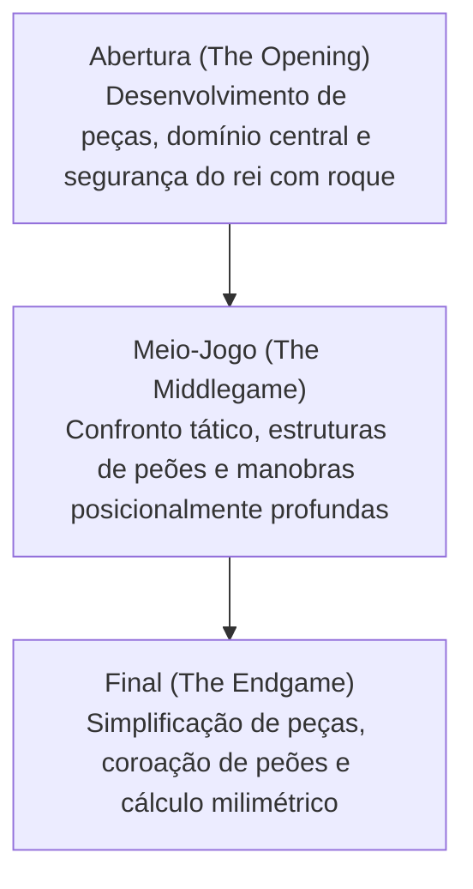

# Jogos de Tabuleiro e IA: Regras do Xadrez, Padrões Estratégicos e de Deep Blue a AlphaZero

Na história da Inteligência Artificial (IA), os jogos de tabuleiro sempre foram considerados a «drosófila da pesquisa em IA»: um ambiente restrito, formal e perfeito para decifrar os mecanismos da inteligência humana e experimentar novos algoritmos. Entre todos os jogos clássicos, o xadrez ocupa a posição mais emblemática. Praticado globalmente por centenas de milhões de pessoas, ele impulsionou marcos determinantes na computação moderna.

Este artigo apresenta os fundamentos do xadrez, a complexidade de sua árvore de jogo, seus padrões estratégicos e a fascinante trajetória que vai das formulações de Claude Shannon à vitória histórica do Deep Blue sobre Garry Kasparov em 1997, culminando no aprendizado profundo do AlphaZero e nos motores neurais híbridos como o Stockfish NNUE.

## 1. Regras Fundamentais e Complexidade do Xadrez

O xadrez é um jogo para dois participantes, de soma zero, finito, determinista e de informação perfeita. O confronto ocorre em um tabuleiro de 64 casas ($8 \times 8$) com cores claras e escuras alternadas. Cada jogador controla um exército de 16 peças (as brancas iniciam o jogo), com o propósito soberano de encurralar o Rei adversário num ataque do qual não haja escapatória: o **xeque-mate (Checkmate)**.

### Tipos de Peças e Vetores de Movimento
O exército é composto por seis peças com mecânicas geométricas exclusivas:
- **Rei (King)**: Move-se uma casa em qualquer direção. Sua captura encerra a partida.
- **Dama / Rainha (Queen)**: A peça mais versátil e poderosa; move-se qualquer número de casas desocupadas em linha reta (fileiras, colunas ou diagonais).
- **Torre (Rook)**: Desloca-se ortogonalmente ao longo de colunas e fileiras.
- **Bispo (Bishop)**: Percorre diagonais, permanecendo vinculado a casas de uma mesma cor durante todo o jogo.
- **Cavalo (Knight)**: Movimenta-se em «L» (duas casas em uma direção e uma perpendicular); é a única peça autorizada a saltar sobre outras.
- **Peão (Pawn)**: Avança uma casa para a frente (duas no lance inaugural) e captura em diagonal. Conta com movimentos especiais como a captura en passant e a promoção ao alcançar a oitava fileira.

### As Três Fases de uma Partida
Uma partida divide-se estruturalmente em três etapas:

1. **Abertura (Opening)**: Mobilização rápida das peças para casas ativas, disputa pelo controle das casas centrais ($d4, e4, d5, e5$) e proteção do Rei via roque. Séculos de prática humana resultaram em extensas enciclopédias de aberturas (códigos ECO).
2. **Meio-Jogo (Middlegame)**: Fase de combate aberto com peças desenvolvidas. Exige a síntese entre visão posicional a longo prazo (estrutura de peões, postos avançados) e golpes táticos imediatos (cravadas, garfos, sacrifícios).
3. **Final (Endgame)**: A maioria das peças foi trocada. A promoção de peões em damas torna-se o fator decisivo, demandando cálculo rigoroso onde um único tempo define a vitória ou o empate.

### Complexidade da Árvore de Jogo: O Número de Shannon

Para compreender a barreira computacional do xadrez, em 1950 Claude Shannon calculou o número aproximado de partidas possíveis, o célebre **Número de Shannon**:

$$ \text{Complexidade da Árvore de Jogo} \approx 10^{120} $$

Por sua vez, a complexidade do espaço de estados (configurações possíveis no tabuleiro) é estimada em:

$$ \text{Complexidade do Espaço de Estados} \approx 10^{43} \sim 10^{47} $$

Em face dos cerca de $10^{80}$ átomos existentes no universo observável, o número de Shannon evidencia que **o xadrez jamais será resolvido por busca exaustiva (força bruta)**. A inteligência computacional precisa podar caminhos inviáveis.

## 2. Padrões Estratégicos e a Intuição Humana

Como os grandes mestres dominam essa complexidade? A psicologia cognitiva comprovou que o segredo reside no **reconhecimento de padrões (Pattern Recognition) e no agrupamento de blocos de informação (Chunking)**.

Grandes mestres não calculam todos os lances legais; eles percebem o tabuleiro em padrões significativos assimilados após anos de estudo. Descartam instantaneamente 98% dos lances e concentram o raciocínio profundo em duas ou três variantes cruciais.

O pensamento enxadrístico envolve:
- **Tática (Tactics)**: Sequências forçadas que buscam ganho material imediato ou xeque-mate (cravadas, garfos, ataques descobertos).
- **Jogo Posicional (Positional Play)**: Planejamento a longo prazo, exploração de debilidades de peões, domínio de colunas abertas e controle do espaço.

Por décadas, o objetivo supremo da IA foi dotar os computadores dessa refinada intuição posicional humana.

## 3. O Impacto do Deep Blue: A Vitória da Força Bruta

Os primeiros motores baseavam-se no **algoritmo Minimax** com **poda alfa-beta (Alpha-Beta Pruning)**, guiados por uma **função de avaliação heurística** manual que atribuía pontos a peças e posicionamentos.

### A Estrutura do Deep Blue
Em maio de 1997, o supercomputador da IBM **Deep Blue** venceu o campeão mundial Garry Kasparov por $3\frac{1}{2} - 2\frac{1}{2}$ em um match de seis partidas.

O trunfo do Deep Blue residia na velocidade de cálculo por força bruta:
- **Hardware Especializado**: Supercomputador IBM RS/6000 SP de 30 nós, equipado com 480 chips VLSI dedicados exclusivamente ao cálculo de xadrez.
- **Velocidade de Busca**: Avaliava mais de **200 milhões de posições por segundo**, calculando de 6 a 8 lances à frente com frequência e até 20 lances em linhas forçadas.
- **Bases de Conhecimento**: Função de avaliação com milhares de parâmetros refinados pelo grande mestre Joel Benjamin, somada a vastas bibliotecas de aberturas e tabelas de finais de 5 peças.

### Significado e Limites
A vitória abalou o mundo, mas tratava-se de um triunfo da engenharia de hardware e da velocidade bruta. O Deep Blue não possuía inteligência adaptativa nem aprendia sozinho.

## 4. Mudança de Paradigma: A Revolução do AlphaZero

Por duas décadas após o Deep Blue, os motores evoluíram na busca alfa-beta tradicional (como o Stockfish). Contudo, em dezembro de 2017, o Google DeepMind apresentou o **AlphaZero**, revolucionando a IA.

Em um match de 100 partidas contra o Stockfish 8, o AlphaZero obteve 28 vitórias, 72 empates e **nenhuma derrota**.

### A Ruptura Algorítmica do AlphaZero
O AlphaZero descartou todo o conhecimento prévio humano:

1. **Aprendizado por Reforço do Zero (Tabula Rasa)**: Não recebeu partidas humanas, livros de abertura ou tabelas de finais; apenas as regras do jogo.
2. **Auto-aprendizado (Self-Play)**: Jogando milhões de partidas contra si mesmo, redescobriu a teoria do xadrez e desenvolveu ideias inéditas.
3. **Rede Neural Profunda Dual**: Uma rede convolucional prevê as melhores jogadas (**Policy**) e avalia as chances de vitória da posição (**Value**).
4. **Busca em Árvore Monte Carlo (MCTS)**: Enquanto o Stockfish 8 avaliava 60 milhões de posições por segundo, o AlphaZero analisava apenas **60.000 posições por segundo**. Guiado por sua intuição neural, calculava seletivamente as linhas mais promissoras, assemelhando-se à intuição humana.

Mestres internacionais ficaram maravilhados com o estilo do AlphaZero, caracterizado pela valorização da atividade das peças em detrimento do apego material, sacrificando peões e peças com audácia em prol de pressão contínua.

## 5. A Era Moderna: A Hibridização com Stockfish NNUE

O AlphaZero provou o valor das redes neurais, mas exigia supercomputadores TPU. A comunidade open-source criou uma solução elegante: a tecnologia **NNUE (Efficiently Updatable Neural Network)**.

Originária do shogi computacional, a arquitetura NNUE foi incorporada ao Stockfish 12 em 2020:
- Substituiu a avaliação heurística manual por uma rede neural leve treinada com centenas de milhões de posições.
- Apoiada em instruções vetoriais de CPUs domésticas, a rede se atualiza em nanossegundos durante a poda alfa-beta, unindo velocidade brutal e intuição posicional profunda.

Hoje, o **Stockfish 16+ NNUE** supera os **3500 pontos de rating Elo**, um patamar inalcançável para seres humanos (onde Magnus Carlsen atingiu o pico de 2882).

## 6. Conclusão: A Coevolução entre Humanos e Inteligência Artificial

A evolução da IA no xadrez partiu de cálculos artesanais, passou pela força bruta e alcançou a autonomia do aprendizado profundo.

Hoje, a máquina não é mais vista como uma rival, mas como uma mentora insubstituível:
- Mestres e campeões mundiais preparam-se diariamente analisando variantes com engines neurais.
- Linhas clássicas foram revitalizadas por manobras pioneiras de peões de torre ($h4/a4$).
- As tecnologias desenvolvidas nas 64 casas do tabuleiro (MCTS, redes neurais e aprendizado por reforço) são aplicadas hoje no desdobramento de proteínas (AlphaFold), na ciência dos materiais e na otimização de redes de suprimentos.

Sobre o tabuleiro de xadrez, a inteligência humana e a artificial continuam enriquecendo-se mutuamente na busca contínua pelo conhecimento.
