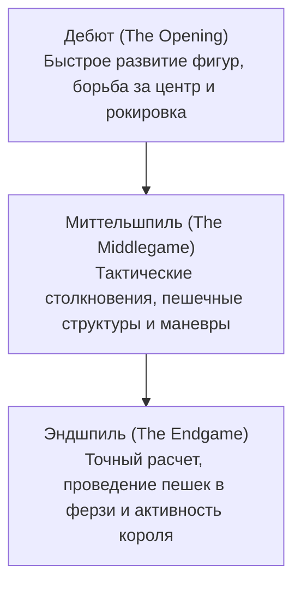

# Настольные игры и ИИ: правила шахмат, стратегические паттерны и эволюция от Deep Blue до AlphaZero

В истории искусственного интеллекта настольные игры издавна называли «дрозофилой исследований ИИ»: замкнутым, строго формализованным полигоном для изучения природы человеческого мышления и проверки новых вычислительных алгоритмов. Среди всех интеллектуальных состязаний шахматы всегда занимали особое место. Будучи одной из самых популярных стратегических игр в мире, шахматы стимулировали важнейшие прорывы в компьютерных науках.

В этой статье мы подробно рассмотрим базовые правила шахмат, сложность дерева игры, ключевые стратегические паттерны, а также весь путь развития шахматного ИИ — от теоретических работ Клода Шеннона и исторической победы суперкомпьютера Deep Blue над Гарри Каспаровым в 1997 году до нейросетевой революции AlphaZero и современных гибридных движков Stockfish NNUE.

## 1. Базовые правила шахмат и сложность игрового дерева

Шахматы представляют собой детерминированную антагонистическую конечную игру с полной информацией для двух игроков. Сражение разворачивается на квадратной доске из 64 клеток ($8 \times 8$), окрашенных в чередующиеся светлые и темные цвета. Каждый соперник командует армией из 16 фигур (белые ходят первыми), а конечная цель состоит в том, чтобы поставить неприятельского короля в безвыходное положение под шахом — то есть объявить **мат (Checkmate)**.

### Фигуры и геометрия ходов
Каждая армия включает шесть видов фигур с уникальной геометрией перемещения:
- **Король (King)**: Ходит на одну клетку в любом направлении. Главная фигура, потеря которой означает поражение.
- **Ферзь (Queen)**: Сильнейшая фигура; перемещается на любое число свободных клеток по вертикалям, горизонталям и диагоналям.
- **Ладья (Rook)**: Перемещается по вертикалям и горизонталям на любое число клеток.
- **Слон (Bishop)**: Ходит только по диагоналям, оставаясь навсегда привязанным к полям одного цвета.
- **Конь (Knight)**: Перемещается буквой «Г» (две клетки в одном направлении и одна под прямым углом); единственная фигура, способная перепрыгивать через другие фигуры.
- **Пешка (Pawn)**: Ходит вперед на одну клетку (первым ходом — на две) и бьет по диагонали. Обладает особыми правилами: взятие на проходе (en passant) и превращение в любую фигуру на восьмой горизонтали.

### Три фазы шахматной партии
Партия естественным образом подразделяется на три стратегических этапа:

1. **Дебют (Opening)**: Начальная стадия, где игроки выводят легкие фигуры на активные позиции, борются за контроль над четырьмя центральными полями ($d4, e4, d5, e5$) и прячут короля с помощью рокировки. Вековой опыт человечества систематизирован в энциклопедиях дебютов (классификация ECO).
2. **Миттельшпиль (Middlegame)**: После завершения развития разгорается основное сражение. Здесь требуется гармоничное сочетание позиционного понимания (слабости полей, пешечные цепи, аванпосты) и конкретной тактической зоркости (связки, вилки, жертвы фигур).
3. **Эндшпиль (Endgame)**: Большинство тяжелых и легких фигур разменяно. Главной целью становится превращение проходных пешек в ферзи. Расчет вариантов должен быть абсолютно точным: потеря одного темпа решает судьбу партии.

### Сложность игрового дерева: число Шеннона

Масштаб вычислительной задачи, стоящей перед разработчиками шахматных программ, демонстрирует оценка общего числа возможных уникальных шахматных партий, вычисленная в 1950 году Клодом Шенноном — **Число Шеннона**:

$$ \text{Сложность игрового дерева} \approx 10^{120} $$

А количество возможных легальных позиций на доске (сложность пространства состояний) оценивается как:

$$ \text{Сложность пространства состояний} \approx 10^{43} \sim 10^{47} $$

В сравнении с общим числом атомов в наблюдаемой Вселенной (около $10^{80}$), число Шеннона доказывает непреложный факт: **шахматы невозможно решить полным перебором всех вариантов (Brute-force)**. Любой успешный ИИ должен уметь отсекать бесперспективные ветви и оценивать позиции.

## 2. Стратегические паттерны и интуиция гроссмейстера

Как же люди-гроссмейстеры справлялись с этим океаном вариантов? Когнитивная психология (Герберт Саймон и др.) доказала, что секрет кроется в **распознавании образов (Pattern Recognition) и структурировании памяти (Chunking)**.

Опытный шахматист не перебирает ходы по отдельности: он мгновенно схватывает позицию целостными смысловыми блоками. Его мозг бессознательно отсекает 98% бессмысленных ходов, направляя расчет лишь на две-три самые перспективные ветви.

Шахматное мастерство опирается на две составляющие:
- **Тактика (Tactics)**: Форсированные приемы, ведущие к материальному выигрышу или мату (связки, двойные удары, вскрытые нападения).
- **Позиционная игра (Positional Play)**: Долгосрочные планы по улучшению пешечной структуры, захвату открытых линий и созданию пространственного перевеса.

На протяжении полувека главной целью ИИ было научить вычислительную машину этой трудноуловимой гроссмейстерской интуиции.

## 3. Удар Deep Blue: торжество грубой вычислительной силы

Первые шахматные программы базировались на **алгоритме минимакс** с **альфа-бета отсечением (Alpha-Beta Pruning)** и вручную составленной **оценочной функции (Evaluation Function)**, начислявшей баллы за материал и позиционные факторы.

### Архитектура Deep Blue
В мае 1997 года суперкомпьютер корпорации IBM **Deep Blue** сотворил мировую сенсацию, победив действующего чемпиона мира Гарри Каспарова в матче из шести партий ($3\frac{1}{2} - 2\frac{1}{2}$).

Основой мощи Deep Blue стал колоссальный параллельный перебор:
- **Специализированное железо**: Суперкомпьютер IBM RS/6000 SP (30 узлов), объединенный с 480 специализированными кремниевыми чипами VLSI, созданными исключительно для расчета шахматных ходов.
- **Скорость перебора**: Анализировал свыше **200 миллионов позиций в секунду**, просчитывая дерево игры на 6–8 полуходов вперед, а в форсированных линиях — глубже 20 ходов.
- **Опыт человека в коде**: Оценочная функция содержала тысячи параметров, настроенных при участии гроссмейстера Джоэля Бенджамина, библиотеку дебютов и 5-фигурные базы эндшпилей.

### Значение и границы победы
Поражение Каспарова вызвало волну споров о превосходстве машин. Однако ученые понимали: Deep Blue не обладал подлинным интеллектом. Он не «понимал» игру и не мог учиться самостоятельно — это был блестящий триумф специализированного инженерного расчета.

## 4. Смена парадигмы: триумф AlphaZero

Два десятилетия после Deep Blue шахматные программы шли по пути совершенствования альфа-бета поиска на процессорах общего назначения. Но в декабре 2017 года лаборатория Google DeepMind представила **AlphaZero**, перевернув представления об ИИ.

В матче из 100 партий против сильнейшего классического движка Stockfish 8 AlphaZero одержал безоговорочную победу: 28 побед, 72 ничьи и **ноль поражений**.

### Алгоритмический прорыв AlphaZero
AlphaZero порвал с традиционными методами:

1. **Обучение с чистого листа (Tabula Rasa)**: Никаких дебютных книг, эндшпильных таблиц и баз гроссмейстерских партий — только базовые правила перемещения фигур.
2. **Самообучение (Self-Play)**: Начав со случайных ходов, система играла сама с собой миллионы партий, постигая стратегию методом глубокого обучения с подкреплением (Reinforcement Learning).
3. **Двухголовая глубокая нейросеть**: Единая глубокая сверточная сеть одновременно генерирует оценку лучших ходов (**Policy**) и вероятность победы в текущей позиции (**Value**).
4. **Поиск по дереву Монте-Карло (MCTS)**: Stockfish 8 рассчитывал 60 миллионов позиций в секунду, а AlphaZero анализировал всего **60 000 позиций в секунду**. Руководствуясь нейросетевой интуицией, он исследовал только самые важные ветви, имитируя мышление гроссмейстера.

Стиль игры AlphaZero поразил шахматный мир. Чемпионы описывали его партии как «игру инопланетного гения»: машина пренебрегала материалом ради долгосрочной активности фигур и тотального удушения позиции соперника.

## 5. Современная гибридизация: появление Stockfish NNUE

AlphaZero продемонстрировал превосходство нейросетей, однако требовал мощнейших вычислительных кластеров TPU. Шахматное опенсорс-сообщество ответило гениальным решением: архитектурой **NNUE (Efficiently Updatable Neural Network)**.

Технология NNUE, пришедшая из японских шахмат сеги, была внедрена в Stockfish 12 в 2020 году:
- Она заменила эвристическую формулу оценки компактной нейросетью, обученной на миллиардах позиций.
- Благодаря векторным инструкциям процессора сеть обновляется за наносекунды во время альфа-бета поиска, объединяя глубину классического перебора с нейросетевым позиционным чутьем.

Сегодня **Stockfish 16+ NNUE** имеет рейтинг Эло выше **3500 пунктов**, находясь на недосягаемой для человека высоте (исторический рекорд Магнуса Карлсена — 2882).

## 6. Заключение: коэволюция человека и машины

История шахматного ИИ прошла путь от формализации логики к грубой силе суперкомпьютеров и, наконец, к глубокому самообучению.

Сегодня ИИ стал для шахматистов незаменимым наставником:
- Все гроссмейстеры используют нейросетевые движки для анализа новинок и поиска скрытых ресурсов.
- Смелые ходы пешками на флангах ($h4/a4$), возрожденные ИИ, обогатили старинные дебюты.
- Алгоритмы, отточенные на шахматной доске (MCTS, глубокое обучение с подкреплением), сегодня спасают жизни в предсказании структуры белков (AlphaFold), разработке лекарств и управлении плазмой в термоядерных реакторах.

На древней доске из 64 клеток продолжается великий диалог между человеческим разумом и машинным интеллектом.
