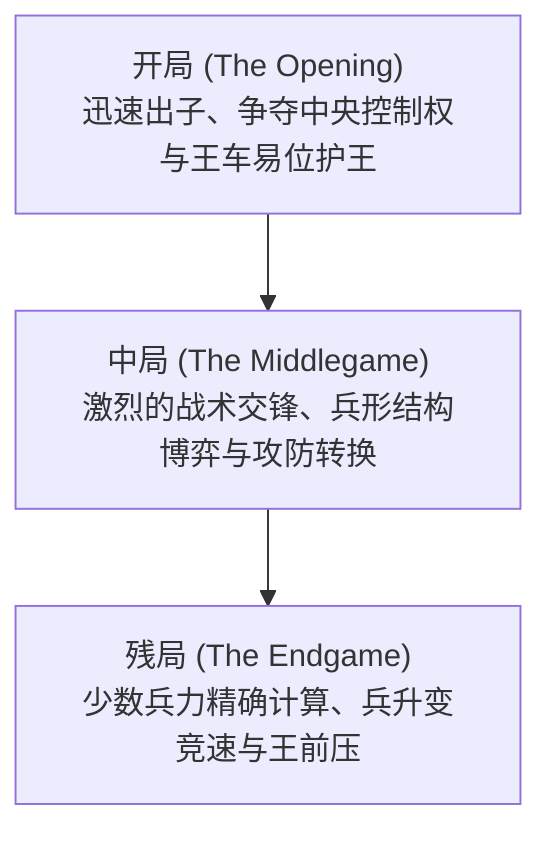

# 棋类博弈与AI：国际象棋规则、战略模式与从深蓝到AlphaZero的演进

在人工智能（AI）波澜壮阔的研究史中，棋类博弈长期以来被科学家誉为“人工智能领域的果蝇”——它是破译人类智慧机制、验证全新算法最理想的封闭实验场。而在所有经典博弈中，国际象棋（Chess）无疑占据着至高无上的地位。作为全球普及度最高的智力竞技之一，国际象棋在整部AI发展史中扮演了举足轻重的标杆角色。

本文将系统梳理国际象棋的基本规则、复杂度模型与深层战略模式，并全景式回顾从1997年击败人类世界冠军的IBM“深蓝（Deep Blue）”，到掀起深度强化学习革命的“AlphaZero”，再到当代一统棋坛的“Stockfish NNUE”的演进全貌。

## 1. 国际象棋基本规则与博弈树复杂度

国际象棋是一项双人对弈的零和、有限、确定性、完全信息博弈。对局在由黑白相间的 $8 \times 8$ 共64个方格构成的棋盘上展开。对弈双方各执16枚棋子（白方先行，黑方后行），其终极目标是通过严密协同将对手的“王”置于无路可逃的绝境——即 **将死（Checkmate）** 。

### 兵种类型与移动机制
棋盘上的棋子分为六大兵种，各具独特的几何行棋向量：
- **王（King）** ：向周围任意方向移动一格。全军的核心，被将死即宣告对局终结。
- **后（Queen）** ：威力最强的棋子，可横、竖、斜任意方向不限格数移动。
- **车（Rook）** ：可沿横向行和竖向列任意行进不限格数。
- **象（Bishop）** ：沿斜线任意方向不限格数行进，终生被锁定在单一颜色的格子内。
- **马（Knight）** ：走“日”字型（先向一个方向走两格，再转垂直方向走一格），是全盘唯一能越过其他棋子的奇兵。
- **兵（Pawn）** ：每次只能向前直进一格（第一步可选择走两格），斜向吃子。拥有“过路兵（En Passant）”及到达底线后的“升变（Promotion）”等特殊战术机制。

### 对局的三大阶段
一盘标准的国际象棋通常清晰地划分为三个战略发展阶段：

1. **开局（Opening）** ：将棋子从初始格子快速展开到有利位置，争夺中央核心四格（$d4, e4, d5, e5$）的控制权，并通过“王车易位”确保王的安全。人类数百年积累的开局定式被编纂为庞大的百科全书（ECO系统）。
2. **中局（Middlegame）** ：出子完毕后爆发的大规模交火阶段。该阶段极度考验棋手宏观战略（兵形、弱格、前哨据点）与局部战术手筋（牵制、双重打击、弃子攻王）的融会贯通。
3. **残局（Endgame）** ：盘面大部分重子被兑换离场。此时“兵的升变”成为决定胜负的生命线，步数计算要求绝对精确，一拍之差便定胜负。

### 状态空间复杂度：香农数

为了直观理解国际象棋对早期计算机所构成的计算噩梦，数学家克劳德·香农在1950年估算出了国际象棋所有可能博弈路径的数量，即著名的 **香农数（Shannon Number）** ：

$$ \text{博弈树复杂度} \approx 10^{120} $$

而所有合法盘面状态的空间复杂度大约估算为：

$$ \text{状态空间复杂度} \approx 10^{43} \sim 10^{47} $$

对比目前物理学估计的可观测宇宙中的原子总数（约为 $10^{80}$），香农数堪称天文数字。这意味着： **任何计算机都不可能通过全排列暴力穷举来破解国际象棋** 。智能算法必须学会如何高效“剪枝”与“评估”。

## 2. 战略模式与人类特级大师的直觉

面对天文数字般的计算量，人类国际象棋特级大师是如何思考的？认知心理学揭示其核心在于 **模式识别（Pattern Recognition）与组块化记忆（Chunking）** 。

大师在审视棋盘时，并不像机器那样逐格遍历所有走法，而是凭借数以万计对局提炼的直觉，将复杂的棋盘瞬间解构为具有特定战术意图的“块”。他们一眼就能过滤掉98%以上的平庸走法，只将全部心智聚焦在两三条最致命的深远分支上。

国际象棋的思维由两个维度交织而成：
- **战术（Tactics）** ：牵制（Pin）、闪击（Discovered Attack）、双击（Fork）、偏转等强制性连珠妙手，追求立竿见影的得子或绝杀。
- **战略与位置走法（Positional Play）** ：兵链结构、重子开放线、双象优势、空间压迫等长线布局优势。

在长达半个世纪的AI研究中，如何让冷冰冰的代码拥有人类特级大师这种玄妙的“大局观直觉”，成为了科研人员攻坚的最高圣杯。

## 3. 深蓝的震撼：算力碾压人类历史的一天

早期的国际象棋程序依赖于 **极小化极大算法（Minimax）** 与 **阿尔法-贝塔剪枝（Alpha-Beta Pruning）** ，配合人工精心编写的 **评估函数（Evaluation Function）** 来量化盘面优劣。

### 深蓝的硬核架构
1997年5月，由IBM研发的超级计算机 **深蓝（Deep Blue）** 在六局对抗赛中以 $3\frac{1}{2} - 2\frac{1}{2}$ 彻底击败了当时公认的人类历史最强世界冠军加里·卡斯帕罗夫（Garry Kasparov），制造了震撼全球的科技大事件。

深蓝制胜的核心武器是登峰造极的“超级并行暴力计算”：
- **专用芯片矩阵** ：由一台30节点的IBM RS/6000 SP超级计算机与480块专门针对国际象棋硬件优化的专用VLSI芯片紧密协同。
- **惊人计算速度** ：每秒可精密评估 **2亿步局势** ，能够稳健前瞻6〜8回合，在复杂战术局面下可深入推演至20回合以上。
- **大师级专家库** ：评估函数内置了特级大师乔尔·本杰明等人参与编写的数千条启发式参数，并加载了涵盖数十万局的大师开局库与5子完美残局库。

### 胜利的历史意义与局限
卡斯帕罗夫的落败引发了全球舆论关于“机器超越人类智能”的惊呼。然而从AI算法的本质来看，深蓝是 **“超强硬件算力”与“人类大师知识库编码”** 的极度堆砌。深蓝并不理解国际象棋，也无法自学进化，它的胜利标志着传统暴力搜索路线的巅峰，却也暴露了传统AI的创造力瓶颈。

## 4. 范式转移：AlphaZero的神迹

深蓝之后整整二十年，国际象棋引擎在CPU算法与剪枝技术上持续演进。然而2017年12月，Google DeepMind发布的 **AlphaZero** 彻底重写了棋类人工智能的底层逻辑。

在与当时全球公认最强的传统开源国际象棋引擎Stockfish 8进行的百局对抗赛中，AlphaZero以28胜72平0负的碾压级战绩完胜。

### AlphaZero的核心颠覆性
AlphaZero与深蓝及传统引擎存在本质上的范式鸿沟：

1. **白板起步与强化学习（Tabula Rasa）** ：AlphaZero没有被灌注任何人类特级大师的棋谱、定式或开局残局数据库，系统被赋予的仅仅是最纯粹的游戏规则。
2. **纯自我对弈演化** ：从完全随机乱走开始，AlphaZero通过自我博弈数百万局，依靠强化学习在虚空之中自我领悟了人类耗费上千年才总结出的全部棋理，甚至开辟了崭新的现代战术领域。
3. **双头深度神经网络** ：单一的大型深度卷积神经网络同时输出 **策略分布（Policy，直觉指引下一步走法）** 与 **价值评估（Value，当前盘面胜率估值）** 。
4. **蒙特卡洛树搜索（MCTS）** ：传统引擎Stockfish 8每秒计算6000万步，而AlphaZero每秒仅搜索约 **6万步** 。它将绝大部分算力集中在极少数最符合直觉的核心主干上，其思考方式无限逼近人类大师的“大局观直觉”。

特级大师们在复盘AlphaZero的棋局时惊叹其“如来自外星的棋艺”：它极度看重棋子的机动性与空间控制，经常不计成本地连续弃兵甚至弃子，以换取对对手防线的绝对窒息。

## 5. 当代AI的混合进化：Stockfish NNUE的崛起

AlphaZero展现了神经网络评估的绝对优势，但它依赖昂贵的Google TPU超级计算集群，无法在普通家用电脑上普及。为此，国际象棋开源社区发起了另一场革命： **NNUE（高效可更新神经网络，Efficiently Updatable Neural Network）** 。

NNUE最初诞生于日本将棋AI领域，随后在2020年被正式引入Stockfish 12。

这一架构实现了传统与前沿的完美杂交：
- 彻底废弃了以往手工调优的代码评估函数，取而代之的是一个在数亿局棋谱上训练出来的高效浅层神经网络；
- 该网络高度适配CPU指令集，能在深度Alpha-Beta剪枝搜索时实现毫秒级增量更新，既拥有千亿步的搜索吞吐量，又具备了接近深度学习的宏观大局观。

如今搭载NNUE的 **Stockfish 16+** 的对弈Elo等级分已突破 **3500分** ，将人类顶尖棋手（卡尔森等级分约2880分）远远甩在身后。

## 6. 结语：AI与人类的共生进化

国际象棋的人工智能演进史，是人类试图将自身逻辑机械化、经由暴力计算征服、最终走向自律学习的壮丽史诗。

如今，AI在国际象棋界已经从“战胜人类的冷酷对手”彻底转变为“启迪人类的智慧导师”：
- **棋艺研究的颠覆** ：当今世界特级大师无一例外地使用神经网络引擎进行日常开局推演与赛后复盘；
- **古典理论的复兴** ：AI打破了传统教条，使许多沉寂百年的偏门开局（如冲边兵策略）重放异彩；
- **技术溢出赋能人类现实** ：在棋盘上磨砺成熟的蒙特卡洛树搜索、强化学习与神经网络架构，如今正广泛应用于蛋白质结构预测（AlphaFold）、芯片自动化设计、物流全局调度与受控核聚变控制。

在这片由64个黑白方格构筑的古老天地中，人类理性与机器智能展开了一场跨越半个世纪的交响乐，共同谱写着探索未知智慧的无尽篇章。
