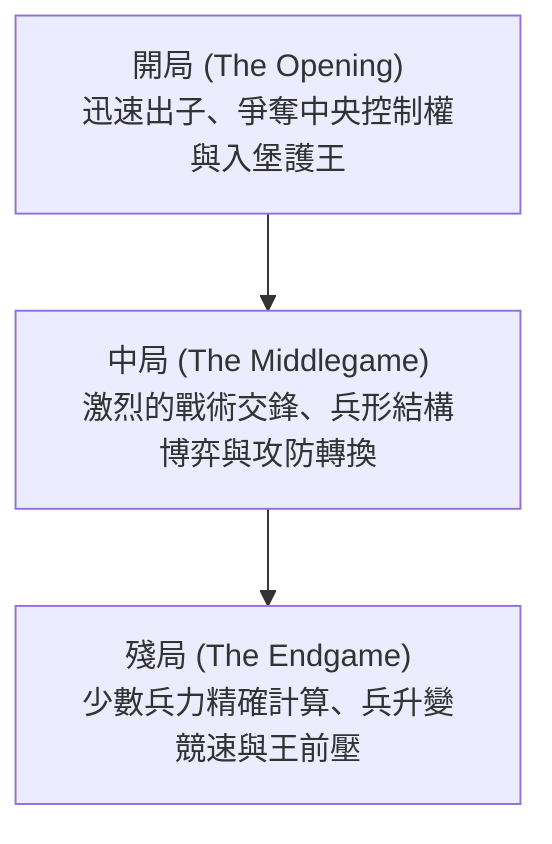

# 棋類博弈與AI：西洋棋規則、戰略模式與從深藍到AlphaZero的演進

在人工智慧（AI）波瀾壯闊的研究史中，棋類博弈長期以來被科學家譽為「人工智慧領域的果蠅」——它是破譯人類智慧機制、驗證全新演算法最理想的封閉實驗場。而在所有經典博弈中，西洋棋（Chess）無疑佔據著至高無上的地位。作為全球普及度最高的智力競技之一，西洋棋在整部AI發展史中扮演了舉足輕重的標竿角色。

本文將系統梳理西洋棋的基本規則、複雜度模型與深層戰略模式，並全景式回顧從1997年擊敗人類世界冠軍的IBM「深藍（Deep Blue）」，到掀起深度強化學習革命的「AlphaZero」，再到當代一統棋壇的「Stockfish NNUE」的演進全貌。

## 1. 西洋棋基本規則與博弈樹複雜度

西洋棋是一項雙人對弈的零和、有限、確定性、完全資訊博弈。對局在由黑白相間的 $8 \times 8$ 共64個方格構成的棋盤上展開。對弈雙方各執16枚棋子（白方先行，黑方後行），其終極目標是透過嚴密協同將對手的「國王」置於無路可逃的絕境——即 **將死（Checkmate）** 。

### 兵種類型與移動機制
棋盤上的棋子分為六大兵種，各具獨特的幾何行棋向量：
- **國王（King）** ：向周圍任意方向移動一格。全軍的核心，被將死即宣告對局終結。
- **皇后（Queen）** ：威力最強的棋子，可橫、豎、斜任意方向不限格數移動。
- **城堡/車（Rook）** ：可沿橫向行和豎向列任意行進不限格數。
- **主教/象（Bishop）** ：沿斜線任意方向不限格數行進，終生被鎖定在單一顏色的格子內。
- **騎士/馬（Knight）** ：走「日」字型（先向一個方向走兩格，再轉垂直方向走一格），是全盤唯一能越過其他棋子的奇兵。
- **小兵（Pawn）** ：每次只能向前直進一格（第一步可選擇走兩格），斜向吃子。擁有「吃過路兵（En Passant）」及到達底線後的「升變（Promotion）」等特殊戰術機制。

### 對局的三大階段
一盤標準的西洋棋通常清晰地劃分為三個戰略發展階段：

1. **開局（Opening）** ：將棋子從初始格子快速展開到有利位置，爭奪中央核心四格（$d4, e4, d5, e5$）的控制權，並透過「入堡」確保國王的安全。人類數百年積累的開局定式被編纂為龐大的百科全書（ECO系統）。
2. **中局（Middlegame）** ：出子完畢後爆發的大規模交火階段。該階段極度考驗棋手宏觀戰略（兵形、弱格、前哨據點）與局部戰術手筋（牽制、雙重打擊、棄子攻王）的融會貫通。
3. **殘局（Endgame）** ：盤面大部分重子被兌換離場。此時「兵的升變」成為決定勝負的生命線，步數計算要求絕對精確，一拍之差便定勝負。

### 狀態空間複雜度：香農數

為了直觀理解西洋棋對早期電腦所構成的計算噩夢，數學家克勞德·香農在1950年估算出了西洋棋所有可能博弈路徑的數量，即著名的 **香農數（Shannon Number）** ：

$$ \text{博弈樹複雜度} \approx 10^{120} $$

而所有合法盤面狀態的空間複雜度大約估算為：

$$ \text{狀態空間複雜度} \approx 10^{43} \sim 10^{47} $$

對比目前物理學估計的可觀測宇宙中的原子總數（約為 $10^{80}$），香農數堪稱天文數字。這意味著： **任何電腦都不可能透過全排列暴力窮舉來破解西洋棋** 。智慧演算法必須學會如何高效「剪枝」與「評估」。

## 2. 戰略模式與人類特級大師的直覺

面對天文數字般的計算量，人類西洋棋特級大師是如何思考的？認知心理學揭示其核心在於 **模式識別（Pattern Recognition）與組塊化記憶（Chunking）** 。

大師在審視棋盤時，並不項機器那樣逐格遍歷所有走法，而是憑藉數以萬計對局提煉的直覺，將複雜的棋盤瞬間解構為具有特定戰術意圖的「塊」。他們一眼就能過濾掉98%以上的平庸走法，只將全部心智聚焦在兩三條最致命的深遠分支上。

西洋棋的思維由兩個維度交織而成：
- **戰術（Tactics）** ：牽制（Pin）、閃擊（Discovered Attack）、雙擊（Fork）、偏轉等強制性連珠妙手，追求立竿見影的得子或絕殺。
- **戰略與位置走法（Positional Play）** ：兵鏈結構、重子開放線、雙象優勢、空間壓迫等長線佈局優勢。

在長達半個世紀的AI研究中，如何讓冷冰冰的程式碼擁有人類特級大師這種玄妙的「大局觀直覺」，成為了科研人員攻堅的最高聖杯。

## 3. 深藍的震撼：算力碾壓人類歷史的一天

早期的西洋棋程式依賴於 **極小化極大演算法（Minimax）** 與 **阿爾法-貝塔剪枝（Alpha-Beta Pruning）** ，配合人工精心編寫的 **評估函數（Evaluation Function）** 來量化盤面優劣。

### 深藍的硬核架構
1997年5月，由IBM研發的超級電腦 **深藍（Deep Blue）** 在六局對抗賽中以 $3\frac{1}{2} - 2\frac{1}{2}$ 徹底擊敗了當時公認的人類歷史最強世界冠軍加里·卡斯帕羅夫（Garry Kasparov），製造了震撼全球的科技大事件。

深藍制勝的核心武器是登峰造極的「超級並行暴力計算」：
- **專用晶片矩陣** ：由一台30節點的IBM RS/6000 SP超級電腦與480塊專門針對西洋棋硬體最佳化的專用VLSI晶片緊密協同。
- **驚人計算速度** ：每秒可精密評估 **2億步局勢** ，能夠穩健前瞻6〜8回合，在複雜戰術局面下可深入推演至20回合以上。
- **大師級專家庫** ：評估函數內建了特級大師喬爾·本傑明等人參與編寫的數千條啟發式參數，並載入了涵蓋數十萬局的大師開局庫與5子完美殘局庫。

### 勝利的歷史意義與局限
卡斯帕羅夫的落敗引發了全球輿論關於「機器超越人類智慧」的驚呼。然而從AI演算法的本質來看，深藍是 **「超強硬體算力」與「人類大師知識庫編碼」** 的極度堆砌。深藍並不理解西洋棋，也無法自學進化，它的勝利標誌著傳統暴力搜尋路線的巔峰，卻也暴露了傳統AI的創造力瓶頸。

## 4. 範式轉移：AlphaZero的神蹟

深藍之後整整二十年，西洋棋引擎在CPU演算法與剪枝技術上持續演進。然而2017年12月，Google DeepMind發布的 **AlphaZero** 徹底重寫了棋類人工智慧的底層邏輯。

在與當時全球公認最強的傳統開源西洋棋引擎Stockfish 8進行的百局對抗賽中，AlphaZero以28勝72平0負的輾壓級戰績完勝。

### AlphaZero的核心顛覆性
AlphaZero與深藍及傳統引擎存在本質上的範式鴻溝：

1. **白板起步與強化學習（Tabula Rasa）** ：AlphaZero沒有被灌注任何人類特級大師的棋譜、定式或開局殘局資料庫，系統被賦予的僅僅是最純粹的遊戲規則。
2. **純自我對弈演化** ：從完全隨機亂走開始，AlphaZero透過自我博弈數百萬局，依靠強化學習在虛空之中自我領悟了人類耗費上千年才總結出的全部棋理，甚至開闢了嶄新的現代戰術領域。
3. **雙頭深度神經網路** ：單一的大型深度卷積神經網路同時輸出 **策略分布（Policy，直覺指引下一步走法）** 與 **價值評估（Value，當前盤面勝率估值）** 。
4. **蒙地卡羅樹搜尋（MCTS）** ：傳統引擎Stockfish 8每秒計算6000萬步，而AlphaZero每秒僅搜尋約 **6萬步** 。它將絕大部分算力集中在極少數最符合直覺的核心主幹上，其思考方式無限逼近人類大師的「大局觀直覺」。

特級大師們在覆盤AlphaZero的棋局時驚嘆其「如來自外星的棋藝」：它極度看重棋子的機動性與空間控制，經常不計成本地連續棄兵甚至棄子，以換取對對手防線的絕對窒息。

## 5. 當代AI的混合進化：Stockfish NNUE的崛起

AlphaZero展現了神經網路評估的絕對優勢，但它依賴昂貴的Google TPU超級計算集群，無法在普通家用電腦上普及。為此，西洋棋開源社群發起了另一場革命： **NNUE（高效可更新神經網路，Efficiently Updatable Neural Network）** 。

NNUE最初誕生於日本將棋AI領域，隨後在2020年被正式引入Stockfish 12。

這一架構實現了傳統與前沿的完美雜交：
- 徹底廢棄了以往手工調優的程式碼評估函數，取而代之的是一個在數億局棋譜上訓練出來的高效淺層神經網路；
- 該網路高度適配CPU指令集，能在深度Alpha-Beta剪枝搜尋時實現毫秒級增量更新，既擁有千億步的搜尋吞吐量，又具備了接近深度學習的宏觀大局觀。

如今搭載NNUE的 **Stockfish 16+** 的對弈Elo等級分已突破 **3500分** ，將人類頂尖棋手（卡爾森等級分約2880分）遠遠甩在身後。

## 6. 結語：AI與人類的共生進化

西洋棋的人工智慧演進史，是人類試圖將自身邏輯機械化、經由暴力計算征服、最終走向自律學習的壯麗史詩。

如今，AI在西洋棋界已經從「戰勝人類的冷酷對手」徹底轉變為「啟迪人類的智慧導師」：
- **棋藝研究的顛覆** ：當今世界特級大師無一例外地使用神經網路引擎進行日常開局推演與賽後覆盤；
- **古典理論的復興** ：AI打破了傳統教條，使許多沉寂百年的偏門開局（如衝邊兵策略）重放異彩；
- **技術溢出賦能人類現實** ：在棋盤上磨礪成熟的蒙地卡羅樹搜尋、強化學習與神經網路架構，如今正廣泛應用於蛋白質結構預測（AlphaFold）、晶片自動化設計、物流全局調度與受控核融合控制。

在這片由64個黑白方格構築的古老天地中，人類理性與機器智慧展開了一場跨越半個世紀的交響樂，共同譜寫著探索未知智慧的無盡篇章。
