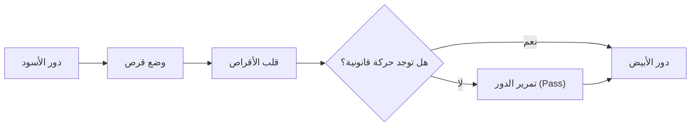

# ألعاب الألواح والذكاء الاصطناعي: قواعد عطيل (أوثيلو)، الأنماط الاستراتيجية، والمسار نحو الحل الكامل

"دقيقة لتتعلمها، وعمر كامل لتتقنها (A minute to learn, a lifetime to master)" — يجسد هذا الشعار الشهير جوهر لعبة **عطيل** (Othello / ريفيرسي)، إحدى أشهر ألعاب الألواح الاستراتيجية في العالم. بفضل رقعة تتألف من 8x8 مربعات و64 قرصاً ملوناً بالأبيض والأسود، تبدو بنيتها في غاية البساطة، إلا أن التنوع التكتيكي الهائل الذي تنتجه قد أسر العقول والمفكرين لأكثر من قرن.

ومع التطور المتسارع في أبحاث الذكاء الاصطناعي (AI)، باتت لعبة عطيل، إلى جانب الشطرنج والشوغي والغو، معياراً أساسياً لاختبار خوارزميات البحث والاستدلال المنطقي. نتناول في هذا المقال التعقيد الرياضي للعبة عطيل، والأنماط الاستراتيجية الجوهرية التي طورها أبطال اللعبة ومحركات الحاسوب، إضافة إلى الإنجاز التاريخي المزلزل في عام 2023: الحل الرياضي الكامل للعبة.

## 1. قواعد عطيل وتعقيد شجرة اللعبة

تتميز قواعد لعبة عطيل بالوضوح والسهولة. يتناوب لاعبان، الأسود والأبيض، على وضع الأقراص على الرقعة. عند وضع قرص، يجب أن يحصر صفاً مستمراً (أفقياً أو عمودياً أو قطرياً) من أقراص الخصم بين القرص الجديد وقرص آخر من نفس اللون، لتنقلب الأقراص المحصورة وتتحول إلى لون اللاعب الحالي. تنتهي اللعبة عند امتلاء الرقعة أو عجز كلا اللاعبين عن القيام بحركات قانونية، ويفوز من يملك أكبر عدد من الأقراص.

خلف هذه القواعد البسيطة يكمن فضاء رياضي فلكي. في نظرية الألعاب التوافقية، يُقاس حجم اللعبة بمعيارين أساسيين: **تعقيد فضاء الحالات** (State-space complexity) و**تعقيد شجرة اللعبة** (Game-tree complexity).

في عطيل، يُقدر عدد الوضعيات القانونية المحتملة على الرقعة (تعقيد فضاء الحالات) بنحو $10^{28}$. أما إجمالي المسارات الممكنة من البداية وحتى نهاية المباراة (تعقيد شجرة اللعبة) فيصل إلى حوالي $10^{58}$.

$$
\text{تعقيد شجرة اللعبة} \approx 10^{58}
$$

ورغم أن هذا الرقم أقل من تعقيد الشطرنج (نحو $10^{123}$) والغو (نحو $10^{360}$)، فإنه يظل رقماً خيالياً يستحيل فحصه بالقوة الغاشمة (Brute-force) حتى باستخدام أقوى الحواسيب الفائقة الحديثة. ولهذا انصب تركيز أبحاث الذكاء الاصطناعي لعقود على تقليص فضاء البحث وتطوير دوال تقييم غاية في الدقة.

## 2. تاريخ وتطور الذكاء الاصطناعي في عطيل

بدأت الأبحاث البرمجية للعبة عطيل في أواخر سبعينيات القرن العشرين. اعتمدت البرامج الأولى على خوارزميات البحث التنافسي الكلاسيكية: **خوارزمية ميني ماكس** (Minimax algorithm) المدعومة بـ **تقليم ألفا-بيتا** (Alpha-beta pruning).

### خوارزمية ميني ماكس وتقليم ألفا-بيتا
تفترض خوارزمية ميني ماكس أن الخصم سيختار دائماً الرد الأمثل الذي يقلل من مكاسب اللاعب الحالي. ولمواجهة الانفجار التوافقي للأفرع عند التعمق في الحساب، يقوم تقليم ألفا-بيتا بإلغاء الفروع التي ثبت رياضياً أنها لن تؤثر على القرار النهائي، مما يضاعف عمق البحث الفعلي للحاسوب.

### تطور دوال التقييم
كانت صياغة **دالة التقييم** (Evaluation function) عاملاً حاسماً يضاهي محرك البحث في الأهمية. اعتمدت البرامج المبكرة على استدلالات أولية مثل إحصاء عدد الأقراص أو منح قيم ثابتة للمربعات الاستراتيجية (كالزوايا).

وفي التسعينيات، أحدث التعلم الآلي قفزة نوعية عبر جداول الأنماط (Pattern tables). حيث تمكنت البرامج من تقييم التكوينات المحلية للأقراص على الحواف والأقطار عبر تحليل ملايين المباريات التاريخية وجلسات اللعب الذاتي. وفي عام 1997، حقق برنامج **Logistello** للمطور مايكل بورو إنجازاً تاريخياً بسحقه بطل العالم البشري آنذاك تاكيشي موراكامي بنتيجة 6–0.

## 3. الأنماط الاستراتيجية العميقة في عطيل

توصل كبار اللاعبين ومحركات الذكاء الاصطناعي إلى استراتيجيات راسخة تؤكد أن الفوز لا يعتمد على قلب أكبر عدد من الأقراص في البداية، بل على التحكم الموضعي والمكاني:

### 1. السيطرة على الزوايا و«الأقراص المستقرة»
القاعدة الذهبية في عطيل هي الاستيلاء على الزوايا الأربع. فالقرص الذي يستقر في الزاوية لا يمكن قلبه نهائياً حتى نهاية اللعبة، وتسمى هذه **الأقراص المستقرة** (Stable discs). وتتيح الزاوية مد سلاسل محمية على طول حواف الرقعة لبناء أفضلية ساحقة.

### 2. إدارة الحركية والخيارات (Mobility)
في منتصف اللعبة، تصبح **الحركية** (عدد النقلات القانونية المتاحة) المعيار الأهم. المبدأ الأساسي هو: "حافظ على خياراتك واسعة واضغط لتقليص خيارات الخصم". وعندما تنفد المربعات الآمنة أمام الخصم، يقع في موقف "تسوغ تسفانغ" (Zugzwang)، ويضطر للعب نقلات كارثية تمنحك الزوايا والحواف.

### 3. المربعات الخطيرة: مربعات X ومربعات C
المربعات المجاورة قطرياً للزاوية تسمى **مربعات X**، وتلك المجاورة للزاوية على الحافة تسمى **مربعات C**. اللعب المبكر في هذه المربعات يمنح الخصم فرصة ذهبية للاستيلاء على الزاوية. يتجنبها المبتدئون دائماً، بينما يستخدمها الخبراء والذكاء الاصطناعي أحياناً كتضحيات تكتيكية مدروسة لشل حركة الخصم.

### 4. التكافؤ (نظرية المساحات الزوجية - Parity)
في نهاية اللعبة، يحسم **التكافؤ** (Parity) النتيجة. تنقسم المربعات الفارغة المتبقية إلى مناطق معزولة. إذا ضمن اللاعب أن تحتوي المنطقة على عدد زوجي من المربعات الفارغة ولعب دائماً رداً على خصمه في تلك المنطقة، فإنه يضمن لعب النقلة الأخيرة فيها، مما يمنحه كسباً كبيراً ومستقراً للأقراص.

## 4. الإنجاز التاريخي لعام 2023: الحل الرياضي الكامل لعطيل

ظل السؤال الأكبر في نظرية الألعاب لعقود دون إجابة: إذا لعب الطرفان بأعلى درجات الدقة والكمال الرياضي من الحركة الأولى، فما هي النتيجة الحتمية لعطيل؟ فوز الأسود، فوز الأبيض، أم التعادل؟

في عام 2023، أعلن الباحث الياباني **هيروكي تاكيزاوا** (Hiroki Takizawa) في ورقة بحثية رائدة إثباتاً رياضياً قاطعاً: **لعبة عطيل محلولة حلاً ضعيفاً (Weakly solved)؛ وعند اللعب المثالي من كلا الجانبين، تنتهي اللعبة حتماً بالتعادل (32–32)**.

### المنهجية الحاسوبية للإثبات
لم يكن حل شجرة لعبة بحجم $10^{58}$ نتيجة للحساب العشوائي، بل اعتمد على نسخة فائقة التحسين من المحرك المفتوح المصدر **Edax**، مدمجة مع:
1. **تقليم ألفا-بيتا الموجه بجداول الأنماط**: ترتيب النقلات بدقة أتاح قطع مليارات الأفرع غير المجدية مبكراً.
2. **محللات نهايات فائقة السرعة**: مكنت تقنيات لوحات البت (Bitboards) من حساب الحركات الختامية بدقة متناهية وفي أجزاء من الثانية بمجرد أن يتبقى أقل من 30 مربعاً فارغاً.
3. **الحوسبة السحابية الموزعة**: عملت مجموعات الخوادم الضخمة لشهور طويلة للتحقق المنهجي من جميع تفريعات الافتتاحيات.

### مراتب حل الألعاب في نظرية الألعاب
تُصنف الألعاب المحلولة إلى ثلاث مراتب:
- **محلولة حلاً فائق الضعف (Ultra-weakly solved)**: معرفة النتيجة النهائية (فوز أو خسارة أو تعادل) رياضياً دون توفير شجرة النقلات.
- **محلولة حلاً ضعيفاً (Weakly solved)**: توفير خوارزمية أو شجرة نقلات كاملة تضمن النتيجة النظرية بدءاً من الموقف الافتتاحي.
- **محلولة حلاً قوياً (Strongly solved)**: القدرة على حساب أفضل حركة والنتيجة الحتمية من أي وضعية قانونية في زمن قياسي.

يُعد إنجاز تاكيزاوا **حلاً ضعيفاً** لعطيل، وهو أكبر إنجاز لألعاب الألواح العالمية منذ أن قام فريق جوناثان شيفر بحل لعبة الداما (Checkers) في عام 2007.

## 5. مستقبل الذكاء الاصطناعي وألعاب التفكير

إن حقيقة انتهاء عطيل بالتعادل النظري لا تنقص قيد أنملة من سحر اللعبة وشغف ممارستها. فبالنسبة للعقل البشري، يظل فضاء اللعبة لا نهائياً، وتظل المنافسات التكتيكية حافلة بالمتعة والإثارة.

علاوة على ذلك، فإن التقنيات التي صُقلت لحل عطيل — تقليص أشجار البحث، الحسابات البتية، وجدولة الحوسبة الموزعة — تسهم اليوم بشكل مباشر في حل المشكلات الصناعية المعقدة، مثل تحسين المسارات اللوجستية، واكتشاف الأدوية الكيميائية، وتدقيق أنظمة الحوسبة الكمومية.

تظل رقعة عطيل ذات الـ 64 مربعاً شاهداً خالداً على اللقاء الرائع بين حدس العقل البشري وقوة الدقة الرياضية للذكاء الاصطناعي.

---

*المراجع*
- Takizawa, H. (2023). "Othello is Solved". arXiv preprint arXiv:2310.19387.
- Buro, M. (1997). "The Othello Match of the Year: Takeshi Murakami vs. Logistello".
- التقارير الفنية والوثائق الرسمية للاتحاد العالمي للعبة عطيل (WOF).
