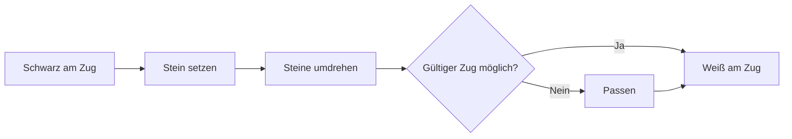

# Brettspiele und KI: Othello-Regeln, strategische Muster und der Weg zur vollständigen Lösung

„In einer Minute gelernt, ein Leben lang gemeistert (A minute to learn, a lifetime to master)“ — dieser weltberühmte Slogan beschreibt treffend die Faszination von **Othello** (auch bekannt als Reversi). Mit einem minimalistischen 8x8-Gitter und 64 doppelseitigen Scheiben in Schwarz und Weiß wirkt die Spielmechanik denkbar einfach. Dennoch birgt sie eine nahezu unendliche kombinatorische Tiefe, die das menschliche Denken seit Generationen fesselt.

Mit den rasanten Fortschritten der künstlichen Intelligenz (KI) entwickelte sich Othello neben Schach, Shogi und Go zu einem zentralen Maßstab für heuristische Suchverfahren. Dieser Artikel beleuchtet die mathematische Komplexität des Spiels, die von menschlichen Meistern und Computern entwickelten Strategiemuster sowie den historischen Durchbruch des Jahres 2023: die vollständige mathematische Lösung von Othello.

## 1. Othello-Regeln und Spielbaum-Komplexität

Die Grundregeln von Othello sind geradlinig. Zwei Kontrahenten, Schwarz und Weiß, setzen abwechselnd Steine auf das Brett. Wird mindestens eine gegnerische Steinreihe (horizontal, vertikal oder diagonal) zwischen dem neu gesetzten und einem bereits liegenden eigenen Stein eingeklemmt, werden die gegnerischen Steine umgedreht. Das Spiel endet, wenn das Brett voll ist oder kein Spieler mehr regelkonform ziehen kann. Sieger ist, wer am Ende die meisten Steine seiner Farbe besitzt.

Trotz dieser eingängigen Logik übersteigt die mathematische Vielfalt jede menschliche Intuition. In der kombinatorischen Spieltheorie wird die Dimension eines Spiels primär über zwei Kennzahlen erfasst: die **Zustandsraum-Komplexität** (State-space complexity) und die **Spielbaum-Komplexität** (Game-tree complexity).

Für Othello wird die Anzahl erreichbarer legaler Stellungen (Zustandsraum-Komplexität) auf etwa $10^{28}$ geschätzt. Die Gesamtzahl aller möglichen Spielverläufe von der Anfangsstellung bis zum Endspiel (Spielbaum-Komplexität) liegt bei rund $10^{58}$.

$$
\text{Spielbaum-Komplexität} \approx 10^{58}
$$

Verglichen mit Schach (ca. $10^{123}$) oder Go (ca. $10^{360}$) ist diese Zahl zwar geringer, doch für moderne Hochleistungsrechner stellt $10^{58}$ nach wie vor eine unüberwindbare Hürde für naive Brute-Force-Suchen dar. Die Othello-KI-Forschung konzentrierte sich daher über Jahrzehnte hinweg auf hocheffiziente Schnittverfahren (Pruning) und präzise Bewertungsfunktionen.

## 2. Geschichte und Evolution der Othello-KI

Die softwarebasierte Erforschung von Othello setzte bereits in den späten 1970er Jahren ein. Frühe Programme basierten auf klassischen Konzepten der antagonistischen Spielbaumanalyse: dem **Minimax-Algorithmus** in Verbindung mit der **Alpha-Beta-Suche** (Alpha-beta pruning).

### Minimax-Algorithmus und Alpha-Beta-Schnitt
Der Minimax-Ansatz berechnet den besten Zug unter der Annahme, dass der Gegenspieler stets den für den aktiven Spieler ungünstigsten Gegenzug wählt. Da die Verzweigungen bei tieferer Suche exponentiell explodieren, schneidet die Alpha-Beta-Prunings-Methode Teilbäume ab, die das Gesamtergebnis mathematisch nicht mehr verändern können, was die effektive Rechentiefe enorm vergrößert.

### Weiterentwicklung der Bewertungsfunktionen
Mindestens ebenso entscheidend war die Formulierung der Bewertungsfunktion, die Zwischenstellungen numerisch gewichtet. Anfänglich nutzte man starre Heuristiken wie reine Steinezählung oder feste Gewichtungen für prominente Positionen (z. B. Ecken).

In den 1990er Jahren revolutionierte maschinelles Lernen die Parameteroptimierung. Über Musterbewertungstabellen (Pattern tables), die die Rand- und Diagonalstrukturen statistisch erfassten, lernten Programme anhand von Millionen Meisterpartien und Selbstspielzyklen hochgradig differenzierte Lagebewertungen. Einen historischen Meilenstein setzte 1997 das von Michael Buro entwickelte Programm **Logistello**, das den amtierenden menschlichen Weltmeister Takeshi Murakami glatt mit 6:0 besiegte.

## 3. Strategische Kernmuster im modernen Othello

Aus dem Zusammenspiel menschlicher Großmeister und rechenstarker Algorithmen haben sich fundamentale strategische Prinzipien herauskristallisiert. Modernes Othello zielt nicht auf frühe Massenumwandlungen ab, sondern auf Tempokontrolle und Positionsstabilität:

### 1. Eckkontrolle und „stabile Steine“
Das unumstößliche Grundgesetz von Othello lautet: Ecken erobern. Ein Stein auf einem der vier Eckfelder kann bis zum Spielende niemals mehr umgedreht werden. Man bezeichnet solche Steine als **stabile Steine** (Stable discs). Eine gesicherte Ecke ermöglicht es, gefahrlose Steinreihen entlang der Außenkanten aufzubauen.

### 2. Mobilitätsmanagement
Im Mittelspiel ist die **Mobilität** (die Anzahl eigener legaler Zugmöglichkeiten) der wichtigste strategische Faktor. Oberstes Ziel ist es, die eigenen Zugoptionen maximal zu halten und gleichzeitig die Mobilität des Gegners systematisch einzuschnüren. Hat der Gegner keine sicheren Felder mehr zur Verfügung, gerät er in Zugzwang und muss katastrophale Züge ausführen, die Ecken oder Außenlinien preisgeben.

### 3. Gefahrenzonen: X-Felder und C-Felder
Felder, die diagonal an eine Ecke grenzen, werden als **X-Felder** bezeichnet; Felder, die entlang des Randes direkt neben einer Ecke liegen, heißen **C-Felder**. Ein verfrühtes Besetzen dieser Felder eröffnet dem Gegner fast immer den direkten Zugriff auf die Ecke. Während Einsteiger diese Felder strikt meiden, setzen Großmeister und Spitzen-KIs gelegentlich gezielte Opfer auf C-Feldern ein, um die Mobilität des Gegners empfindlich zu stören.

### 4. Parität (Gerade-Felder-Theorie)
Im Endspiel entscheidet oft die **Parität**. Die verbleibenden Leerfelder formieren sich meist zu isolierten Zonen. Schafft es ein Spieler, dass eine Zone eine gerade Anzahl an Feldern aufweist und zieht er stets als Zweiter in diese Zone, garantiert er sich den letzten Zug in diesem Areal. Dieser Schlusszug sorgt meist für erhebliche, unumkehrbare Steinumwandlungen.

## 4. Der Durchbruch von 2023: Vollständige mathematische Lösung

Über Jahrzehnte hinweg blieb eine theoretische Kernfrage ungelöst: Wenn beide Seiten von Zug eins an mathematisch fehlerfrei agieren, wie lautet das deterministische Ergebnis von Othello? Gewinnt Schwarz (Startspieler), gewinnt Weiß oder endet das Spiel unentschieden?

Im Jahr 2023 gelang dem japanischen Informatiker **Hiroki Takizawa** der mathematische Durchbruch: Er bewies formal, dass **Othello schwach gelöst ist: Bei beiderseits perfektem Spiel endet die Partie ausnahmslos unentschieden (32:32)**.

### Der Lösungsweg
Die Bewältigung eines Spielbaums von $10^{58}$ Knoten war kein Produkt blinder Rechenkraft. Auf Basis einer extrem optimierten Version der Open-Source-Engine **Edax** vereinte die Forschungsarbeit:
1. **Hochpräzise Alpha-Beta-Suche mit Muster-Heuristiken**: Eine vortreffliche Sortierung der Zugkandidaten führte zu maximalen Schnittraten.
2. **Ultraschnelle Endspiel-Löser**: Durch bitweise Logikoperationen (Bitboards) konnten Stellungen mit weniger als 30 verbleibenden Leerfeldern in Sekundenbruchteilen exakt ausgerechnet werden.
3. **Massiv-parallele Cloud-Infrastruktur**: Umfangreiche Rechencluster prüften über Monate hinweg systematisch jede Verzweigung des Eröffnungsbaums.

### Stufen der Spiellösung in der Spieltheorie
Man unterscheidet in der mathematischen Spieltheorie drei Grade der Lösung:
- **Ultra-schwach gelöst (Ultra-weakly solved)**: Nur das Endergebnis (Sieg, Niederlage, Remis) ab der Grundstellung ist mathematisch bewiesen, ohne die Zugfolgen vollständig anzugeben.
- **Schwach gelöst (Weakly solved)**: Es existiert ein konkreter Algorithmus oder ein vollständiger Entscheidungsbaum, der das theoretische Resultat ab dem ersten Zug garantiert.
- **Stark gelöst (Strongly solved)**: Für jede beliebige, erreichbare Spielstellung lässt sich in vertretbarer Zeit der optimale Folgezug berechnen.

Takizawas Arbeit stellt eine **schwache Lösung** dar. Es ist der bedeutendste Meilenstein bei klassischen Denkspielen seit der Lösung von Dame (Checkers) durch das Team um Jonathan Schaeffer im Jahr 2007.

## 5. Die Zukunft von KI und Denkspielen

Dass Othello bei perfektem Spiel mit einem Remis endet, schmälert die Attraktivität des Spiels für den Menschen in keiner Weise. Für den menschlichen Verstand bleibt der Suchraum von $10^{58}$ faktisch unerschöpflich, und weltweite Meisterschaften erfreuen sich ungebrochener Faszination.

Darüber hinaus besitzen die bei der Lösung von Othello perfektionierten Algorithmen — Zustandsraumkompression, Bitboard-Beschleunigung und verteilte Lastverteilung — weitreichende Bedeutung für praktische Probleme der modernen Informatik: von logistischer Tourenplanung über biochemische Molekülmodellierung bis hin zur Verifikation von Quantenalgorithmen.

Das 64-Felder-Brett von Othello bleibt ein zeitloses Zeugnis für das fruchtbare Zusammenspiel von menschlicher Intuition und mathematischer Präzision.

---

*Literaturhinweise*
- Takizawa, H. (2023). "Othello is Solved". arXiv preprint arXiv:2310.19387.
- Buro, M. (1997). "The Othello Match of the Year: Takeshi Murakami vs. Logistello".
- Offizielle Turnierberichte und Veröffentlichungen der World Othello Federation (WOF).
