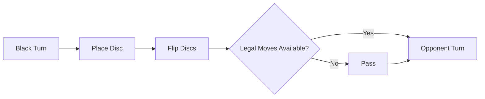

# Board Games and AI: Othello Rules, Strategic Patterns, and the Road to Complete Analysis

"A minute to learn, a lifetime to master" — this famous catchphrase represents the globally beloved board game **Othello** (also known as Reversi). Played on an 8x8 grid with 64 double-sided discs of black and white, its structure is remarkably minimalistic, yet the diversity of positions it produces has captivated human intellect for generations.

In recent decades, driven by rapid advancements in artificial intelligence (AI), Othello has served alongside chess, shogi, and go as a foundational benchmark for algorithmic research. In this article, we examine the intrinsic complexity of Othello, analyze the core tactical and strategic principles developed by master players and computational engines, and explore the landmark breakthrough of 2023: the mathematical solving of Othello.

## 1. Othello Rules and Game-Tree Complexity

The rules governing Othello are straightforward. Two players, Black and White, alternate placing discs on the board. Any opponent discs flanked in a continuous straight line (horizontal, vertical, or diagonal) between the newly placed disc and another disc of the current player's color are flipped. The objective is to finish the game with the majority of discs in your color.

Beneath this accessible rule set lies a state space far beyond immediate human intuition. In computational game theory, complexity is assessed primarily through two metrics: **State-space complexity** and **Game-tree complexity**.

In Othello, the estimated number of reachable legal board configurations (state-space complexity) is roughly $10^{28}$. The total number of unique paths from the initial setup to terminal configurations (game-tree complexity) is estimated at approximately $10^{58}$.

$$
\text{Game-Tree Complexity} \approx 10^{58}
$$

While this value is lower than that of chess (roughly $10^{123}$) or go (roughly $10^{360}$), it remains an astronomical figure. Exhaustive brute-force exploration across $10^{58}$ terminal branches is physically impossible even on modern high-performance computing clusters. Consequently, designing Othello AI has centered for decades on efficient search space pruning and high-fidelity heuristic evaluation functions.

## 2. History and Evolution of Othello AI

Computational research on Othello began in the late 1970s. Early software relied predominantly on classical adversarial search algorithms: the **Minimax algorithm** enhanced by **Alpha-Beta pruning**.

### Minimax Algorithm and Alpha-Beta Pruning
The minimax algorithm determines the optimal move by assuming that the opponent will always select the move that minimizes the current player's maximum payoff. Because exploring every possible sequence several plies deep leads to exponential branch explosions, alpha-beta pruning is employed to eliminate subtrees that cannot influence the final root decision, drastically cutting computation time.

### Evolution of Evaluation Functions
Equally critical to deep search was the formulation of the evaluation function — the mathematical model assessing which player holds an advantage in non-terminal states. Early engines prioritized primitive heuristics, such as raw disc counts or static weights assigned to specific board squares (e.g., valuing corner squares highly).

During the 1990s, automated parameter optimization using machine learning techniques emerged. In particular, linear evaluation based on pattern tables (measuring configurations of disc arrangements across edges, corners, and localized clusters) was calibrated against millions of expert games and self-play sessions. This generation of AI rapidly surpassed the capabilities of human grandmasters. A defining historic milestone occurred in 1997, when Michael Buro's program **Logistello** defeated reigning human World Champion Takeshi Murakami with a clean 6–0 sweep.

## 3. Profound Strategic Patterns in Othello

Through decades of tournament play and algorithmic analysis, both human masters and game engines established core strategic tenets. Modern high-level Othello focuses not on maximizing disc counts early, but on board control, tempo, and stability.

### 1. Corner Control and Stable Discs
The foundational tactical principle in Othello is capturing corners. Discs placed in any of the four corner squares can never be flipped for the remainder of the match. Such permanent stones are called **stable discs**. Securing a corner allows a player to anchor full edges and systematically build an impenetrable cluster of permanent discs.

### 2. Mobility Management
In the mid-game phase, **mobility** (the count of legal moves available to a player) becomes the decisive strategic metric. The overriding objective of modern theory is maximizing one's own mobility while minimizing that of the adversary.

By systematically stripping an opponent of options, they are eventually forced into playing "zugzwang" moves — conceding tactical sacrifices or placing discs on squares that grant the player easy access to corners and advantageous edges.

### 3. Dangerous Squares: X-Squares and C-Squares
Squares diagonally adjacent to corners are designated **X-squares**, while squares immediately adjacent to corners along the outer perimeter are known as **C-squares**. Playing into these squares early grants the opponent immediate or straightforward avenues to capture the adjacent corner. While beginners often avoid them categorically, grandmasters and advanced engines occasionally employ calculated sacrifices on C-squares to disrupt an opponent's mobility or wedge into perimeter stability.

### 4. Parity (Even-Space Theory)
In the endgame phase, **parity** dictates victory. The remaining empty squares on the board are distributed across isolated pockets. If a player ensures that an empty region contains an even number of squares, and responds whenever the opponent moves into that region, the player guarantees playing the final move in that zone. Capturing the terminal disc of a region often yields substantial disc flips that cannot be reversed.

## 4. The 2023 Breakthrough: Complete Mathematical Resolution

For decades, game theorists sought to answer the fundamental question: if both players choose flawless, mathematically perfect moves from move one, what is the theoretical outcome of Othello? Is it a win for Black (first player), a win for White (second player), or a draw?

In 2023, Japanese computer scientist **Hiroki Takizawa** published a landmark paper establishing that **Othello is weakly solved: with perfect play from both sides, the game ends in an exact draw (32–32)**.

### The Computational Approach
Solving a game tree of $10^{58}$ nodes was not achieved through naive brute force. Built upon an optimized version of the open-source engine **Edax**, the proof utilized state-of-the-art alpha-beta search routines, highly tuned transposition tables, and extensive cloud-based distributed computation.

Key technical pillars enabling this solution include:
1. **Aggressive Alpha-Beta Pruning with Heuristic Move Ordering**: High-accuracy pattern evaluation tables ensured that optimal branches were searched first, maximizing cutoff rates.
2. **High-Speed Endgame Solvers**: Fast bitboard operations allowed exhaustive computation once the game reached remaining plies under 30 empty squares.
3. **Distributed Cloud Infrastructure**: Computation was distributed across extensive cluster nodes over prolonged periods, systematically resolving each opening transposition.

### Historic Context Among Solved Games
In combinatorial game theory, resolution is categorized into tiers:
- **Ultra-weakly solved**: The game-theoretic outcome (win, loss, or draw) from the initial state is proven without computing the complete strategic sequence.
- **Weakly solved**: An explicit algorithm or sequence of moves is demonstrated that guarantees the theoretical outcome from the opening state.
- **Strongly solved**: Perfect moves and outcomes can be computed in practical time from any reachable board state.

Takizawa's achievement represents a **weak solution** of Othello. It stands as the most computationally significant board game resolution since Jonathan Schaeffer's team weakly solved Checkers (draughts) in 2007.

## 5. The Future of AI and Combinatorial Games

The mathematical proof that Othello ends in a draw does not detract from its human appeal. For human players, the vastness of the state space remains functionally infinite, and competitive play continues to flourish across international tournaments.

More broadly, the methodologies refined during the solving of Othello provide enduring insights for computational science. Techniques developed for search tree reduction, parallel workload distribution, and memory caching apply directly to real-world optimization problems, supply chain routing, automated theorem proving, and drug discovery.

The 64 squares of Othello reflect a harmonious intersection of human intuition and algorithmic precision — a timeless canvas where intellect and computational power elevate one another.

---

*References*
- Takizawa, H. (2023). "Othello is Solved". arXiv preprint arXiv:2310.19387.
- Buro, M. (1997). "The Othello Match of the Year: Takeshi Murakami vs. Logistello".
- Literature and Tournament Technical Reports from the World Othello Federation (WOF).
