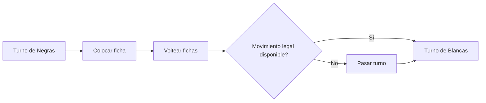

# Juegos de tablero e IA: Reglas de Otelo, patrones estratégicos y el camino hacia la resolución completa

"Un minuto para aprender, toda una vida para dominar (A minute to learn, a lifetime to master)" — este célebre lema sintetiza la esencia de **Otelo** (Othello / Reversi), uno de los juegos de tablero abstracto más populares del mundo. Con un tablero cuadriculado de 8x8 casillas y 64 fichas bicolores (blancas y negras), su estructura es engañosamente elemental. Sin embargo, las ramificaciones estratégicas que emergen de sus reglas han cautivado a matemáticos y jugadores durante más de un siglo.

Con la acelerada evolución de la inteligencia artificial (IA), Otelo se consolidó —junto al ajedrez, el shogi y el go— como un banco de pruebas fundamental para los algoritmos de búsqueda heurística y aprendizaje automático. En este artículo, analizamos la complejidad intrínseca de Otelo, los patrones estratégicos desarrollados por grandes maestros y motores computacionales, y el histórico hito alcanzado en 2023: la resolución matemática completa del juego.

## 1. Reglas de Otelo y la complejidad del árbol de juego

Las reglas de Otelo son sumamente accesibles. Dos contrincantes, Negras y Blancas, se alternan colocando fichas sobre el tablero. Al colocar una ficha, cualquier línea recta continua (horizontal, vertical o diagonal) de fichas enemigas que quede flanqueada entre la nueva ficha y otra del mismo color se voltea, cambiando a su color. El juego concluye cuando el tablero se llena o ningún jugador puede mover; quien posea más fichas en su color resulta vencedor.

Bajo esta mecánica elemental subyace un espacio de búsqueda astronómico. En teoría de juegos combinatoria, la complejidad se evalúa mediante dos métricas principales: la **complejidad del espacio de estados** (State-space complexity) y la **complejidad del árbol de juego** (Game-tree complexity).

En Otelo, el número estimado de configuraciones válidas alcanzables (complejidad del espacio de estados) es de aproximadamente $10^{28}$. Por su parte, la cantidad total de secuencias de juego posibles desde la apertura hasta el final (complejidad del árbol de juego) ronda los $10^{58}$.

$$
\text{Complejidad del árbol de juego} \approx 10^{58}
$$

Aunque esta cifra es inferior a la del ajedrez (aproximadamente $10^{123}$) o el go (aproximadamente $10^{360}$), sigue representando una magnitud inabarcable para la fuerza bruta. Explorar sistemáticamente $10^{58}$ hojas terminales es físicamente imposible, incluso con los superordenadores modernos. De ahí que el desarrollo de la IA para Otelo se haya centrado durante décadas en optimizar podas de búsqueda y funciones de evaluación posicional.

## 2. Historia y evolución de la IA en Otelo

La investigación computacional sobre Otelo arrancó a finales de los años 70. Los primeros programas se fundamentaron en técnicas clásicas de búsqueda antagónica: el **algoritmo Minimax** complementado con la **poda Alfa-Beta** (Alpha-beta pruning).

### Algoritmo Minimax y poda Alfa-Beta
El algoritmo Minimax selecciona la jugada óptima asumiendo que el oponente elegirá siempre la réplica que minimice la ganancia del jugador actual. Dado que el factor de ramificación genera una explosión combinatoria exponencial al profundizar, la poda Alfa-Beta descarta subárboles enteros que matemáticamente no pueden alterar la decisión en la raíz, multiplicando la profundidad efectiva del análisis.

### Evolución de las funciones de evaluación
Tan decisivo como el motor de búsqueda fue el diseño de la función de evaluación, encargada de estimar el valor numérico de posiciones intermedias. Los programas pioneros utilizaban heurísticas rígidas, como contar la cantidad bruta de fichas o asignar valores fijos a casillas privilegiadas (como las esquinas).

A partir de los años 90, el aprendizaje automático transformó este enfoque al calibrar automáticamente miles de parámetros mediante tablas de patrones (Pattern tables). Estos modelos medían la correlación estadística entre configuraciones locales en bordes y diagonales y la probabilidad final de victoria, entrenándose con millones de partidas de expertos y juego autónomo. En 1997, el programa **Logistello**, concebido por Michael Buro, derrotó al campeón mundial humano Takeshi Murakami por un inapelable 6-0, marcando la supremacía definitiva de las máquinas sobre los jugadores humanos.

## 3. Patrones estratégicos avanzados en Otelo

Tanto los grandes maestros como los motores de IA han convergido en una serie de conceptos tácticos y posicionales esenciales. Lejos de buscar la captura masiva de fichas al principio, el juego moderno prioriza el control territorial y el tempo:

### 1. El valor de las esquinas y las "fichas estables"
El axioma cardinal de Otelo consiste en asegurar las cuatro esquinas. Una ficha asentada en una esquina jamás puede ser volteada en lo que resta de partida. Estas fichas permanentes se denominan **fichas estables** (Stable discs). Controlar una esquina permite expandir fichas seguras a lo largo de los bordes, construyendo una fortaleza inexpugnable.

### 2. Gestión de la movilidad
Durante el medio juego, la **movilidad** (el número de jugadas legales disponibles para un jugador) se erige en el factor determinante. La estrategia canónica consiste en maximizar las opciones propias mientras se estrangula progresivamente la movilidad del oponente. Al agotar sus casillas seguras, el rival cae en una situación de "zugzwang", viéndose obligado a realizar jugadas catastróficas que ceden esquinas o bordes clave.

### 3. Casillas críticas: Casillas X y Casillas C
Las casillas ubicadas en la diagonal contigua a una esquina se denominan **casillas X**, mientras que las adyacentes a la esquina a lo largo de los bordes se conocen como **casillas C**. Ocupar estas posiciones prematuramente concede al adversario una vía directa para conquistar la esquina contigua. Aunque los principiantes las evitan a ultranza, los jugadores expertos y las IA a veces realizan sacrificios calculados en casillas C para distorsionar la movilidad enemiga.

### 4. Paridad (Teoría de las casillas pares)
En el desenlace de la partida, la **paridad** define la victoria. El tablero vacío suele fragmentarse en bolsas o regiones aisladas de casillas vacías. Si un jugador logra que una región contenga un número par de casillas y responde a cada movimiento del oponente dentro de ella, se garantiza jugar la última ficha de dicha zona, asegurando las capturas terminales que consolidan el marcador.

## 4. El gran avance de 2023: Resolución matemática completa

Durante décadas, la teoría de juegos mantuvo abierta la incógnita primordial: bajo un juego matemáticamente perfecto por parte de ambos bandos, ¿cuál es el resultado intrínseco de Otelo? ¿Gana el primer jugador (Negras), el segundo (Blancas) o es tablas?

En 2023, el investigador japonés **Hiroki Takizawa** resolvió formalmente el enigma al publicar la prueba matemática definitiva: **Otelo está débilmente resuelto; con juego perfecto de ambos contendientes, la partida culmina invariablemente en empate (32–32)**.

### Metodología computacional del descubrimiento
Afrontar un árbol de juego de $10^{58}$ nodos no fue fruto de una simple fuerza bruta descontrolada. Respaldado por una versión altamente optimizada del motor de código abierto **Edax**, el proyecto combinó:
1. **Poda Alfa-Beta potenciada por tablas de patrones**: Una ordenación heurística precisa permitió podar ramas irrelevantes de forma masiva en las primeras fases del árbol.
2. **Solucionadores ultrarrápidos de finales de partida**: Mediante operaciones de tablero de bits (Bitboard), se resolvieron de forma exhaustiva e instantánea todos los subárboles cuando restaban menos de 30 casillas vacías.
3. **Computación paralela distribuida en la nube**: Servidores en clúster procesaron ininterrumpidamente durante meses las complejas transposiciones de apertura.

### Niveles de resolución en teoría de juegos
En la clasificación de juegos resueltos se distinguen tres categorías:
- **Ultra-débilmente resuelto (Ultra-weakly solved)**: Se demuestra el resultado formal (victoria, derrota o tablas) desde la posición inicial sin proporcionar el árbol de jugadas óptimo.
- **Débilmente resuelto (Weakly solved)**: Se demuestra y documenta un algoritmo o árbol de variantes óptimas que garantiza el resultado desde la apertura.
- **Fuertemente resuelto (Strongly solved)**: Se puede calcular la mejor respuesta y el desenlace garantizado desde cualquier posición legal arbitraria.

El hallazgo de Takizawa constituye una **resolución débil** de Otelo, erigiéndose en el mayor logro en juegos de tablero tradicionales desde que el equipo de Jonathan Schaeffer resolvió las Damas (Checkers) en 2007.

## 5. El futuro de la IA y los juegos de tablero

Que Otelo esté matemáticamente resuelto como empate no reduce en absoluto su interés competitivo o pedagógico. Para el cerebro humano, el espacio de juego sigue siendo virtualmente infinito, y la belleza de sus combinaciones permanece inalterable.

En un plano científico más amplio, las innovaciones desarrolladas para resolver Otelo —compresión de espacios de estados, poda heurística avanzada y orquestación distribuida masiva— encuentran aplicación directa en la optimización logística, la bioinformática (plegamiento de proteínas y diseño de fármacos) y la verificación formal de sistemas cuánticos.

El tapete de 64 casillas de Otelo se consagra así como un punto de encuentro paradigmático donde la intuición humana y la potencia analítica de la inteligencia artificial se potencian mutuamente.

---

*Referencias bibliográficas*
- Takizawa, H. (2023). "Othello is Solved". arXiv preprint arXiv:2310.19387.
- Buro, M. (1997). "The Othello Match of the Year: Takeshi Murakami vs. Logistello".
- Informes técnicos y publicaciones de la Federación Mundial de Otelo (World Othello Federation, WOF).
