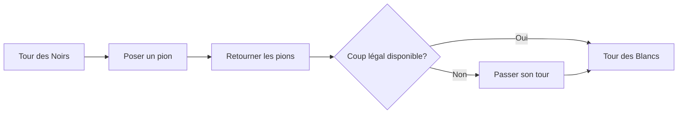

# Jeux de plateau et IA : Règles d'Othello, modèles stratégiques et la voie vers la résolution complète

« Une minute pour l'apprendre, une vie pour le maîtriser (A minute to learn, a lifetime to master) » — ce célèbre slogan résume la nature fascinante d'**Othello** (ou Reversi), l'un des jeux de réflexion pure les plus populaires au monde. Disputé sur une grille de 8x8 cases avec 64 pions bicolores (noirs et blancs), son principe semble élémentaire, mais la variété vertigineuse de ses configurations a stimulé l'intellect humain depuis plus d'un siècle.

Avec l'essor fulgurant de l'intelligence artificielle (IA), Othello s'est imposé, au même titre que les échecs, le shogi et le go, comme une référence majeure pour évaluer les algorithmes d'exploration combinatoire. Cet article analyse la complexité intrinsèque d'Othello, les concepts stratégiques majeurs développés par les champions et les machines, ainsi que la portée historique de l'événement de 2023 : la résolution mathématique complète du jeu.

## 1. Règles d'Othello et complexité de l'arbre de jeu

Les règles d'Othello sont remarquablement concises. Deux joueurs, les Noirs et les Blancs, posent tour à tour un pion sur le plateau. Pour être valide, le coup doit encadrer une ou plusieurs lignes de pions adverses (verticales, horizontales ou diagonales) entre le pion joué et un autre pion de sa couleur. Les pions encadrés sont alors retournés. Lorsque le plateau est saturé ou qu'aucun coup légal n'est possible, le camp possédant la majorité des pions remporte la partie.

Derrière cette apparente simplicité réside une complexité combinatoire colossale. En théorie des jeux, on quantifie la dimension d'un jeu à travers deux notions clés : la **complexité de l'espace d'états** (State-space complexity) et la **complexité de l'arbre de jeu** (Game-tree complexity).

Pour Othello, le nombre de positions légales atteignables (complexité de l'espace d'états) est estimé à environ $10^{28}$. Quant au nombre total de parties possibles depuis la configuration initiale jusqu'aux états terminaux (complexité de l'arbre de jeu), il avoisine $10^{58}$.

$$
\text{Complexité de l'arbre de jeu} \approx 10^{58}
$$

Bien que ce chiffre soit modeste comparé aux échecs (environ $10^{123}$) ou au go (environ $10^{360}$), il demeure astronomique. Un calcul exhaustif par force brute de $10^{58}$ branches est rigoureusement inaccessible aux supercalculateurs contemporains. Dès lors, le développement des moteurs d'Othello s'est focalisé sur la réduction sélective de l'espace de recherche et le raffinement des fonctions d'évaluation heuristique.

## 2. Histoire et évolution de l'IA appliquée à Othello

Les recherches informatiques sur Othello ont débuté dès la fin des années 1970. Les premiers logiciels reposaient sur les principes fondamentaux de la recherche antagoniste : l'**algorithme Minimax** associé à l'**élagage Alpha-Bêta** (Alpha-beta pruning).

### L'algorithme Minimax et l'élagage Alpha-Bêta
Le principe Minimax détermine le coup optimal en postulant que l'adversaire effectuera systématiquement le choix minimisant le gain du joueur actif. Face à l'explosion exponentielle des branches lors des projections en profondeur, l'élagage Alpha-Bêta permet d'interrompre l'exploration de sous-arbres qui n'ont aucune chance d'influencer la décision finale, démultipliant ainsi la profondeur de calcul utile.

### L'évolution des fonctions d'évaluation
Parallèlement à la vitesse de recherche, la conception de la fonction d'évaluation heuristique s'est avérée déterminante. Les premiers programmes utilisaient des règles manuelles simplistes, telles que le décompte brut des pions ou l'attribution de valeurs fixes à certaines cases stratégiques (comme les coins).

Dans les années 1990, l'avènement de l'apprentissage automatique a permis d'optimiser automatiquement les pondérations via des tables de motifs (Pattern tables). En évaluant statistiquement l'impact des configurations locales (bords, diagonales) à partir de millions de parties jouées par des maîtres ou en auto-apprentissage, les machines ont franchi un palier décisif. En 1997, le programme **Logistello**, développé par Michael Buro, a surclassé le champion du monde humain Takeshi Murakami par un score écrasant de 6 à 0, consacrant la supériorité des algorithmes sur l'expertise humaine.

## 3. Modèles stratégiques fondamentaux d'Othello

L'analyse conjointe des grands maîtres et des moteurs d'IA a dégagé plusieurs préceptes cardinaux. La stratégie moderne ne consiste pas à maximiser le nombre de pions retournés en début de partie, mais à contrôler l'espace et le rythme :

### 1. Contrôle des coins et « pions stables »
La règle d'or d'Othello est la prise des quatre coins du plateau. Un pion placé dans un coin ne peut plus jamais être retourné d'ici la fin de la partie. On qualifie ces pièces de **pions stables** (Stable discs). Le contrôle d'un coin offre un ancrage solide pour sécuriser progressivement toute une bordure sans risque de réversion.

### 2. Gestion de la mobilité
En milieu de partie, la **mobilité** (le nombre de coups légaux accessibles à un joueur) devient le critère prépondérant. L'objectif stratégique suprême consiste à préserver ses propres options tout en étouffant celles de l'adversaire. Lorsque ce dernier est privé de bons coups, il est acculé à une situation de « zugzwang », contraint de jouer des coups désastreux qui cèdent les coins et les bords.

### 3. Les cases critiques : Cases X et cases C
Les cases situées en diagonale immédiate d'un coin sont appelées **cases X**, tandis que celles bordant directement un coin sur le périmètre sont désignées comme **cases C**. Y placer un pion prématurément permet généralement à l'adversaire de s'emparer sans effort du coin adjacent. Si les débutants doivent impérativement les proscrire, les maîtres et les IA effectuent parfois des sacrifices calculés sur les cases C pour verrouiller la mobilité globale adverse.

### 4. La parité (Théorie des espaces pairs)
Dans la phase finale, la **parité** constitue le facteur décisif. Les cases vides résiduelles forment des zones indépendantes. Si un joueur s'assure qu'une zone comporte un nombre pair de cases libres et réplique à chaque incursion adverse dans cette zone, il est certain d'y jouer le dernier coup. Ce dernier coup d'une région entraîne généralement des retournements massifs et irréversibles.

## 4. La percée de 2023 : La résolution mathématique complète

Durant des décennies, la théorie des jeux est restée confrontée à cette interrogation fondamentale : en supposant que les deux joueurs jouent de manière absolument parfaite, quelle est l'issue inéluctable d'une partie d'Othello ? Est-ce une victoire des Noirs, une victoire des Blancs ou une partie nulle ?

En 2023, le chercheur japonais **Hiroki Takizawa** a publié une démonstration mathématique retentissante : **Othello est désormais faiblement résolu ; lorsque les deux camps adoptent le jeu parfait, l'issue théorique est inévitablement une partie nulle (32 contre 32)**.

### Méthodologie et prouesse algorithmique
Cette résolution d'un arbre de $10^{58}$ nœuds n'a pas été obtenue par une force brute aveugle. En s'appuyant sur une version remaniée du moteur libre de référence **Edax**, la recherche a combiné :
1. **Un élagage Alpha-Bêta optimisé par tables de motifs** : Un tri prédictif précis des coups a permis d'éliminer la quasi-totalité des branches sous-optimales dès la racine.
2. **Des résolveurs ultra-rapides de fin de partie** : Grâce à l'algèbre des tables de bits (Bitboard), les calculs exhaustifs ont pu être exécutés en un temps record dès lors qu'il restait moins de 30 cases libres.
3. **Une infrastructure informatique massivement distribuée** : Des grappes de calcul en nuage ont fonctionné en continu pendant des mois afin de résoudre méthodiquement toutes les transpositions d'ouverture.

### Les paliers de résolution en théorie des jeux
On distingue trois degrés de résolution d'un jeu combinatoire :
- **Ultra-faiblement résolu (Ultra-weakly solved)** : L'issue finale (gain, perte ou nul) depuis l'état initial est établie mathématiquement, sans que la séquence exacte ne soit fournie.
- **Faiblement résolu (Weakly solved)** : Un algorithme ou un arbre complet de coups optimaux garantissant le résultat théorique depuis le premier coup est entièrement explicité.
- **Fortement résolu (Strongly solved)** : Le meilleur coup et l'issue finale peuvent être calculés pour n'importe quelle configuration légale du plateau.

La découverte de Takizawa correspond à une **résolution faible**. C'est le résultat le plus marquant obtenu sur un jeu de réflexion mondial depuis la résolution des dames anglaises (Checkers) par l'équipe de Jonathan Schaeffer en 2007.

## 5. L'avenir de l'IA et des jeux combinatoires

Savoir qu'une partie parfaite se solde par un match nul n'altère en rien l'intérêt d'Othello. Pour l'esprit humain, l'immensité combinatoire demeure indomptable, et la richesse tactique du jeu continue d'animer les tournois compétitifs à travers le monde.

Sur le plan scientifique, les innovations déployées pour résoudre Othello — réduction de l'arbre de recherche, calcul bit-à-bit optimisé et calcul distribué à grande échelle — constituent des briques technologiques précieuses pour l'optimisation industrielle, la recherche opérationnelle, la conception de molécules thérapeutiques et la vérification des systèmes quantiques.

Le tablier bicolore d'Othello s'affirme comme un chef-d'œuvre où la rigueur algorithmique de l'intelligence artificielle et l'intuition créative de l'esprit humain s'enrichissent mutuellement.

---

*Références*
- Takizawa, H. (2023). "Othello is Solved". Prépublication arXiv arXiv:2310.19387.
- Buro, M. (1997). "The Othello Match of the Year: Takeshi Murakami vs. Logistello".
- Rapports techniques et publications de la Fédération Mondiale d'Othello (WOF).
