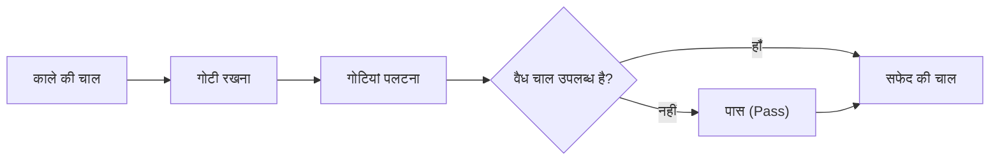

# बोर्ड गेम और एआई: ओथेलो के नियम, रणनीतिक पैटर्न और पूर्ण समाधान की राह

"सीखने में एक मिनट, महारत हासिल करने में पूरी जिंदगी (A minute to learn, a lifetime to master)" — यह विश्व प्रसिद्ध नारा **ओथेलो** (Othello / रिवर्सी) के सार को दर्शाता है। 8x8 ग्रिड और 64 काले-सफेद दोतरफा मोहरों (डिस्क) के साथ, इसकी संरचना अत्यंत सरल प्रतीत होती है। फिर भी, इसकी गोटियों के संयोजन से उत्पन्न होने वाली रणनीतिक गहराई सदियों से मानव बुद्धि को आकर्षित करती रही है।

आर्टिफिशियल इंटेलिजेंस (एआई) के अभूतपूर्व विकास के साथ, ओथेलो शतरंज, शोगी और गो के साथ खोज एल्गोरिदम का एक महत्वपूर्ण मानक बन गया है। इस लेख में, हम ओथेलो की गणितीय जटिलता, मानव खिलाड़ियों और कंप्यूटर इंजनों द्वारा विकसित मुख्य रणनीतियों और 2023 में हासिल की गई ऐतिहासिक उपलब्धि — ओथेलो के गणितीय समाधान (सॉल्व्ड गेम) का तकनीकी विश्लेषण करेंगे।

## 1. ओथेलो के नियम और गेम-ट्री जटिलता

ओथेलो के नियम बेहद स्पष्ट हैं। दो खिलाड़ी, काले और सफेद, बारी-बारी से बोर्ड पर गोटी रखते हैं। जब कोई खिलाड़ी नई गोटी रखता है, तो उस गोटी और अपने रंग की किसी अन्य गोटी के बीच सीधी रेखा (क्षैतिज, लंबवत या विकर्ण) में आने वाली प्रतिद्वंद्वी की सभी गोटियों को पलटकर अपने रंग में बदल दिया जाता है। जब पूरा बोर्ड भर जाता है या दोनों खिलाड़ियों के पास कोई वैध चाल नहीं बचती, तब जिसके पास सबसे अधिक गोटियां होती हैं, वह जीतता है।

इस सरल नियम के पीछे एक विशाल खोज स्थान छिपा है। कॉम्बिनेटरियल गेम थ्योरी में किसी खेल के पैमाने को दो प्रमुख मानकों से मापा जाता है: **स्टेट-स्पेस जटिलता** (State-space complexity) और **गेम-ट्री जटिलता** (Game-tree complexity)।

ओथेलो में बोर्ड की संभावित विन्यास संख्या (स्टेट-स्पेस जटिलता) लगभग $10^{28}$ आंकी गई है। वहीं शुरुआती स्थिति से लेकर खेल के अंत तक संभावित चालों के अनुक्रमों की कुल संख्या (गेम-ट्री जटिलता) लगभग $10^{58}$ मानी जाती है।

$$
\text{गेम-ट्री जटिलता} \approx 10^{58}
$$

यद्यपि यह संख्या शतरंज (लगभग $10^{123}$) या गो (लगभग $10^{360}$) से कम है, फिर भी आधुनिक सुपरकंप्यूटरों के लिए $10^{58}$ शाखाओं की ब्रूट-फोर्स गणना करना असंभव है। इसलिए, ओथेलो एआई अनुसंधान का मुख्य ध्यान दशकों तक कुशल प्रूनिंग (Pruning) और सटीक मूल्यांकन फलनों (Evaluation functions) पर केंद्रित रहा।

## 2. ओथेलो एआई का इतिहास और तकनीकी विकास

ओथेलो पर कंप्यूटर अनुसंधान 1970 के दशक के उत्तरार्ध में शुरू हुआ। शुरुआती कार्यक्रम क्लासिक एडवरसैरियल सर्च एल्गोरिदम: **मिनिमैक्स एल्गोरिदम** (Minimax) और **अल्फा-बीटा प्रूनिंग** (Alpha-beta pruning) पर आधारित थे।

### मिनिमैक्स और अल्फा-बीटा प्रूनिंग
मिनिमैक्स एल्गोरिदम यह मानकर इष्टतम चाल चुनता है कि प्रतिद्वंद्वी हमेशा ऐसी चाल चलेगा जो वर्तमान खिलाड़ी के लाभ को न्यूनतम कर दे। चूंकि खोज की गहराई बढ़ने पर शाखाओं की संख्या तेजी से बढ़ती है, अल्फा-बीटा प्रूनिंग उन शाखाओं को काट देती है जो अंतिम निर्णय को प्रभावित नहीं कर सकतीं, जिससे गणना की प्रभावी गहराई कई गुना बढ़ जाती है।

### मूल्यांकन फलनों का विकास
खोज इंजन के साथ-साथ सबसे महत्वपूर्ण घटक था मूल्यांकन फलन का निर्माण, जो बीच की स्थितियों को संख्यात्मक मान प्रदान करता है। शुरुआती कार्यक्रम केवल गोटियों की संख्या गिनने या कोनों जैसे विशेष खानों को स्थिर अंक देने पर निर्भर थे।

1990 के दशक में मशीन लर्निंग के प्रयोग ने इस क्षेत्र में क्रांति ला दी। पैटर्न-आधारित मूल्यांकन तालिकाओं (Pattern tables) ने लाखों ग्रैंडमास्टर मैचों से किनारों और विकर्णों के विन्यास का विश्लेषण कर जीत की संभावना का सटीक आकलन करना सीखा। 1997 में माइकल बुरो द्वारा विकसित **Logistello** नामक कार्यक्रम ने तत्कालीन मानव विश्व चैंपियन ताकेशी मुराकामी को 6–0 से हराकर इतिहास रचा।

## 3. ओथेलो के गहन रणनीतिक पैटर्न

शीर्ष मानव खिलाड़ियों और आधुनिक एआई इंजनों ने कई मौलिक सिद्धांत स्थापित किए हैं। उच्च स्तरीय ओथेलो में लक्ष्य शुरुआत में अधिक गोटियां पलटना नहीं, बल्कि बोर्ड का नियंत्रण और स्थिरता बनाए रखना है:

### 1. कोनों का नियंत्रण और «स्थिर गोटियां»
ओथेलो का मूलभूत सिद्धांत चारों कोनों (Corners) पर कब्जा करना है। कोने में रखी गई गोटी को खेल के अंत तक कभी पलटा नहीं जा सकता। इन्हें **स्थिर गोटियां** (Stable discs) कहा जाता है। कोनों को सुरक्षित करके खिलाड़ी बोर्ड के किनारों पर अपनी सुरक्षित गोटियों का दायरा बढ़ा सकता है।

### 2. मोबिलिटी (गतिशीलता) प्रबंधन
मध्य खेल (Midgame) में सबसे महत्वपूर्ण कारक **मोबिलिटी** (उपलब्ध वैध चालों की संख्या) है। आधुनिक रणनीति का मुख्य नियम है: "अपने विकल्पों को अधिकतम रखना और विरोधी के विकल्पों को न्यूनतम करना।" जब प्रतिद्वंद्वी के पास सुरक्षित खाने नहीं बचते, तो वह जुगज्वांग (Zugzwang) में फंस जाता है और उसे कोनों या किनारों को छोड़ने वाली खराब चालें चलने पर मजबूर होना पड़ता है।

### 3. खतरनाक खाने: X-स्क्वायर और C-स्क्वायर
कोने के विकर्ण पर सटे खाने को **X-स्क्वायर** और कोने के किनारे सटे खाने को **C-स्क्वायर** कहा जाता है। शुरुआत में इन खानों में गोटी रखने से विरोधी को आसानी से कोना मिल जाता है। शुरुआती खिलाड़ियों को इनसे बचना चाहिए, हालांकि एआई और विशेषज्ञ कभी-कभी प्रतिद्वंद्वी की गतिशीलता को नष्ट करने के लिए सोचे-समझे बलिदान के रूप में इन खानों का उपयोग करते हैं।

### 4. समता (पैरिटी सिद्धांत)
खेल के अंतिम चरण (Endgame) में **पैरिटी** (Parity / सम-विषम सिद्धांत) जीत तय करता है। बचे हुए खाली खाने अक्सर अलग-अलग क्षेत्रों में बंट जाते हैं। यदि कोई खिलाड़ी यह सुनिश्चित करता है कि किसी क्षेत्र में सम संख्या में खाली खाने हों और विरोधी की प्रत्येक चाल का उसी क्षेत्र में उत्तर देता है, तो उस क्षेत्र की अंतिम चाल वही चलेगा, जिससे उसे भारी बढ़त मिलती है।

## 4. 2023 की ऐतिहासिक सफलता: ओथेलो का 'पूर्ण गणितीय समाधान'

दशकों से गेम थ्योरी में यह सवाल अनुत्तरित था: यदि दोनों खिलाड़ी शुरू से अंत तक त्रुटिहीन और सर्वश्रेष्ठ चालें चलें, तो खेल का सैद्धांतिक परिणाम क्या होगा? काले की जीत, सफेद की जीत, या ड्रॉ (टाई)?

2023 में जापानी कंप्यूटर वैज्ञानिक **हिरोकी ताकिज़ावा** (Hiroki Takizawa) ने एक ऐतिहासिक शोध पत्र में गणितीय रूप से सिद्ध किया: **ओथेलो कमजोर रूप से हल (Weakly solved) हो चुका है; दोनों पक्षों के सर्वश्रेष्ठ खेल के साथ मैच अनिवार्य रूप से ड्रॉ (32-32) पर समाप्त होता है**।

### समाधान की तकनीकी रूपरेखा
$10^{58}$ नोड्स वाले गेम-ट्री को हल करना केवल अंधी ब्रूट-फोर्स का परिणाम नहीं था। ओपन-सोर्स इंजन **Edax** के अत्यधिक अनुकूलित संस्करण पर आधारित इस शोध में निम्नलिखित का उपयोग किया गया:
1. **पैटर्न-आधारित अल्फा-बीटा प्रूनिंग**: चालों की सटीक प्राथमिकता ने अनावश्यक शाखाओं को तुरंत छांट दिया।
2. **अति-तीव्र एंडगेम सॉल्वर**: जब 30 से कम खाली खाने बचे, तो बिटबोर्ड (Bitboard) संचालन ने कुछ ही क्षणों में स्थिति का सटीक अंत निकाल लिया।
3. **वितरित क्लाउड कंप्यूटिंग**: क्लाउड सुपरकंप्यूटिंग क्लस्टर्स ने महीनों तक लगातार काम करते हुए सभी ओपनिंग विविधताओं को व्यवस्थित रूप से हल किया।

### सॉल्व्ड गेम्स के स्तर
गेम थ्योरी में किसी खेल के समाधान के तीन स्तर होते हैं:
- **अल्ट्रा-वीकली सॉल्व्ड (Ultra-weakly solved)**: बिना पूरी चालें दिखाए प्रारंभिक स्थिति से केवल परिणाम सिद्ध किया जाता है।
- **वीकली सॉल्व्ड (Weakly solved)**: प्रारंभिक स्थिति से एक पूर्ण एल्गोरिदम या चालों का पेड़ दिया जाता है जो सैद्धांतिक परिणाम सुनिश्चित करता है।
- **स्ट्रॉन्गली सॉल्व्ड (Strongly solved)**: किसी भी वैध स्थिति से तुरंत इष्टतम चाल और अंतिम परिणाम निकाला जा सकता है।

ताकिज़ावा की उपलब्धि ओथेलो का **कमजोर समाधान (Weak solution)** है। 2007 में जोनाथन शेफ़र की टीम द्वारा चेकर्स (Checkers) को हल किए जाने के बाद से यह पारंपरिक बोर्ड गेम की दुनिया की सबसे बड़ी गणितीय उपलब्धि है।

## 5. एआई और बोर्ड गेम्स का भविष्य

ओथेलो का परिणाम 'ड्रॉ' साबित होने से इस खेल का आकर्षण बिल्कुल कम नहीं हुआ है। मानव मस्तिष्क के लिए $10^{58}$ का विस्तार अनंत के समान है, और वैश्विक प्रतियोगिताओं में इसकी बौद्धिक सुंदरता बनी हुई है।

व्यापक स्तर पर, ओथेलो को हल करने में प्रयुक्त तकनीकें — सर्च ट्री रिडक्शन, बिटबोर्ड अनुकूलन और वितरित क्लस्टर शेड्यूलिंग — आज रसद अनुकूलन, नई दवा अनुसंधान और क्वांटम कंप्यूटिंग सिस्टम के सत्यापन में महत्वपूर्ण योगदान दे रही हैं।

ओथेलो का 64-खानों वाला बोर्ड मानव बुद्धि और कृत्रिम बुद्धिमत्ता की विश्लेषणात्मक शक्ति के सुंदर समन्वय का एक कालजयी प्रतीक है।

---

*संदर्भ सूची*
- Takizawa, H. (2023). "Othello is Solved". arXiv preprint arXiv:2310.19387.
- Buro, M. (1997). "The Othello Match of the Year: Takeshi Murakami vs. Logistello".
- वर्ल्ड ओथेलो फेडरेशन (WOF) के आधिकारिक तकनीकी दस्तावेज और लेख।
