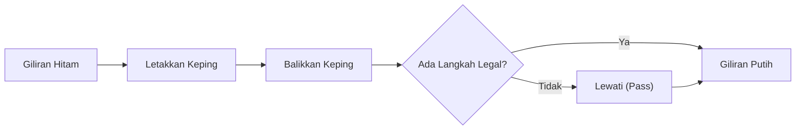

# Permainan Papan dan AI: Aturan Othello, Pola Strategis, dan Jalan Menuju Analisis Lengkap

"Satu menit untuk dipelajari, seumur hidup untuk dikuasai (A minute to learn, a lifetime to master)" — slogan terkenal ini menggambarkan esensi dari **Othello** (juga dikenal sebagai Reversi), salah satu permainan papan strategi abstrak paling digemari di dunia. Dengan papan berukuran 8x8 kotak dan 64 keping dua warna (hitam dan putih), strukturnya tampak sangat sederhana. Namun, dinamika posisi yang dihasilkannya telah memikat kecerdasan manusia selama lebih dari satu abad.

Seiring pesatnya kemajuan kecerdasan buatan (AI), Othello bersama catur, shogi, dan go telah menjadi tolak ukur fundamental dalam penelitian algoritma pencarian. Artikel ini mengupas tuntas kompleksitas matematis Othello, pola strategis inti yang dikembangkan oleh para master dan mesin komputasi, serta terobosan bersejarah pada tahun 2023: pembuktian solusi matematis lengkap dari Othello.

## 1. Aturan Othello dan Kompleksitas Pohon Permainan

Aturan Othello sangat lugas. Dua pemain, Hitam dan Putih, bergantian meletakkan keping di atas papan. Setiap keping lawan yang terhimpit dalam satu garis lurus kontinu (horizontal, vertikal, atau diagonal) antara keping yang baru diletakkan dan keping kawan lainnya akan dibalik menjadi warna pemain saat itu. Permainan berakhir ketika papan penuh atau kedua pemain tidak lagi memiliki langkah legal; pemain dengan keping terbanyak dinyatakan sebagai pemenang.

Di balik aturan sederhana ini tersembunyi ruang pencarian yang sangat luas. Dalam teori permainan kombinatorial, skala permainan diukur melalui dua metrik utama: **kompleksitas ruang status** (State-space complexity) dan **kompleksitas pohon permainan** (Game-tree complexity).

Pada Othello, perkiraan konfigurasi papan legal yang dapat dicapai (kompleksitas ruang status) adalah sekitar $10^{28}$. Sementara itu, jumlah seluruh variasi alur permainan dari posisi awal hingga akhir (kompleksitas pohon permainan) diperkirakan mencapai $10^{58}$.

$$
\text{Kompleksitas Pohon Permainan} \approx 10^{58}
$$

Meskipun angka ini lebih kecil dibandingkan catur (sekitar $10^{123}$) atau go (sekitar $10^{360}$), nilai tersebut tetaplah angka astronomis. Penjelajahan menyeluruh secara membabi buta (Brute-force) terhadap $10^{58}$ cabang tidak mungkin dilakukan bahkan dengan superkomputer modern tercanggih. Oleh karena itu, riset AI Othello selama beberapa dekade difokuskan pada pemangkasan cabang pencarian yang efisien dan perumusan fungsi evaluasi posisi yang akurat.

## 2. Sejarah dan Evolusi Teknologi AI Othello

Penelitian komputasi Othello telah dimulai sejak akhir dekade 1970-an. Program-program awal mengandalkan algoritma pencarian adversarial klasik: **algoritma Minimax** yang dipadukan dengan **pemangkasan Alpha-Beta** (Alpha-beta pruning).

### Algoritma Minimax dan Pemangkasan Alpha-Beta
Algoritma Minimax menentukan langkah terbaik dengan asumsi bahwa lawan akan selalu memilih respons yang paling merugikan bagi pemain saat ini. Karena eksplorasi mendalam memicu ledakan cabang eksponensial, pemangkasan Alpha-Beta membuang sub-pohon pencarian yang secara matematis tidak akan memengaruhi keputusan akhir, sehingga melipatgandakan kedalaman kalkulasi yang dapat dicapai.

### Evolusi Fungsi Evaluasi
Sama krusialnya dengan algoritma pencarian adalah desain fungsi evaluasi (Evaluation function), yang memberikan skor numerik pada posisi papan non-terminal. Program generasi pertama menggunakan heuristik kaku, seperti menghitung jumlah keping fisik atau memberikan nilai statis pada kotak-kotak tertentu (seperti kotak sudut).

Memasuki dekade 1990-an, pendekatan pembelajaran mesin (Machine learning) diterapkan untuk mengkalibrasi parameter evaluasi secara otomatis. Evaluasi berbasis tabel pola (Pattern tables) memetakan pengaruh konfigurasi bidak di pinggir dan diagonal terhadap peluang kemenangan berdasarkan jutaan rekaman pertandingan master dan simulasi mandiri. Pada tahun 1997, program legendaris **Logistello** yang diciptakan Michael Buro menumbangkan juara dunia manusia saat itu, Takeshi Murakami, dengan skor telak 6–0.

## 3. Pola Strategis Mendalam dalam Othello

Dari kolaborasi pengamatan master manusia dan algoritma mesin, terbentuklah prinsip-prinsip strategis modern. Othello tingkat tinggi tidak berfokus pada membalikkan keping sebanyak mungkin di awal, melainkan pada pengendalian ruang dan tempo:

### 1. Nilai Sudut dan «Keping Stabil»
Prinsip fundamental dalam Othello adalah menguasai empat sudut papan. Keping yang berada di sudut tidak akan pernah bisa dibalik lagi hingga permainan usai. Keping permanen ini disebut **keping stabil** (Stable discs). Menguasai sudut memungkinkan pemain mengunci barisan keping di sepanjang tepi papan secara aman.

### 2. Manajemen Mobilitas (Mobility)
Pada fase permainan tengah (midgame), faktor paling menentukan adalah **mobilitas** (jumlah langkah legal yang dimiliki pemain). Taktik modern berpusat pada memperbanyak opsi langkah sendiri sambil secara agresif membatasi opsi langkah lawan. Ketika lawan kehabisan kotak aman, mereka akan terjebak dalam kondisi zugzwang, terpaksa melangkah di kotak yang merugikan.

### 3. Kotak Bahaya: Kotak X dan Kotak C
Kotak yang bersebelahan secara diagonal dengan sudut disebut **kotak X**, sedangkan kotak di samping sudut sepanjang tepi disebut **kotak C**. Menempatkan keping di kotak ini secara prematur hampir selalu memberi jalan bagi lawan untuk merebut sudut. Pemain pemula wajib menghindarinya, meski pemain tingkat master atau AI terkadang melakukan pengorbanan terhitung di kotak C demi membatasi mobilitas lawan.

### 4. Paritas (Teori Kotak Genap)
Pada babak akhir permainan (endgame), kemenangan ditentukan oleh **paritas** (Parity). Sisa kotak kosong biasanya terbagi menjadi beberapa kantong terisolasi. Jika seorang pemain memastikan suatu area memiliki jumlah kotak kosong genap dan selalu membalas langkah lawan di area tersebut, ia dijamin akan memainkan langkah terakhir di area itu, merebut pembalikan keping permanen yang menentukan skor akhir.

## 4. Terobosan 2023: Pemecahan Matematis Lengkap Othello

Selama beberapa dekade, teori permainan dihadapkan pada pertanyaan pamungkas: jika kedua pemain bermain secara sempurna tanpa cela, apakah hasil akhir teoretis dari Othello? Apakah kemenangan bagi Hitam, kemenangan bagi Putih, atau remis (seri)?

Pada tahun 2023, ilmuwan komputer asal Jepang, **Hiroki Takizawa**, mempublikasikan makalah ilmiah yang membuktikan secara matematis: **Othello terpecahkan secara lemah (Weakly solved); jika kedua pihak bermain secara sempurna, permainan pasti berakhir dengan hasil imbang/seri (32–32)**.

### Metodologi dan Pendekatan Komputasi
Menyelesaikan pohon permainan berukuran $10^{58}$ simpul bukanlah hasil dari brute-force semata. Didukung versi optimal dari mesin sumber terbuka **Edax**, pembuktian ini memadukan:
1. **Pencarian Alpha-Beta Berbantuan Tabel Pola**: Pengurutan langkah heuristik yang sangat akurat memungkinkan pemangkasan massal cabang yang tidak optimal.
2. **Solver Endgame Berkecepatan Tinggi**: Operasi bitboard memungkinkan komputasi tuntas dalam hitungan detik ketika sisa kotak kosong di bawah 30 petak.
3. **Komputasi Paralel Terdistribusi di Cloud**: Kluster komputasi berskala masif bekerja selama berbulan-bulan untuk memverifikasi setiap transposisi pembukaan secara sistematis.

### Klasifikasi Permainan Terpecahkan
Dalam teori permainan kombinatorial, penyelesaian permainan dikelompokkan ke dalam tiga tingkatan:
- **Terpecahkan Sangat Lemah (Ultra-weakly solved)**: Hasil akhir (menang, kalah, atau seri) dari posisi awal dibuktikan secara teoretis tanpa menyajikan urutan langkah lengkapnya.
- **Terpecahkan Lemah (Weakly solved)**: Disajikan algoritma atau pohon langkah optimal yang menjamin hasil teoretis dari langkah pembuka.
- **Terpecahkan Kuat (Strongly solved)**: Langkah terbaik dan hasil pasti dapat dihitung dalam waktu praktis dari posisi papan legal mana pun.

Pencapaian Takizawa tergolong sebagai **solusi lemah**. Ini adalah pencapaian terbesar dalam kategori permainan papan tradisional dunia sejak tim Jonathan Schaeffer memecahkan permainan Dam (Checkers) pada tahun 2007.

## 5. Masa Depan AI dan Permainan Papan

Kenyataan bahwa Othello secara matematis berakhir imbang sama sekali tidak melunturkan pesonanya bagi manusia. Bagi pikiran manusia, ruang eksplorasi $10^{58}$ tetap tak terbatas, dan kejuaraan kompetitif dunia tetap menyuguhkan duel taktik yang memikat.

Secara lebih luas, teknik yang disempurnakan dalam menyelesaikan Othello — pengurangan pohon pencarian, percepatan komputasi bitboard, dan penjadwalan kluster terdistribusi — memberikan kontribusi nyata bagi optimasi rute logistik, penemuan molekul obat-obatan baru, serta verifikasi sistem komputasi kuantum.

Papan 64 kotak Othello berdiri sebagai saksi keharmonisan antara intuisi berpikir manusia dan ketepatan analitis kecerdasan buatan.

---

*Daftar Pustaka*
- Takizawa, H. (2023). "Othello is Solved". arXiv preprint arXiv:2310.19387.
- Buro, M. (1997). "The Othello Match of the Year: Takeshi Murakami vs. Logistello".
- Dokumen teknis dan publikasi resmi World Othello Federation (WOF).
