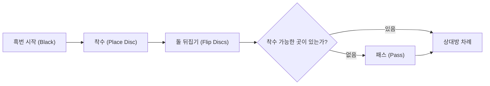

# 보드게임과 인공지능: 오셀로의 규칙과 전략 패턴, 완전 해결로 가는 길

"배우는 데 1분, 마스터하는 데 평생(A minute to learn, a lifetime to master)" —— 이는 전 세계에서 널리 사랑받는 추상 전략 보드게임 **오셀로** (Othello / 리버시)의 가장 유명한 캐치프레이즈입니다. $8 \times 8$ 크기의 격자판과 흑백 양면으로 칠해진 64개의 돌이라는 극히 단순한 구성임에도 불구하고, 그로부터 파생되는 전술적 변화는 무한에 가까워 오랜 세월 동안 인간의 지성을 매료시켜 왔습니다.

인공지능(AI)의 눈부신 발전과 더불어 오셀로는 체스, 쇼기, 바둑과 함께 컴퓨터 과학 및 탐색 알고리즘 연구의 핵심 벤치마크로 기능해 왔습니다. 본 글에서는 오셀로 게임이 지닌 본질적인 수학적 복잡도, 인간 챔피언과 AI가 발전시켜 온 핵심 전략 패턴, 그리고 2023년 마침내 달성된 역사적 사건인 '오셀로의 수학적 완전 해결(약한 해결)'의 기술적 의미를 상세히 살펴봅니다.

## 1. 오셀로의 규칙과 게임 트리 복잡도

오셀로의 규칙은 직관적입니다. 흑과 백이 번갈아 판 위에 돌을 놓으며, 자신이 놓은 돌과 이미 놓여 있던 자신의 돌 사이에 상대방의 돌을 가로, 세로, 대각선 방향으로 끼워 넣으면 그 돌들을 모두 뒤집어 자신의 색으로 만듭니다. 최종적으로 판이 가득 차거나 양쪽 모두 둘 곳이 없을 때 더 많은 돌을 확보한 쪽이 승리합니다.

이토록 단순한 규칙 이면에는 직관을 초월하는 거대한 탐색 공간이 존재합니다. 게임 이론 및 컴퓨터 과학에서는 보드게임의 규모를 **상태 공간 복잡도(State-space complexity)** 와 **게임 트리 복잡도(Game-tree complexity)** 로 측정합니다.

오셀로에서 발생 가능한 합법적 판 국면의 총수(상태 공간 복잡도)는 약 $10^{28}$ 로 추정됩니다. 첫 수부터 종국까지 가능한 모든 경기 진행 분기 수(게임 트리 복잡도)는 약 $10^{58}$ 에 달합니다.

$$
\text{게임 트리 복잡도} \approx 10^{58}
$$

이는 체스(약 $10^{123}$)나 바둑(약 $10^{360}$)에 비하면 작은 수치이지만, 현대 최신 슈퍼컴퓨터로도 모든 분기를 전수 조사(Brute-force)하는 것은 물리적으로 불가능한 천문학적 규모입니다. 따라서 오셀로 AI 개발의 역사는 어떻게 불필요한 분기를 효율적으로 가지치기(Pruning)하고 중간 국면을 정밀하게 평가하느냐의 역사였습니다.

## 2. 오셀로 AI의 역사와 기술적 진화

컴퓨터 오셀로 연구는 1970년대 후반부터 본격화되었습니다. 초기의 대국 프로그램은 주로 적대적 탐색 기법인 **미니맥스 알고리즘(Minimax algorithm)** 과 **알파-베타 가지치기(Alpha-beta pruning)** 에 의존했습니다.

### 미니맥스 알고리즘과 알파-베타 가지치기
미니맥스 알고리즘은 상대가 항상 자신에게 가장 불리한(상대에게 최선인) 수를 둔다고 가정하고 탐색 깊이의 결과를 역산하는 기법입니다. 그러나 깊이가 깊어질수록 분기 폭발이 일어나므로, 결과에 영향을 주지 않는 하위 트리를 즉시 배제하는 알파-베타 가지치기를 통해 유효 탐색 깊이를 획기적으로 늘렸습니다.

### 평가 함수의 비약적 발전
탐색 알고리즘 못지않게 중요했던 것이 **평가 함수(Evaluation function)** 의 설계였습니다. 초기 프로그램은 단순히 돌의 개수나 특정 좌표(모퉁이 등)에 고정 가중치를 매기는 초보적인 휴리스틱을 사용했습니다.

1990년대에 들어서면서 머신러닝 기법을 활용해 평가 함수의 매개변수를 자동으로 튜닝하는 방식이 자리 잡았습니다. 특히 모서리와 코너 주변의 국소적 패턴 배치가 승률에 미치는 영향을 대규모 기보로부터 학습하는 '패턴 평가 함수'가 도입되면서 AI의 실력은 인간 세계 챔피언을 능가하기 시작했습니다. 1997년 마이클 뷰로(Michael Buro)가 개발한 프로그램 **Logistello** 가 당시 인간 세계 챔피언 무라카미 다케시를 상대로 6전 전승을 거둔 것은 AI 역사에 기록된 중대한 이정표였습니다.

## 3. 오셀로의 심오한 전략적 패턴

톱 프로 기사와 강력한 AI 엔진들이 공유하는 현대 오셀로의 핵심 전략은 단순히 초반에 돌을 많이 뒤집는 것이 아니라, 판의 '지배권'과 '안정성'을 확보하는 데 집중됩니다.

### ① 귀(모퉁이)의 절대적 가치와 '확정석'
오셀로에서 가장 기본적인 승리 공식은 4개의 귀(Corner)를 장악하는 것입니다. 귀에 놓인 돌은 게임이 끝날 때까지 절대로 뒤집히지 않으며, 이를 **확정석(Stable discs)** 이라고 부릅니다. 귀를 선점하면 변을 따라 안전하게 확정석 영역을 넓혀 나갈 수 있어 게임을 결정적으로 유리하게 이끌 수 있습니다.

### ② 기동력(Mobility)의 확보와 상대 억제
중반전에서 승패를 가르는 가장 중요한 개념은 **기동력(착수 가능 수의 개수)** 입니다. 현대 오셀로 이론의 핵심은 "나의 둘 곳은 최대한 많이 확보하고, 상대방의 둘 곳은 극단적으로 제한하는 것"입니다. 상대의 선택지를 말려 죽임으로써, 상대가 어쩔 수 없이 위험한 악수(모퉁이 인접 지역 등)를 두도록 강제하는 '추크츠방(Zugzwang)' 상태로 몰아넣는 전략입니다.

### ③ 위험한 영역: X-스퀘어와 C-스퀘어
모퉁이의 대각선 안쪽 칸을 **X-스퀘어**, 모퉁이에 바로 맞닿은 변의 칸을 **C-스퀘어** 라고 부릅니다. 초중반에 이곳에 먼저 돌을 놓으면 상대에게 귀를 거저 헌납하게 되므로 초심자에게는 금기시됩니다. 그러나 초일류 기사나 최신 AI는 상대방의 기동력을 완전히 파괴하기 위해 의도적으로 귀를 내주는 '사석(Sacrifice) 전술'을 고도화하여 구사하기도 합니다.

### ④ 패리티(Parity, 우수 빈칸 이론)
종반전의 승리를 결정짓는 것은 **패리티(Parity)** 이론입니다. 판 위의 빈칸들은 종반에 여러 개의 닫힌 독립 구역으로 나뉩니다. 짝수 개의 빈칸이 남은 구역에 상대가 먼저 두게 만들고 자신이 마지막 수를 둠으로써, 그 구역의 마지막 뒤집기 권리를 독점하고 대량 득점을 확정 짓는 고급 종반 수학 이론입니다.

## 4. 2023년의 기념비적 돌파구: 오셀로의 '수학적 완전 해결'

오랜 세월 동안 게임 이론 학계에는 "흑과 백 양측이 한 치의 오차도 없이 최선의 수를 둘 경우, 승부는 흑승인가 백승인가, 아니면 무승부인가?"라는 근원적인 물음(약한 해결)이 풀리지 않은 채 남아 있었습니다.

마침내 2023년, 일본의 컴퓨터 과학자 **타키자와 히로키(Hiroki Takizawa)** 연구팀은 논문을 통해 **"오셀로는 양측이 최선수를 둘 경우 반드시 무승부(32대 32)로 끝난다"** 는 사실을 수학적으로 완전 증명했다고 발표했습니다.

### 해결을 가능하게 한 기술적 접근법
$10^{58}$ 에 달하는 탐색 공간을 해결한 것은 단순한 컴퓨터 파워의 결과가 아니었습니다. 강력한 오픈소스 오셀로 엔진 **Edax** 를 기반으로 고도화된 탐색 최적화 기법이 총동원되었습니다.
1. **패턴 평가 함수를 결합한 초정밀 알파-베타 가지치기**: 최적의 착수 후보를 최우선 순위로 탐색하도록 정렬하여 가지치기 효율을 극한으로 끌어올렸습니다.
2. **초고속 종반 해석기**: 비트보드(Bitboard) 연산을 극대화하여 빈칸이 30개 미만으로 남은 시점부터 순식간에 종국 결과를 전수 계산했습니다.
3. **대규모 클라우드 분산 컴퓨팅**: 수개월에 걸쳐 슈퍼컴퓨터급 분산 인프라를 가동하여 초반 오프닝 트리의 모든 분기를 체계적으로 검증했습니다.

### 체스, 체커에 이은 역사적 쾌거
조합 게임 이론(Combinatorial game theory)에서 게임의 '해결(Solved game)'은 세 단계로 정의됩니다.
- **초약한 해결(Ultra-weakly solved)**: 초기 국면에서 수학적 정리 등을 통해 결과(승/패/무)만 알려진 상태.
- **약한 해결(Weakly solved)**: 초기 상태부터 결과에 이르는 완전한 최적 수순의 트리가 계산된 상태.
- **강한 해결(Strongly solved)**: 임의의 모든 합법 국면에서 최선의 수와 최종 결과를 즉시 산출할 수 있는 상태.

2023년 오셀로의 해결은 **약한 해결(Weakly solved)** 에 해당합니다. 이는 2007년 캐나다 조너선 셰퍼(Jonathan Schaeffer) 교수 연구팀에 의해 해결된 서양장기(Checkers) 이후, 세계적인 메이저 보드게임 중 완벽하게 해결된 가장 위대한 학술적 성과입니다.

## 5. 인공지능과 보드게임의 미래

오셀로의 이론적 결과가 '무승부'로 밝혀졌다고 해서 게임의 매력이 사라진 것은 결코 아닙니다. 인간의 지각 능력 안에서 $10^{58}$ 의 게임 트리는 여전히 무한하며, 심리전과 직관이 교차하는 마인드 스포츠로서의 오셀로는 지금도 전 세계 수많은 플레이어를 열광시키고 있습니다.

나아가 오셀로 완전 분석 과정에서 확립된 **탐색 공간 압축 기법**, **비트 연산 최적화**, **분산 스케줄링 알고리즘** 은 물류 경로 최적화, 신약 분자 구조 탐색, 반도체 배치 배선, 양자 컴퓨팅 알고리즘 검증 등 복잡 다단한 현대 산업의 난제들을 해결하는 데 귀중한 토대가 되고 있습니다.

오셀로의 흑백 격자판은 인간의 지적 호기심과 인공지능의 계산력이 만나 서로를 드높인 가장 아름다운 지적 탐구의 장이었습니다.

---

*참고 문헌*
- Takizawa, H. (2023). "Othello is Solved". arXiv preprint arXiv:2310.19387.
- Buro, M. (1997). "The Othello Match of the Year: Takeshi Murakami vs. Logistello".
- 세계 오셀로 연맹(WOF) 공식 기보 및 기술 보고서
