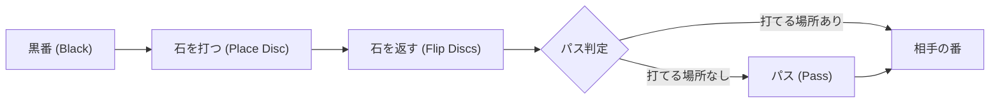

# ボードゲームとAI: オセロのルールと戦略パターン、完全解析への道

「覚えるのは1分、極めるのは一生（A minute to learn, a lifetime to master）」——これは、世界中で愛されているボードゲーム「オセロ（Othello / リバーシ）」の有名なキャッチフレーズです。8×8の盤面と、白黒に塗り分けられた64枚の石という極めてシンプルな構成でありながら、そこから生み出される展開は無限にも等しく、古くから人間の知能を魅了し続けてきました。

そして近年、人工知能（AI）の急速な発展に伴い、オセロはチェスや将棋、囲碁と同様に、AI研究の重要なベンチマークとして扱われてきました。本記事では、オセロというゲームが持つ本質的な複雑性、人間やAIが導き出してきた戦略パターン、そして2023年に達成された「完全解析（オセロが数学的に解決されたこと）」の歴史的意義について、技術的な視点から詳細に解説します。

## 1. オセロのルールとゲーム木の複雑性

オセロのルールは至ってシンプルです。黒番と白番が交互に石を打ち、相手の石を挟んで裏返し、最終的に盤面上の自分の色の石が多い方が勝利となります。

しかし、このシンプルなルールから生み出されるゲームの複雑性は、人間の直感を遥かに超えています。ボードゲームの複雑さを測る指標として「状態空間複雑性（State-space complexity）」と「ゲーム木の複雑性（Game-tree complexity）」があります。

オセロの場合、盤面に配置されうる石のパターン（状態空間複雑性）は約 $10^{28}$ 通りと推定されています。さらに、初手から終局までのゲーム展開の分岐の数（ゲーム木の複雑性）は、およそ $10^{58}$ とされています。

$$
\text{ゲーム木の複雑性} \approx 10^{58}
$$

これはチェス（約 $10^{123}$）や囲碁（約 $10^{360}$）と比較すると小さい数字ですが、それでもなお、現在のスーパーコンピュータを用いてもすべての分岐を総当たり（ブルートフォース）で計算することは事実上不可能な天文学的な数字です。したがって、オセロのAI開発においては、いかに効率的に探索空間を削減し、現在の局面を正確に評価するかが長年の課題でした。

## 2. オセロAIの歴史と技術的進化

オセロをプレイするプログラムの歴史は古く、1970年代から研究が始まっています。初期のAIプログラムは、主に「ミニマックス法（Minimax algorithm）」と「アルファベータ法（Alpha-beta pruning）」という探索アルゴリズムに基づいていました。

### ミニマックス法とアルファベータ枝刈り
ミニマックス法は、自分が最も有利になる手を、相手が最も自分にとって不利になる（相手にとって有利になる）手を打つと仮定して、数手先まで探索する手法です。しかし、すべての分岐を計算すると時間がかかりすぎるため、結果に影響を与えない無駄な探索を省略する「アルファベータ枝刈り」が併用されます。

### 評価関数の進化
探索アルゴリズム以上に重要だったのが、「評価関数（Evaluation function）」の設計です。評価関数とは、現在の盤面が自分にとってどれくらい有利かを示す数値を算出する数式やアルゴリズムのことです。初期のプログラムは「石の数が多い方が有利」「角（隅）を取ると有利」といった、人間の経験則（ヒューリスティクス）をパラメータ化していました。

その後、1990年代に入ると、機械学習を用いて評価関数のパラメータを自動調整するアプローチが登場しました。特に、大量の棋譜データをもとに、特定のパターン（盤面の局所的な配置）が勝率にどう寄与するかを学習する手法が主流となり、AIの強さは人間の世界チャンピオンを凌駕するレベルに到達しました。有名なオセロプログラム「Logistello」が1997年に当時の世界チャンピオンである村上健氏に6戦全勝したことは、AIの歴史における大きなマイルストーンとして記憶されています。

## 3. オセロの深遠な戦略パターン

オセロAIが学習し、また人間のトッププレイヤーが実践している戦略パターンには、いくつかの重要な概念があります。これらは単なる「石の多寡」ではなく、盤面の「支配力」に関わるものです。

### ① 角（隅）の重要性と「確定石」
オセロにおける最も基本的な戦略は「角（隅）を取る」ことです。角に置かれた石は、ゲーム終了まで絶対に裏返されることがありません。これを「確定石」と呼びます。角を取ることで、その辺に沿ってさらに確定石を増やすことが容易になり、ゲームを決定的に有利に進めることができます。

### ② モビリティ（着手可能手数）の確保
中盤において最も重要な概念が「モビリティ（Mobility）」です。これは「自分が打てる場所の数」を意味します。自分のモビリティを大きく保ち、相手のモビリティを奪う（打てる場所をなくす）ことが、現代オセロにおける最強の基本戦略です。
相手が打つ場所を制限することで、相手は不利な場所（例えば角の隣など）に打たざるを得なくなります。これを「手渡し」や「相手に悪手を強制する」と表現します。

### ③ 危険なマス：X打ちとC打ち
角の斜め内側にあるマスを「Xマス」、角の隣（辺寄り）にあるマスを「Cマス」と呼びます。ここに石を打つと、相手に角を取られるリスクが跳ね上がるため、序盤から中盤にかけてはこれらのマスを避けるのが鉄則です。しかし、上級者やAIは、相手に角を取らせた上で、他の場所でより大きな利益を得る高度な戦略（サクリファイス）を用いることもあります。

### ④ パリティ（偶数空き理論）
終盤戦における勝敗を分けるのが「パリティ（Parity）」の概念です。オセロの盤面には、通常、空きマスが偶数個の領域と奇数個の領域が存在します。相手が打った偶数個の空き領域に自分が打ち返すことで、常にその領域での「最後の一手」を自分が打てるようにコントロールする戦略です。これにより、確定石を効率よく確保することができます。

## 4. 2023年のブレイクスルー：オセロの「完全解析」

長らく、オセロは「双方が最善を尽くした場合、黒（先手）が勝つのか、白（後手）が勝つのか、それとも引き分けになるのか」という究極の問い（弱解決）に対する答えが出ていませんでした。

しかし、2023年、情報処理の歴史に名を刻む劇的なブレイクスルーが発表されました。日本人研究者の滝沢宏樹（Hiroki Takizawa）氏による論文において、**「オセロは双方が最善手を打ち続けた場合、最終結果は必ず引き分け（32対32）になる」**ことが数学的に証明されたのです。

### 解析へのアプローチ
この証明は、オセロの探索空間 $10^{58}$ を力技で全て計算したわけではありません。強力なオセロAI「Edax」を基盤に、高度なアルファベータ枝刈り、置換表（Transposition table）の最適化、そして大規模な並列計算を駆使することで実現しました。

探索のプロセスでは、以下のような技術が貢献しました。
1. **強力な評価関数による枝刈り**: 機械学習で鍛え上げられた評価関数を用い、明らかに不利な手を初期段階で計算対象から除外（枝刈り）しました。
2. **終盤ソルバーの進化**: 空きマスが残り数十個になった段階から、結果を完全に読み切る終盤ソルバーの高速化が、探索時間を劇的に短縮しました。
3. **クラウドコンピューティング**: スーパーコンピュータクラスの計算資源を長期間にわたって稼働させ、膨大な局面の解析を行いました。

### チェッカーに次ぐ快挙
「ゲームが解決される（Solved game）」ことにはいくつかの段階があります。
- **超弱解決 (Ultra-weakly solved):** 初期状態から結果（勝敗または引き分け）のみがわかっている状態。
- **弱解決 (Weakly solved):** 初期状態から結果に至る「最善手順」がわかっている状態。
- **強解決 (Strongly solved):** どんな局面からでも、完全な最善手と結果が計算できる状態。

2023年のオセロの解析は「弱解決」にあたります（初手からの最善進行による結果が引き分けと証明された）。これは、2007年に完全解析された「チェッカー」以来の、世界的にプレイされている主要なボードゲームにおける歴史的快挙です。

## 5. AIとボードゲームの未来

オセロが「引き分け」という結論に達したことは、ゲームの魅力が失われたことを意味するものではありません。人間にとってオセロの探索空間は依然として無限に等しく、その戦略性や競技としての奥深さは全く色褪せていません。

むしろ、AIがオセロを解明したことは、情報科学と計算機能力の驚異的な進歩を示すものです。探索アルゴリズムの効率化や、並列計算のスケジューリング、そして状態空間の圧縮技術など、オセロ解析のために生み出された技術は、今後も最適化問題、創薬、物流管理、さらには量子コンピューティングの領域など、様々な実社会の複雑な問題解決に応用されていくでしょう。

人間が長い時間をかけて築き上げてきた戦略パターン（モビリティやパリティなど）が、最終的に「引き分け」に向かう最善手の一部として数学的に裏付けられたことは、人間の直感や論理的思考の素晴らしさを証明しているとも言えます。

オセロの白黒の盤面は、AIと人間の知性が交差し、互いに高め合う美しい知のキャンバスなのです。

---

*参考文献*
- Takizawa, H. (2023). "Othello is Solved". arXiv preprint.
- Buro, M. (1997). "The Othello Match of the Year: Takeshi Murakami vs. Logistello".
- 現代オセロの最新理論に関する各種文献および研究報告
