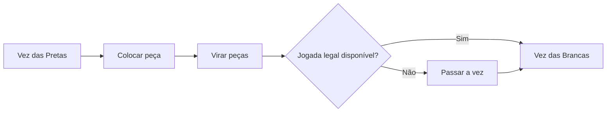

# Jogos de tabuleiro e IA: Regras de Otelo, padrões estratégicos e o caminho para a resolução completa

"Um minuto para aprender, uma vida inteira para dominar (A minute to learn, a lifetime to master)" — este famoso lema sintetiza perfeitamente o encanto de **Otelo** (Othello / Reversi), um dos jogos de tabuleiro abstrato mais admirados do mundo. Com uma grelha de 8x8 casas e 64 peças bicolores de faces preta e branca, a sua estrutura é incrivelmente minimalista, mas as ramificações de jogo que dela emergem fascinam o intelecto humano há gerações.

Com a aceleração dos avanços em inteligência artificial (IA), Otelo tornou-se, a par do xadrez, do shogi e do go, um dos parâmetros essenciais para medir a eficácia de algoritmos de exploração combinatória. Este artigo analisa a complexidade matemática do jogo, os padrões estratégicos estabelecidos por mestres e motores computacionais e o marco histórico de 2023: a resolução matemática completa de Otelo.

## 1. Regras de Otelo e a complexidade da árvore de jogo

As regras de Otelo são notavelmente diretas. Dois jogadores, Pretas e Brancas, alternam jogadas colocando peças no tabuleiro. Uma jogada consiste em posicionar uma peça de forma a cercar uma ou mais peças adversárias em linha reta contínua (horizontal, vertical ou diagonal) entre a nova peça e outra peça da sua cor. As peças cercadas são viradas para a cor de quem jogou. O jogo termina quando o tabuleiro fica cheio ou quando nenhum jogador pode mover; vence quem tiver o maior número de peças da sua cor.

Sob esta aparente simplicidade, esconde-se um espaço de pesquisa que desafia a intuição humana. Na teoria combinatória dos jogos, a escala de um jogo é quantificada por duas métricas principais: a **complexidade do espaço de estados** (State-space complexity) e a **complexidade da árvore de jogo** (Game-tree complexity).

Em Otelo, o número estimado de configurações legais alcançáveis (complexidade do espaço de estados) é de cerca de $10^{28}$. Já o número total de caminhos possíveis desde a abertura até aos estados terminais (complexidade da árvore de jogo) é estimado em aproximadamente $10^{58}$.

$$
\text{Complexidade da árvore de jogo} \approx 10^{58}
$$

Embora este valor seja inferior ao do xadrez (cerca de $10^{123}$) ou ao do go (cerca de $10^{360}$), continua a ser um número astronómico. Percorrer $10^{58}$ ramificações por força bruta direta é fisicamente impossível nos supercomputadores atuais. Por isso, a investigação de IA em Otelo concentrou-se durante décadas em métodos eficientes de poda de ramos e na construção de funções heurísticas de avaliação refinadas.

## 2. História e evolução da IA em Otelo

A investigação computacional sobre Otelo teve início no final da década de 1970. Os primeiros programas apoiavam-se em algoritmos clássicos de pesquisa competitiva: o **algoritmo Minimax** combinado com a **poda Alfa-Beta** (Alpha-beta pruning).

### Algoritmo Minimax e poda Alfa-Beta
O algoritmo Minimax calcula a jogada ótima assumindo que o oponente escolherá sempre a resposta que minimiza a vantagem do jogador ativo. Para evitar a explosão combinatória associada ao aumento da profundidade de cálculo, a poda Alfa-Beta elimina ramos inteiros da árvore que não podem influenciar a decisão final, expandindo consideravelmente o alcance da análise.

### A evolução das funções de avaliação
Tão vital quanto o motor de busca foi o desenvolvimento da função de avaliação, responsável por atribuir uma pontuação numérica a posições intermediárias. Os motores pioneiros utilizavam heurísticas simples, como a contagem bruta de peças ou pontuações estáticas em casas privilegiadas (como os cantos).

Na década de 1990, a introdução de técnicas de aprendizagem automática revolucionou a afinação dos parâmetros. Através de tabelas de padrões (Pattern tables), o software passou a medir a correlação estatística entre configurações de bordas e diagonais e a probabilidade de vitória, analisando milhões de partidas de grandes mestres e sessões de auto-jogo. Em 1997, o programa **Logistello**, concebido por Michael Buro, derrotou o então campeão mundial humano Takeshi Murakami por expressivos 6 a 0, consolidando a superioridade dos algoritmos.

## 3. Padrões estratégicos fundamentais em Otelo

Tanto os mestres humanos como os motores de IA desenvolveram princípios táticos essenciais. No Otelo de alto nível, o objetivo primordial não é virar o máximo de peças na fase inicial, mas sim consolidar estabilidade e controlo de tempo:

### 1. Controlo dos cantos e «peças estáveis»
O princípio basilar em Otelo é a conquista dos quatro cantos. Uma peça colocada num canto nunca mais poderá ser virada até ao fim da partida. Tais peças são denominadas **peças estáveis** (Stable discs). Assegurar um canto permite expandir faixas de peças invulneráveis ao longo das bordas do tabuleiro.

### 2. Gestão de mobilidade
No meio-jogo, a **mobilidade** (o número de lances legais disponíveis) torna-se o indicador crucial. A regra de ouro é manter as opções próprias elevadas enquanto se restringe progressivamente o leque de escolhas do oponente. Ao ficar sem jogadas seguras, o adversário entra em "zugzwang", sendo forçado a efetuar lances desfavoráveis que cedem cantos e bordas.

### 3. Casas perigosas: Casas X e casas C
As casas situadas na diagonal imediata de um canto são denominadas **casas X**, e as casas adjacentes ao canto ao longo das bordas são as **casas C**. Ocupar estas casas prematuramente concede frequentemente ao oponente uma rota desimpedida para conquistar o canto adjacente. Embora os iniciantes as evitem sistematicamente, mestres e motores recorrem por vezes a sacrifícios calculados em casas C para estrangular a mobilidade adversária.

### 4. Paridade (Teoria dos espaços pares)
Na fase final, a **paridade** decide o vencedor. O tabuleiro vazio divide-se frequentemente em regiões isoladas. Se um jogador assegurar que uma região tem um número par de casas livres e responder sempre que o adversário nela jogar, garante o direito de jogar a última peça nessa área, assegurando viragens finais decisivas.

## 4. O avanço de 2023: A resolução matemática completa

Durante décadas, permaneceu em aberto a questão elementar da teoria dos jogos: se ambos os jogadores jogarem com perfeição matemática absoluta, qual é o desfecho garantido de Otelo? Vitória das Pretas, vitória das Brancas ou empate?

Em 2023, o investigador japonês **Hiroki Takizawa** publicou a prova matemática definitiva: **Otelo está fracamente resolvido; sob jogo perfeito de ambas as partes, a partida termina invariavelmente empatada (32 a 32)**.

### A abordagem computacional
Resolver uma árvore de jogo com $10^{58}$ nós exigiu mais do que processamento bruto. Utilizando uma versão otimizada do motor de código aberto **Edax**, a demonstração baseou-se em:
1. **Poda Alfa-Beta refinada por tabelas de padrões**: Ordenação heurística rigorosa para podar ramos subótimos de imediato.
2. **Solucionadores ultra-rápidos de finais**: Uso de operações com tabuleiros de bits (Bitboards) para calcular exaustivamente qualquer posição com menos de 30 casas vazias em frações de segundo.
3. **Computação distribuída em nuvem**: Agrupamentos de servidores processaram ininterruptamente durante meses todas as aberturas fundamentais.

### Classificação de soluções na teoria dos jogos
Distinguem-se três níveis de resolução em jogos combinatórios:
- **Ultra-fracamente resolvido (Ultra-weakly solved)**: Determina-se formalmente o resultado (vitória, derrota ou empate) a partir da posição inicial sem especificar a árvore de variantes.
- **Fracamente resolvido (Weakly solved)**: Demonstra-se uma árvore explícita de variantes ou um algoritmo que assegura o resultado teórico a partir da posição inicial.
- **Fortemente resolvido (Strongly solved)**: É possível calcular o lance ótimo e o resultado garantido a partir de qualquer posição legal arbitrária.

A demonstração de Takizawa corresponde a uma **resolução fraca**. É o maior triunfo em jogos de tabuleiro clássicos desde que a equipa de Jonathan Schaeffer resolveu as Damas (Checkers) em 2007.

## 5. O futuro da IA e dos jogos de estratégia

O facto de Otelo estar resolvido como empate não enfraquece a paixão pelo jogo. Para os humanos, a árvore de estados permanece funcionalmente inesgotável, e a cena competitiva global continua vibrante.

No campo da ciência da computação, os métodos aperfeiçoados durante este projeto — compressão de árvores de busca, aceleração por bitboard e computação distribuída massiva — encontram aplicações diretas na resolução de problemas industriais complexos, na logística de distribuição, na biologia computacional e na simulação quântica.

O tabuleiro de 64 casas de Otelo permanece como um testemunho duradouro do encontro harmónico entre a mente humana e a capacidade analítica da inteligência artificial.

---

*Referências bibliográficas*
- Takizawa, H. (2023). "Othello is Solved". arXiv preprint arXiv:2310.19387.
- Buro, M. (1997). "The Othello Match of the Year: Takeshi Murakami vs. Logistello".
- Documentos técnicos e relatórios de campeonatos da Federação Mundial de Otelo (WOF).
