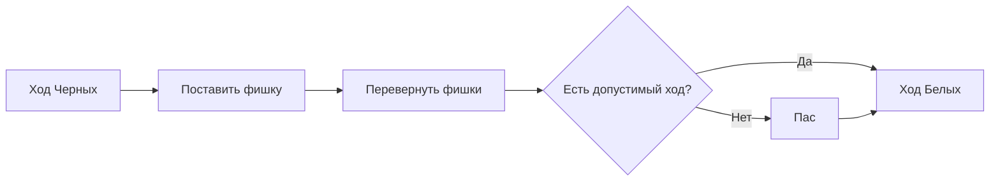

# Настольные игры и ИИ: правила Отелло, стратегические паттерны и путь к полному математическому решению

«Минута на обучение, целая жизнь на совершенствование (A minute to learn, a lifetime to master)» — этот всемирно известный девиз описывает суть игры **Отелло** (также известной как Реверси). На первый взгляд, доска 8x8 и 64 двусторонние черно-белые фишки представляют собой максимально простую структуру. Однако порождаемое этим минимализмом стратегическое разнообразие уже более столетия восхищает математиков и любителей интеллектуальных игр по всему миру.

С бурным развитием искусственного интеллекта (ИИ) Отелло наряду с шахматами, сёги и го стало важнейшим полигоном для алгоритмов поиска и машинного обучения. В этой статье мы подробно рассмотрим математическую сложность игры, стратегические паттерны, выработанные людьми и компьютерными программами, а также эпохальный прорыв 2023 года: полное математическое решение Отелло.

## 1. Правила Отелло и сложность игрового дерева

Правила Отелло предельно прозрачны. Два игрока, Черные и Белые, поочередно выставляют фишки на доску. Если фишка ставится так, что между ней и другой фишкой того же цвета по горизонтали, вертикали или диагонали оказывается непрерывный ряд фишек соперника, все они переворачиваются и принимают цвет сделавшего ход. Партия завершается, когда доска заполнена или ни у кого нет допустимых ходов; побеждает обладатель большего числа фишек своего цвета.

За этой обманчивой простотой скрывается колоссальное комбинаторное пространство. В теории игр сложность задачи оценивают двумя фундаментальными параметрами: **сложностью пространства состояний** (State-space complexity) и **сложностью дерева игры** (Game-tree complexity).

В Отелло общее число допустимых позиций на доске (сложность пространства состояний) оценивается величиной порядка $10^{28}$. А совокупное число возможных партий от начальной расстановки до финального хода (сложность дерева игры) составляет приблизительно $10^{58}$.

$$
\text{Сложность дерева игры} \approx 10^{58}
$$

Хотя это число меньше, чем в шахматах (около $10^{123}$) или в го (около $10^{360}$), оно остается астрономическим. Полный перебор (Brute-force) $10^{58}$ ветвей невозможен даже на современных суперкомпьютерных кластерах. Поэтому исследования ИИ для Отелло десятилетиями концентрировались на эффективных алгоритмах отсечения ветвей и высокоточных оценочных функциях.

## 2. История и технологическая эволюция ИИ в Отелло

Исследования алгоритмов для игры в Отелло стартовали в конце 1970-х годов. Первые программы строились на классических принципах антагонистического поиска: **алгоритме Минимакс** (Minimax) в сочетании с **Альфа-бета отсечением** (Alpha-beta pruning).

### Алгоритм Минимакс и Альфа-бета отсечение
Минимакс определяет лучший ход, предполагая, что противник всегда выбирает ответное действие, минимизирующее выгоду текущего игрока. Поскольку ветвление при увеличении глубины растет экспоненциально, альфа-бета отсечение позволяет отбрасывать ветви, которые математически не способны повлиять на финальное решение в корне дерева, многократно увеличивая эффективную глубину расчета.

### Эволюция оценочных функций
Не менее важным фактором была разработка оценочной функции (Evaluation function), оценивающей привлекательность промежуточных позиций. Ранние программы полагались на элементарные эвристики: подсчет количества фишек или присвоение статических весов отдельным полям (например, углам).

В 1990-х годах произошел качественный скачок благодаря методам машинного обучения. Оценочные функции на основе таблиц паттернов (Pattern tables) стали автоматически калибровать весовые коэффициенты конфигураций на краях и диагоналях доски, анализируя миллионы партий гроссмейстеров и сессий самообучения. В 1997 году программа **Logistello**, созданная Майклом Бьюро (Michael Buro), разгромила действующего чемпиона мира среди людей Такеши Мураками со счетом 6:0, доказав безоговорочное превосходство алгоритмов.

## 3. Глубокие стратегические концепции в Отелло

Мастера игры и компьютерные движки сформировали систему стратегических принципов. В современном Отелло высокого уровня цель заключается не в том, чтобы захватить как можно больше фишек на ранней стадии, а в контроле темпа и стабильности:

### 1. Контроль углов и «стабильные фишки»
Главное тактическое правило Отелло — захват четырех угловых полей. Фишка, занявшая угол доски, уже никогда не может быть перевернута до самого конца партии. Такие фишки называют **стабильными** (Stable discs). Опираясь на угол, игрок может методично выстраивать защищенные цепочки вдоль бортов, формируя непреодолимое позиционное преимущество.

### 2. Управление мобильностью
В миттельшпиле ключевым фактором становится **мобильность** (число доступных допустимых ходов). Фундаментальный принцип звучит так: «сохраняй максимум собственных вариантов хода, одновременно лишая ходов противника». Когда у оппонента заканчиваются безопасные поля, он попадает в цугцванг и вынужден делать разрушительные ходы, отдавая углы и края доски.

### 3. Опасные поля: X-поля и C-поля
Поля, примыкающие к углам по диагонали, называются **X-полями**, а поля, соседствующие с углом вдоль края, — **C-полями**. Занятие этих полей в дебюте или раннем миттельшпиле обычно позволяет сопернику мгновенно занять заветный угол. Начинающим игрокам категорически запрещается ходить на эти поля, однако гроссмейстеры и современные ИИ иногда применяют рассчитанные жертвы на C-полях ради стратегического перехвата инициативы.

### 4. Паритет (Теория четных зон)
В эндшпиле решающую роль играет концепция **паритета**. Оставшиеся пустые поля обычно распадаются на изолированные области. Если игрок добивается того, чтобы в отдельной области оставалось четное количество пустых клеток, и отвечает на каждый ход противника в этой зоне, он гарантирует себе право последнего хода в этом секторе, забирая ключевые перевороты фишек.

## 4. Прорыв 2023 года: Полное математическое решение Отелло

На протяжении десятилетий перед математиками стоял нерешенный вопрос: если оба игрока действуют абсолютно безошибочно от первого до последнего хода, каков теоретический исход игры в Отелло? Победа Черных, победа Белых или ничья?

В 2023 году японский исследователь **Хироки Такидзава** (Hiroki Takizawa) опубликовал фундаментальное исследование, в котором математически доказал: **Отелло является слабо решенной игрой; при идеальной игре с обеих сторон партия неизбежно завершается вничью (32:32)**.

### Технологическая база доказательства
Решение игрового дерева масштабом $10^{58}$ узлов потребовало не просто вычислительной мощности, а глубокой алгоритмической оптимизации на основе открытого движка **Edax**:
1. **Альфа-бета поиск с эвристиками паттернов**: Предварительное упорядочивание ходов обеспечило максимальную частоту отсечения заведомо проигрышных ветвей.
2. **Сверхбыстрые эндшпильные солверы**: Использование битовых досок (Bitboards) позволило мгновенно и без потерь просчитывать окончания, когда на доске оставалось менее 30 свободных полей.
3. **Распределенные облачные вычисления**: Серверные кластеры непрерывно обсчитывали миллионы транспозиций дебютных линий на протяжении нескольких месяцев.

### Классификация решенных игр
В комбинаторной теории игр различают три уровня решения:
- **Ультра-слабо решенная (Ultra-weakly solved)**: Математически доказан исход (победа, поражение или ничья) из начальной позиции без предъявления дерева конкретных ходов.
- **Слабо решенная (Weakly solved)**: Построен полный алгоритм или дерево ходов, гарантирующий теоретический результат от самого первого хода.
- **Сильно решенная (Strongly solved)**: Для любого допустимого состояния доски можно за разумное время вычислить абсолютно лучший ход и исход партии.

Результат Такидзавы представляет собой **слабое решение** Отелло. Это крупнейшее достижение в области традиционных настольных игр с момента слабого решения шашек (Checkers) командой Джонатана Шеффера в 2007 году.

## 5. Будущее ИИ и комбинаторных игр

Доказательство того, что идеальная партия в Отелло ведет к ничьей, нисколько не снижает интереса к игре со стороны людей. Для человеческого восприятия пространство состояний остается безграничным, а турнирная борьба и тактическая красота партий не теряют своей актуальности.

В масштабах всей науки алгоритмы, доведенные до совершенства в ходе решения Отелло — эффективное сжатие деревьев поиска, параллельная координация вычислений и битовые манипуляции, — уже сегодня находят прямое применение в задачах логистической оптимизации, моделировании биологических молекул и верификации квантовых алгоритмов.

Черно-белая доска Отелло остается вечным символом гармоничного союза человеческой интуиции и вычислительной мощи искусственного интеллекта.

---

*Литература*
- Takizawa, H. (2023). "Othello is Solved". arXiv preprint arXiv:2310.19387.
- Buro, M. (1997). "The Othello Match of the Year: Takeshi Murakami vs. Logistello".
- Официальные технические отчеты Всемирной федерации Отелло (WOF).
