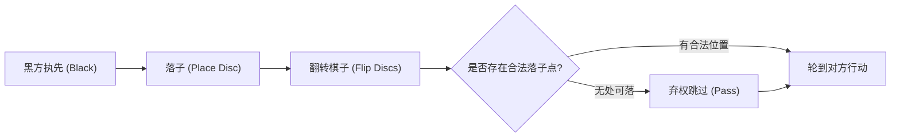

# 棋盘游戏与人工智能：黑白棋的规则、战略模式与完全破解之路

“一分钟学会，一生去精通（A minute to learn, a lifetime to master）” —— 这是风靡全球的棋盘游戏 **黑白棋** （Othello / 奥赛罗 / 反转棋）最为著名的宣传语。黑白棋仅由 $8 \times 8$ 的棋盘与 64 枚黑白双色棋子构成，规则极尽简约，然而其中蕴含的战局变化却近乎无穷，百年来持续吸引着人类智力的探索。

近年来，随着人工智能（AI）技术的迅猛发展，黑白棋与国际象棋、将棋、围棋一道，成为了衡量算法探索与评估能力的关键基准。本文将从技术与博弈论的视角，系统剖析黑白棋的核心复杂度、人类大师与 AI 发展出的经典战略模式，以及 2023 年实现数学完全解析（弱解决）的历史性突破。

## 1. 黑白棋规则与博弈树复杂度

黑白棋的对局规则十分明晰。执黑先行的黑方与白方交替落子。玩家落子时，必须在横、竖或斜向的某一直线上，夹住对方一枚或多枚连续棋子，并将其翻转为自己的颜色。棋盘填满或双方均无法落子时对局结束，棋子多者获胜。

在这套简洁规则的背后，隐藏着远超直觉的庞大计算空间。在博弈论与计算机科学中，通常使用两个指标来量化棋盘游戏的规模： **状态空间复杂度** （State-space complexity）与 **博弈树复杂度** （Game-tree complexity）。

对于黑白棋，棋盘上可能出现的合法局面总数（状态空间复杂度）约为 $10^{28}$ 种。而从初始状态到终局的所有可能对局路径总数（博弈树复杂度）则高达约 $10^{58}$。

$$
\text{博弈树复杂度} \approx 10^{58}
$$

尽管这一数字小于国际象棋（约 $10^{123}$）与围棋（约 $10^{360}$），但对现代超级计算机而言，$10^{58}$ 依然是一个无法通过全量暴力穷举遍历的天文数字。因此，如何高效剪枝与精准评估中间局面，构成了黑白棋 AI 研发数十年来攻坚的核心课题。

## 2. 黑白棋 AI 的历史演进与技术突破

黑白棋程序的研发始于 20 世纪 70 年代。早期的博弈程序主要依托于经典对抗搜索理论： **极小化极大算法** （Minimax algorithm）与 **阿尔法-贝塔剪枝** （Alpha-beta pruning）。

### 极小化极大与阿尔法-贝塔剪枝
极小化极大算法假定对手在每一步都选择对自己最不利（对对手最有利）的最优策略，自底向上评估数步之后的终局或中间价值。由于分支因子会导致搜索树呈指数级爆炸，研究人员结合阿尔法-贝塔剪枝技术，及时舍弃不影响最终决策的无效分支，极大拓展了有效搜索深度。

### 局面评估函数的进化
决定引擎实力的另一支柱是 **评估函数** （Evaluation function）的设计。早期程序往往依赖人工归纳的启发式规则，例如统计盘面子数或为特定格子赋予静态分值（如角点赋予高分）。

进入 20 世纪 90 年代后，机器学习被引入评估函数的自动参数校准。特别是基于特定棋形模式（Pattern-based evaluation）的特征提取技术，使得程序能够从海量对局谱与自我对弈中归纳各区域局部的胜率贡献。1997 年，著名黑白棋软件 **Logistello** 以 6 比 0 击败了当时的人类世界冠军村上健（Takeshi Murakami），标志着 AI 在黑白棋领域全面超越人类顶尖智力水准。

## 3. 黑白棋的深奥战术与战略模式

由顶尖棋手与 AI 算法共同沉淀出的现代黑白棋理论，摒弃了早期盲目求多翻子的误区，将核心聚焦于控制权与稳定性：

### ① 角的绝对价值与“稳定子”
黑白棋最核心的战术原则是抢占四个角。一旦落入角点，该棋子在对局结束前永远无法被翻转，被称为 **稳定子** （Stable discs）。占领角点后，棋手可以沿着边缘逐步向外拓展不可逆转的绝对优势。

### ② 行动力（Mobility）管理
在中局阶段，决定胜负的关键指标是 **行动力** （即己方可合法落子的点数）。现代黑白棋的最高原则是：“在保证己方拥有宽广选择的同时，最大程度压缩对手的落子点”。当对手无好子可下时，将被迫选择下在恶手位置（如角边的危险位置），将战略主动权拱手相让。

### ③ 危险格子：X位与C位
紧挨角点斜向内侧的格子被称为 **X位** ，与角相邻的边位格子被称为 **C位** 。过早占据这些格子极易直接将角点拱手让给对手。因此在开中局阶段，避开 X 位与 C 位是入门铁律。但在高水平对决与 AI 算法中，有时会主动通过弃子牺牲（Sacrifice）换取更为关键的全局行动力。

### ④ 奇偶理论（Parity / 偶数空位理论）
在终局冲刺阶段， **奇偶性** （Parity）理论起着决定性作用。棋盘未落子区域通常会被分割成若干相互隔离的空区。通过控制节奏，确保在包含偶数个空位的区域内，每次由对方先手落子、自己落入该区域最后一步，从而确保该局部绝大部分翻转子归属于己方。

## 4. 2023 年重大突破：黑白棋的“数学完全破解”

多年来，博弈论界一直悬而未决的终极问题是：如果双方都走出绝对完美的招法，黑白棋的最终结果究竟是黑胜、白胜还是和棋？

2023 年，计算机科学界迎来了一座历史性丰碑：日本学者 **泷泽宏树** （Hiroki Takizawa）在研究论文中通过严谨的数学推导与计算验证正式证明： **在双方均采取最优招法的前提下，黑白棋的最终结果必然是平局（32 比 32）** 。

### 求解的技术路径
面对 $10^{58}$ 的庞大博弈树，该研究并非盲目暴力遍历，而是基于顶尖开源引擎 **Edax** ，深度结合了前沿搜索算法与分布式计算资源：
1. **高精度模式评估辅助的深度剪枝** ：依托极致优化的模式表（Pattern tables），大幅提升走步排序精度，最大限度触发剪枝。
2. **高速终局求解器** ：利用极致优化的位棋盘（Bitboard）运算，在剩余空格进入 30 步以内时瞬间穷举局部极值。
3. **大规模云端分布式并行架构** ：将不同开局分支调度至庞大计算集群持续运算数月，系统性完成了首手开局的全部推导。

### 弱解决与博弈论里程碑
在博弈论中，游戏被“解决”（Solved game）分为三个层级：
- **超弱解决 (Ultra-weakly solved)** ：仅通过数学证明得知初始状态下的输赢平结果，但无法给出具体走法。
- **弱解决 (Weakly solved)** ：从初始局面出发，能够给出一条通往理论必然结果（赢或平）的完整最优招法树。
- **强解决 (Strongly solved)** ：无论棋盘处于何种合法局面，都能在有限时间内给出该局面下的最佳招法与最终结局。

泷泽宏树的研究属于 **弱解决** 。这是继 2007 年加拿大科学家 Jonathan Schaeffer 团队破解西洋跳棋（Checkers）以来，全球主流棋类游戏中取得的最为辉煌的数学与计算成果。

## 5. 人工智能与棋盘博弈的未来

黑白棋被证明“终局为平局”，丝毫未削弱这项竞技运动的魅力。对于人类棋手而言，千变万化的战局空间依然如星海般辽阔，竞技博弈的心理较量与智力博弈历久弥新。

更为深远的是，黑白棋完全解析过程中沉淀出的 **博弈树搜索降维** 、 **位运算位图加速** 与 **分布式超算调度算法** ，正在为实际工业界的组合优化、仓储物流调度、新药分子筛选以及量子计算算法验证提供宝贵的技术范式。

黑白交错的方寸棋盘，不仅见证了人类逻辑智慧的深邃，更记录了人工智能探索未知极限的壮丽征程。

---

*参考文献*
- Takizawa, H. (2023). "Othello is Solved". arXiv preprint arXiv:2310.19387.
- Buro, M. (1997). "The Othello Match of the Year: Takeshi Murakami vs. Logistello".
- 世界黑白棋联合会 (WOF) 官方技术报告与经典棋谱文献
