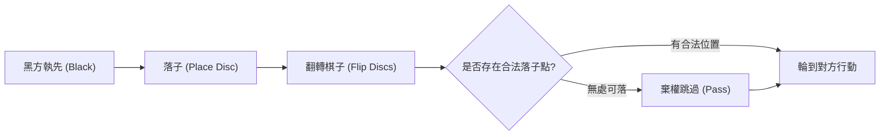

# 棋盤遊戲與人工智慧：黑白棋的規則、戰略模式與完全破解之路

「一分鐘學會，一生去精通（A minute to learn, a lifetime to master）」 —— 這是風靡全球的棋盤遊戲 **黑白棋** （Othello / 奧賽羅 / 翻轉棋）最為著名的宣傳語。黑白棋僅由 $8 \times 8$ 的棋盤與 64 枚黑白雙色棋子構成，規則極盡簡約，然而其中蘊含的戰局變化卻近乎無窮，百年來持續吸引著人類智力的探索。

近年來，隨著人工智慧（AI）技術的迅猛發展，黑白棋與西洋棋、將棋、圍棋一道，成為了衡量演算法探索與評估能力的重要基準。本文將從技術與賽局理論的視角，系統剖析黑白棋的核心複雜度、人類大師與 AI 發展出的經典戰略模式，以及 2023 年實現數學完全解析（弱解決）的歷史性突破。

## 1. 黑白棋規則與博弈樹複雜度

黑白棋的對局規則十分明晰。執黑先行的黑方與白方交替落子。玩家落子時，必須在橫、直或斜向的某一直線上，夾住對方一枚或多枚連續棋子，並將其翻轉為自己的顏色。棋盤填滿或雙方均無法落子時對局結束，棋子多者獲勝。

在這套簡潔規則的背後，隱藏著遠超直覺的龐大計算空間。在賽局理論與電腦科學中，通常使用兩個指標來量化棋盤遊戲的規模： **狀態空間複雜度** （State-space complexity）與 **博弈樹複雜度** （Game-tree complexity）。

對於黑白棋，棋盤上可能出現的合法局面總數（狀態空間複雜度）約為 $10^{28}$ 種。而從初始狀態到終局的所有可能對局路徑總數（博弈樹複雜度）則高達約 $10^{58}$。

$$
\text{博弈樹複雜度} \approx 10^{58}
$$

儘管這一數字小於西洋棋（約 $10^{123}$）與圍棋（約 $10^{360}$），但對現代超級電腦而言，$10^{58}$ 依然是一個無法透過全量暴力窮舉遍歷的天文數字。因此，如何高效剪枝與精準評估中間局面，構成了黑白棋 AI 研發數十年來攻堅的核心課題。

## 2. 黑白棋 AI 的歷史演進與技術突破

黑白棋程式的研發始於 20 世紀 70 年代。早期的博弈程式主要依託於經典對抗搜尋理論： **極小化極大演算法** （Minimax algorithm）與 **阿爾法-貝塔剪枝** （Alpha-beta pruning）。

### 極小化極大與阿爾法-貝塔剪枝
極小化極大演算法假定對手在每一步都選擇對自己最不利（對對手最有利）的最佳策略，自底向上評估數步之後的終局或中間價值。由於分支因子會導致搜尋樹呈指數級爆炸，研究人員結合阿爾法-貝塔剪枝技術，及時捨棄不影響最終決策的無效分支，極大拓展了有效搜尋深度。

### 局面評估函數的進化
決定引擎實力的另一支柱是 **評估函數** （Evaluation function）的設計。早期程式往往依賴人工歸納的啟發式規則，例如統計盤面子數或為特定格子賦予靜態分值（如角點賦予高分）。

進入 20 世紀 90 年代後，機器學習被引入評估函數的自動參數校準。特別是基於特定棋形模式（Pattern-based evaluation）的特徵提取技術，使得程式能夠從海量對局譜與自我對弈中歸納各區域局部的勝率貢獻。1997 年，著名黑白棋軟體 **Logistello** 以 6 比 0 擊敗了當時的人類世界冠軍村上健（Takeshi Murakami），標誌著 AI 在黑白棋領域全面超越人類頂尖智力水準。

## 3. 黑白棋的深奧戰術與戰略模式

由頂尖棋手與 AI 演算法共同沉澱出的現代黑白棋理論，摒棄了早期盲目求多翻子的誤區，將核心聚焦於控制權與穩定性：

### ① 角的絕對價值與「穩定子」
黑白棋最核心的戰術原則是搶佔四個角。一旦落入角點，該棋子在對局結束前永遠無法被翻轉，被稱為 **穩定子** （Stable discs）。佔領角點後，棋手可以沿著邊緣逐步向外拓展不可逆轉的絕對優勢。

### ② 行動力（Mobility）管理
在中局階段，決定勝負的關鍵指標是 **行動力** （即己方可合法落子的點數）。現代黑白棋的最高原則是：「在保證己方擁有寬廣選擇的同時，最大程度壓縮對手的落子點」。當對手無好子可下時，將被迫選擇下在惡手位置（如角邊的危險位置），將戰略主動權拱手相讓。

### ③ 危險格子：X位與C位
緊挨角點斜向內側的格子被稱為 **X位** ，與角相鄰的邊位格子被稱為 **C位** 。過早佔據這些格子極易直接將角點拱手讓給對手。因此在開中局階段，避開 X 位與 C 位是入門鐵律。但在高水準對決與 AI 演算法中，有時會主動透過棄子犧牲（Sacrifice）換取更為關鍵的全局行動力。

### ④ 奇偶理論（Parity / 偶數空位理論）
在終局衝刺階段， **奇偶性** （Parity）理論起著決定性作用。棋盤未落子區域通常會被分割成若干相互隔離的空區。透過控制節奏，確保在包含偶數個空位的區域內，每次由對方先手落子、自己落入該區域最後一步，從而確保該局部絕大部分翻轉子歸屬於己方。

## 4. 2023 年重大突破：黑白棋的「數學完全破解」

多年來，賽局理論界一直懸而未決的終極問題是：如果雙方都走出絕對完美的招法，黑白棋的最終結果究竟是黑勝、白勝還是和局？

2023 年，電腦科學界迎來了一座歷史性豐碑：日本學者 **瀧澤宏樹** （Hiroki Takizawa）在研究論文中透過嚴謹的數學推導與計算驗證正式證明： **在雙方均採取最優招法的前提下，黑白棋的最終結果必然是平局（32 比 32）** 。

### 求解的技術路徑
面對 $10^{58}$ 的龐大博弈樹，該研究並非盲目暴力遍歷，而是基於頂尖開源引擎 **Edax** ，深度結合了前沿搜尋演算法與分散式計算資源：
1. **高精度模式評估輔助的深度剪枝** ：依託極致優化的模式表（Pattern tables），大幅提升走步排序精度，最大限度觸發剪枝。
2. **高速終局求解器** ：利用極致優化的位棋盤（Bitboard）運算，在剩餘空格進入 30 步以內時瞬間窮舉局部極值。
3. **大規模雲端分散式並行架構** ：將不同開局分支排程至龐大計算叢集持續運算數月，系統性完成了首手開局的全部推導。

### 弱解決與賽局理論里程碑
在賽局理論中，遊戲被「解決」（Solved game）分為三個層級：
- **超弱解決 (Ultra-weakly solved)** ：僅透過數學證明得知初始狀態下的輸贏平結果，但無法給出具體走法。
- **弱解決 (Weakly solved)** ：從初始局面出發，能夠給出一條通往理論必然結果（贏或平）的完整最優招法樹。
- **強解決 (Strongly solved)** ：無論棋盤處於何種合法局面，都能在有限時間內給出該局面下的最佳招法與最終結局。

瀧澤宏樹的研究屬於 **弱解決** 。這是繼 2007 年加拿大科學家 Jonathan Schaeffer 團隊破解西洋跳棋（Checkers）以來，全球主流棋類遊戲中取得的最為輝煌的數學與計算成果。

## 5. 人工智慧與棋盤博弈的未來

黑白棋被證明「終局為平局」，絲毫未削弱這項競技運動的魅力。對於人類棋手而言，千變萬化的戰局空間依然如星海般遼闊，競技博弈的心理較量與智力博弈歷久彌新。

更為深遠的是，黑白棋完全解析過程中沉澱出的 **博弈樹搜尋降維** 、 **位運算位圖加速** 與 **分散式超算排程演算法** ，正在為實際工業界的組合優化、倉儲物流排程、新藥分子篩選以及量子計算演算法驗證提供寶貴的技術範式。

黑白交錯的方寸棋盤，不僅見證了人類邏輯智慧的深邃，更記錄了人工智慧探索未知極限的壯麗征程。

---

*參考文獻*
- Takizawa, H. (2023). "Othello is Solved". arXiv preprint arXiv:2310.19387.
- Buro, M. (1997). "The Othello Match of the Year: Takeshi Murakami vs. Logistello".
- 世界黑白棋聯合會 (WOF) 官方技術報告與經典棋譜文獻
