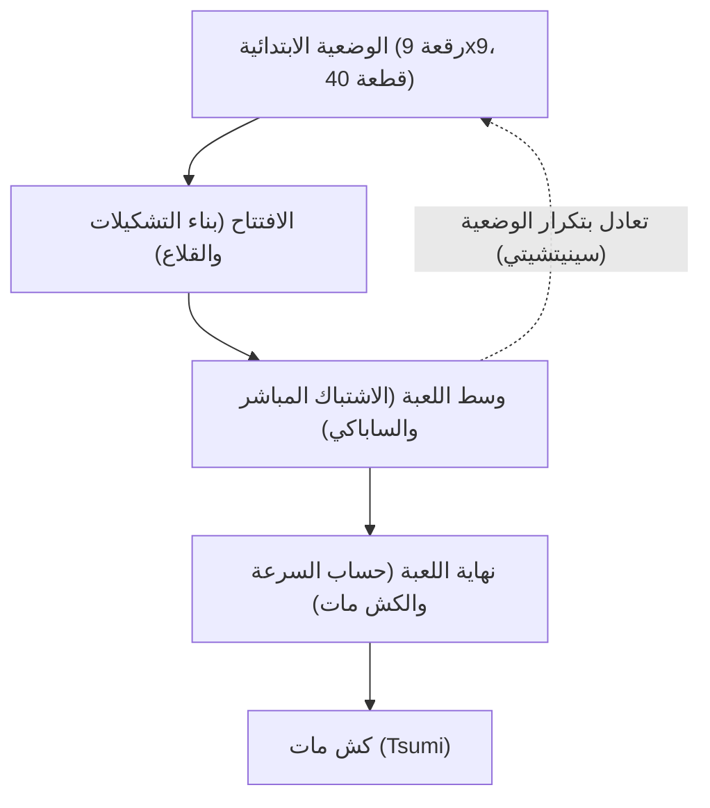

# ألعاب الألواح والذكاء الاصطناعي: قواعد الشوغي، الأنماط الاستراتيجية، وتطور الذكاء الاصطناعي

تُعد لعبة **الشوغي** (Shogi / الشطرنج الياباني)، وهي لعبة استراتيجية تقليدية تعود لقرون طويلة في اليابان، من أعمق الألعاب الذهنية وأكثرها ديناميكية في تاريخ البشرية. وفي ميادين علوم الحاسوب والذكاء الاصطناعي (AI)، مثلت الشوغي لعقود طويلة تحدياً علمياً هائلاً. فبعد أن انتصر الحاسوب Deep Blue التابع لشركة IBM على بطل العالم في الشطرنج الغربي عام 1997، اتجهت أنظار الباحثين نحو الشوغي — اللعبة المحصنة بتعقيد توافقي فلكي وقاعدة إعادة إنزال القطع المبتكرة.

نتناول في هذا المقال القواعد الأساسية للشوغي وتعقيدها الرياضي، ونحلل الأنماط الاستراتيجية عبر مراحلها الثلاث، ونتتبع القفزات التقنية التي نقلت محركات الشوغي من القواعد اليدوية إلى التعلم المعزز العميق، مسلطين الضوء على التحول الجذري في تفكير المحترفين اليوم.

## 1. القواعد الجوهرية والتعقيد البنيوي: لماذا تستعصي الشوغي على القوة الغاشمة؟

الشوغي هي لعبة ذات مجموع صفري، محدودة، حتمية وذات معلومات كاملة، تُلعب بين متنافسين على رقعة مكوّنة من 9x9 مربعات. يمتلك كل لاعب 20 قطعة في بداية المباراة. والهدف الأسمى مطابق للشطرنج: كش مات (*Tsumi*) للملك المعادي (*Osho* أو *Gyokuso*).

أما الفارق الثوري الأعظم الذي يميز الشوغي عن الشطرنج الغربي والشيانغتشي الصيني فهو **قاعدة الإنزال** (*Mochigoma*). فعندما يأسر لاعب قطعة من قطع الخصم، لا تُستبعد تلك القطعة من المباراة، بل تصبح احتياطياً في يد الآسر. وفي أي نقلة لاحقة، يمكن للاعب بدلاً من تحريك قطعة على الرقعة أن يختار «إنزال» (*Drop*) تلك القطعة في أي مربع فارغ لتنضم لجيشه كقطعة صديقة.

تغير هذه القاعدة البنية الرياضية للمباراة جذرياً. ففي الشطرنج التقليدي يؤدي تبادل القطع إلى تصفية الرقعة وتقليص الاحتمالات وصولاً للنهايات. أما في الشوغي، فإن التبادلات تحافظ على عدد القطع الكلي؛ وبدلاً من أن تتلاشى الخيارات، تتفجر التفرعات التكتيكية بصورة أسيّة كلما اقتربت المباراة من نهايتها.

في نظرية الألعاب التوافقية، يُقاس حجم اللعبة بمعيارين أساسيين: **تعقيد فضاء الحالات** و**تعقيد شجرة اللعبة**:

$$
\text{تعقيد فضاء الحالات} \approx 10^{71}
$$
$$
\text{تعقيد شجرة اللعبة} \approx 10^{226}
$$

وبالمقارنة مع الشطرنج الغربي (فضاء حالات يقارب $10^{47}$ وشجرة لعبة تقارب $10^{123}$)، يتبين لنا التحدي الحسابي المذهل للشوغي. فمع متوسط عامل تفرع يبلغ نحو 80 نقلة قانونية لكل حركة (مقابل نحو 35 في الشطرنج)، يستحيل على أي حاسوب فائق استخدام القوة الغاشمة دون خوارزميات تقليم وتشذيب فائقة التطور.

## 2. مراحل المباراة والأنماط الاستراتيجية

تتوزع مباراة الشوغي عبر ثلاث مراحل واضحة المعالم: الافتتاح (*Joban*)، ووسط اللعبة (*Chuban*)، ونهاية اللعبة (*Shuban*). تتطلب كل مرحلة عقلية استراتيجية متباينة:

### 1. الافتتاح: الانتشار، القلاع وتمركز الطابية (الرخ)
يركز الافتتاح على تعبئة القطع من مواقعها الأولى، وبناء خطة هجومية متماسكة مع تحصين الملك داخل «قلعة» دفاعية (*Kakoi*). ينقسم الفكر الاستراتيجي في الافتتاحيات بحسب موقع الطابية (*Hisha*):

- **الطابية الثابتة (Ibisha)**: تبقى الطابية في جناحها الأيمن الأصلي (العمود 2 للأسود)، معتمدة على الهجوم الرأسي المباشر، وتضم أنظمة كلاسيكية مثل *ياغورا* (القلعة) و*كاكوغاواري* (تبادل الفيلة).
- **الطابية المتحركة (Furibisha)**: تُنقل الطابية إلى الوسط أو الجناح الأيسر (الأعمدة من 3 إلى 5). وتتميز خطط مثل *شيكينبيشا* (طابية العمود الرابع) بالمرونة والقدرة على شن الهجمات المرتدة السريعة.

بالموازاة مع ذلك، يُعد بناء القلاع أمراً حيوياً؛ فهياكل مثل **قلعة مينو** الحصينة أو قلعة **أناغوما** (جحر الغرير) فائق الكثافة، حيث يُدفن الملك في الزاوية البعيدة، تؤمن حماية قصوى ضد الهجمات المباغتة.

### 2. وسط اللعبة: التكتيكات ورؤية الرقعة الشاملة (تايكيوكوكان)
ينفجر وسط اللعبة فور حدوث أول التحام مباشر بين القطع. في هذه المرحلة يتكامل الحساب التكتيكي الدقيق مع الرؤية الكلية للرقعة (*تايكيوكوكان*):

- **التيسوجي (Tesuji)**: وهي النقلات التكتيكية البارعة والمجربة، مثل تضحية البيدق الساقط (*تاتاكينو-فو*) لتشتيت دفاعات الخصم، أو شوكة الطابية المزدوجة (*جوجي-بيشا*).
- **كسب القطع مقابل فاعليتها وديناميكيتها (ساباكي)**: في الشوغي، لا تكفي مجرد السيطرة على قطع أكثر، بل الأهم هو سيولة القطع وتناغمها الحركي (*ساباكي*). فالقطعة الثقيلة العاجزة عن الحركة تصبح عبئاً على صاحبها.

واختيار التوقيت المثالي لبدء الهجوم العام (*شيكاكي*) يمثل ذروة النضج الاستراتيجي.

### 3. نهاية اللعبة: حساب السرعة والكش مات
بخلاف نهايات الشطرنج الغربي الهادئة، فإن نهاية الشوغي سباق سرعة مصيري نحو الموت. وبما أنه يمكن إنزال القطع المخزونة في اليد مباشرة أمام أنف الملك المعادي، فإن الصمود الدفاعي المستمر مستحيل.

- **حساب السرعة (سوكودو)**: البوصلة الحاكمة للنهاية هي السرعة النسبية. لا يبحث اللاعب عن حماية مطلقة لملكه، بل يحسب بدقة رياضية ما إذا كان يستطيع إسقاط ملك خصمه قبل أن يسقط ملكه بنقلة واحدة.
- **تسومي (Tsumi - كش مات) وهيسي (Hisshi - كش مات حتمي)**: *تسومي* هي سلسلة من الكش لا فكاك منها تنتهي بأسر الملك. أما *هيسي* فهي وضعية تهديد مميتة بحيث مهما فعل الخصم في نقلته التالية، سيقع عليه كش مات محتوم في النقلة التي تليها.

## 3. التطور التقني للذكاء الاصطناعي في الشوغي

تجسد قصة الذكاء الاصطناعي في الشوغي ملحمة تحول علوم الحاسوب من الأنظمة القائمة على القواعد اليدوية إلى الشبكات العصبية العميقة والتعلم الذاتي.

### الحقبة المبكرة: القواعد اليدوية ومحدودية ميني ماكس
خلال ثمانينيات وتسعينيات القرن الماضي، اعتمدت البرامج على خوارزمية ميني ماكس وتقليم ألفا-بيتا، مقترنة بدوال تقييم كُتبت يدوياً بمساعدة لاعبين محترفين. حُددت أوزان ثابتة لقيم القطع، وأمن الملك، والسيطرة المكانية.

ولكن أمام الطوفان التوافقي الناتج عن إنزال القطع، احتوت تلك القواعد اليدوية على ثغرات فادحة جعلت البرمجيات عاجزة حتى عن مجاراة الهواة المتقدمين.

### ثورة برنامج Bonanza: التحسين الآلي للبارامترات (2005)
في عام 2005، قلب الباحث كونيهيتو هوكي موازين برمجة الألعاب بابتكاره برنامج **Bonanza**. فبدلاً من ضبط المعايير يدوياً، أدخل البرنامج الضبط الآلي باستخدام التعلم الآلي ("طريقة بونانزا"). ومن خلال تغذية البرنامج بعشرات الآلاف من سجلات مباريات المحترفين (*Kifu*)، قام النظام ذاتياً بضبط مئات الآلاف من أوزان ارتباطات القطع (جداول KPP وKKP).

أكسب هذا الابتكار البرنامج حساً موضعياً متكاملاً تجاوز التقدير البشري، وأصبح النموذج الهيكلي الذي استندت إليه جميع المحركات اللاحقة.

### بطولات دين أوسن والتفوق على البشر (2012–2017)
بحلول عام 2010، اقتربت البرمجيات من مستوى النخبة البشرية. وفي بطولات **دين أوسن** (Denou-sen) الرسمية التي نظمتها جمعية الشوغي اليابانية وشركة دوانغو، نجحت برامج رائدة مثل *GPS Shogi* و*YaneuraOu* و**Ponanza** (للمطور كازوسوكي ياماموتو) في هزيمة أعتى المحترفين.

وجاء الحسم التاريخي في ربيع عام 2017: ففي بطولة دين أوسن الثانية، خسر حامل لقب «ميجين» الأرفع شأناً في اليابان، **أماهيكو ساتو**، أمام برنامج **Ponanza** بنتيجة 0–2، معلناً رسمياً تفوق الذكاء الاصطناعي الكامل على قمة الذكاء البشري في الشوغي.

### عصر AlphaZero والشبكات العصبية العميقة
في أواخر عام 2017، أطلقت Google DeepMind نظامها الأسطوري **AlphaZero**. فبدون الاطلاع على أي مباريات بشرية، واعتماداً فقط على القواعد الأساسية، تدرّب AlphaZero عبر اللعب الذاتي (التعلم المعزز) وخوارزمية البحث في شجرة مونت كارلو (MCTS). وفي غضون ساعات قليلة فقط، سحق بطل العالم الحاسوبي للشوغي آنذاك، برنامج *elmo*.

واليوم، تزدهر محركات مفتوحة المصدر مثل **dlshogi** (المعتمد على شبكات الطي العميقة على بطاقات الرسوميات) و**Suisho** (بمعمارية NNUE فائقة السرعة على المعالجات المركزية)، لتمنح الحواسيب الشخصية العادية قدرات تفوق أعظم أساطير اللعبة في التاريخ.

## 4. التحول الجوهري في عالم الشوغي البشري

لم يقضِ انتصار الآلة على الشوغي، بل أطلق نهضة فكرية وثقافية غير مسبوقة بين المحترفين:

### 1. إعادة صياغة نظريات الافتتاح
تطورت نظريات الافتتاح لقرون عبر التوافق التجريبي، لكن محركات الذكاء الاصطناعي نسفت مسلمات قديمة في أشهر معدودة. أثبتت المحركات أن الإفراط في بناء القلاع الثقيلة يضيع وتيرة اللعب، مروجة لتشكيلات خفيفة ومرنة للملك تتيح شن هجمات ارتدادية سريعة. وعادت خطط قديمة للظهور مجدداً، وأصبحت التفريعات المبتكرة بواسطة الذكاء الاصطناعي معياراً أساسياً في بطولات المحترفين.

### 2. الذكاء الاصطناعي كأداة بحث وتحليل إلزامية
اليوم، من طلاب أكاديمية *شوريكاي* وصولاً إلى أساطير مثل سوتا فوجي (المستحوذ على كافة الألقاب الكبرى)، أصبح التدريب اليومي مع محركات الذكاء الاصطناعي ضرورة لا غنى عنها. ويتركز تحليل ما بعد المباراة على قياس "نسبة تطابق النقلات مع أفضل خيارات الذكاء الاصطناعي".

### 3. إعادة اكتشاف البعد الإنساني للعبة
المفارقة الرائعة هي أن كمال الآلة أظهر بوضوح القيمة الدرامية للنفس البشرية. فضغط عقارب الساعة، والإرهاق الذهني، والتنافس النفسي، والقرارات الجريئة النابعة من الحدس، تقدم ملحمة إنسانية عاجزة الشرائح السيليكونية عن محاكاتها. ولمّا كانت المحركات تكشف بدقة الحقيقة الموضوعية للرقعة، بات الجمهور أكثر تقديراً لبطولة وصمود الأساتذة البشريين وهم يصارعون على حافة الهاوية.

## 5. خاتمة: الذكاء الاصطناعي ومستقبل التفكير الإنساني

تُعد رحلة الشوغي مع الذكاء الاصطناعي نموذجاً ملهماً للتناغم بين العقل البشري والقدرة الحسابية للآلة. فلم يمحُ الذكاء الاصطناعي سحر الشوغي، بل كان خير مرشد سرّع من استكشاف أسرار هذه الرياضة الفكرية بوتيرة لم يشهدها التاريخ.

وعلاوة على رقعة الشوغي ذات الـ 81 مربعاً، فإن الخوارزميات التي طُوِّرت لحل هذا التعقيد الهائل — اختزال أشجار البحث، دوال التقييم العصبية، والتعلم المعزز — تُسهم اليوم في حل أعقد المشكلات الواقعية في مجالات الإمداد اللوجستي، والبيولوجيا الجزيئية، وتطوير العقاقير الطبية، وأنظمة القيادة الذاتية.

إن تلاقي التراث الياباني الأصيل مع أحدث تقنيات الذكاء الاصطناعي يبرهن على أن دقة الحسابات الرقمية لا تطفئ شعلة الفن الفكري، بل تزيده إشراقاً وبهاءً.

---

*المراجع*
- Hoki, K. (2006). "Bonanza: The Shogi Program Using Automatic Parameter Tuning". *IPSJ SIG Notes*.
- Silver, D., et al. (2018). "A general reinforcement learning algorithm that masters chess, shogi, and Go through self-play". *Science*, 362(6419), 1140-1144.
- الأرشيف الرسمي وسجلات مباريات سلسلة دين أوسن (جمعية الشوغي اليابانية وشركة دوانغو).
