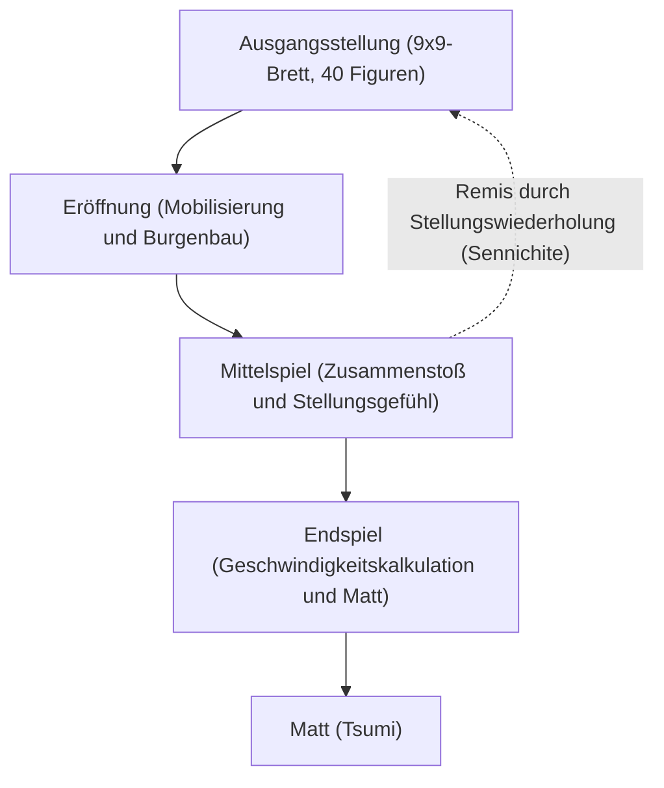

# Brettspiele und KI: Shogi-Regeln, strategische Muster und die Evolution der künstlichen Intelligenz

**Shogi** (das japanische Schach), das über Jahrhunderte in Japan verfeinert wurde, birgt eine taktische Tiefe und Dynamik, die Denker und Meister seit jeher in ihren Bann zieht. In der Informatik und der Forschung zur künstlichen Intelligenz (KI) galt Shogi über Jahrzehnte als eine der anspruchsvollsten Hürden überhaupt. Nachdem Deep Blue von IBM 1997 das westliche Schach bezwungen hatte, verlagerte sich der Fokus der Wissenschaft zwangsläufig auf Shogi – ein Spiel mit einem astronomisch größeren Verzweigungsfaktor und einer einzigartigen Wiedereinsetzungsregel geschlagener Figuren.

In diesem Beitrag analysieren wir die fundamentalen Regeln und die mathematische Komplexität von Shogi, erläutern die strategischen Denkmuster der drei Spielphasen, zeichnen den technologischen Wandel der Shogi-KI von manuell kodierten Heuristiken bis hin zum tiefen bestärkenden Lernen nach und beleuchten den revolutionären Paradigmenwechsel in der Welt der Profispieler.

## 1. Grundregeln und inhärente Komplexität: Warum Shogi Brute-Force trotzt

Shogi ist ein deterministisches Nullsummenspiel mit vollständiger Information für zwei Kontrahenten auf einem 9x9-Gitter. Jeder Spieler beginnt mit 20 Figuren. Das elementare Spielziel entspricht dem des westlichen Schachs: das Mattsetzen (*Tsumi*) des gegnerischen Königs (*Osho* oder *Gyokuso*).

Der revolutionäre Unterschied zu westlichem Schach oder chinesischem Xiangqi liegt in der **Wiedereinsetzungsregel** (*Mochigoma*). Wird eine gegnerische Figur geschlagen, scheidet sie nicht aus dem Spiel aus, sondern wandert in die Reserve des Schlagenden. Zu jedem späteren Zeitpunkt kann der Spieler auf einen regulären Zug verzichten und stattdessen eine Figur aus seiner Reserve auf ein beliebiges freies Feld als eigene Figur „einsetzen“ (*Drop*).

Diese Regel verändert die mathematische Topologie des Spiels grundlegend. Im klassischen Schach vereinfacht das Schlagen von Figuren das Brett und verringert die kombinatorische Komplexität im Endspiel. Im Shogi bleibt das Gesamtvolumen an Figuren auf dem Brett und in der Hand stets konstant; die Anzahl der Züge sinkt im Spielverlauf keineswegs, sondern explodiert insbesondere in der Schlussphase.

In der kombinatorischen Spieltheorie wird die Dimension eines Spiels anhand von zwei Schlüsselkriterien gemessen: der **Zustandsraum-Komplexität** und der **Spielbaum-Komplexität**:

$$
\text{Zustandsraum-Komplexität} \approx 10^{71}
$$
$$
\text{Spielbaum-Komplexität} \approx 10^{226}
$$

Vergleicht man diese Werte mit dem westlichen Schach (Zustandsraum ca. $10^{47}$, Spielbaum ca. $10^{123}$), wird das gigantische Ausmaß der rechnerischen Herausforderung deutlich. Mit einem durchschnittlichen Verzweigungsfaktor von rund 80 legalen Zügen pro Halbzug (im Vergleich zu etwa 35 im Schach) scheitert jede reine Brute-Force-Suche ohne hochentwickelte Schnitttechniken unausweichlich.

## 2. Spielverlauf und strategische Denkmuster

Eine Shogi-Partie gliedert sich in drei prägnante Phasen: die Eröffnung (*Joban*), das Mittelspiel (*Chuban*) und das Endspiel (*Shuban*). Jede Phase erfordert ein völlig eigenes strategisches Repertoire:

### 1. Eröffnung: Formierungsaufbau, Burgenbau und Turmstrategien
Die Eröffnung dient dazu, Figuren harmonisch zu entwickeln, eine Angriffsformation vorzubereiten und gleichzeitig den König durch eine Verteidigungsburg (*Kakoi*) zu sichern. Das klassische Hauptkriterium der Eröffnungstheorie ist die Positionierung des Turms (*Hisha*):

- **Statischer Turm (Ibisha)**: Der Turm verbleibt auf seiner angestammten rechten Flanke (Linie 2 für Schwarz). Dieser Stil sucht den direkten vertikalen Durchbruch und umfasst Systeme wie *Yagura* (Festung), *Kakugawari* (Läufertausch) und *Aigakari*.
- **Schwenkender Turm (Furibisha)**: Der Turm wird aktiv auf die zentrale oder linke Seite geschwenkt (Linien 3 bis 5). Varianten wie *Shikenbisha* (Turm auf der 4. Linie) oder *Nakabisha* (Zentraler Turm) setzen auf flexible Gegenangriffe.

Gleichzeitig ist der Schutz des Königs unerlässlich. Verteidigungsburgen wie die widerstandsfähige **Mino-Burg** oder die massive **Anaguma-Burg** (Dachsbau), bei der der König tief im hintersten Eckfeld vergraben wird, bieten verlässlichen Schutz vor Überraschungsangriffen.

### 2. Mittelspiel: Taktische Gefechte und das „Große Ganze“ (Taikyokukan)
Das Mittelspiel bricht an, sobald die vorderen Ketten aufeinandertreffen. Hier verbinden sich exakte Rechenarbeit und intuitives Positionsgefühl (*Taikyokukan*):

- **Tesuji (Taktische Muster)**: Universelle Standardmotive, wie das Hineinopfern von Bauern (*Tatakino-fu*), um gegnerische Formationen aufzubrechen, oder Doppeldrohungen mittels des „Kreuzturms“ (*Juji-bisha*).
- **Materialgewinn vs. Figurenaktivität (Sabaki)**: Im Shogi ist materieller Vorteil (*Komadoku*) oft zweitrangig gegenüber der Beweglichkeit und Koordinationsfähigkeit der Figuren (*Sabaki*). Eine unbewegliche Großfigur ist ein Hindernis, kein Gewinn.

Die Wahl des richtigen Zeitpunkts für die Offensive (*Shikake*) entscheidet über Wohl und Wehe im Mittelspiel.

### 3. Endspiel: Geschwindigkeitskalkulation und Tsumi (Matt)
Im Gegensatz zu den zähen, figurenarmen Endspielen des westlichen Schachs ist das Shogi-Endspiel ein dramatischer Sprint. Da geschlagene Figuren unmittelbar vor den gegnerischen König eingesetzt werden können, bricht jede Verteidigungslinie früher oder später zusammen.

- **Geschwindigkeitsrechnung (Sokudo)**: Das Leitmotiv des Endspiels lautet Tempo. Es geht nicht darum, den eigenen König absolut zu sichern, sondern messerscharf zu berechnen, wer den gegnerischen König einen Zug früher mattsetzt.
- **Tsumi (Matt) und Hisshi (Brinkmate)**: Als *Tsumi* bezeichnet man eine lückenlose Schlagfolge bis zum Königsmatt. *Hisshi* beschreibt eine Zwangslage, in der der Gegner zwar noch am Zug ist, aber mathematisch keinen Verteidigungszug mehr besitzt, der das unvermeidliche Matt im nächsten Halbzug verhindern könnte.

## 3. Die technologische Evolution der Shogi-KI

Die Überwindung der menschlichen Vormachtstellung im Shogi zählt zu den glanzvollsten Erfolgen der modernen Computer- und Kognitionswissenschaften.

### Die Pionierphase: Handprogrammierte Heuristiken
In den 1980er und 1990er Jahren kombinierten frühe Programme den Minimax-Algorithmus und Alpha-Beta-Schnittverfahren mit Bewertungsfunktionen, die von Programmierern und Berater-Großmeistern manuell mit Regeln und Punktwerten gefüttert wurden.

Aufgrund des astronomischen Verzweigungsbaums und der Dynamik der Handfiguren wiesen starre Heuristiken jedoch fundamentale Lücken im Stellungsurteil auf, sodass Programme selbst fortgeschrittenen Vereinsamateuren klar unterlegen blieben.

### Der Durchbruch von Bonanza: Maschinelles Lernen (2005)
Im Jahr 2005 schuf Kunihito Hoki mit **Bonanza** einen historischen Wendepunkt. Anstatt Werte mühsam manuell abzugleichen, führte Bonanza die automatische Parameteroptimierung mittels maschinellen Lernens ein („Bonanza-Methode“). Anhand von zehntausenden Partien japanischer Profis (*Kifu*) kalibrierte das Programm selbstständig hunderttausende von Positionsgewichten (KPP- und KKP-Muster).

Dadurch erlangte die KI ein verblüffend organisches Verständnis für Figurenkoordination, was einen beispiellosen Leistungssprung auslöste und zum Fundament sämtlicher künftiger Spitzen-Engines wurde.

### Die Denou-sen-Turniere und der Fall der Großmeister (2012–2017)
In den 2010er Jahren schlossen die Algorithmen zur Weltspitze auf. Im Rahmen der vom japanischen Shogi-Verband und Dwango organisierten **Denou-sen**-Wettkämpfe besiegten Spitzenprogramme wie *GPS Shogi*, *YaneuraOu* und **Ponanza** (entwickelt von Kazusuke Yamamoto) nacheinander gestandene Titelträger.

Der historische Schlusspunkt folgte im Frühjahr 2017: Im zweiten offiziellen Denou-sen unterlag der amtierende Meijin-Titelträger **Amahiko Sato** dem Programm **Ponanza** glatt mit 0:2. Damit war der endgültige Triumph der Maschine über die menschliche Meisterklasse besiegelt.

### AlphaZero und die Ära der tiefen neuronalen Netze
Ende 2017 erschütterte Google DeepMind die Fachwelt mit **AlphaZero**. Völlig ohne menschliche Partiedaten und ausschließlich auf Basis der Spielregeln erlernte AlphaZero das Spiel durch reines bestärkendes Selbstspiel in Kombination mit Monte-Carlo-Baumsuche (MCTS). Innerhalb weniger Stunden besiegte es den amtierenden Computer-Shogi-Weltmeister *elmo*.

Heute setzen führende Open-Source-Engines wie **dlshogi** (mittels tiefer Faltungsnetze auf GPUs) und **Suisho** (mit der extrem schnellen NNUE-Architektur auf CPUs) diesen Weg fort und ermöglichen selbst auf herkömmlichen Heim-PCs Analysen weit jenseits menschlicher Vorstellungskraft.

## 4. Der Paradigmenwechsel im modernen Shogi

Die Überlegenheit der KI bedeutete keineswegs das Ende des Shogi, sondern leitete eine faszinierende intellektuelle Renaissance ein:

### 1. Neudefinition der Eröffnungstheorie
Jahrhundertealte Dogmen wurden von Bewertungsfunktionen innerhalb weniger Monate entzaubert. Die KI bewies, dass massiver Burgenbau oft unnötig Tempo verschenkt, und etablierte stattdessen luftige, hochflexible Königspositionen, die auf unmittelbaren Gegenstoß ausgelegt sind. Ehemals belächelte Züge erlebten ein Comeback, und von der KI geprägte Eröffnungsvarianten sind heute fester Bestandteil internationaler Titelkämpfe.

### 2. Die KI als unverzichtbares Forschungs- und Trainingswerkzeug
Vom Nachwuchs der Kaderschmiede *Shoreikai* bis hin zu Ausnahmeerscheinungen wie Sota Fujii (Inhaber sämtlicher Haupttitel) nutzt heute die gesamte professionelle Elite tägliche KI-Analysen. Im Mittelpunkt steht die Überprüfung der eigenen Spielzüge anhand der prozentualen Übereinstimmung mit dem Erstvorschlag des Motors („AI Match Rate“).

### 3. Renaissance der menschlichen Dramatik
Paradoxerweise hat die Perfektion der Maschine den emotionalen Wert menschlicher Wettkämpfe noch gesteigert. Das Ticken der Schachuhr, die physische Anspannung, das Ringen im psychologischen Grenzbereich und mutige intuitive Entscheidungen erzeugen ein mitreißendes Drama, das kein stummer Rechner nachahmen kann. Gerade weil die KI die mathematische Wahrheit jedes Zuges enthüllt, erfährt das Publikum den unerbittlichen Mut menschlicher Meister im Angesicht des Abgrunds mit noch größerer Ehrfurcht.

## 5. Fazit: Shogi und die Zukunft kombinatorischer Intelligenz

Die Symbiose von Shogi und künstlicher Intelligenz ist ein leuchtendes Vorbild für das partnerschaftliche Zusammenwirken von Mensch und Maschine. Die KI hat das Shogi nicht entzaubert, sondern zum stärksten Katalysator menschlicher Spielfreude und Erkenntnis überhaupt gemacht.

Weit über das 81-Felder-Brett hinaus strahlen die zur Bewältigung der Shogi-Bäume entwickelten Methoden — heuristische Schnittverfahren, tiefe neuronale Netze und bestärkendes Lernen — in praktische Disziplinen aus: von komplexer Logistikplanung und Wirkstoffdesign in der Biomedizin bis hin zu autonomen Steuerungssystemen.

Shogi beweist auf zeitlose Weise: Künstliche Intelligenz vernichtet die Kunst des Denkens nicht, sondern lässt sie in neuem, unvergänglichem Glanz erstrahlen.

---

*Literaturhinweise*
- Hoki, K. (2006). "Bonanza: The Shogi Program Using Automatic Parameter Tuning". *IPSJ SIG Notes*.
- Silver, D., et al. (2018). "A general reinforcement learning algorithm that masters chess, shogi, and Go through self-play". *Science*, 362(6419), 1140-1144.
- Offizielle Turnierberichte und Archive der Denou-sen-Serie (Japan Shogi Association & Dwango).
