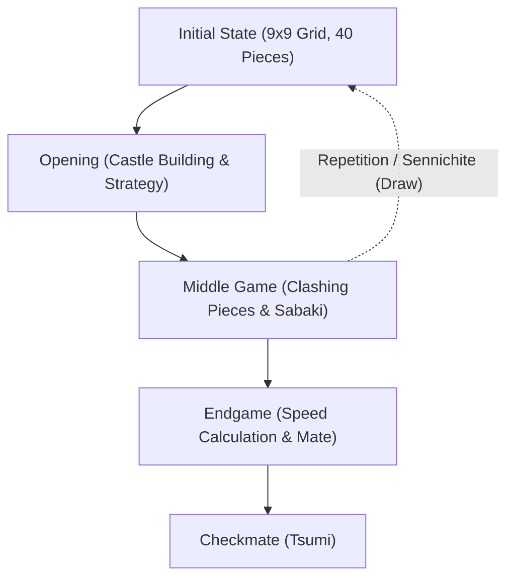

# Board Games and AI: Shogi Rules, Strategic Patterns, and the Evolution of Artificial Intelligence

**Shogi** (Japanese chess), a traditional turn-based strategy game refined over centuries in Japan, possesses an intellectual depth and tactical dynamism that has long captivated players and scholars alike. Within computer science and artificial intelligence (AI), shogi stood for decades as a daunting grand challenge. After IBM's Deep Blue conquered Western chess in 1997, the algorithmic frontier shifted naturally to shogi — a game protected by an astronomically larger branching factor and an intricate drop rule.

In this article, we explore the foundational rules and structural uniqueness of shogi, detail the strategic paradigms across its three distinct phases of play, trace the technological revolution of shogi AI from hand-crafted heuristics to deep reinforcement learning, and analyze how machine intelligence has fundamentally reshaped the professional shogi ecosystem.

## 1. Core Rules and Inherent Complexity: Why Shogi Defies Brute Force

Shogi is a two-player, zero-sum, finite, deterministic game of perfect information played on a 9x9 grid. Each player begins with 20 pieces across eight ranks and files. The objective is identical to chess: checkmate the opponent's King (Osho or Gyokuso).

The decisive mechanism separating shogi from Western chess and Xiangqi is the **drop rule** (*Mochigoma*). Whenever a player captures an opponent's piece, that piece does not leave the match; instead, it enters the capturing player's reserve hand and can be re-entered onto virtually any unoccupied square on subsequent turns as one's own piece.

This single mechanism radically alters the mathematical landscape of the game. In chess, piece trades simplify the board and reduce combinatorial options toward an endgame. In shogi, piece trades maintain the total piece count across the board and reserves, causing the branching factor to remain extraordinarily high or even expand as the match progresses.

In combinatorial game theory, complexity is measured through two primary metrics: **State-space complexity** and **Game-tree complexity**:

$$
\text{State-Space Complexity} \approx 10^{71}
$$
$$
\text{Game-Tree Complexity} \approx 10^{226}
$$

Comparing these values to Western chess (state-space complexity of $\approx 10^{47}$ and game-tree complexity of $\approx 10^{123}$) reveals why shogi presented such an immense computational hurdle. With an average branching factor of approximately 80 legal moves per ply (compared to roughly 35 in chess), traversing the game tree requires astronomical computational power and exceptionally discerning heuristics.

## 2. Match Progression and Strategic Paradigms

A competitive shogi game unfolds across three well-defined phases: the Opening (*Joban*), the Middle Game (*Chuban*), and the Endgame (*Shuban*). Each phase demands a distinct cognitive toolkit and strategic mindset.

### 1. Opening: Formations, Castling, and Static vs. Ranging Rook
The opening phase focuses on deploying pieces from their initial positions to construct an offensive formation while fortifying defenses around the King through "castling" (*Kakoi*). The overarching strategic dichotomy in shogi openings is defined by Rook placement:

- **Static Rook (Ibisha)**: The player maintains the Rook on its original right flank file (file 2 for Black). This style favors linear, dynamic clashes and includes classical strategies such as *Yagura* (Fortress), *Kakugawari* (Bishop Exchange), and *Aigakari* (Double Wing Attack).
- **Ranging Rook (Furibisha)**: The player actively swings the Rook across to the center or the left flank (files 3 through 5). Common variations include *Shikenbisha* (Fourth-file Rook), *Sankenbisha* (Third-file Rook), and *Nakabisha* (Central Rook), which emphasize fluid piece activity and counter-attacking.

Simultaneously, constructing a protective castle is vital. Defensive bastions such as the resilient *Mino Castle* or the ultra-dense *Anaguma* (Badger Hole) fortress provide a secure haven for the King against sudden tactical onslaughts.

### 2. Middle Game: Tactical Maneuvers and Whole-Board Vision
The middle game begins when opposing pieces make contact and tactical skirmishes ignite across the files. In this phase, players rely on *Taikyokukan* (whole-board strategic intuition) and deep concrete reading:

- **Tesuji (Tactical Knacks)**: Standardized tactical motifs that optimize localized piece interactions. Common examples include dropping sacrificial pawns (*Tatakino-fu*) to disrupt enemy formations or unleashing cross-board Rook forks (*Juji-bisha*).
- **Material Balance vs. Piece Activity (Sabaki)**: In shogi, static material counts (*Komadoku*) are frequently subordinate to the dynamic utility and fluidity of the pieces (*Sabaki*). Inactive or trapped pieces are liabilities regardless of their nominal strength.

Initiating combat (*Shikake*) requires precise timing; striking prematurely can leave vulnerabilities, while delaying action can allow an opponent to fortify their position beyond breach.

### 3. Endgame: Speed Calculation, Tsumi, and Brinkmate
Unlike chess, where endgames are often technical, low-material grinds, shogi endgames are lethal, high-tension drag races. Because pieces can be dropped from reserves directly adjacent to the enemy King, defense becomes exceptionally difficult.

- **Speed Calculation (Sokudo)**: Endgame strategy is dictated entirely by "relative speed." A player does not necessarily look for the absolute safest defense; rather, they calculate whether their King can survive one move longer than the opponent's King under an all-out assault.
- **Tsumi (Checkmate) and Hisshi (Brinkmate)**: *Tsumi* denotes an unavoidable checkmate sequence where every defensive response is exhausted. *Hisshi* represents a threat state where, regardless of the opponent's defensive reply on the following turn, an unstoppable checkmate will follow on the subsequent move. Mastering complex checkmate problems (*Tsume Shogi*) is central to shogi mastery.

## 3. The Technological Evolution of Shogi AI

The computational conquest of shogi represents one of the most celebrated milestones in artificial intelligence history, progressing from brittle rule-based heuristics to self-learning neural networks.

### The Early Era: Hand-Crafted Heuristics and Alpha-Beta Search
Early shogi software throughout the 1980s and 1990s combined adversarial tree exploration (the minimax algorithm enhanced by alpha-beta pruning) with hand-coded evaluation functions. Human developers and consulting professional players manually assigned numerical weights to piece values, King safety, and square control.

However, due to the astronomical branching factor and the non-convergent nature of shogi endgames, hand-tuned functions suffered from profound blind spots, consistently faltering against amateur club players.

### The Bonanza Breakthrough: Automated Machine Learning (2005)
In 2005, computer scientist Kunihito Hoki introduced **Bonanza**, fundamentally disrupting game AI. Bonanza discarded manual parameter tuning in favor of automated optimization. Using thousands of recorded professional game scores (*Kifu*), Bonanza utilized maximum margin estimation (the "Bonanza Method") to automatically calibrate tens of thousands of positional feature weights, especially piece-pair and piece-three relationships (KPP and KKP tables).

By allowing the computer to discern positional nuance directly from master-level play, Bonanza caused an immediate leap in tactical cohesion, establishing the universal architectural foundation for subsequent competitive engines.

### The Denou-sen Matches and AI Supremacy (2012–2017)
By the 2010s, algorithmic engines surpassed elite human grandmasters. Organized by Dwango and the Japan Shogi Association, the **Denou-sen** series pitted top professional players against state-of-the-art software.

Engine after engine, including *GPS Shogi*, *YaneuraOu*, and *Ponanza* (developed by Kazusuke Yamamoto), defeated active professionals. The turning point arrived in spring 2017, when reigning Meijin titleholder **Amahiko Sato** was decisively defeated by Ponanza in a two-game match, formally marking the arrival of superhuman artificial intelligence in shogi.

### AlphaZero and Deep Neural Networks
In late 2017, Google DeepMind unveiled **AlphaZero**, demonstrating that superhuman proficiency could be acquired entirely tabula rasa through deep reinforcement learning and Monte Carlo Tree Search (MCTS), without relying on human game transcripts. Starting solely with the basic rules, AlphaZero achieved a superhuman level within hours of self-play, dismantling the reigning World Computer Shogi Champion engine, *elmo*.

This prompted the shogi programming community to adopt deep neural network evaluation frameworks, leading to modern open-source engines like **dlshogi** (utilizing deep convolutional networks on GPUs) and **Suisho** (incorporating NNUE architecture on CPUs), bringing grandmaster-shattering analysis to commodity personal computers.

## 4. The Paradigm Shift in the Human Shogi World

The triumph of AI did not render human shogi obsolete; instead, it sparked a profound intellectual renaissance across professional play.

### 1. Radical Revision of Opening Theory
For centuries, professional opening theory developed incrementally through empirical consensus. AI evaluation engines overturned decades of dogma within months.

Engines demonstrated that heavily fortified traditional castles (such as deep Anaguma setups) often ceded excessive tempo, favoring instead flexible, lightly defended King placements with dynamic counter-punching potential. Ancient, discarded variations were rehabilitated, and novel "AI-origin openings" became mainstream standards across professional tournaments.

### 2. Pervasive Research Ecosystems
Today, from junior apprentices in the *Shoreikai* academy to multi-crown titleholders like Sota Fujii, rigorous daily training with AI engines is mandatory. Post-match analysis revolves around comparing human decisions against engine evaluation graphs, identifying tactical inaccuracies and uncovering previously unimaginable move options. The metric of "AI move concordance rate" has emerged as a respected indicator of technical precision.

### 3. Re-discovering the Beauty of Human Play
Paradoxically, the perfection of AI has elevated public appreciation for human psychology and dramatic narrative. In high-stakes matches, the ticking clock, physical exhaustion, emotional tension, and daring intuitive leaps create a compelling spectacle that deterministic computation cannot replicate. Because AI illuminates the objective ground truth of any position, spectators can more vividly appreciate the agony, courage, and resolve demanded of human masters confronting the limits of calculation.

## 5. Conclusion: AI and the Future of Combinatorial Intelligence

The history of shogi AI is a testament to the power of machine learning and a compelling blueprint for human-machine synergy. Far from destroying the game, AI has emerged as the ultimate sparring partner, accelerating human tactical discovery at an unprecedented pace.

Beyond the 81 squares of the shogi board, the algorithms developed to solve shogi's massive search trees — automated parameter tuning, deep reinforcement learning, and high-performance neural evaluation — are actively driving breakthroughs in logistics optimization, structural biology, automated theorem proving, and real-time decision-making systems.

The fusion of timeless Japanese tradition and cutting-edge artificial intelligence demonstrates that computational mastery does not diminish art; it illuminates it.

---

*References*
- Hoki, K. (2006). "Bonanza: The Shogi Program Using Automatic Parameter Tuning". *IPSJ SIG Notes*.
- Silver, D., et al. (2018). "A general reinforcement learning algorithm that masters chess, shogi, and Go through self-play". *Science*, 362(6419), 1140-1144.
- Official Match Archives of the Denou-sen Series (Japan Shogi Association & Dwango).
