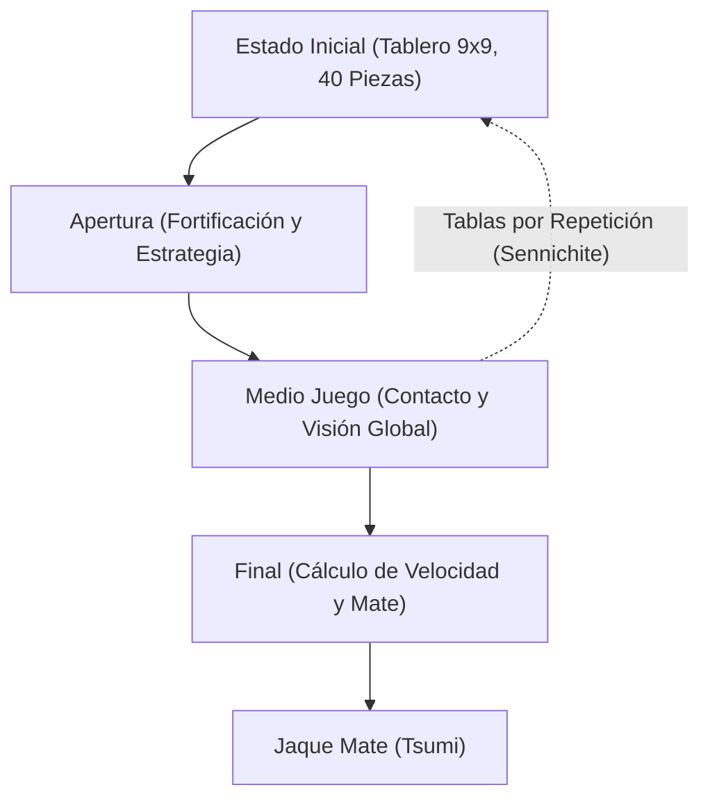

# Juegos de tablero e IA: Reglas del Shogi, patrones estratégicos y la evolución de la inteligencia artificial

El **Shogi** (ajedrez japonés), refinado a lo largo de siglos en Japón, posee una profundidad táctica y un dinamismo incomparables que han cautivado a maestros y científicos durante generaciones. En el campo de las ciencias de la computación y la inteligencia artificial (IA), el shogi representó durante décadas un reto monumental. Tras la histórica victoria de Deep Blue de IBM frente al ajedrez occidental en 1997, el siguiente gran horizonte fue el shogi, protegido por un factor de ramificación colosal y una regla de reintroducción de piezas única en el mundo.

En este artículo, analizamos las reglas fundamentales y la complejidad matemática del shogi, los patrones estratégicos que vertebran sus tres fases de juego, la evolución tecnológica que llevó a los motores de IA desde reglas artesanales hasta el aprendizaje por refuerzo profundo, y el trascendental cambio de paradigma que esto ha provocado en el ámbito profesional.

## 1. Reglas fundamentales y complejidad matemática: ¿Por qué el Shogi desafía la fuerza bruta?

El shogi es un juego de suma cero, finito, determinista y de información perfecta disputado por dos contendientes sobre un tablero cuadriculado de 9x9 casillas. Cada jugador comienza con 20 piezas. El objetivo esencial coincide con el ajedrez: dar jaque mate (*Tsumi*) al Rey enemigo (*Osho* o *Gyokuso*).

La diferencia más revolucionaria que separa al shogi del ajedrez occidental o del Xiangqi es la **regla de reintroducción** (*Mochigoma*). Cuando un jugador captura una pieza enemiga, esta no es eliminada de la partida; en su lugar, pasa a formar parte de la reserva del captor. En cualquier turno posterior, el jugador puede decidir colocar una pieza de su reserva en casi cualquier casilla desocupada del tablero como tropa propia.

Esta mecánica altera drásticamente la estructura combinatoria de la partida. En el ajedrez tradicional, el intercambio de piezas simplifica el tablero y reduce las opciones hacia el final. En el shogi, el número total de piezas en juego se mantiene inalterado; en lugar de disminuir, las opciones tácticas se multiplican vertiginosamente a medida que avanza la partida.

En teoría de juegos combinatoria, la envergadura de un juego se cuantifica mediante la **complejidad del espacio de estados** y la **complejidad del árbol de juego**:

$$
\text{Complejidad del espacio de estados} \approx 10^{71}
$$
$$
\text{Complejidad del árbol de juego} \approx 10^{226}
$$

Si comparamos estos valores con el ajedrez occidental (espacio de estados de $\approx 10^{47}$ y árbol de juego de $\approx 10^{123}$), se evidencia la colosal barrera matemática del shogi. Con un factor de ramificación medio de unas 80 jugadas legales por turno (frente a unas 35 en el ajedrez), resulta físicamente imposible recorrer el árbol de variantes mediante fuerza bruta sin podas extremadamente precisas.

## 2. Progresión de la partida y patrones estratégicos

Una partida de shogi se estructura en tres etapas claramente delimitadas: la Apertura (*Joban*), el Medio Juego (*Chuban*) y el Final (*Shuban*). Cada una requiere un marco conceptual específico:

### 1. Apertura: Despliegue, Enroque y Estilos de Torre
En la apertura se movilizan las piezas desde sus posiciones de salida para armar una estructura ofensiva y resguardar al Rey mediante una fortaleza defensiva o "enroque" (*Kakoi*). La gran división estratégica del shogi se basa en la posición de la pieza más poderosa, la Torre (*Hisha*):

- **Torre Estática (Ibisha)**: La Torre permanece en su flanco derecho original. Fomenta un choque directo y vertical, englobando sistemas clásicos como *Yagura* (Fortaleza), *Kakugawari* (Intercambio de Alfiles) y *Aigakari* (Ataque de Doble Flanco).
- **Torre Móvil (Furibisha)**: La Torre se traslada al centro o al flanco izquierdo (columnas 3 a 5). Variantes como *Shikenbisha* (Torre en 4ª columna) o *Nakabisha* (Torre Central) priorizan la flexibilidad táctica y el contragolpe.

En paralelo, construir una defensa sólida es vital. Estructuras como el inexpugnable **Castillo Mino** o el ultradenso **Anaguma** (Madriguera del Tejón), donde el Rey se atrinchera en la esquina más remota, resultan esenciales para sobrevivir a los asaltos tácticos.

### 2. Medio Juego: Tácticas de contacto y visión global (Taikyokukan)
El medio juego estalla cuando las vanguardias entran en contacto. Aquí se combinan el cálculo táctico y la visión intuitiva del conjunto (*Taikyokukan*):

- **Tesuji (Técnicas clave)**: Maniobras tácticas recurrentes de alta eficiencia, como arrojar peones de sacrificio (*Tatakino-fu*) para deformar la defensa enemiga o aplicar la "Torre en Cruz" (*Juji-bisha*) para asestar ataques dobles.
- **Ganancia material frente a fluidez (Sabaki)**: En shogi, acumular piezas capturadas (*Komadoku*) a menudo queda en segundo plano frente a la agilidad y coordinación dinámica de las fuerzas (*Sabaki*). Una pieza pesada inmovilizada es una carga inútil.

El momento exacto para desatar la ofensiva (*Shikake*) exige un juicio posicional supremo.

### 3. Final: Cálculo de velocidad y Jaque Mate
A diferencia de los finales posicionales del ajedrez, el final del shogi es una carrera armamentística de velocidad pura. Dado que las piezas en mano pueden reintroducirse a quemarropa frente al Rey enemigo, defenderse indefinidamente es casi imposible.

- **Cálculo de velocidad (Sokudo)**: La prioridad no es asegurar al propio Rey de forma absoluta, sino calcular con exactitud milimétrica quién dará el mate primero. Se compara el número de jugadas que le restan al rival para alcanzarnos frente al tiempo que necesitamos para rematar su monarca.
- **Tsumi (Jaque Mate) y Hisshi (Brinkmate)**: *Tsumi* es una secuencia forzada e ineludible de jaques que culmina en la captura del Rey. *Hisshi* describe una posición donde, independientemente de la defensa que adopte el contrincante en su turno, existe una red de mate imparable en la jugada siguiente.

## 3. La evolución tecnológica de la IA en Shogi

La conquista computacional del shogi ilustra la transición desde la programación heurística clásica hacia las redes neuronales profundas y el autoaprendizaje.

### La era inicial: Heurísticas manuales y poda Alfa-Beta
En las décadas de 1980 y 1990, los motores de shogi integraban el algoritmo Minimax con poda Alfa-Beta y funciones de evaluación programadas a mano. Ingenieros y maestros humanos intentaban cuantificar numéricamente el valor de cada pieza, la solidez de los castillos y el control del espacio.

Sin embargo, el descomunal árbol de variantes y la complejidad del *Mochigoma* hacían inviables las reglas rígidas, provocando que los programas sucumbieran con facilidad ante jugadores aficionados avanzados.

### El hito de Bonanza: Aprendizaje automático de parámetros (2005)
En 2005, el científico Kunihito Hoki revolucionó el panorama con **Bonanza**. En lugar de programar heurísticas manualmente, Bonanza implementó un método de optimización automática basado en aprendizaje automático (el célebre "Método Bonanza"). Analizando decenas de miles de partidas profesionales (*Kifu*), el programa ajustó de forma autónoma los pesos de combinaciones locales de piezas (matrices KPP y KKP).

Este salto cualitativo dotó a la IA de una noción posicional orgánica que emulaba e incluso superaba el criterio humano, estableciendo el estándar técnico para toda la industria.

### Las series Denou-sen y la caída de los grandes maestros (2012–2017)
Durante la década de 2010, los motores superaron la élite humana. En el marco de los torneos oficiales **Denou-sen**, programas como *GPS Shogi*, *YaneuraOu* y **Ponanza** (desarrollado por Kazusuke Yamamoto) derrotaron a sucesivos campeones profesionales.

El momento culminante se produjo en 2017: en el segundo Denou-sen oficial, el vigente portador del prestigioso título de Meijin, **Amahiko Sato**, cayó derrotado 0–2 ante **Ponanza**, confirmando de manera irreversible la superioridad de la IA sobre los humanos.

### AlphaZero y las redes neuronales profundas
A finales de 2017, Google DeepMind asombró al mundo con **AlphaZero**. Sin acceso a partidas humanas y partiendo exclusivamente de las reglas del juego, AlphaZero aprendió mediante juego autónomo (aprendizaje por refuerzo puro) y búsqueda en árbol de Monte Carlo (MCTS). En cuestión de horas, destrozó al campeón informático mundial reinante, *elmo*.

Posteriormente, la comunidad de código abierto desarrolló motores basados en redes neuronales profundas, como **dlshogi** (para GPU) y **Suisho** (arquitectura NNUE optimizada para CPU), poniendo al alcance de ordenadores domésticos una fuerza de cálculo sobrehumana.

## 4. El cambio de paradigma en el mundo del Shogi humano

La supremacía de la IA no supuso la muerte del shogi; al contrario, inauguró una era dorada de descubrimiento intelectual:

### 1. Reescritura radical de las aperturas
Durante siglos, las aperturas se refinaron mediante tradición y consenso empírico. Los motores de IA desmantelaron numerosos dogmas en cuestión de meses. Demostraron que fortificar en exceso el castillo cede tiempos preciosos, popularizando en su lugar defensas ligeras y flexibles orientadas al contragolpe fulgurante. Líneas tácticas antaño descalificadas han sido reivindicadas y nuevas aperturas diseñadas por IA dominan hoy los torneos profesionales.

### 2. La IA como herramienta de estudio indispensable
Hoy en día, desde las jóvenes promesas de la academia *Shoreikai* hasta prodigios absolutos como Sota Fujii (poseedor de múltiples títulos), el entrenamiento diario con motores de IA es una exigencia insustituible. El análisis post-partida se centra en cotejar las jugadas humanas con las valoraciones del motor, evaluando la "tasa de coincidencia" con la mejor jugada de la IA.

### 3. Revalorización del drama y la emoción humana
Paradójicamente, la perfección aséptica de la máquina ha realzado el valor de la psicología humana. La angustia frente al reloj, el desgaste físico, las decisiones intuitivas y los errores bajo presión extrema ofrecen un espectáculo emotivo irreproducible por un algoritmo. Conocer la verdad matemática del tablero hace que el público valore aún más el coraje y la lucidez de los maestros humanos que batallan al límite de sus fuerzas.

## 5. Conclusión: La IA y el porvenir de la inteligencia combinatoria

La trayectoria del shogi y la inteligencia artificial ejemplifica una exitosa sinergia entre el hombre y la máquina. La IA no ha despojado al shogi de su misterio; al contrario, actúa como un maestro inagotable que acelera la comprensión del juego a un ritmo sin precedentes.

Asimismo, los avances conceptuales derivados del shogi —compresión de árboles masivos, optimización neuronal y aprendizaje autónomo— se aplican hoy con éxito a la resolución de problemas en logística global, secuenciación molecular, vehículos autónomos y modelos financieros.

El tablero de 81 casillas del shogi sigue siendo un espacio fascinante donde la milenaria intuición humana y la precisión analítica de la inteligencia artificial continúan elevándose mutuamente.

---

*Referencias bibliográficas*
- Hoki, K. (2006). "Bonanza: The Shogi Program Using Automatic Parameter Tuning". *IPSJ SIG Notes*.
- Silver, D., et al. (2018). "A general reinforcement learning algorithm that masters chess, shogi, and Go through self-play". *Science*, 362(6419), 1140-1144.
- Archivos oficiales y partidas históricas de la serie Denou-sen (Asociación Japonesa de Shogi y Dwango).
