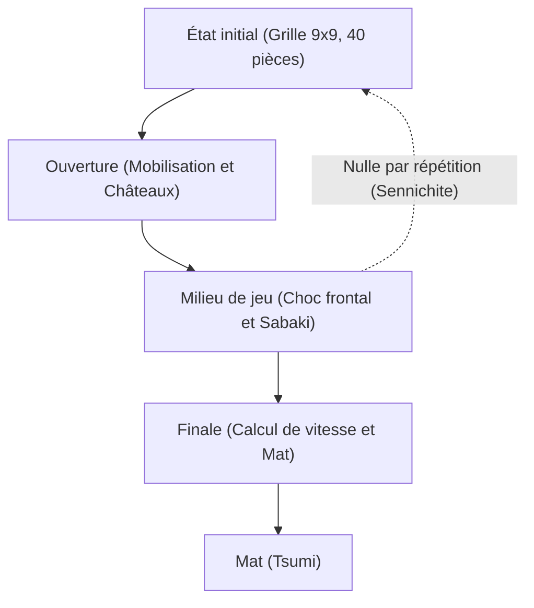

# Jeux de plateau et IA : Règles du Shogi, modèles stratégiques et l'évolution de l'intelligence artificielle

Le **Shogi** (les échecs japonais), art martial de l'esprit affiné au cours des siècles au Japon, possède une profondeur tactique et une richesse dynamique qui ont toujours fasciné maîtres et mathématiciens. Pour l'informatique et l'intelligence artificielle (IA), le shogi a représenté pendant des décennies un défi scientifique titanesque. Après la victoire emblématique de Deep Blue contre Garry Kasparov en 1997 aux échecs occidentaux, le nouveau front de la recherche s'est naturellement déplacé vers le shogi — un jeu protégé par une complexité combinatoire démesurée et une règle inédite de parachutage des pièces capturées.

Cet article explore les règles fondamentales et la complexité intrinsèque du shogi, détaille les principes stratégiques à l'œuvre durant ses trois phases de jeu, retrace l'épopée technologique qui a conduit les moteurs du réglage heuristique manuel à l'apprentissage profond par renforcement, et examine la métamorphose intellectuelle vécue par le monde professionnel.

## 1. Règles fondamentales et complexité structurelle : Pourquoi le Shogi défie la force brute

Le shogi est un jeu à somme nulle, fini, déterministe et à information parfaite opposant deux joueurs sur une grille de 9x9 cases. Chaque camp dispose au départ de 20 pièces. L'objectif fondamental est analogue à celui des échecs : mater (*Tsumi*) le Roi adverse (*Osho* ou *Gyokuso*).

La rupture conceptuelle majeure qui singularise le shogi par rapport aux échecs occidentaux ou au Xiangqi réside dans la **règle de parachutage** (*Mochigoma*). Lorsqu'un joueur capture une pièce adverse, celle-ci n'est pas définitivement exclue de la partie : elle entre dans la réserve du preneur. À tout moment ultérieur, le joueur peut choisir, au lieu de déplacer une pièce du plateau, de « parachuter » une pièce de sa réserve sur n'importe quelle case libre pour en faire sa propre unité de combat.

Cette règle unique bouleverse la trajectoire mathématique du jeu. Aux échecs classiques, les échanges éclaircissent l'échiquier et réduisent la combinatoire vers des finales épurées. Au shogi, les échanges conservent la totalité de la matière en circulation ; le nombre d'options tactiques disponibles ne diminue pas, mais a tendance à exploser à mesure que la partie progresse.

En théorie des jeux combinatoires, la dimension d'un jeu se mesure à l'aune de deux variables cardinales : la **complexité de l'espace d'états** et la **complexité de l'arbre de jeu** :

$$
\text{Complexité de l'espace d'états} \approx 10^{71}
$$
$$
\text{Complexité de l'arbre de jeu} \approx 10^{226}
$$

En comparaison des échecs occidentaux (espace d'états d'environ $10^{47}$ et arbre de jeu de $10^{123}$), le shogi présente un défi calculatoire vertigineux. Avec un facteur de branchement moyen d'environ 80 coups légaux par demi-coup (contre 35 aux échecs), l'exploration de l'arbre par force brute pure est matériellement impossible sans heuristiques d'élagage ultra-raffinées.

## 2. Déroulement de la partie et paradigmes stratégiques

Une partie de shogi s'articule en trois phases rigoureusement différenciées : l'Ouverture (*Joban*), le Milieu de jeu (*Chuban*) et la Finale (*Shuban*). Chaque phase requiert un cadre cognitif distinct :

### 1. L'Ouverture : Déploiement, Châteaux et Tour Statique vs Tour Mobile
L'ouverture consiste à quitter la configuration initiale pour coordonner une force offensive tout en bâtissant une forteresse protectrice autour du Roi appelée « château » (*Kakoi*). La dichotomie doctrinale fondamentale repose sur l'emploi de la Tour (*Hisha*) :

- **Tour Statique (Ibisha)** : La Tour demeure sur sa colonne d'origine à l'aile droite. Ce style privilégie la percée frontale à travers des systèmes réputés tels que *Yagura* (la Forteresse), *Kakugawari* (Échange des Fous) et *Aigakari* (Attaque sur les deux ailes).
- **Tour Mobile (Furibisha)** : La Tour glisse vers le centre ou l'aile gauche (colonnes 3 à 5). Des systèmes comme *Shikenbisha* (Tour sur la 4e colonne) ou *Nakabisha* (Tour Centrale) favorisent la réactivité tactique et les contre-attaques fluides.

Parallèlement, la protection du monarque est capitale. Des structures comme le résistant **Château Mino** ou le bunker ultra-dense **Anaguma** (le Terrier du Blaireau), où le Roi s'enterre au fond du coin de l'échiquier, sont indispensables pour encaisser les agressions violentes.

### 2. Le Milieu de jeu : Manœuvres tactiques et vision globale (Taikyokukan)
Le milieu de jeu commence dès lors que les armées entrent en contact physique. Il sollicite une combinaison d'analyse calculée et d'intuition positionnelle d'ensemble (*Taikyokukan*) :

- **Tesuji (Coups d'orfèvre)** : Motifs tactiques universels d'une efficacité redoutable, tels que le pion sacrifié frappé au sol (*Tatakino-fu*) pour désorganiser l'ennemi ou la double attaque de la « Tour en Croix » (*Juji-bisha*).
- **Gain matériel contre activité dynamique (Sabaki)** : Au shogi, l'accumulation brute de matériel (*Komadoku*) est souvent secondaire par rapport à la fluidité et à la liberté de manœuvre des pièces (*Sabaki*). Une pièce lourde inactive est un lourd fardeau.

Choisir l'instant exact pour lancer l'offensive générale (*Shikake*) exige une maturité stratégique absolue.

### 3. La Finale : Calcul de vitesse et Mat
Loin des finales techniques et dépouillées des échecs, la fin de partie au shogi est un sprint effréné vers la mort. Grâce aux parachutages possibles à bout portant contre le Roi adverse, aucune défense ne peut tenir indéfiniment.

- **Calcul de vitesse (Sokudo)** : La boussole de la finale est la vitesse relative. On ne cherche pas à ériger une forteresse parfaite, mais à calculer si l'on peut porter l'estocade un coup plus vite que l'adversaire.
- **Tsumi (Mat) et Hisshi (Brinkmate)** : Le *Tsumi* est une séquence d'échecs imparables menant à la prise inéluctable du Roi. Le *Hisshi* désigne une position où, quel que soit le coup de défense joué par l'adversaire au tour suivant, un mat forcé se déclenchera inévitablement au coup d'après.

## 3. L'épopée technologique de l'IA appliquée au Shogi

L'histoire de l'IA au shogi illustre le passage historique des systèmes experts fondés sur des règles écrites à la main vers l'apprentissage profond autonome.

### L'époque pionnière : Heuristiques manuelles et limites du Minimax
Durant les années 1980 et 1990, les moteurs s'appuyaient sur l'algorithme Minimax élagué par Alpha-Bêta, associé à des fonctions d'évaluation codées manuellement par des programmeurs et des maîtres de shogi. On attribuait des poids fixes à la valeur des pièces, à la sécurité du Roi et au contrôle de l'espace.

Toutefois, face à la marée combinatoire générée par le parachutage des pièces, ces règles manuelles comportaient d'immenses failles de jugement, rendant les logiciels incapables de rivaliser avec de bons joueurs amateurs de club.

### La révolution Bonanza : L'optimisation automatique des paramètres (2005)
En 2005, le chercheur Kunihito Hoki bouleverse les paradigmes en créant **Bonanza**. Au lieu de calibrer laborieusement les heuristiques, Bonanza a inauguré l'apprentissage automatique appliqué à l'évaluation positionnelle (la « Méthode Bonanza »). En analysant des dizaines de milliers de parties disputées par des professionnels (*Kifu*), Bonanza a optimisé de façon complètement autonome les pondérations d'associations de pièces (matrices KPP et KKP).

Cette percée a conféré au programme une vision globale d'une finesse inédite, surpassant l'intuition humaine et posant le standard algorithmique de tous les moteurs modernes.

### Les tournois Denou-sen et le triomphe de la machine (2012–2017)
Durant les années 2010, les moteurs ont rattrapé les maîtres de l'élite. Dans le cadre des prestigieux tournois officiels **Denou-sen**, des logiciels comme *GPS Shogi*, *YaneuraOu* et **Ponanza** (créé par Kazusuke Yamamoto) ont tour à tour terrassé des professionnels de premier plan.

La consécration définitive eut lieu au printemps 2017 : lors du deuxième Denou-sen officiel, le champion en titre du prestigieux titre de Meijin, **Amahiko Sato**, s'inclinait sèchement 0 à 2 face à **Ponanza**, actant officiellement la supériorité de la machine sur le génie humain.

### AlphaZero et l'avènement des réseaux neuronaux profonds
Fin 2017, Google DeepMind frappa un grand coup avec **AlphaZero**. Sans aucune connaissance des parties humaines et guidé uniquement par les règles fondamentales du jeu, AlphaZero s'entraîna par auto-apprentissage pur (apprentissage par renforcement) combiné à la recherche arborescente Monte-Carlo (MCTS). En quelques heures seulement, il terrassa le champion du monde informatique en titre, le moteur *elmo*.

Aujourd'hui, l'écosystème open source a adopté ces avancées avec des logiciels de pointe tels que **dlshogi** (utilisant des réseaux convolutifs profonds sur GPU) et **Suisho** (reposant sur l'architecture ultra-rapide NNUE sur processeur classique), offrant à n'importe quel ordinateur portable une puissance de calcul surhumaine.

## 4. La métamorphose du monde professionnel du Shogi

Loin de dévaloriser le shogi, la domination de l'IA a engendré un renouveau intellectuel sans précédent dans les cercles professionnels :

### 1. Refondation des théories d'ouverture
Pendant des siècles, la théorie des ouvertures reposait sur un consensus empirique. Les logiciels d'IA ont balayé de vieux dogmes en quelques mois. Les moteurs ont démontré que s'enfermer dans des châteaux trop lourds cédait un temps précieux, privilégiant des structures plus aérées et flexibles prêtes à contre-attaquer immédiatement. Des ouvertures anciennes délaissées ont retrouvé leurs lettres de noblesse et les stratégies issues de l'IA sont devenues la norme des tournois officiels.

### 2. L'IA comme outil d'étude incontournable
Aujourd'hui, des jeunes recrues de la prestigieuse académie de la *Shoreikai* jusqu'aux prodiges planétaires tels que Sota Fujii (détenteur de tous les grands titres majeurs), l'entraînement intensif quotidien avec les moteurs d'IA est devenu universel. L'analyse après match consiste à disséquer ses propres erreurs à la lumière des courbes de probabilité de victoire et du « taux de concordance avec les meilleurs coups de l'IA ».

### 3. La redécouverte de la dramaturgie humaine
Paradoxalement, la précision froide de la machine a mis en lumière la beauté intrinsèque de l'âme humaine. L'angoisse du chronomètre qui s'égrène, l'épuisement nerveux, les choix intuitifs dans l'obscurité tactique et la tragédie de l'erreur humaine constituent un spectacle poignant qu'aucun algorithme ne pourra jamais reproduire. Parce que l'IA révèle la perfection mathématique de l'échiquier, les spectateurs mesurent d'autant mieux le courage et la dignité des maîtres qui combattent au bord du gouffre.

## 5. Conclusion : L'IA et l'avenir de la créativité combinatoire

La rencontre du shogi et de l'intelligence artificielle est un modèle magistral de symbiose entre la machine et l'esprit humain. L'IA n'a pas détruit le shogi ; elle en est devenue le guide suprême, propulsant la compréhension de ce jeu séculaire vers des sommets inexplorés.

Au-delà des 81 cases du tablier de shogi, les découvertes algorithmiques forgées dans cette quête — exploration d'espaces arborescents immenses, réseaux d'évaluation neuronaux et optimisation par renforcement — irriguent aujourd'hui les défis les plus complexes de la société moderne : logistique globale, bio-informatique structurale, synthèse de nouveaux médicaments et pilotage de véhicules autonomes.

Le dialogue entre la tradition millénaire du shogi et la modernité algorithmique prouve que la rigueur du calcul mathématique n'étouffe pas la poésie du jeu : elle la magnifie.

---

*Références*
- Hoki, K. (2006). "Bonanza: The Shogi Program Using Automatic Parameter Tuning". *IPSJ SIG Notes*.
- Silver, D., et al. (2018). "A general reinforcement learning algorithm that masters chess, shogi, and Go through self-play". *Science*, 362(6419), 1140-1144.
- Archives officielles des matchs de la série Denou-sen (Fédération Japonaise de Shogi et Dwango).
