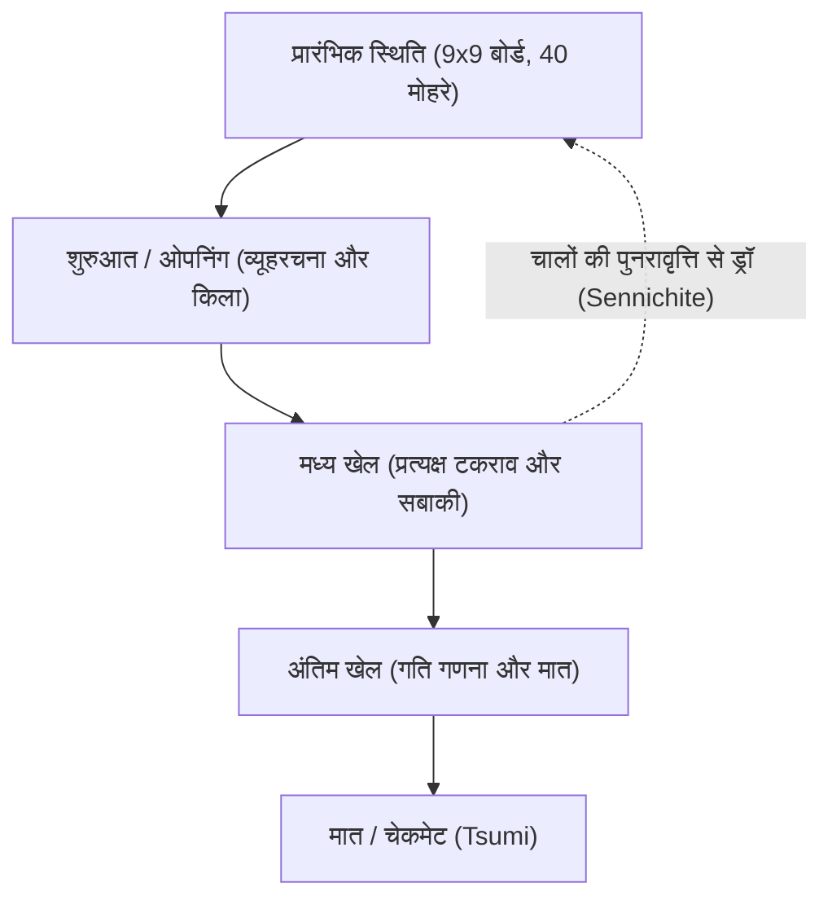

# बोर्ड गेम और एआई: शोगी (जापानी शतरंज) के नियम, रणनीतिक पैटर्न और कृत्रिम बुद्धिमत्ता का विकास

जापान का पारंपरिक रणनीतिक खेल **शोगी** (Shogi / जापानी शतरंज), अपनी सामरिक गहराई और असाधारण गतिशीलता के लिए सदियों से विद्वानों और खिलाड़ियों को मंत्रमुग्ध करता रहा है। कंप्यूटर विज्ञान और आर्टिफिशियल इंटेलिजेंस (एआई) के क्षेत्र में, शोगी दशकों तक एक दुर्गम वैज्ञानिक चुनौती बना रहा। 1997 में जब आईबीएम के डीप ब्लू ने पश्चिमी शतरंज में मानव चैंपियन को हराया, तो शोधकर्ताओं की निगाहें स्वाभाविक रूप से शोगी की ओर मुड़ीं — एक ऐसा खेल जिसकी विशाल गेम-ट्री जटिलता और 'मोहरों की वापसी' का अनूठा नियम ब्रूट-फोर्स गणना को असंभव बना देता है।

इस लेख में, हम शोगी के बुनियादी नियमों, इसकी गणितीय जटिलता, तीनों चरणों के रणनीतिक सिद्धांतों, हस्तलिखित ह्युरिस्टिक्स से लेकर डीप रीइन्फोर्समेंट लर्निंग तक एआई के विकास, और पेशेवर शोगी जगत में आए युगांतरकारी बदलावों का विस्तृत विश्लेषण करेंगे।

## 1. बुनियादी नियम और संरचनात्मक जटिलता: शोगी ब्रूट-फोर्स के वश में क्यों नहीं आता?

शोगी दो खिलाड़ियों के बीच 9x9 खानों के बोर्ड पर खेला जाने वाला एक परिमित, नियतिवादी और पूर्ण सूचना वाला जीरो-सम खेल है। प्रत्येक खिलाड़ी 20 मोहरों के साथ खेल शुरू करता है। इसका अंतिम उद्देश्य पश्चिमी शतरंज की तरह ही प्रतिद्वंद्वी के राजा (*Osho* या *Gyokuso*) को मात (*Tsumi*) देना है।

शोगी को पश्चिमी शतरंज और चीनी जियांगची से अलग करने वाला सबसे क्रांतिकारी नियम **मोचिगोमा** (*Mochigoma* / बंदी मोहरों का पुनः उपयोग) है। जब कोई खिलाड़ी प्रतिद्वंद्वी के किसी मोहरे को मारता है, तो वह मोहरा खेल से बाहर नहीं होता; बल्कि वह खिलाड़ी के हाथ में सुरक्षित रहता है। बाद में किसी भी चाल में, बोर्ड पर मोहरा चलाने के बजाय, खिलाड़ी अपने हाथ के उस मोहरे को बोर्ड के किसी भी खाली खाने में अपनी नई शक्ति के रूप में 'उतार' (*Drop*) सकता है।

यह नियम खेल के गणितीय स्वरूप को पूरी तरह बदल देता है। सामान्य शतरंज में मोहरे कटने पर बोर्ड खाली होता जाता है और अंत में विकल्प घटते हैं। लेकिन शोगी में मोहरे कटने के बाद भी कुल संख्या स्थिर रहती है; खेल जैसे-जैसे आगे बढ़ता है, उपलब्ध चालों की संख्या घटने के बजाय तेजी से बढ़ती है।

कॉम्बिनेटरियल गेम थ्योरी में किसी खेल के पैमाने को दो प्रमुख पैमानों पर मापा जाता है: **स्टेट-स्पेस जटिलता** और **गेम-ट्री जटिलता**:

$$
\text{स्टेट-स्पेस जटिलता} \approx 10^{71}
$$
$$
\text{गेम-ट्री जटिलता} \approx 10^{226}
$$

पश्चिमी शतरंज (स्टेट-स्पेस लगभग $10^{47}$, गेम-ट्री लगभग $10^{123}$) की तुलना में शोगी की जटिलता अकल्पनीय रूप से विशाल है। शोगी में प्रति चाल औसतन लगभग 80 वैध विकल्प होते हैं (शतरंज में लगभग 35)। सटीक मूल्यांकन और प्रूनिंग के बिना दुनिया का कोई भी सुपरकंप्यूटर इस खोज वृक्ष में भटक जाएगा।

## 2. खेल की प्रगति और रणनीतिक पैटर्न

शोगी का मैच तीन सुव्यवस्थित चरणों में विभाजित होता है: शुरुआत (*Joban*), मध्य खेल (*Chuban*), और अंतिम खेल (*Shuban*)। प्रत्येक चरण के लिए विशेष रणनीतिक दृष्टिकोण की आवश्यकता होती है:

### 1. शुरुआत (ओपनिंग): तैनाती, किलेबंदी और हाथी (रूख) की स्थिति
शुरुआती चरण में मोहरों को मूल स्थानों से आगे बढ़ाकर आक्रमण की तैयारी की जाती है और राजा की सुरक्षा के लिए 'किला' (*Kakoi*) बनाया जाता है। शोगी में रणनीति का प्रमुख विभाजन रूख (*Hisha*) की स्थिति पर निर्भर करता है:

- **स्थिर रूख (Ibisha)**: रूख को अपने मूल दाहिने किनारे (काले के लिए दूसरी फाइल) पर ही रखकर सीधा हमला किया जाता है। इसमें *यागुरा* (दुर्ग), *काकुगावारी* (ऊंट विनिमय) और *ऐगाकारी* जैसे पारंपरिक स्वरूप शामिल हैं।
- **गतिशील रूख (Furibisha)**: रूख को बोर्ड के केंद्र या बाईं ओर (फाइल 3 से 5) स्थानांतरित किया जाता है। *शिकेनबिशा* या *नाकाबिशा* जैसी प्रणालियां लचीले बचाव और पलटवार पर जोर देती हैं।

इसके साथ ही राजा की रक्षा के लिए किला बनाना अत्यंत आवश्यक है। ठोस **मीनो किला** (Mino Castle) या अत्यंत अभेद्य **आनागुमा** (Anaguma / बिज्जू की मांद), जहां राजा को बोर्ड के सबसे दूरस्थ कोने में छिपा दिया जाता है, अचानक होने वाले हमलों से रक्षा प्रदान करते हैं।

### 2. मध्य खेल: सामरिक दांवपेंच और व्यापक दृष्टिकोण (ताइख्योकुकन)
मध्य खेल तब शुरू होता है जब दोनों सेनाएं आमने-सामने टकराती हैं। यहां सटीक गणना और बोर्ड की समग्र समझ (*ताइख्योकुकन*) निर्णायक होती है:

- **तेसुजी (सामरिक तकनीकें)**: अत्यधिक प्रभावी मानक चालें, जैसे प्रतिद्वंद्वी के मोहरों को भटकाने के लिए प्यादे का बलिदान (*ताताकीनो-फू*) या रूख का दोहरा हमला (*जूजी-बिशा*)।
- **मोहरों का मूल्य बनाम मोहरों की सक्रियता (सबाकी)**: शोगी में केवल मोहरे मारना (*कोमादोकु*) ही पर्याप्त नहीं होता, बल्कि मोहरों की स्वतंत्रता और आपसी तालमेल (*सबाकी*) अधिक महत्वपूर्ण होता है। फंसा हुआ भारी मोहरा किसी काम का नहीं रहता।

आक्रमण शुरू करने (*शिकाके*) का सही समय चुनना मध्य खेल का सबसे महत्वपूर्ण पहलू है।

### 3. अंतिम खेल: गति की गणना और मात (त्सुमी)
शतरंज के धीमे और तकनीकी एंडगेम के विपरीत, शोगी का अंतिम खेल गति की एक रोमांचक दौड़ है। चूंकि हाथ में रखे मोहरों को सीधे राजा के सामने उतारा जा सकता है, इसलिए लंबी रक्षा करना लगभग असंभव होता है।

- **गति गणना (सोकुदो)**: अंतिम खेल की रणनीति गति पर आधारित होती है। इसमें अपने राजा को पूर्ण सुरक्षित रखने के बजाय यह सटीक गणना की जाती है कि कौन एक चाल पहले प्रतिद्वंद्वी के राजा को मात दे सकता है।
- **त्सुमी (मात) और हिस्शी (ब्रिंकमेट)**: *त्सुमी* का अर्थ है लगातार शह देकर राजा का अनिवार्य वध। *हिस्शी* ऐसी घातक स्थिति है जहां प्रतिद्वंद्वी अपनी अगली चाल में चाहे कोई भी बचाव करे, अगली ही चाल में उसे मात से बचाना असंभव होता है।

## 3. शोगी एआई का तकनीकी विकास

शोगी एआई का इतिहास कंप्यूटर विज्ञान में हस्तनिर्मित नियमों से स्वायत्त शिक्षण की ओर परिवर्तन की एक गौरवशाली गाथा है।

### प्रारंभिक काल: हस्तलिखित ह्युरिस्टिक्स और मिनिमैक्स की सीमाएं
1980 और 1990 के दशकों में, प्रोग्राम मिनिमैक्स एल्गोरिदम, अल्फा-बीटा प्रूनिंग और डेवलपर्स तथा ग्रैंडमास्टर्स द्वारा हाथ से लिखे गए मूल्यांकन फलनों पर निर्भर थे। मोहरों के मूल्यों और राजा की सुरक्षा के लिए स्थिर अंक तय किए जाते थे।

किंतु मोहरों की वापसी से उत्पन्न अनंत विकल्पों के कारण ये नियम विफल साबित हुए और सॉफ्टवेयर क्लब स्तर के शौकिया खिलाड़ियों से भी हार जाते थे।

### बोनान्ज़ा की क्रांति: मशीन लर्निंग द्वारा स्वचालित ट्यूनिंग (2005)
2005 में कुनिहितो होकी ने **Bonanza** पेश कर गेम एआई का इतिहास बदल दिया। हाथ से नियम लिखने के बजाय बोनान्ज़ा ने मशीन लर्निंग के जरिए पेशेवर मैचों (*Kifu*) से हजारों मोहरों के आपसी तालमेल के भार (KPP और KKP तालिकाओं) को स्वतः अनुकूलित किया ("बोनान्ज़ा मेथड")।

कंप्यूटर द्वारा मोहरों के सामंजस्य को स्वयं सीखने की इस पद्धति ने एआई की शक्ति में युगांतरकारी छलांग लगाई और सभी भविष्य के इंजनों का आधार बनी।

### डैनओ-सेन शृंखला और एआई की सर्वोच्चता (2012–2017)
2010 के दशक में एआई ने शीर्ष पेशेवरों को पछाड़ना शुरू कर दिया। जापान शोगी एसोसिएशन और ड्वांगो द्वारा आयोजित आधिकारिक **डैनओ-सेन** मैचों में *GPS Shogi*, *YaneuraOu* और **Ponanza** (काजुसुके यामामोटो द्वारा विकसित) ने एक के बाद एक शीर्ष पेशेवरों को हराया।

ऐतिहासिक निर्णायक क्षण 2017 के वसंत में आया: दूसरे डैनओ-सेन में मौजूदा मेइजिन खिताब धारक **अमाहिको सातो** को **Ponanza** ने 0–2 से हराया। इसने आधिकारिक तौर पर सिद्ध कर दिया कि शोगी में कृत्रिम बुद्धिमत्ता मानव बुद्धि से आगे निकल चुकी है।

### अल्फाजीरो और डीप न्यूरल नेटवर्क का युग
2017 के अंत में गूगल डीपमाइंड ने **AlphaZero** की घोषणा की। मानव मैचों का कोई डेटा लिए बिना, केवल बुनियादी नियमों के आधार पर स्व-खेल (रीइन्फोर्समेंट लर्निंग) और मोंटे कार्लो ट्री सर्च (MCTS) के जरिए कुछ ही घंटों में इसने कंप्यूटर शोगी विश्व चैंपियन *elmo* को परास्त कर दिया।

आज ओपन-सोर्स प्लेटफॉर्म पर **dlshogi** (जीपीयू पर डीप न्यूरल नेटवर्क) और **Suisho** (सीपीयू पर तेज NNUE वास्तुकला) जैसे इंजन उपलब्ध हैं, जो सामान्य घरेलू कंप्यूटरों पर भी ऐतिहासिक दिग्गजों से कहीं अधिक शक्तिशाली गणना करते हैं।

## 4. आधुनिक शोगी में वैचारिक क्रांति (पैराडाइम शिफ्ट)

एआई की जीत ने शोगी को समाप्त करने के बजाय एक नए स्वर्णिम युग की शुरुआत की है:

### 1. ओपनिंग सिद्धांतों का पुनर्निर्माण
शताब्दियों से चले आ रहे रूढ़िवादी सिद्धांतों को एआई ने कुछ ही महीनों में बदल दिया। एआई ने दिखाया कि अत्यधिक भारी किले बनाने में समय बर्बाद होता है। इसके बजाय हल्के, लचीले और तुरंत पलटवार करने वाले किलों को लोकप्रियता मिली। कई भूले-बिसरे पुराने स्वरूप पुनर्जीवित हुए और एआई द्वारा खोजी गई नई प्रणालियां पेशेवर प्रतियोगिताओं का मानक बन गईं।

### 2. अनिवार्य अनुसंधान उपकरण के रूप में एआई
आज युवा शिक्षार्थियों से लेकर सभी आठ प्रमुख खिताब जीतने वाले सोता फुजी जैसे दिग्गजों तक, हर पेशेवर खिलाड़ी के दैनिक अध्ययन में एआई इंजन अनिवार्य हो चुके हैं। मैचों के बाद 'एआई की शीर्ष चाल के साथ मिलान दर' की जांच कर अपनी सोच की सीमाओं को परखा जाता है।

### 3. मानवीय संवेदना और प्रतिस्पर्धा का पुनर्मूल्यांकन
विरोधाभास यह है कि मशीन की पूर्णता ने मानव खेल के भावनात्मक सौंदर्य को और अधिक उजागर किया है। समय का दबाव, शारीरिक थकान, मनोवैज्ञानिक तनाव और अंतर्ज्ञान के आधार पर लिए गए साहसिक निर्णय ऐसा मानवीय नाटक प्रस्तुत करते हैं जिसकी नकल कोई मशीन नहीं कर सकती। जब दर्शक जानते हैं कि बोर्ड पर पूर्ण सत्य क्या है, तो वे चरम दबाव में जूझते मानव खिलाड़ियों के साहस की और अधिक सराहना करते हैं।

## 5. निष्कर्ष: एआई और बौद्धिक खेलों का भविष्य

शोगी और कृत्रिम बुद्धिमत्ता का संगम मानव और मशीन के सह-विकास का एक आदर्श उदाहरण है। एआई ने खेल के रहस्य को नष्ट नहीं किया, बल्कि वह एक ऐसा मार्गदर्शक बन गया है जिसने मानव समझ को अभूतपूर्व गति से आगे बढ़ाया है।

शोगी के 81 खानों से परे, इस विशाल गेम-ट्री को हल करने में विकसित तकनीकें — सर्च ट्री रिडक्शन, न्यूरल इवैल्यूएशन और रीइन्फोर्समेंट लर्निंग — आज वैश्विक रसद, आणविक जीवविज्ञान, नई दवाओं के विकास और स्वायत्त वाहनों जैसी जटिल वास्तविक समस्याओं को हल करने में महत्वपूर्ण भूमिका निभा रही हैं।

शोगी की परंपरा और आधुनिक एआई का यह संगम सिद्ध करता है कि मशीनी गणना कला के सौंदर्य को कम नहीं करती, बल्कि उसे और अधिक आलोकित करती है।

---

*संदर्भ सूची*
- Hoki, K. (2006). "Bonanza: The Shogi Program Using Automatic Parameter Tuning". *IPSJ SIG Notes*.
- Silver, D., et al. (2018). "A general reinforcement learning algorithm that masters chess, shogi, and Go through self-play". *Science*, 362(6419), 1140-1144.
- डैनओ-सेन शृंखला के आधिकारिक रिकॉर्ड और तकनीकी दस्तावेज (जापान शोगी एसोसिएशन एवं ड्वांगो)।
