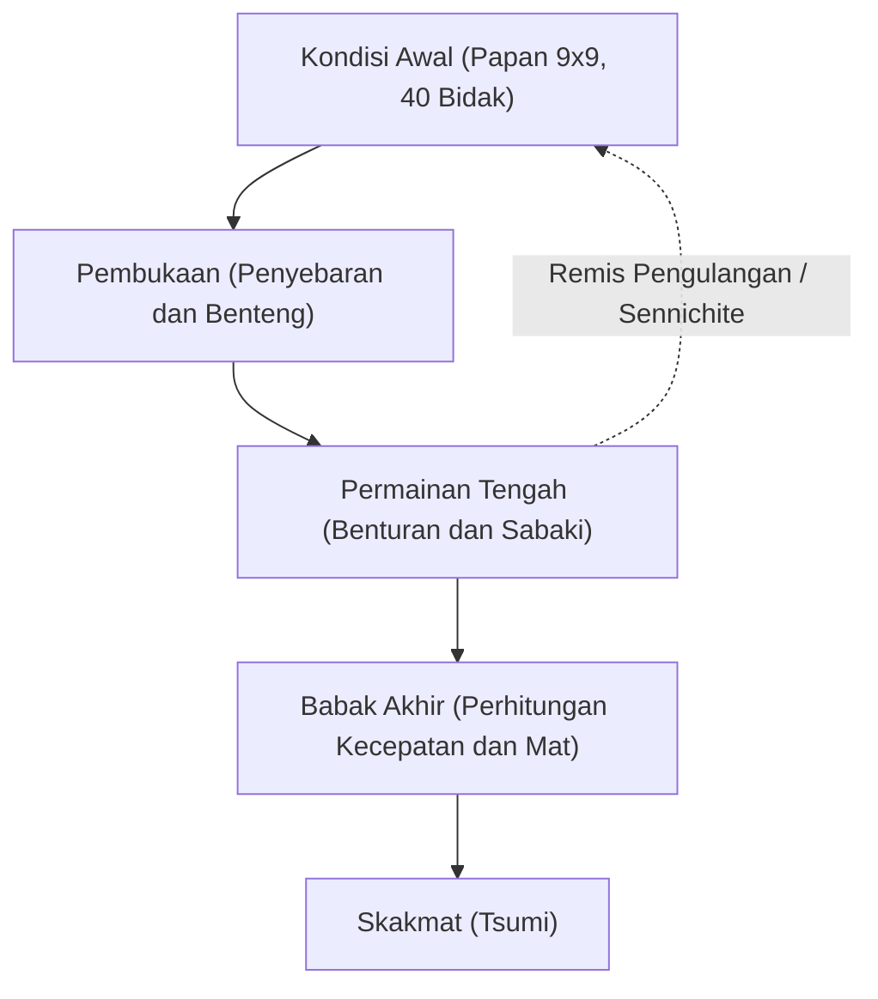

# Permainan Papan dan AI: Aturan Shogi, Pola Strategis, dan Evolusi Kecerdasan Buatan

**Shogi** (catur Jepang), permainan strategi giliran tradisional yang diasah selama berabad-abad di Jepang, memiliki kedalaman taktis dan dinamika posisi luar biasa yang memikat para master dan ilmuwan dari generasi ke generasi. Dalam ranah ilmu komputer dan kecerdasan buatan (AI), shogi berdiri selama puluhan tahun sebagai tantangan akbar yang sangat berat. Setelah Deep Blue milik IBM menaklukkan catur barat pada tahun 1997, fokus penelitian beralih secara alami ke shogi — permainan dengan faktor percabangan astronomis dan aturan peletakan bidak tangkapan yang tiada duanya.

Artikel ini membahas aturan dasar dan kompleksitas matematis shogi, pola strategis dalam tiga fase permainannya, lompatan teknologi AI dari heuristik manual hingga pembelajaran penguatan mendalam (deep reinforcement learning), serta pergeseran paradigma yang merevolusi dunia pemain profesional saat ini.

## 1. Aturan Dasar dan Keunikan Struktural: Mengapa Shogi Kebal Brute Force

Shogi adalah permainan zero-sum, berhingga, deterministik, dan berinformasi sempurna yang dimainkan oleh dua pemain di atas papan 9x9 petak. Setiap pemain memulai dengan 20 buah bidak. Tujuan akhirnya serupa dengan catur konvensional: melakukan skakmat (*Tsumi*) terhadap Raja lawan (*Osho* atau *Gyokuso*).

Perbedaan paling revolusioner yang memisahkan shogi dari catur barat maupun Xiangqi adalah **aturan peletakan bidak** (*Mochigoma*). Ketika seorang pemain menangkap bidak lawan, bidak tersebut tidak disingkirkan dari permainan; melainkan disimpan di tangan sebagai cadangan. Pada giliran berikutnya, alih-alih menggerakkan bidak di papan, pemain dapat memilih untuk "menerjunkan" (*Drop*) bidak cadangan ke kotak kosong mana pun sebagai bidaknya sendiri.

Mekanisme tunggal ini mengubah total lanskap komputasi permainan. Dalam catur biasa, pertukaran bidak menyederhanakan papan dan mengerucutkan opsi menuju babak akhir. Dalam shogi, pertukaran bidak mempertahankan jumlah total pasukan; bukannya menurun, jumlah pilihan langkah justru melonjak drastis seiring berjalannya pertandingan.

Dalam teori permainan kombinatorial, skala permainan diukur melalui dua metrik utama: **kompleksitas ruang status** dan **kompleksitas pohon permainan**:

$$
\text{Kompleksitas Ruang Status} \approx 10^{71}
$$
$$
\text{Kompleksitas Pohon Permainan} \approx 10^{226}
$$

Dibandingkan dengan catur barat (ruang status sekitar $10^{47}$ dan pohon permainan sekitar $10^{123}$), shogi menuntut kapasitas kalkulasi yang luar biasa raksasa. Rata-rata percabangan langkah legal mencapai sekitar 80 opsi per giliran (dibandingkan sekitar 35 pada catur barat). Tanpa pemangkasan cabang pencarian yang cerdas, superkomputer mana pun akan tersesat dalam belantara kombinasi ini.

## 2. Progresi Permainan dan Pola Strategis

Sebuah pertandingan shogi terbagi menjadi tiga fase utama yang terstruktur: Pembukaan (*Joban*), Permainan Tengah (*Chuban*), dan Babak Akhir (*Shuban*). Masing-masing fase memerlukan pendekatan kognitif yang berbeda:

### 1. Pembukaan: Penempatan Formasi, Benteng, dan Varian Benteng
Fase pembukaan berfokus pada memobilisasi bidak dari formasi awal, merancang struktur serang, dan mengamankan Raja di dalam benteng pertahanan (*Kakoi*). Polarisasi taktis utama dalam pembukaan shogi ditentukan oleh penempatan Benteng (*Hisha*):

- **Benteng Statis (Ibisha)**: Benteng dipertahankan di sayap kanan aslinya (jalur 2 untuk pemain Hitam). Gaya ini berorientasi pada serangan vertikal frontal, mencakup sistem terkenal seperti *Yagura* (Benteng Menara), *Kakugawari* (Pertukaran Gajah), dan *Aigakari*.
- **Benteng Bergeser (Furibisha)**: Benteng digeser ke arah tengah atau sayap kiri (jalur 3 hingga 5). Varian seperti *Shikenbisha* (Benteng Jalur 4) atau *Nakabisha* (Benteng Jalur Pusat) mengutamakan keluwesan manuver dan serangan balik.

Pada saat yang sama, membangun benteng pelindung Raja adalah hal mutlak. Struktur pertahanan kokoh seperti **Benteng Mino** atau benteng superpadat **Anaguma** (Liang Luak), di mana Raja dikubur di sudut terdalam papan, sangat penting untuk menahan gempuran taktis mendadak.

### 2. Permainan Tengah: Taktik Kontak dan Visi Global (Taikyokukan)
Permainan tengah pecah saat kedua belah pihak mulai melakukan kontak fisik antarbidak. Di fase ini, perhitungan taktis mendalam berpadu dengan intuisi posisi global (*Taikyokukan*):

- **Tesuji (Jurus Taktis Standar)**: Manuver taktis teruji dengan efisiensi tinggi, seperti menjatuhkan pion korban (*Tatakino-fu*) untuk merusak formasi lawan atau garpuan dua arah Benteng Silang (*Juji-bisha*).
- **Keuntungan Material vs Keluwesan Bidak (Sabaki)**: Di shogi, akumulasi bidak tangkapan (*Komadoku*) sering kali kalah penting dibandingkan kelancaran pergerakan dan koordinasi bidak (*Sabaki*). Bidak besar yang terjebak dan pasif justru menjadi beban.

Memilih momen yang tepat untuk melancarkan serangan (*Shikake*) membutuhkan kematangan pertimbangan posisi.

### 3. Babak Akhir: Kalkulasi Kecepatan dan Skakmat
Berbeda dari babak akhir catur barat yang lambat dan teknis, babak akhir shogi adalah balapan kecepatan hidup-mati. Karena bidak cadangan dapat diterjunkan langsung di depan hidung Raja lawan, pertahanan pasif mustahil bertahan lama.

- **Kalkulasi Kecepatan (Sokudo)**: Kompas utama babak akhir adalah kecepatan relatif. Tujuannya bukan membuat Raja sendiri aman seratus persen, melainkan menghitung secara cermat apakah kita bisa menumbangkan Raja lawan satu langkah lebih cepat.
- **Tsumi (Skakmat) dan Hisshi (Brinkmate)**: *Tsumi* adalah rangkaian skak tanpa henti yang berujung pada penangkapan Raja lawan. *Hisshi* adalah kondisi ancaman mat mutlak di mana apa pun langkah pembelaan lawan berikutnya, skakmat tak terhindarkan akan jatuh pada giliran selanjutnya.

## 3. Evolusi Teknologi AI Shogi

Sejarah AI dalam shogi melukiskan perjalanan transformatif ilmu komputer modern, beralih dari aturan manual yang kaku menuju jaringan saraf tiruan yang belajar mandiri.

### Era Awal: Heuristik Buatan Tangan dan Keterbatasan Minimax
Sepanjang dekade 1980-an dan 1990-an, mesin shogi mengandalkan algoritma Minimax dan pemangkasan Alpha-Beta yang dipadukan dengan fungsi evaluasi manual. Para pemrogram bersama pemain profesional memasukkan bobot numerik secara manual untuk menilai nilai bidak, keamanan Raja, dan penguasaan petak.

Namun, akibat besarnya ruang pencarian dan komplikasi bidak cadangan, sistem berbasis aturan manual penuh dengan kelemahan konseptual, sehingga mesin selalu kalah dari pemain amatir tingkat mahir.

### Terobosan Bonanza: Optimalisasi Pembelajaran Mesin (2005)
Pada tahun 2005, Kunihito Hoki merevolusi kancah AI melalui **Bonanza**. Alih-alih menyetel bobot secara manual, Bonanza menerapkan optimasi parameter otomatis melalui machine learning ("Metode Bonanza"). Berdasarkan puluhan ribu rekaman pertandingan profesional (*Kifu*), Bonanza menyetel ratusan ribu bobot konfigurasi pasangan dan kelompok bidak (tabel KPP dan KKP) secara mandiri.

Pendekatan ini memberi AI pemahaman posisi yang organik dan melampaui intuisi manusia, menjadi fondasi arsitektur bagi seluruh mesin catur modern setelahnya.

### Serial Turnamen Denou-sen dan Kemenangan AI (2012–2017)
Memasuki dekade 2010-an, mesin komputer telah menyamai level grandmaster teratas. Melalui rangkaian turnamen resmi **Denou-sen** yang digelar oleh Asosiasi Shogi Jepang dan Dwango, program-program mutakhir seperti *GPS Shogi*, *YaneuraOu*, dan **Ponanza** (dikembangkan oleh Kazusuke Yamamoto) mengalahkan para pemain profesional papan atas satu per satu.

Puncaknya terjadi pada musim semi 2017: dalam turnamen Denou-sen ke-2, pemegang gelar tertinggi Meijin saat itu, **Amahiko Sato**, ditaklukkan dengan skor 0–2 oleh **Ponanza**. Ini secara resmi mengukuhkan supremasi kecerdasan buatan atas kemampuan terbaik manusia dalam shogi.

### Era AlphaZero dan Jaringan Saraf Tiruan Dalam
Pada akhir 2017, Google DeepMind menggemparkan dunia dengan **AlphaZero**. Tanpa mempelajari data pertandingan manusia dan hanya berbekal aturan dasar, AlphaZero berlatih melalui simulasi mandiri (reinforcement learning murni) dipadukan dengan Monte Carlo Tree Search (MCTS). Hanya dalam hitungan jam, ia mampu menundukkan juara bertahan komputer dunia, *elmo*.

Kini, komunitas pengembang sumber terbuka melahirkan mesin-mesin canggih seperti **dlshogi** (berbasis jaringan konvolusi dalam pada GPU) dan **Suisho** (arsitektur NNUE supercepat pada CPU), memungkinkan komputer rumahan biasa memiliki daya analisis yang jauh melampaui para legenda masa lalu.

## 4. Pergeseran Paradigma di Dunia Shogi Modern

Keunggulan AI tidak mematikan shogi, melainkan memicu kelahiran kembali intelektual yang luar biasa di panggung profesional:

### 1. Pembongkaran Dogma Pembukaan Klasik
Selama ratusan tahun, teori pembukaan berkembang lewat kesepakatan empiris. Mesin AI mematahkan mitos lama hanya dalam hitungan bulan. AI membuktikan bahwa membangun benteng pertahanan yang terlalu berat membuang tempo berharga. Sebagai gantinya, AI mempopulerkan formasi Raja yang lebih fleksibel dan ringan dengan potensi serangan balik cepat. Varian kuno yang sempat ditinggalkan kini bangkit kembali, dan inovasi taktik ciptaan AI telah menjadi standar turnamen profesional.

### 2. AI sebagai Alat Riset Wajib
Saat ini, mulai dari siswa akademi *Shoreikai* hingga grandmaster pemegang delapan gelar seperti Sota Fujii, latihan harian bersama mesin AI adalah hal wajib. Evaluasi pascapertandingan menitikberatkan pada penemuan celah taktis dan penghitungan "tingkat kesesuaian langkah dengan pilihan utama AI".

### 3. Penemuan Kembali Nilai Kemanusiaan
Menariknya, kesempurnaan mesin kalkulasi justru menonjolkan keindahan psikologi manusia. Desakan waktu (byo-yomi), kelelahan fisik, ketegangan mental, dan lompatan intuisi yang berani menghadirkan drama emosional yang tak bisa ditiru mesin. Justru karena AI memperlihatkan langkah mutlak yang sempurna di papan, penonton dapat semakin menghargai perjuangan dan keberanian master manusia yang bertarung di batas kemampuannya.

## 5. Kesimpulan: AI dan Masa Depan Kecerdasan Kombinatorial

Perjumpaan shogi dan kecerdasan buatan menyajikan contoh nyata sinergi harmonis antara kecerdasan manusia dan mesin komputasi. AI tidak melenyapkan misteri shogi, melainkan menjadi mentor terbaik yang mengakselerasi pemahaman taktik manusia ke tingkat yang belum pernah terbayangkan.

Di luar 81 petak papan shogi, teknologi yang dimatangkan dalam menaklukkan pohon permainan ini — reduksi ruang pencarian masif, jaringan evaluasi saraf tiruan, dan pembelajaran penguatan — kini aktif memecahkan tantangan dunia nyata di bidang logistik global, bioinformatika molekuler, penemuan obat baru, hingga sistem kemudi otonom.

Perpaduan antara tradisi luhur Jepang dan kecerdasan buatan membuktikan bahwa ketepatan hitungan algoritma tidak memadamkan keindahan seni berpikir, melainkan menyinarinya dengan lebih cemerlang.

---

*Daftar Pustaka*
- Hoki, K. (2006). "Bonanza: The Shogi Program Using Automatic Parameter Tuning". *IPSJ SIG Notes*.
- Silver, D., et al. (2018). "A general reinforcement learning algorithm that masters chess, shogi, and Go through self-play". *Science*, 362(6419), 1140-1144.
- Arsip pertandingan dan laporan teknis resmi Denou-sen (Japan Shogi Association & Dwango).
