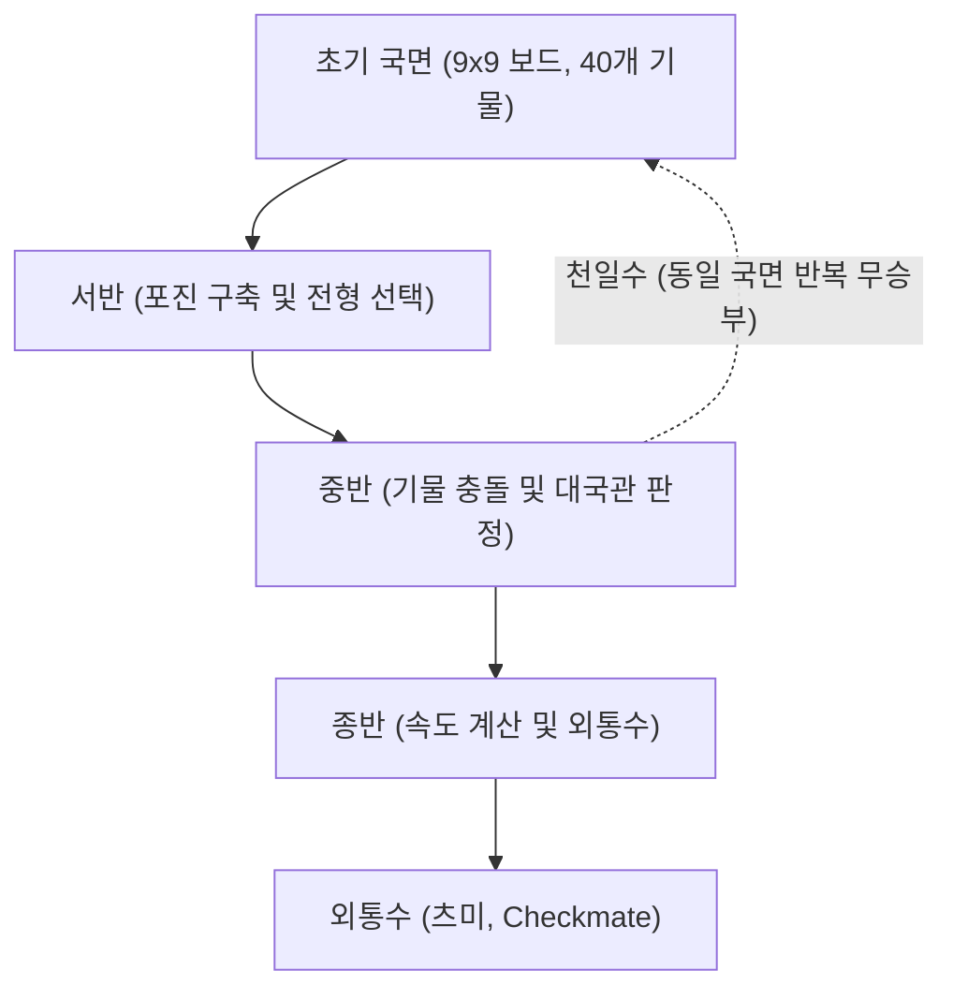

# 보드게임과 인공지능: 쇼기(일본 장기)의 규칙과 전략 패턴, AI의 진화

일본의 전통적인 턴제 추상 전략 보드게임인 **쇼기**(将棋 / 일본 장기)는 수백 년에 걸쳐 연마된 깊은 전술적 깊이와 역동성으로 오랜 세월 동안 플레이어와 학자들을 매료시켜 왔습니다. 컴퓨터 과학과 인공지능(AI) 연구 분야에서 쇼기는 수십 년 동안 난공불락의 거대한 도전 과제로 여겨졌습니다. 1997년 IBM의 딥 블루(Deep Blue)가 서양 체스를 정복한 이후, 컴퓨터 지능의 다음 개척지로 떠오른 것이 바로 쇼기였습니다. 체스보다 훨씬 방대한 분기 계수와 독특한 '포로 재사용' 규칙 때문이었습니다.

본 글에서는 쇼기의 기본 규칙과 구조적 특이성을 살펴보고, 초반·중반·종반 3단계에 걸친 핵심 전략 패턴을 분석하며, 수작업 휴리스틱에서 딥러닝으로 이어진 쇼기 AI의 진화 과정과 이것이 현대 프로 기사들에게 가져온 패러다임 전환을 기술적으로 조명합니다.

## 1. 쇼기의 기본 규칙과 고유성: 왜 쇼기는 계산적으로 복잡한가?

쇼기는 $9 \times 9$ 크기의 격자판 위에서 두 명의 경기자가 20개씩의 기물을 가지고 번갈아 수를 두며 상대방의 '옥장(玉将 / 왕)'을 먼저 외통수로 잡는(詰み, 츠미) 2인 제로섬 유한 확정 완전정보 게임입니다.

쇼기가 체스나 한국 장기, 중국 샹치와 결정적으로 차별화되는 가장 혁명적인 규칙은 바로 **모치고마(持ち駒, 포로 재사용 규칙)** 입니다. 상대방의 기물을 잡았을 때 기물이 판에서 영구 퇴장하는 것이 아니라, 자신의 예비 기물로 보관했다가 이후 자신의 차례에 빈칸 어디든 새로운 아군 기물로 '타격(打つ, 드롭)'하여 배치할 수 있습니다.

이 규칙은 게임의 수학적 구조를 근본적으로 뒤흔듭니다. 일반적인 체스에서는 기물 교환이 일어날수록 판 위의 기물 수가 줄어들어 종반으로 갈수록 탐색 공간이 급격히 수렴합니다. 반면 쇼기에서는 기물 교환이 일어나도 기물의 총량이 보존되며 오히려 손안의 배치 자유도가 높아져, 게임이 종반으로 향할수록 착수 가능한 선택지가 기하급수적으로 폭증합니다.

조합 게임 이론에서 게임의 규모를 나타내는 대표 지표인 **상태 공간 복잡도(State-space complexity)** 와 **게임 트리 복잡도(Game-tree complexity)** 를 비교해 보면 쇼기의 방대함이 명확히 드러납니다:

$$
\text{상태 공간 복잡도} \approx 10^{71}
$$
$$
\text{게임 트리 복잡도} \approx 10^{226}
$$

체스의 상태 공간 복잡도가 약 $10^{47}$, 게임 트리 복잡도가 $10^{123}$ 인 것과 비교할 때 쇼기는 천문학적인 연산량을 요구합니다. 쇼기의 평균 유효 착수 수는 1수당 약 80개에 달해(체스는 약 35개), 정밀한 형세 판단과 강력한 가지치기(Pruning) 없이는 어떠한 슈퍼컴퓨터로도 탐색 트리의 수렁에서 빠져나올 수 없습니다.

## 2. 대국의 진행과 국면별 전략 패턴

쇼기 대국은 크게 서반(Opening), 중반(Middle Game), 종반(Endgame)의 세 국면으로 나뉘며, 각 국면마다 전혀 다른 사고체계와 전략이 요구됩니다.

### 1. 서반: 포진의 구축과 울타리(카코이), 비차의 위치
서반은 초기 배치된 기물들을 조화롭게 전개하여 공격 진형을 갖추고, 동시에 자신의 왕을 안전하게 지키는 '울타리(囲い, 카코이)'를 완성하는 단계입니다. 쇼기의 전형은 공격의 핵심인 '비차(飛車, 룩에 해당)'를 어디에 배치하느냐에 따라 크게 둘로 나뉩니다:

- **이비샤(居飛車, Static Rook)**: 비차를 원래 자리인 오른쪽 날개(선수 기준 2열)에 둔 채 정면 돌파를 노리는 스타일. 야구라(Yagura), 카쿠가와리(Bishop Exchange), 아이가카리 등의 정통 전법이 이에 속합니다.
- **후리비샤(振り飛車, Ranging Rook)**: 비차를 중앙이나 좌측 날개(3–5열)로 이동시켜 유연하게 반격을 노리는 스타일. 사간비차, 삼간비차, 중비차 등이 대표적입니다.

또한 왕을 보호하는 울타리 구축 역시 승패를 좌우합니다. 단단함의 대명사인 **미노 울타리(Mino Castle)** 나 왕을 구석에 깊숙이 묻어 절대적인 안정감을 주는 **아나구마(Anaguma, 오소리 굴)** 등 상대의 전형에 맞춘 최적의 방어진을 설계해야 합니다.

### 2. 중반: 기물의 격돌과 대국관(사바키)
중반은 양측의 진형이 완성된 후 본격적인 국지전이 벌어지는 단계입니다. 정밀한 수읽기와 전체 판세를 꿰뚫어 보는 '대국관(大局観)'이 결정적 역할을 합니다:

- **테스지(手筋)**: 특정 국면에서 기물의 효용을 극대화하는 표준 전술 묘수. 보를 희생하여 상대 진형을 무너뜨리는 '타타키노 후'나 비차의 양걸이를 노리는 '십자비차' 등이 있습니다.
- **기물의 손익과 활용도(사바키)**: 쇼기에서는 단순히 기물을 많이 잡았는가(기물득)보다 기물이 얼마나 자유롭고 효율적으로 일하고 있는가(사바키, 捌き)가 국면의 우열을 결정합니다.

공격을 시작하는 타이밍(시카케)을 정확히 포착하는 것이 중반전의 핵심입니다.

### 3. 종반: 속도 계산과 츠미(외통수)
기술적인 기물 감축으로 흐르는 체스의 엔드게임과 달리, 쇼기의 종반전은 상대 왕의 목을 먼저 베는 쪽이 승리하는 숨 막히는 '스피드 레이스'입니다. 손안에 든 모치고마를 적진 바로 코앞에 투하할 수 있기 때문에 방어선을 유지하기가 극도로 어렵습니다.

- **속도 계산(速度)**: 종반의 유일한 나침반은 속도입니다. 내 왕의 안전도를 높이기보다, "내 왕이 잡히기까지 걸리는 수수"와 "상대 왕을 잡기까지 걸리는 수수"를 비교하여 단 한 수라도 먼저 상대 왕을 끝장내는 외길 수순을 찾아냅니다.
- **츠미(詰み, 외통수)와 힛시(必至, 브링크메이트)**: 상대 왕이 아무리 발버둥 쳐도 피할 수 없는 완벽한 체크메이트를 '츠미'라 부르며, 상대가 다음 턴에 어떤 방어수를 두더라도 그다음 수에 무조건 츠미에 걸리는 탈출 불능 상태를 '힛시'라고 부릅니다.

## 3. 쇼기 AI의 진화: 무차별 탐색에서 딥러닝까지

쇼기 AI의 발전사는 컴퓨터 과학이 복잡계 지능 문제를 극복해 온 역사 그 자체입니다.

### 초창기: 수작업 평가 함수와 알파-베타 가지치기의 한계
1980–1990년대의 쇼기 프로그램은 미니맥스 알고리즘과 알파-베타 가지치기를 기반으로, 프로 기사와 개발자가 손수 규칙과 가중치를 입력하는 '수작업 평가 함수'를 사용했습니다. 그러나 방대한 분기 수와 포로 재사용 규칙의 복잡성 때문에 인간의 언어로 기물의 유기적 가치를 수치화하는 데 명확한 한계가 있었고, 아마추어 유단자의 벽을 넘지 못했습니다.

### 보난자(Bonanza)의 혁명: 머신러닝의 도입 (2005)
2005년 호키 쿠니히토가 발표한 **Bonanza** 는 게임 AI의 역사를 영원히 바꾸어 놓았습니다. 보난자는 사람이 규칙을 짜는 대신, 수만 판의 프로 기보 데이터를 기계학습시켜 평가 함수의 수만 개 가중치를 자동 최적화하는 '보난자 메서드(Bonanza Method)'와 KPP/KKP 평가 방식을 고안했습니다.

컴퓨터가 스스로 기물 간의 상대적 가치와 배치의 조화를 학습하게 되면서 AI의 기력은 폭발적으로 도약했으며, 이는 이후 등장한 모든 쇼기 엔진의 표준 프레임워크가 되었습니다.

### 전왕전(電王戦)과 AI의 인간 초월 (2012–2017)
2010년대에 접어들며 AI는 현역 최정상 프로 기사들을 턱밑까지 추격했습니다. 드완고와 일본쇼기연맹이 주최한 공식 대국 '쇼기 전왕전'에서 *GPS 쇼기*, *야네우라오(YaneuraOu)*, *포난자(Ponanza)* 등 최신 엔진들이 잇달아 프로 기사들을 격파했습니다.

마침내 2017년 봄, 당시 인간계 최고 권위의 타이틀 보유자였던 **사토 아마히코 명인** 이 야마모토 잇세이가 개발한 소프트웨어 **Ponanza** 에게 2연패를 당하며, 인공지능이 인간의 지능을 확고히 초월했음이 공식적으로 선언되었습니다.

### 알파제로와 딥러닝 혁명
2017년 말, Google DeepMind의 **AlphaZero** 는 인간의 기보조차 전혀 학습하지 않고, 오직 기본 규칙만을 바탕으로 자가 대국(강화학습)과 몬테카를로 트리 탐색(MCTS)만을 수행하여 수 시간 만에 세계 컴퓨터 쇼기 선수권 챔피언 엔진 *elmo* 를 압도적으로 격파했습니다.

현재는 심층 신경망을 도입한 **dlshogi**(GPU 기반 DNN)와 초고속 임베디드 신경망 구조인 NNUE를 채택한 **스이쇼(水匠)** 등 오픈소스 엔진들이 비약적으로 발전하여, 가정용 일반 PC에서도 과거의 전설적인 명인들을 가볍게 능가하는 초인적 연산력을 발휘하고 있습니다.

## 4. 인공지능이 가져온 쇼기계의 패러다임 전환

AI가 인간을 추월한 오늘날, 쇼기계는 쇠퇴하기는커녕 전례 없는 연구의 황금기를 맞이하고 있습니다:

### 1. 고정관념을 파괴한 서반 포진의 재구성
과거 수백 년간 프로 기사들이 "악수"라거나 "무리수"라고 치부했던 수들이 AI의 정밀한 승률 분석을 통해 강력한 묘수였음이 속속 밝혀졌습니다. AI는 굳건한 울타리를 짓는 데 턴을 낭비하기보다, 왕을 엉성하게 둔 채 기동성을 극대화하여 먼저 카운터를 날리는 유연한 전법을 선호합니다. 이로 인해 잊혔던 옛 전법들이 부활하고, 'AI 발(發) 신정석'이 현대 프로 대국의 표준으로 자리 잡았습니다.

### 2. 필수 연구 인프라로 자리 잡은 AI
현재 일본 쇼기계에서는 연구생(장려회) 꿈나무부터 전인미답의 8관왕을 달성한 후지이 소타 명인에 이르기까지, 일상적인 복기와 연구에 AI를 활용하는 것이 당연시됩니다. 자신의 수와 'AI 최선수와의 일치율'을 측정하며 인간의 사고 한계를 극복하려는 연구가 보편화되었습니다.

### 3. '인간의 영역'에 대한 재발견
아이러니하게도 완벽한 AI의 등장은 인간 장기가 가진 극적인 매력을 더욱 돋보이게 만들었습니다. 초읽기의 압박, 극한의 심리전, 직관에 의한 결단, 그리고 인간이기에 저지르는 실수와 대역전극은 기계가 흉내 낼 수 없는 감동을 선사합니다. AI가 정답(최선의 수)을 제시해 주기 때문에, 역설적으로 그 정답 앞에서 고뇌하고 결단을 내리는 인간 프로 기사의 분투가 더욱 숭고하게 다가오는 것입니다.

## 5. 결론: AI와 지적 탐구의 미래

쇼기와 인공지능의 만남은 컴퓨터 과학의 위대한 승리이자, 인간과 기계가 어떻게 조화롭게 공진화할 수 있는지를 보여주는 완벽한 롤모델입니다. AI는 쇼기의 신비를 파괴한 것이 아니라, 인간이 도달하지 못했던 심오한 진리의 문을 열어주는 최고의 길잡이가 되었습니다.

나아가 쇼기의 방대한 탐색 공간을 극복하기 위해 개발된 **고차원 상태 압축**, **강화학습 최적화**, **신경망 평가 기법** 은 물류 수송 최적화, 신약 후보 물질 발굴, 자율주행 알고리즘 검증 등 복잡 다단한 인류 현실의 문제들을 해결하는 핵심 원동력으로 확장되고 있습니다.

81개의 칸 위에서 펼쳐진 인간의 직관과 기계의 계산력이 빚어낸 이 아름다운 여정은 지적 탐구의 새로운 지평을 계속해서 밝혀줄 것입니다.

---

*참고 문헌*
- Hoki, K. (2006). "Bonanza: The Shogi Program Using Automatic Parameter Tuning". *IPSJ SIG Notes*.
- Silver, D., et al. (2018). "A general reinforcement learning algorithm that masters chess, shogi, and Go through self-play". *Science*, 362(6419), 1140-1144.
- 일본쇼기연맹 및 Dwango 공식 전왕전 기보 및 기술 백서.
