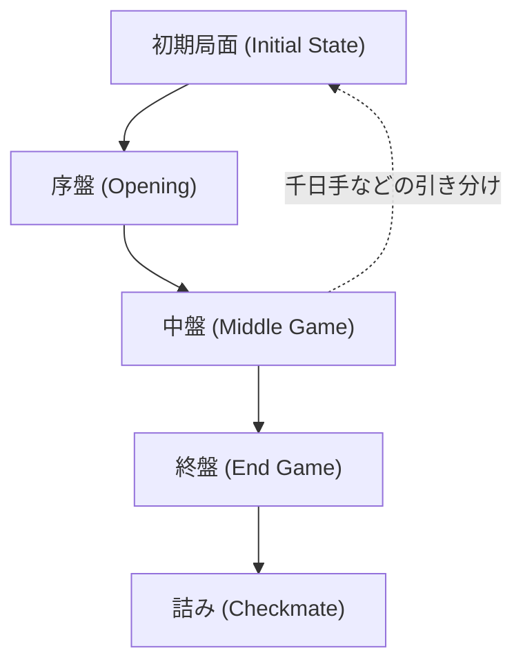

# ボードゲームとAI: 将棋のルールと戦略パターン解説、AIの進化

日本の伝統的なボードゲームである「将棋」。その奥深さと複雑さは、古くから多くの人々を魅了してきました。同時に、将棋はコンピュータサイエンス、特に人工知能（AI）の研究において、長年にわたり重要なベンチマークとして扱われてきました。チェスがAIによって攻略された後、次なる巨大な壁として立ちはだかったのが将棋です。

本記事では、将棋の基本的なルールや戦略のパターンを解説するとともに、将棋AIがどのように進化を遂げ、そして現在どのようにプロ棋士やアマチュアの戦術に影響を与えているのかを詳細に掘り下げます。

## 将棋の基本ルールと特異性：なぜ将棋は複雑なのか？

将棋は、9行9列の盤面上で、2人のプレイヤーが交互に駒を動かし、相手の「王将（玉将）」を先に捕獲する（詰ます）ことを目的としたゼロ和有限確定完全情報ゲームです。

将棋が他のチェスライクなゲーム（チェスやシャンチーなど）と決定的に異なるのは、「持ち駒」のルールの存在です。相手から取った駒を自らの駒として盤上に打つことができるこのルールにより、ゲームが進行するにつれて選択肢が爆発的に増加します。

ゲームの複雑さを示す指標として「状態空間複雑性（State-space complexity）」と「ゲーム木複雑性（Game-tree complexity）」があります。将棋の複雑さは以下の通りです。

$$
\text{状態空間の複雑性} \approx 10^{71}
$$
$$
\text{ゲーム木の複雑性} \approx 10^{226}
$$

チェスの状態空間複雑性が約$10^{47}$、ゲーム木複雑性が$10^{123}$であることを考えると、将棋がいかに膨大な計算量を要求するゲームであるかが分かります。「持ち駒」により、終盤になっても盤上の駒が減らないため、局面が収束しにくく、選択肢が常に膨大に保たれるのです。

## 将棋の進行と戦略パターン

将棋のゲーム進行は、大きく「序盤」「中盤」「終盤」の3つのフェーズに分けられます。それぞれのフェーズにおいて、独特の戦略パターンが存在します。

### 1. 序盤（Opening）：陣形の構築と戦型の選択

序盤は、駒を初期配置から動かし、自陣の守りを固め（囲い）、攻めの陣形を作るフェーズです。ここで採用される戦略は「戦法」と呼ばれ、大きく「居飛車（いびしゃ）」と「振り飛車（ふりびしゃ）」に大別されます。

- **居飛車**：攻撃の要である飛車を右翼（初期位置）に置いたまま戦うスタイル。矢倉（やぐら）、角換わり（かくがわり）、相掛かり（あいがかり）などの戦型があります。
- **振り飛車**：飛車を盤の左側や中央に移動させて戦うスタイル。四間飛車（しけんびしゃ）、三間飛車（さんけんびしゃ）、中飛車（なかびしゃ）などがあります。

また、自らの玉を守る「囲い」も重要です。「美濃囲い（みのがこい）」「穴熊（あなぐま）」など、相手の戦型に合わせて最適な防御陣地を構築することが序盤の鍵を握ります。

### 2. 中盤（Middle Game）：駒のぶつかり合いと大局観

中盤は、双方が構築した陣形をもとに、駒がぶつかり合うフェーズです。ここでは「大局観（たいきょくかん）」と「読み」の力が求められます。

- **手筋（てすじ）**：特定の局面で有効な部分的な駒の動かし方（戦術）。「歩の叩き」「十字飛車」など、無数のパターンが存在します。
- **駒の損得と駒の働き**：単に強い駒を持っているか（駒得）だけでなく、盤上の駒がどれだけ有効に働いているか（遊び駒がないか）が局面の優劣を左右します。

中盤では、どのタイミングで戦いを起こすか（仕掛け）、あるいは相手の攻めをどう受けるかという高度な判断が必要になります。

### 3. 終盤（End Game）：速度計算と詰み

終盤は、いかにして相手の玉を捕まえるか、そして自玉をいかに安全に保つかを競うフェーズです。将棋の終盤は「速度（そくど）」の概念が支配します。

- **速度計算**：自玉が詰まされるまでの手数（あるいは逃げ切れるか）と、相手玉を詰ますまでの手数を比較し、一歩でも早く相手を打ち負かす手順を導き出します。
- **詰み（つみ）と必至（ひっし）**：相手玉がどこに逃げても取られる状態を「詰み」、次にどう受けても詰みを逃れられない状態を「必至」と呼びます。終盤では、精緻な「読み」によってこれらの状態を正確に発見する能力が問われます。

## 将棋AIの進化：力任せの探索からディープラーニングへ

将棋AIの歴史は、コンピュータサイエンスの進歩そのものです。チェスAI「Deep Blue」が1997年に人間の世界チャンピオンを破った後、多くの研究者が将棋AIの開発に注力しました。

### 黎明期と評価関数の手動調整

初期の将棋プログラムは、盤面の有利・不利を数値化する「評価関数（Evaluation Function）」と、先の局面を読む「探索アルゴリズム（Search Algorithm）」で構成されていました。探索には「ミニマックス法」や、それを効率化した「アルファベータ法（Alpha-Beta pruning）」が用いられました。

しかし、当時のAIの評価関数は人間（開発者や協力棋士）が手動でパラメータを調整しており、将棋の複雑な局面を正確に評価するには限界がありました。

### Bonanzaの衝撃：機械学習の導入

将棋AIの歴史を大きく変えたのが、2005年に登場した「Bonanza」です。Bonanzaは、プロの棋譜（過去の対局記録）を大量に入力し、そこから機械学習を用いて評価関数の重みを自動的に最適化する手法（ボナンザ・メソッド）を確立しました。

これにより、AIの大局観が飛躍的に向上し、人間らしい、あるいは人間をも凌駕する自然な手を指せるようになりました。このアプローチは後の将棋ソフト開発の標準となり、AIの棋力を爆発的に引き上げました。

### 電王戦とAIの勝利

2010年代に入ると、AIの実力はトッププロ棋士に肉薄するようになります。「将棋電王戦」と銘打たれたプロ棋士対コンピュータソフトの公式戦では、AIが相次いでプロ棋士を撃破しました。そして2017年、当時の佐藤天彦名人が将棋ソフト「Ponanza」に敗れたことで、AIが人間を超越したことが決定づけられました。

### アルファゼロとディープラーニングの台頭

さらに革新をもたらしたのが、Google DeepMind社が開発した「AlphaZero（アルファゼロ）」です。従来の将棋AIが人間の棋譜を学習して評価関数を作っていたのに対し、AlphaZeroはルールの知識のみを与えられ、自分自身との対局（強化学習）を繰り返すことで、わずか数時間で世界最強クラスの将棋ソフト「elmo」を打ち破るまでに成長しました。

現在では、ディープラーニング技術（DNN評価関数など）を取り入れた「水匠（すいしょう）」や「dlshogi」といったソフトがオープンソース等で開発され、家庭用の一般的なPCでも過去の名人を遥かに凌ぐ計算能力を発揮できるようになっています。

## AIがもたらした将棋界のパラダイムシフト

AIが人間を凌駕した現在、プロ棋士の役割は「AIに勝つこと」から「AIと共に進化すること」へと変化しています。将棋AIの存在は、現代の将棋界に大きなパラダイムシフトをもたらしました。

### 1. 序盤理論の再構築

AIの評価値（局面の有利不利を示す数値）によって、これまで「不利だ」「定跡外だ」とされてきた手が実は有効であることが次々と発見されました。例えば、AIは陣形を固めるよりも、玉を薄く構えてバランスを取りながらカウンターを狙う戦術を好む傾向があります。これにより、昔からある戦法が再評価されたり、全く新しい「AI発の戦法」が人間の対局で流行したりしています。

### 2. 研究ツールの必須化

現在、奨励会（プロの養成機関）の若手からタイトル保持者のトッププロに至るまで、日常の研究にAIを用いることは当たり前となっています。対局後にはAIを使って自分の悪手や見落としていた好手を分析し、次戦への対策を練ります。「AIの評価値と一致する手を指せるか」が一種の強さの指標となっている側面もあります。

### 3. 「人間らしさ」の再発見

皮肉なことに、完璧な手を追求するAIの登場によって、人間の指す将棋の持つ「人間らしい魅力」が再認識されています。持ち時間の切迫による焦り、極限状態での心理戦、そして時にはAIが読めないような直感的な一手。これらは人間同士の対局だからこそ生まれるドラマであり、観る者を熱狂させます。AIが指し示す「最善手」という正解があるからこそ、人間がそこでどう悩み、どう決断するのかというプロセスに、より大きな価値が見出されているのです。

## 結論：AIとボードゲームの未来

将棋とAIの関わりは、技術的な挑戦の歴史であり、同時に人間と機械の共存のモデルケースでもあります。AIは将棋というゲームの真理を解き明かすための強力なツールとなりましたが、それによって将棋の魅力が失われたわけではありません。むしろ、AIという新たな「教師」あるいは「パートナー」を得たことで、将棋界はこれまでにないスピードで進化を続けています。

将棋におけるAIの進化のプロセスは、今後、医療、金融、自動運転など、より複雑な実社会の問題解決への応用が期待されています。盤上の限られた世界から生まれた知能が、私たちの社会全体を豊かにする日も、そう遠くはないでしょう。
