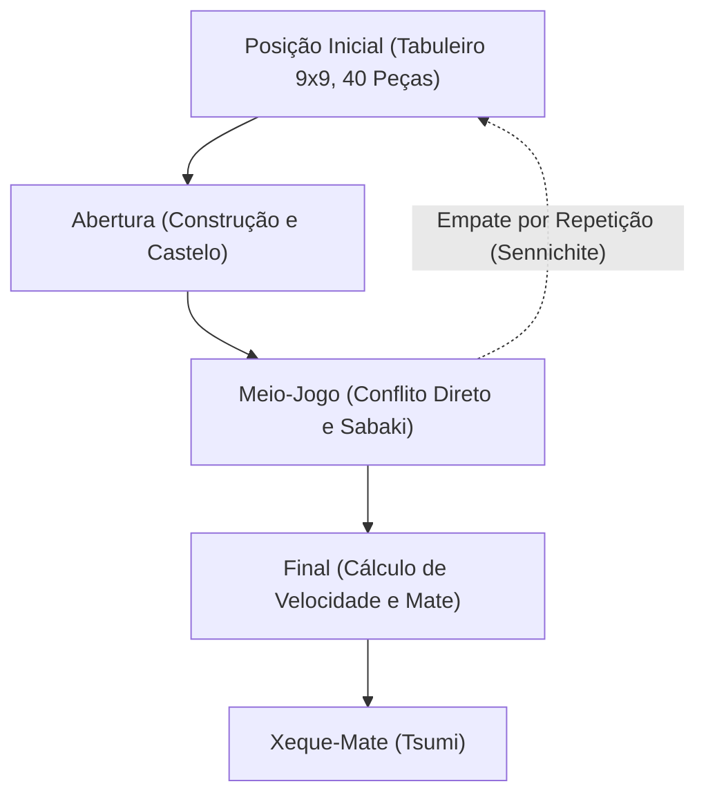

# Jogos de tabuleiro e IA: Regras do Shogi, padrões estratégicos e a evolução da inteligência artificial

O **Shogi** (o xadrez japonês), uma arte estratégica refinada ao longo de séculos no Japão, exibe uma profundidade posicional e um dinamismo incomparáveis que fascinam jogadores e cientistas há gerações. Na ciência da computação e na inteligência artificial (IA), o shogi constituiu durante décadas um dos mais formidáveis desafios algorítmicos. Após a consagração histórica do Deep Blue da IBM sobre o xadrez ocidental em 1997, as atenções voltaram-se inevitavelmente para o shogi — protegido por um fator de ramificação astronómico e pela revolucionária regra de reintrodução de peças.

Neste artigo, exploramos as regras fundamentais e a complexidade matemática do shogi, detalhamos os padrões estratégicos que regem as suas três fases de jogo, descrevemos a odisseia tecnológica dos motores de IA — desde heurísticas manuais até redes neurais profundas de aprendizagem por reforço — e examinamos a revolução de paradigmas que transformou a elite profissional.

## 1. Regras fundamentais e complexidade intrínseca: Por que o Shogi desafia a força bruta

O shogi é um jogo de soma zero, finito, determinístico e de informação perfeita disputado por dois jogadores num tabuleiro de 9x9 casas. Cada competidor inicia a partida com 20 peças. O objetivo central é análogo ao do xadrez ocidental: dar xeque-mate (*Tsumi*) ao Rei adversário (*Osho* ou *Gyokuso*).

O elemento de maior rutura conceptual que distingue o shogi do xadrez ocidental ou do Xiangqi é a **regra de reintrodução** (*Mochigoma*). Quando um jogador captura uma peça inimiga, esta não é eliminada; em vez disso, passa para a reserva do captor. Em qualquer jogada seguinte, em vez de mover uma peça já presente no tabuleiro, o jogador pode optar por "reintroduzir" (*Drop*) uma peça da sua reserva em qualquer casa livre como força aliada.

Essa mecânica altera radicalmente o comportamento combinatório do jogo. No xadrez tradicional, a troca de peças simplifica a posição e conduz a finais com poucas opções. No shogi, as trocas mantêm inalterado o número total de peças ativas no tabuleiro e na reserva; em vez de diminuir, o leque de ramificações cresce de forma explosiva à medida que a partida se aproxima do clímax.

Na teoria dos jogos combinatória, a dimensão de um jogo é quantificada por duas métricas fundamentais: a **complexidade do espaço de estados** e a **complexidade da árvore de jogo**:

$$
\text{Complexidade do espaço de estados} \approx 10^{71}
$$
$$
\text{Complexidade da árvore de jogo} \approx 10^{226}
$$

Ao comparar estes valores com os do xadrez ocidental (espaço de estados de $\approx 10^{47}$ e árvore de jogo de $\approx 10^{123}$), compreende-se a barreira hercúlea representada pelo shogi. Com um fator de ramificação médio de cerca de 80 lances válidos por jogada (face a cerca de 35 no xadrez), navegar a árvore de jogo por força bruta direta é fisicamente impossível sem técnicas de poda extremamente sofisticadas.

## 2. Progressão da partida e padrões estratégicos

Uma partida de shogi desenvolve-se ao longo de três fases bem estruturadas: a Abertura (*Joban*), o Meio-Jogo (*Chuban*) e o Final (*Shuban*). Cada fase requer um conjunto específico de ferramentas conceituais:

### 1. Abertura: Mobilização, Construção de Castelos e Posicionamento da Torre
A abertura foca-se na mobilização coordenada das peças a partir das posições iniciais, organizando o ataque e protegendo o Rei através da construção de uma fortaleza ou castelo (*Kakoi*). A grande dicotomia estratégica do shogi assenta no papel da Torre (*Hisha*):

- **Torre Estática (Ibisha)**: A Torre permanece na sua ala direita de origem (coluna 2 para as Pretas). Privilegia o choque direto e vertical em sistemas tradicionais como *Yagura* (Fortaleza), *Kakugawari* (Troca de Bispos) e *Aigakari*.
- **Torre Móvil (Furibisha)**: A Torre é deslocada para o centro ou para a ala esquerda (colunas 3 a 5). Variantes como *Shikenbisha* (Torre na 4ª coluna) ou *Nakabisha* (Torre Central) privilegiam a elasticidade e o contra-ataque fluído.

Paralelamente, a segurança do monarca é crucial. Estruturas como o sólido **Castelo Mino** ou o bunker impenetrável **Anaguma** (Toca do Texugo), onde o Rei se esconde no canto mais remoto do tabuleiro, constituem escudos vitais contra investidas táticas fulminantes.

### 2. Meio-Jogo: Conflito tático e visão global (Taikyokukan)
O meio-jogo eclode no instante em que os exércitos entram em contacto direto. Esta fase exige a união entre a capacidade de cálculo profundo e a intuição posicional global (*Taikyokukan*):

- **Tesuji (Técnicas exemplares)**: Padrões táticos consagrados de alta eficiência, tais como o sacrifício de peão batido (*Tatakino-fu*) para desestruturar a defesa inimiga ou o garfo de Torre em Cruz (*Juji-bisha*).
- **Vantagem material versus fluidez dinâmica (Sabaki)**: No shogi, a posse estática de mais peças (*Komadoku*) é frequentemente secundária perante a harmonia e fluidez operacional das forças no tabuleiro (*Sabaki*). Uma peça valiosa bloqueada representa um peso inútil.

Determinar o momento exato de desencadear o ataque (*Shikake*) exige um discernimento apurado.

### 3. Final: Cálculo de velocidade e Xeque-Mate
Longe dos finais lentos e técnicos do xadrez ocidental, o final no shogi é uma corrida dramática contra o relógio. Uma vez que as peças em reserva podem ser reintroduzidas à queima-roupa sobre o Rei adversário, manter defesas prolongadas é praticamente impossível.

- **Cálculo de velocidade (Sokudo)**: A estratégia do final é regida exclusivamente pela velocidade relativa. Não se busca proteger o próprio Rei de modo absoluto, mas sim calcular matematicamente quem desfere o mate um lance mais cedo.
- **Tsumi (Xeque-Mate) e Hisshi (Brinkmate)**: *Tsumi* é uma sequência forçada e ininterrupta de xeques que culmina na captura do Rei. *Hisshi* define uma situação de ameaça letal onde, qualquer que seja a defesa jogada pelo adversário na jogada seguinte, haverá um xeque-mate inevitável no lance subsequente.

## 3. A evolução tecnológica da IA no Shogi

A superação dos limites humanos no shogi marca uma das mais espetaculares conquistas da inteligência artificial moderna.

### A era inicial: Heurísticas manuais e limites do Minimax
Nas décadas de 1980 e 1990, os programas pioneiros recorriam ao algoritmo Minimax com poda Alfa-Beta e funções de avaliação codificadas manualmente por programadores e mestres convidados. Atribuíam-se pesos fixos ao valor individual das peças, à segurança do Rei e ao controlo espacial.

Contudo, perante a imensidão combinatória provocada pela reintrodução de peças, essas regras rígidas revelavam graves falhas conceituais, impedindo que os motores superassem jogadores amadores experientes.

### A revolução do Bonanza: Aprendizagem automática de parâmetros (2005)
Em 2005, Kunihito Hoki redefiniu a história da computação com o lançamento do **Bonanza**. Em vez de afinar pesos manualmente, o Bonanza introduziu a calibração automática por aprendizagem de máquina (o famoso "Método Bonanza"). Analisando dezenas de milhares de partidas jogadas por profissionais (*Kifu*), o sistema ajustou autonomamente centenas de milhares de pesos posicionais relativos a arranjos de peças (tabelas KPP e KKP).

Essa inovação conferiu ao programa um entendimento harmonioso e intuitivo do jogo, gerando um salto qualitativo que serviu de modelo a todas as gerações subsequentes de software.

### A série Denou-sen e a supremacia sobre os profissionais (2012–2017)
Na década de 2010, os algoritmos alcançaram a elite humana. No âmbito dos torneios oficiais **Denou-sen**, promovidos pela Federação Japonesa de Shogi e pela Dwango, motores como *GPS Shogi*, *YaneuraOu* e **Ponanza** (criado por Kazusuke Yamamoto) derrotaram repetidamente grandes mestres profissionais.

O clímax histórico deu-se na primavera de 2017: na segunda edição do Denou-sen oficial, o então detentor do prestigiado título de Meijin, **Amahiko Sato**, foi derrotado por 0 a 2 pelo motor **Ponanza**, consagrando publicamente a superioridade da IA no shogi.

### AlphaZero e a era das redes neurais profundas
No final de 2017, a Google DeepMind apresentou o revolucionário **AlphaZero**. Sem qualquer recurso a dados ou partidas humanas e conhecendo unicamente as regras básicas, o AlphaZero treinou-se através de auto-jogo puro (aprendizagem por reforço) combinado com pesquisa em árvore Monte Carlo (MCTS). Em apenas algumas horas, superou com facilidade o então campeão mundial de computadores, o motor *elmo*.

Posteriormente, a comunidade de código aberto desenvolveu plataformas notáveis como o **dlshogi** (utilizando redes convolucionais profundas em GPUs) e o **Suisho** (incorporando arquitetura NNUE veloz em CPUs convencionais), disponibilizando em computadores pessoais uma precisão analítica verdadeiramente sobre-humana.

## 4. A mudança de paradigma no Shogi humano

A ascensão vitoriosa da IA não apagou a paixão pelo shogi humano; pelo contrário, estimulou um renascimento intelectual sem precedentes:

### 1. Reformulação da teoria de aberturas
Durante séculos, a teoria das aberturas desenvolveu-se através do consenso empírico. Os motores de IA desmontaram dogmas enraizados em poucos meses. Ficou comprovado que fortificações excessivamente pesadas concediam tempos preciosos ao adversário; em seu lugar, ganharam força formações ligeiras, ágeis e preparadas para contra-golpes velozes. Estratégias antigas caídas em desuso foram resgatadas e variantes inéditas concebidas por IA tornaram-se padrão nos torneios de topo.

### 2. A IA como ferramenta indispensável de pesquisa
Hoje em dia, desde os aprendizes da academia *Shoreikai* até prodígios históricos como Sota Fujii (detentor de todos os grandes títulos mundiais), a utilização diária de motores de IA para estudo e preparação tática tornou-se indispensável. A análise pós-partida baseia-se na identificação de imprecisões e na medição da "taxa de coincidência" com os melhores lances sugeridos pela máquina.

### 3. A redescoberta da essência humana
De forma paradoxal, a precisão matemática da IA realçou a beleza singular da psicologia humana. A pressão inexorável do tempo, o cansaço acumulado, a coragem diante do abismo e as escolhas intuitivas criam uma narrativa comovente que nenhum computador consegue reproduzir. É precisamente porque conhecemos o lance perfeito da máquina que passamos a admirar ainda mais a determinação, a angústia e a bravura dos mestres humanos na sua busca pelo limite.

## 5. Conclusão: A IA e o futuro da inteligência combinatória

A jornada partilhada do shogi e da inteligência artificial constitui um modelo exemplar de colaboração harmoniosa entre o génio humano e o cálculo computacional. A IA não eliminou o mistério do jogo; antes, tornou-se no parceiro e mentor supremo que impulsiona a evolução da arte do shogi a um ritmo sem precedentes.

Para além das 81 casas do tabuleiro, as metodologias forjadas para dominar o shogi — poda em árvores massivas, redes neurais avaliativas e otimização por reforço — estão hoje a transformar setores vitais da sociedade moderna: gestão logística complexa, bioinformática de proteínas, desenvolvimento de novos medicamentos e controlo autónomo.

O encontro entre a tradição milenar do shogi e a tecnologia analítica de ponta confirma que o poder da computação não enfraquece a arte: antes a ilumina com um brilho incomparável.

---

*Referências bibliográficas*
- Hoki, K. (2006). "Bonanza: The Shogi Program Using Automatic Parameter Tuning". *IPSJ SIG Notes*.
- Silver, D., et al. (2018). "A general reinforcement learning algorithm that masters chess, shogi, and Go through self-play". *Science*, 362(6419), 1140-1144.
- Registos de partidas e relatórios técnicos oficiais da série Denou-sen (Associação Japonesa de Shogi e Dwango).
