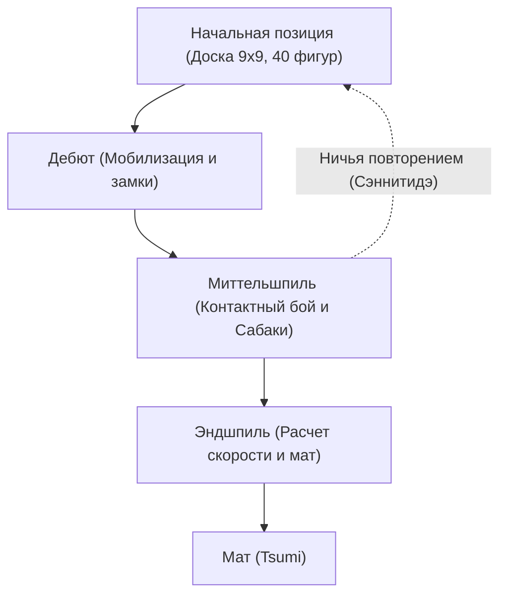

# Настольные игры и ИИ: правила сёги, стратегические паттерны и эволюция искусственного интеллекта

**Сёги** (японские шахматы), традиционная интеллектуальная игра с многовековой историей, обладает уникальной тактической глубиной и динамизмом, которые издавна восхищали мастеров и ученых. В области компьютерных наук и искусственного интеллекта (ИИ) сёги на протяжении десятилетий оставались неприступной цитаделью. После исторической победы программы Deep Blue над Гарри Каспаровым в классических шахматах в 1997 году исследователи обратили пристальное внимание на сёги — игру с астрономическим фактором ветвления и уникальным правилом сброса фигур.

В этой статье мы подробно рассмотрим базовые правила и математическую сложность сёги, стратегические принципы трех стадий партии, технологическую революцию от ручных эвристик до глубокого обучения с подкреплением, а также фундаментальный сдвиг парадигмы в профессиональном мире сёги.

## 1. Базовые правила и структурная уникальность: почему сёги не поддаются прямому перебору

Сёги — это игра для двух игроков с нулевой суммой, конечная, детерминированная и с полной информацией, разворачивающаяся на доске 9x9 клеток. Каждый соперник начинает партию с 20 фигурами. Главная цель аналогична классическим шахматам: поставить мат (*Tsumi*) вражескому королю (*Osho* или *Gyokuso*).

Ключевое отличие сёги от западных шахмат и китайских сянци заключается в **правиле сброса** (*Mochigoma*). Захваченная у противника фигура не покидает игру, а переходит в резерв пленившего ее игрока («фигуры в руке»). В любой свой последующий ход игрок может вместо перемещения фигуры по доске «сбросить» (выставить) фигуру из резерва на любое свободное поле в качестве своей боевой единицы.

Это единственное правило коренным образом меняет математическую природу игры. В классических шахматах размены упрощают позицию, сокращая число возможных продолжений к эндшпилю. В сёги размены сохраняют общее число фигур в игре, из-за чего количество допустимых ходов к завершению партии не уменьшается, а взрывообразно растет.

В комбинаторной теории игр масштаб игры оценивается двумя фундаментальными показателями: **сложностью пространства состояний** и **сложностью дерева игры**:

$$
\text{Сложность пространства состояний} \approx 10^{71}
$$
$$
\text{Сложность дерева игры} \approx 10^{226}
$$

По сравнению с классическими шахматами (пространство состояний $\approx 10^{47}$, дерево игры $\approx 10^{123}$) вычислительная сложность сёги колоссальна. Средний фактор ветвления составляет около 80 ходов на полуход (против 35 в шахматах), что делает невозможным чистый перебор без сверхточных методов отсечения ветвей.

## 2. Развитие партии и ключевые стратегические концепции

Партия в сёги делится на три классические стадии: дебют (*Joban*), миттельшпиль (*Chuban*) и эндшпиль (*Shuban*). Каждая требует специфического набора навыков и стратегического мышления:

### 1. Дебют: Развертывание сил, построение замков и позиционирование Ладьи
В дебюте игроки развивают фигуры с исходных позиций, готовя атаку и укрепляя безопасность своего короля с помощью оборонительного «замка» (*Kakoi*). Главный стратегический водораздел в сёги определяется положением самой мощной атакующей фигуры — Ладьи (*Hisha*):

- **Статическая Ладья (Ibisha)**: Ладья остается на исходном правом фланге (2-я вертикаль для Черных). Этот стиль нацелен на прямолинейную вертикальную атаку и включает системы *Ягура* (Крепость), *Какугавари* (Размен слонов) и *Айгакари*.
- **Смещенная Ладья (Furibisha)**: Ладья перемещается в центр или на левый фланг (3-я, 4-я или 5-я вертикали). Стратегии *Сикэнбися* (Ладья на 4-й вертикали) или *Накабися* (Центральная ладья) делают упор на гибкое маневрирование и контратаки.

Одновременно с этим критически важно возвести надежный замок. Такие структуры, как монолитный **замок Мино** или сверхукрепленный **Анагума** (Барсучья нора), где король прячется в самом углу доски за частоколом генералов, обеспечивают надежную защиту от тактических штурмов.

### 2. Миттельшпиль: Тактические стычки и глобальное видение (Тайкёкукан)
Миттельшпиль начинается при первом прямом контакте боевых линий. Здесь решающее значение приобретают глубокий тактический расчет и стратегическая интуиция (*Тайкёкукан*):

- **Тэдзи (Тактические приемы)**: Канонические тактические мотивы, такие как жертвенный сброс пешки (*Татакино-фу*) для разрушения обороны соперника или крестовый удар Ладьей (*Дзюдзи-бися*).
- **Материальный перевес против активности фигур (Сабаки)**: В сёги чистая ценность фигур (*Комадоку*) часто уступает динамической гармонии и маневренности сил (*Сабаки*). Заблокированная тяжелая фигура становится бесполезным грузом.

Выбор идеального момента для начала атаки (*Сикакэ*) требует высшей позиционной зрелости.

### 3. Эндшпиль: Расчет скорости и мат (Цуми)
В отличие от затяжных шахматных окончаний, эндшпиль в сёги — это ожесточенная гонка на опережение. Поскольку фигуры из руки можно сбрасывать вплотную к неприятельскому королю, глухая оборона обречена на прорыв.

- **Расчет скорости (Сокудо)**: Стратегией эндшпиля управляет относительная скорость. Задача состоит не в поиске абсолютной безопасности собственного короля, а в строгом расчете: успеет ли атака поставить мат королю соперника хотя бы на один ход раньше.
- **Цуми (Мат) и Хисси (Бринкмейт)**: *Цуми* — это форсированная непрерывная цепочка шахов, завершающаяся неизбежным взятием короля. *Хисси* — положение, при котором противник при любом своем ответе получит неотвратимый мат на следующем ходу.

## 3. Технологическая эволюция ИИ в сёги

История программ для игры в сёги олицетворяет триумф современных алгоритмов поиска и искусственных нейронных сетей.

### Ранний этап: Ручные эвристики и ограничения Минимакса
В 1980–1990-х годах программы опирались на алгоритм Минимакс с альфа-бета отсечением и оценочные функции, параметры которых вручную настраивались разработчиками и профессиональными консультантами. Оценивались материальный баланс, безопасность короля и контроль полей.

Однако из-за неисчерпаемого пространства вариантов и динамики сброшенных фигур жестко закодированные правила допускали грубые стратегические ошибки, не позволяя программам одолеть даже сильных игроков-любителей.

### Прорыв Bonanza: Автоматическая оптимизация весов (2005)
В 2005 году Кунихито Хоки представил программу **Bonanza**, навсегда изменившую разработку игрового ИИ. Вместо ручной калибровки Bonanza реализовала автоматическую оптимизацию параметров с помощью машинного обучения («Метод Бонанзы»). На основе анализа десятков тысяч партий профессионалов (*Kifu*) алгоритм автоматически настроил сотни тысяч весовых коэффициентов взаимосвязей фигур (таблицы KPP и KKP).

Программа обрела поразительно естественное позиционное чутье, что вызвало лавинообразный рост силы игры и определило архитектуру всех последующих движков.

### Турниры Дэнъо-сэн и превосходство над человеком (2012–2017)
В 2010-х годах компьютерные движки вплотную приблизились к элите мирового сёги. В рамках официальных серий турниров **Дэнъо-сэн** (Denou-sen), организованных Японской ассоциацией сёги и компанией Dwango, программы *GPS Shogi*, *YaneuraOu* и **Ponanza** (созданная Кадзусукэ Ямамото) раз за разом наносили поражения ведущим профессионалам.

Исторический перелом наступил весной 2017 года: во втором турнире Дэнъо-сэн действующий обладатель высшего титула Мэйдзин, **Амахико Сато**, уступил программе **Ponanza** со счетом 0:2. Это событие окончательно зафиксировало наступление эпохи сверхчеловеческого ИИ в сёги.

### Эра AlphaZero и глубоких нейронных сетей
В конце 2017 года компания Google DeepMind представила **AlphaZero**. Без использования партий людей, зная лишь правила игры, AlphaZero посредством обучения с подкреплением и поиска по дереву Монте-Карло (MCTS) за несколько часов превзошла сильнейший в мире традиционный сёги-движок *elmo*.

Сегодня сообщество разработчиков развивает открытые системы на основе сверточных сетей на GPU (**dlshogi**) и эффективных архитектур NNUE на CPU (**Suisho**), позволяя обычным пользователям запускать аналитические движки, на голову превосходящие любого гроссмейстера прошлого.

## 4. Парадигмальный сдвиг в профессиональном сёги

Триумф ИИ не уничтожил сёги, а открыл эру интеллектуального расцвета и переосмысления игры:

### 1. Пересмотр теории дебютов
Многовековые догмы были разрушены графиками оценки ИИ всего за несколько лет. Оказалось, что чрезмерно массивные замки отнимают слишком много темпов. ИИ популяризировал легкие, сбалансированные конструкции с гибким королем, рассчитанные на стремительную контратаку. Забытые древние варианты обрели вторую жизнь, а дебютные идеи, сгенерированные машинами, стали стандартом профессиональных матчей.

### 2. ИИ как незаменимый инструмент подготовки
Сегодня от юных воспитанников школы *Сёрейкай* до таких феноменов, как обладатель всех высших корон Сота Фудзии, ежедневная подготовка с помощью движков ИИ является абсолютной нормой. Анализ строится на выявлении ошибок и подсчете процента совпадения сделанных ходов с первой линией рекомендаций ИИ.

### 3. Ренессанс человеческих эмоций и драмы
Парадоксально, но идеальная точность вычислений ИИ подчеркнула уникальную ценность человеческого фактора. Ограничение времени, физическое истощение, накал психологической борьбы и интуитивные озарения создают драму, недоступную кремниевым чипам. Знание объективно лучшей оценки позволяет зрителям еще острее сопереживать мужеству и стойкости мастеров, принимающих судьбоносные решения на краю пропасти.

## 5. Заключение: ИИ и будущее комбинаторного интеллекта

История сёги и искусственного интеллекта — это вдохновляющий пример синергии человека и машины. ИИ не развеял магию сёги, а стал безупречным наставником, ускоряющим познание игры невиданными темпами.

За пределами 81 клетки доски алгоритмы, отточенные на деревьях решений сёги — компрессия графов, нейросетевая оценка и обучение с подкреплением, — сегодня успешно применяются для решения сложнейших практических задач: в маршрутизации логистических потоков, структурной биологии, синтезе лекарств и системах беспилотного управления.

Слияние древней японской традиции и передовых компьютерных технологий доказывает, что математическая мощь алгоритмов не убивает искусство мысли — она выводит его на новую высоту.

---

*Литература*
- Hoki, K. (2006). "Bonanza: The Shogi Program Using Automatic Parameter Tuning". *IPSJ SIG Notes*.
- Silver, D., et al. (2018). "A general reinforcement learning algorithm that masters chess, shogi, and Go through self-play". *Science*, 362(6419), 1140-1144.
- Официальные архивы и партии серии турниров Дэнъо-сэн (Японская ассоциация сёги и Dwango).
