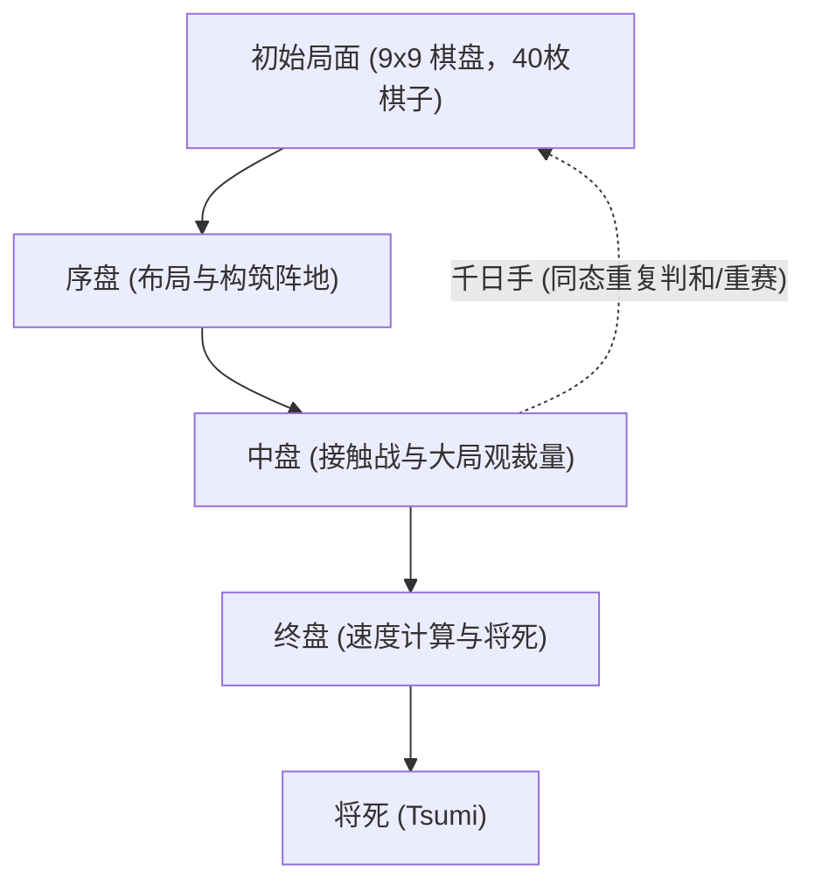

# 棋盘游戏与人工智能：日本将棋的规则、战略模式与AI进化史

作为日本历经数百年沉淀的传统智力瑰宝， **将棋** （Shogi / 日本象棋）以其深邃的战术纵深与动态变化，长期吸引着全球棋手与学者。在计算机科学与人工智能（AI）领域，将棋更是长达数十年的标志性研究基准。1997 年 IBM 的“深蓝”（Deep Blue）攻克国际象棋之后，AI 领域下一座高耸的学术堡垒便是日本将棋——一种因独特的“持驹”规则与天文级分支因子而极难被暴力计算攻破的博弈游戏。

本文将从基础规则出发，系统阐述将棋的核心复杂度、三大对局阶段的经典战略模式，梳理将棋 AI 从传统启发式搜索到深度强化学习的技术跃迁，并深入探讨人工智能对当代职业棋坛与棋艺研究带来的颠覆性范式转变。

## 1. 将棋规则与特异性：为何将棋的计算空间如此浩瀚？

将棋是在 $9 \times 9$ 棋盘上进行的双人零和有限确定完全信息博弈。对局双方执 20 枚棋子，终极目标与国际象棋相同：将死对方的“王将（玉将）”。

将棋区别于国际象棋、中国象棋等棋类的最具革命性的特异规则在于 **持驹** （Mochigoma / 捕获子再次利用）。在对局中吃掉对方的任何棋子，都不会移出棋局，而是进入己方“持驹”储备池。在后续对局中，棋手可随时将储备的棋子作为己方战力“打入”棋盘任意未被占领的合法格子。

这一规则在本质上改变了博弈树的几何演化。在国际象棋中，子力的兑换会直接缩减盘面棋子总数，使得终局计算迅速收敛；而在将棋中，吃子并不减少子力总数，反而极大拓展了盘面可用棋子储备，导致对局越到后期，每一步的可选分支不但不缩水，甚至呈爆炸式剧增。

在组合博弈论中，衡量博弈规模的核心指标包括 **状态空间复杂度** （State-space complexity）与 **博弈树复杂度** （Game-tree complexity）：

$$
\text{状态空间复杂度} \approx 10^{71}
$$
$$
\text{博弈树复杂度} \approx 10^{226}
$$

对比国际象棋（状态空间约为 $10^{47}$，博弈树复杂度约为 $10^{123}$），将棋的计算难度堪称天文级别。将棋每回合平均有效走法高达 80 种左右（国际象棋仅约为 35 种）。如果缺乏高精度的局面剪枝与精准的大局观评估函数，任何超级计算机都将在庞大的博弈树中迷失。

## 2. 对局推进与核心战略模式

一局标准的将棋对决通常划分为三个紧密相连的阶段：序盘（Opening）、中盘（Middle Game）与终盘（End Game）。各阶段均具有鲜明的战略诉求：

### 1. 序盘：布阵、围玉与战型抉择
序盘的核心在于调动初始子力，构建防守阵地（围玉），同时为后续进攻蓄力。将棋战法最核心的分类依据在于主力进攻子“飞车”的初始运用：

- **居飞车（Ibisha）** ：将飞车保留在初始右翼位置作战。典型战型包括矢仓（Yagura）、角交换（Kakugawari）、相挂（Aigakari）等，讲求阵地严谨与正面硬碰硬的战术推演。
- **振飞车（Furibisha）** ：将飞车横向转移至左翼或中路作战。典型战型包括四间飞车、三间飞车、中飞车等，更侧重灵活多变的子力腾挪与防守反击。

与此同时，保护主帅的“围玉”（Castle）至关重要。例如以防御坚韧著称的 **美浓围** （Mino Castle）与防御力极度致密的 **穴熊** （Anaguma），为王将构筑起抗击突袭的安全堡垒。

### 2. 中盘：子力交锋与大局观裁量
中盘始于双方战线发生实质性接触。该阶段考验棋手深入局部的“读棋”（计算力）与总揽全盘的“大局观”：

- **手筋（Tesuji）** ：局部极为高效的定式技巧。例如通过叩步（Tatakino-fu）打乱敌方防线，或利用飞车的“十字飞车”制造致命双重打击。
- **子力价值与子力活性（Sabaki）** ：将棋并非单纯统计谁吃子更多（驹得），更重要的是盘面棋子的运转效率与协同性（避免出现无法参战的死子或呆子）。

在中盘发起总攻（仕挂）的时机选择至关重要，过早进攻会导致破绽百出，拖延进攻则可能错失胜机。

### 3. 终盘：速度计算与将死技巧
与国际象棋沉闷的技术性残局截然不同，将棋终盘是一场生死时速的对攻竞赛。由于双方手握海量持驹可直接空降，绝对防御几乎不可能长久维持。

- **速度计算（Sokudo）** ：终盘并不追求绝对的安全，而是精确比较“自玉被将死的回合数”与“对方玉将死的回合数”。即便己方阵地支离破碎，只要比对手先一步将死敌王即可获胜。
- **将死（Tsumi）与必至（Hisshi）** ：敌玉无论如何逃脱均被吃掉的状态称为“诘（将死）”；而无论对手下一步如何防守，下一回合必然被将死的状态称为“必至”（Brinkmate）。通过练习“诘将棋”，棋手能够淬炼出极高密度的终盘深度计算能力。

## 3. 将棋 AI 的技术跃迁史

将棋 AI 的进化史是现代计算机科学突破的绝佳缩影。它走过了一条从手工死记硬背到自主博弈进化的壮阔道路。

### 早期探索：手工规则与极小化极大算法
20 世纪 80 至 90 年代，早期将棋软件主要依赖极小化极大（Minimax）与阿尔法-贝塔剪枝算法，配合开发者与棋手手工编织的评估函数。人们手动为子力价值、王将安全度以及控制格赋予静态权重。

然而，面对将棋浩瀚的可能走法与持驹引发的复杂性，人工编写的规则千疮百孔，当时的软件实力甚至无法击败业余高水平爱好者。

### Bonanza 的革命：机器学习评估函数的引入 (2005)
2005 年，保木邦仁开发的 **Bonanza** 彻底颠覆了传统棋类 AI 的研发范式。Bonanza 摒弃了人工调参，开创性地提出了利用大量职业高手数万局真实棋谱，通过机器学习自动优化数万个局部子力组合权重的方法（即著名的“Bonanza Method”或 KPP/KKP 评估法）。

这种让计算机自主从真实大师棋谱中感悟全局协调性的架构，使得将棋 AI 的棋力发生了质的飞跃，成为后续所有顶尖将棋软件的基石。

### 电王战与 AI 超越人类 (2012–2017)
进入 2010 年代，AI 的实力已逼近人类巅峰。在多届“将棋电王战”中，包括 *GPS将棋*、*屋檐里王（YaneuraOu）* 和 *Ponanza*（山本一成开发）在内的顶尖软件接连击败一流职业棋士。

终局性时刻发生在 2017 年春天：在第二期电王战中，当时的日本最高荣誉头衔保持者 **佐藤天彦名人** 以 0 比 2 完败给软件 **Ponanza** 。这一战标志着人工智能在将棋领域正式全面超越人类顶尖智力。

### AlphaZero 与深度神经网络时代
2017 年底，Google DeepMind 推出了震惊世界的 **AlphaZero** 。AlphaZero 不依赖任何人类棋谱，仅依靠基础游戏规则，通过自我对弈（强化学习）与蒙特卡洛树搜索（MCTS），仅仅耗时数小时便完胜了当时的计算机将棋世界冠军软件 *elmo*。

如今，采用深度卷积神经网络（DNN）架构的 **dlshogi** 与基于高效神经网络（NNUE）技术的 **水匠** （Suisho）等开源引擎百花齐放。如今在普通家用电脑或便携设备上运行的将棋软件，其计算精度与大局观已远超昔日历史名宿。

## 4. 人工智能引发的将棋界范式转变

AI 击败人类并未让将棋没落，反而为这项古老艺术注入了前所未有的生机，重塑了现代将棋的生态体系：

### 1. 传统定式的颠覆与重构
传统棋理往往强调阵地严密，倾向于深垒坚城（如固若金汤的穴熊围）。然而，AI 的精确胜率评估揭示出：过度加固阵地会白白浪费战术先手权。AI 更青睐轻巧平衡、王将微动却极具反击弹性的崭新布局。许多尘封已久的古老下法被 AI 赋予新生，层出不穷的“AI流定式”成为今日职业赛场的主流标配。

### 2. AI 成为不可或缺的科研工具
从日本棋院“奖励会”的青年学徒，到当代八冠王藤井聪太等顶尖棋士，日常高强度借助 AI 进行复盘与战术推演已成为行业准则。通过评估走法与“AI 第一候选手的一致率”，职业棋手不断突破自身思维盲区。

### 3. “人类特质”与竞技精神的升华
AI 绝对真理的存在，反而衬托出人类竞技的无限魅力。紧迫用时下的极限抉择、呼吸相闻的心理博弈、在绝境中的灵感闪现——这些充满温度的人性较量才是观赛者心潮澎湃的源泉。正因为知道绝对无误的最优解何其严苛，人类棋手在深渊边缘展现的决断力与意志品质才显得尤为崇高。

## 5. 结语：人工智能与棋盘博弈的广阔未来

日本将棋与 AI 的交汇，不仅谱写了一段计算机科学攻坚克难的传奇，更为人机协同进化的未来提供了经典范式。AI 没有杀死将棋，而是扮演了最严厉的导师与最强大的同行者，引领人类棋艺以超越过去数百年的速度迅猛进化。

不仅如此，在攻克将棋浩瀚博弈树过程中淬炼出的 **高维状态剪枝** 、 **神经评估网络架构** 与 **强化学习自主进化范式** ，正广泛辐射至物流路径运筹、生物分子折叠、量化金融决策以及自动驾驶控制等核心领域。

方寸棋盘之间的智慧交融证明：机器计算的巅峰并未消弭棋艺的浪漫，反而将其照耀得更加灿烂夺目。

---

*参考文献*
- Hoki, K. (2006). "Bonanza: The Shogi Program Using Automatic Parameter Tuning". *IPSJ SIG Notes*.
- Silver, D., et al. (2018). "A general reinforcement learning algorithm that masters chess, shogi, and Go through self-play". *Science*, 362(6419), 1140-1144.
- 日本将棋联盟与 Dwango 官方电王战技术档案与对局记录。
